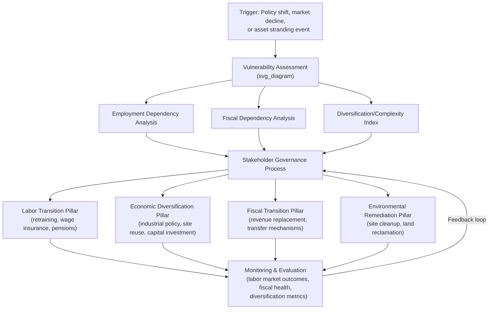

## Just Transition Frameworks for Energy-Dependent Communities

### Definition and Conceptual Origins

A just transition framework is a structured policy and planning approach that manages the shift away from carbon-intensive energy systems while distributing the economic, social, and environmental costs and benefits of that shift equitably. The concept originated in the U.S. labor movement in the 1980s, associated with unionist Tony Mazzocchi, who argued that workers displaced by environmental regulation deserved income and retraining support comparable to that given to soldiers after war (the "Superfund for Workers" proposal). The term was later adopted by the International Labour Organization (ILO), the United Nations Framework Convention on Climate Change (UNFCCC), and incorporated explicitly into the preamble of the 2015 Paris Agreement, which recognizes "the imperatives of a just transition of the workforce."

In energy economics, just transition frameworks address a specific market failure: decarbonization policy generates diffuse, long-run global benefits (avoided climate damage) while concentrating short-run costs on specific places, workers, and fiscal systems (coal regions, oil-exporting economies, utility ratepayers). Without deliberate redistribution mechanisms, this asymmetry creates political economy resistance to climate policy — the phenomenon sometimes called the "green paradox" of local losers blocking global gains.

### Core Economic Rationale

**Key Points**

- Just transition policy is fundamentally a compensation and adjustment-cost problem, analogous to the Stolper-Samuelson framework in trade economics, where liberalization (or decarbonization) creates aggregate gains but concentrated losses for specific factors of production (in this case, fossil-fuel-specific labor and capital).
- Asset stranding is central: energy-dependent communities often hold location-specific human capital (mining/drilling skills) and immobile physical capital (power plants, rail lines, company towns) that lose value discontinuously when policy or markets shift.
- Fiscal dependency compounds labor market effects: many energy-dependent local governments rely on severance taxes, property taxes on energy infrastructure, or royalty transfers for a large share of school and municipal budgets, so job losses are compounded by public service contraction.
- The Coase-theorem intuition (that efficient bargaining could resolve the externality) fails in practice because of transaction costs, incomplete labor mobility, information asymmetries about future asset values, and the political fragmentation of affected communities relative to concentrated benefits accruing to diffuse global populations.

### Analytical Components of a Just Transition Framework

A comprehensive framework typically integrates four analytical layers, each with distinct economic tools.

#### 1. Vulnerability and Dependency Assessment

Quantifies exposure using metrics such as:

- **Employment dependency ratio**: share of local employment in the fossil-fuel value chain (extraction, generation, transport, and induced/indirect employment via input-output multipliers).
- **Fiscal dependency ratio**: share of local/regional government revenue derived from severance taxes, property taxes on energy assets, or royalty-sharing transfers.
- **Location quotient (LQ)**:

$$LQ_i = \dfrac{(e_i / e)}{(E_i / E)}$$

where $e_i$ is local employment in sector $i$, $e$ is total local employment, $E_i$ is national employment in sector $i$, and $E$ is total national employment. An $LQ_i$ substantially above 1 signals regional specialization and therefore higher transition exposure.

- **Economic complexity / diversification index**: measures how narrow the region's productive base is, since low diversification limits the ease of redeploying capital and labor into alternative sectors.

#### 2. Labor Market Transition Design

Draws on active labor market policy (ALMP) economics: retraining, relocation assistance, wage insurance, and bridge-to-retirement provisions. Empirical labor economics (e.g., displaced-worker literature following Jacobson, LaLonde, and Sullivan, 1993) finds that workers displaced from high-wage, unionized, capital-intensive industries (a strong analogue to coal and oil/gas extraction) suffer large and persistent earnings losses — commonly estimated in the range of 15–25% of pre-displacement earnings that can persist for a decade or more — because industry- and firm-specific human capital does not transfer cleanly to new sectors. This is a key empirical justification for compensation mechanisms beyond short-term unemployment insurance.

#### 3. Economic Diversification and Regional Development

Applies regional economics tools — export-base theory, cluster development, and endogenous growth models — to identify substitute industries (e.g., site remediation work, manufacturing using existing grid/rail/port infrastructure, renewable energy generation and storage sited on retired fossil-fuel land, agrivoltaics, or tourism/conservation economies).

#### 4. Governance and Distributional Design

Determines who decides and who receives compensation — typically evaluated against Rawlsian (maximin, prioritizing the worst-off) or capabilities-based (Sen-style, focused on real freedoms and opportunities) theories of distributive justice, alongside three commonly cited justice dimensions:

- **Distributive justice** — fair allocation of costs and benefits.
- **Procedural justice** — meaningful participation of affected communities in decision-making.
- **Recognitional justice** — acknowledgment of the specific historical, cultural, and identity ties workers and communities have to the energy sector.

### Framework Architecture (Structural Overview)

### Financing Mechanisms

**Key Points**

- **Dedicated transition funds**: e.g., the EU's Just Transition Fund (part of the broader Just Transition Mechanism under the European Green Deal), which allocates capital to NUTS-2 regions based on coal/carbon-intensive employment shares and CO₂ intensity of regional GDP.
- **Carbon revenue recycling**: directing a share of carbon tax or emissions trading system (ETS) auction revenue toward affected workers/regions rather than general revenue — improves both efficiency (offsetting labor market distortions) and political feasibility.
- **Multilateral blended finance**: instruments such as the Just Energy Transition Partnerships (JETPs), which combine grants, concessional loans, guarantees, and private capital to help emerging economies (South Africa, Indonesia, Vietnam, Senegal) retire coal capacity while funding worker and community transition alongside grid buildout.
- **Severance/legacy taxes and reclamation bonds**: mechanisms requiring fossil-fuel operators to pre-fund site remediation and worker transition liabilities, reducing the risk that costs fall on the public sector when firms exit or declare bankruptcy (a recurring problem in coal-country abandoned mine land and orphaned well cases).

### Worked Example: Coal Region Transition Model

Consider a hypothetical coal-mining region with:

- 5,000 direct mining jobs, employment multiplier of 2.1 (via input-output analysis), implying roughly 10,500 total jobs dependent on the sector.
- Average mining wage of $85,000/year versus regional non-mining average wage of $52,000/year (a wage premium reflecting industry-specific human capital and unionization).
- Local school district revenue: 40% derived from coal property/severance tax.

A just transition framework applied here would combine:

1. **Wage insurance**: partial compensation (e.g., covering a portion of the wage gap, often up to roughly half the difference between old and new wages, for a defined multi-year period) for displaced workers who take lower-paying jobs, reducing the incentive to remain unemployed while searching for an equivalent-wage job that no longer exists.
2. **Fiscal bridge transfers**: a phased-in state or federal transfer replacing a declining share of the lost severance tax revenue (e.g., 100% year 1, tapering to 0% by year 7–10) to prevent abrupt school funding collapse while the tax base diversifies.
3. **Site repurposing investment**: capital funding to convert reclaimed mine land into utility-scale solar or battery storage — leveraging existing transmission interconnection capacity, which is a genuine engineering/economic advantage of siting new generation at retired fossil sites.
4. **Pension backstop**: government or trust-based guarantee for underfunded multi-employer pension plans common in unionized extraction industries, addressing the risk that employer insolvency triggers pension losses on top of job losses.

[Inference] The specific parameter values above (multiplier of 2.1, 50% wage insurance coverage, 7–10 year tapering) are illustrative rather than drawn from a single documented case; actual multipliers, tax dependency ratios, and transfer schedules vary substantially by region and must be estimated from local input-output tables and fiscal data.

### Case Studies

**Example**

- **Germany — Ruhr Valley / Lusatia coal phase-out**: Managed over decades via the Kohleausstieg framework, using structural funds, early-retirement bridge pensions for older miners (Anpassungsgeld), and heavy public investment in university and research infrastructure to diversify the regional economy. Frequently cited as the most institutionally mature just transition case, though the timeline (multiple decades) is itself a design feature that newer, faster transitions (driven by more urgent climate targets) may not be able to replicate.
- **South Africa — JETP**: An $8.5 billion (later expanded) partnership pledged by the US, EU, UK, France, and Germany to support Eskom's coal fleet retirement, explicitly incorporating a Just Transition Framework covering Mpumalanga province, which is heavily dependent on coal mining and coal-fired generation employment. [Unverified] Implementation has faced documented delays and disbursement bottlenecks; exact disbursed amounts and project completion status should be checked against current JETP investment plan updates, as blended finance commitments frequently diverge from committed totals during execution.
- **United States — Appalachia (POWER Initiative)**: Federal grant program (Partnerships for Opportunity and Workforce and Economic Revitalization) funding economic diversification, workforce retraining, and infrastructure projects in coal-dependent counties, administered through the Appalachian Regional Commission and Economic Development Administration.

### Evaluation Metrics and Monitoring

A rigorous just transition framework specifies measurable indicators, evaluated pre- and post-intervention:

| Dimension | Example Metric |
| --- | --- |
| Labor market | Re-employment rate within 12/24/36 months; wage replacement ratio |
| Fiscal | Local government revenue diversification index; bond rating stability |
| Economic diversification | Herfindahl-Hirschman Index (HHI) of regional employment by sector |
| Environmental | Hectares of land remediated; groundwater/air quality restoration |
| Procedural justice | Share of affected workers/community members in formal consultation processes |

The regional employment HHI is calculated as:

$$HHI = \sum_{i=1}^{n} s_i^2$$

where $s_i$ is sector $i$'s share of total regional employment. A declining HHI over the transition period is used as a proxy for successful diversification away from fossil-fuel dependency.

### Critiques and Limitations

**Key Points**

- **Compensation adequacy**: Empirical evidence from prior industrial transitions (steel, textiles, general manufacturing decline) suggests displaced-worker compensation programs frequently under-deliver relative to actual earnings losses, raising doubts about whether current just transition funding levels match documented displacement costs. [Inference] This is a pattern-based inference from analogous historical transitions rather than a settled finding specific to energy-sector just transition programs, since many current programs are too recent for long-run outcome data.
- **Governance capture risk**: Transition funds risk being captured by incumbent utilities or politically connected firms rather than reaching displaced workers directly, a concern raised regarding both EU Just Transition Fund allocation and JETP disbursement structures.
- **Temporal mismatch**: Climate targets (e.g., net-zero by 2050) impose transition timelines far more compressed than the multi-decade Ruhr Valley model, straining the assumption that gradual, well-funded transitions are always achievable.
- **Scope boundary disputes**: Ongoing debate over whether frameworks should cover only direct extraction/generation workers or extend to the broader "energy value chain" (e.g., internal combustion engine auto manufacturing workers affected by electrification), which significantly changes required funding scale.

### Illustrative Diagram: Cost-Benefit Distribution Asymmetry (svg_diagram)

<svg xmlns="http://www.w3.org/2000/svg" viewBox="0 0 640 340">
<text x="320" y="24" text-anchor="middle" font-size="15" font-weight="bold" fill="#1a1a1a">Distribution of Climate Policy Costs vs. Benefits (svg_diagram)</text>
<line x1="70" y1="280" x2="600" y2="280" stroke="#333" stroke-width="2" />
<line x1="70" y1="280" x2="70" y2="50" stroke="#333" stroke-width="2" />
<text x="40" y="170" text-anchor="middle" font-size="12" fill="#333" transform="rotate(-90 40 170)">Magnitude</text>
<text x="335" y="310" text-anchor="middle" font-size="12" fill="#333">Population Affected (concentrated → diffuse)</text>
<rect x="90" y="90" width="70" height="190" fill="#c0392b" opacity="0.75" />
<text x="125" y="85" text-anchor="middle" font-size="11" fill="#c0392b" font-weight="bold">Local Costs</text>
<text x="125" y="300" text-anchor="middle" font-size="10" fill="#333">Coal region</text>
<text x="125" y="313" text-anchor="middle" font-size="10" fill="#333">workers</text>
<rect x="220" y="230" width="70" height="50" fill="#e67e22" opacity="0.75" />
<text x="255" y="222" text-anchor="middle" font-size="11" fill="#e67e22" font-weight="bold">Regional Costs</text>
<text x="255" y="300" text-anchor="middle" font-size="10" fill="#333">State/province</text>
<rect x="380" y="265" width="70" height="15" fill="#27ae60" opacity="0.75" />
<text x="415" y="257" text-anchor="middle" font-size="11" fill="#27ae60" font-weight="bold">National Benefit</text>
<text x="415" y="300" text-anchor="middle" font-size="10" fill="#333">per capita (small)</text>
<rect x="500" y="272" width="70" height="8" fill="#2980b9" opacity="0.75" />
<text x="535" y="264" text-anchor="middle" font-size="11" fill="#2980b9" font-weight="bold">Global Benefit</text>
<text x="535" y="300" text-anchor="middle" font-size="10" fill="#333">per capita (tiny)</text>
<text x="320" y="335" text-anchor="middle" font-size="11" fill="#555" font-style="italic">Illustrative schematic: concentrated local costs vs. diffuse global benefits drive political resistance</text>
</svg>

### Interconnections with Broader Energy Economics

Just transition frameworks intersect directly with several other energy economics concepts:

- **Stranded asset risk**: financial and regulatory analysis of fossil-fuel reserves/infrastructure that may become uneconomic before the end of their expected physical life, a core input into vulnerability assessment.
- **Energy poverty**: transition mismanagement can create new energy poverty in formerly energy-producing regions through job loss and utility rate increases used to fund grid modernization.
- **Carbon pricing incidence**: the distributional analysis of who bears carbon tax/ETS costs directly informs how revenue recycling toward just transition funding should be designed.
- **Regional resource curse literature**: energy-dependent regions often exhibit symptoms analogous to the natural resource curse (Dutch disease effects, underinvestment in diversification) even before formal decarbonization begins, meaning transition frameworks are sometimes remedying pre-existing structural fragility rather than only new policy-induced shocks.

**Next Steps**

- Stranded assets and the economics of asset write-downs in fossil-fuel infrastructure
- Carbon pricing mechanisms: taxes vs. cap-and-trade and revenue recycling design
- Regional resource curse and Dutch disease effects in energy-exporting economies
- Active labor market policy (ALMP) design and evaluation methods
- Just Energy Transition Partnerships (JETPs): structure, governance, and disbursement analysis
- Input-output analysis and regional employment multipliers
- Distributive vs. procedural vs. recognitional justice frameworks in climate policy
- Pension and legacy liability risk in declining extractive industries
- Grid interconnection reuse economics for repurposed fossil-fuel sites