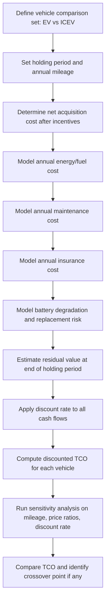

## Total Cost of Ownership Analysis for Electric Vehicles

### Conceptual Framework

Total cost of ownership (TCO) analysis is a financial methodology that aggregates all costs incurred over a vehicle's ownership period, rather than relying solely on the upfront purchase price. In electric vehicle (EV) economics, TCO is the standard analytical framework because EVs and internal combustion engine vehicles (ICEVs) exhibit fundamentally different cost structures: EVs tend to carry higher acquisition costs but lower operating costs, while ICEVs exhibit the reverse pattern. A comparison based on sticker price alone systematically misrepresents the relative economics of the two technologies.

The general TCO identity is expressed as:

$$TCO = C_{acquisition} + \sum_{t=1}^{n} \frac{C_{operating,t} + C_{maintenance,t} + C_{insurance,t}}{(1+r)^t} - \frac{C_{residual,n}}{(1+r)^n}$$

Where:

- $C_{acquisition}$ = upfront purchase price net of subsidies
- $C_{operating,t}$ = energy costs (electricity/fuel) in year $t$
- $C_{maintenance,t}$ = scheduled and unscheduled maintenance costs in year $t$
- $C_{insurance,t}$ = insurance premiums in year $t$
- $C_{residual,n}$ = resale or salvage value at the end of the holding period $n$
- $r$ = discount rate reflecting the owner's cost of capital or time preference

This formulation follows standard discounted cash flow (DCF) principles applied to durable goods, and is analogous to levelized cost methodologies used elsewhere in energy economics (e.g., LCOE).

---

### Cost Components

#### 1. Acquisition Cost

The acquisition cost is the net capital outlay after incentives:

$$C_{acquisition} = P_{sticker} - S_{federal} - S_{state} - S_{utility} + F_{registration}$$

- $P_{sticker}$: manufacturer's suggested retail price (MSRP) or negotiated transaction price.
- $S_{federal}$, $S_{state}$, $S_{utility}$: applicable purchase subsidies, tax credits, or rebates. In the United States, the federal Clean Vehicle Credit under the Inflation Reduction Act (IRC Section 30D) historically provided up to $7,500 for qualifying new EVs, subject to battery sourcing, assembly location, and income eligibility thresholds. [Unverified] — incentive programs are subject to legislative change and jurisdictional variation, and the person should verify current eligibility rules for their jurisdiction and purchase date.
- $F_{registration}$: title, registration, and any EV-specific fees (some jurisdictions impose annual EV registration surcharges to offset lost fuel tax revenue).

EVs generally carry a battery-driven price premium relative to comparable ICEVs, primarily attributable to the traction battery pack, which historically represented 30–40% of total vehicle manufacturing cost. Battery pack price trends are a key driver of TCO convergence between EVs and ICEVs over time.

#### 2. Energy (Fuel) Cost

This is typically the largest source of EV operating savings. The annual energy cost is:

$$C_{energy,t} = \frac{M_t}{100} \times EC \times P_{elec,t}$$

Where:

- $M_t$ = annual miles (or km) driven in year $t$
- $EC$ = energy consumption rate, typically expressed in kWh per 100 miles (or kWh/100 km)
- $P_{elec,t}$ = effective electricity price per kWh in year $t$, which may blend home charging (typically the lowest-cost option, especially on off-peak or EV-specific time-of-use rates), workplace charging, and public DC fast charging (typically the highest-cost option, often 2–4x residential rates)

By comparison, the ICEV fuel cost is:

$$C_{fuel,t} = \frac{M_t}{MPG_t} \times P_{gas,t}$$

The **fuel cost advantage ratio** is a useful comparative metric:

$$FCAR = \frac{C_{fuel,t}}{C_{energy,t}}$$

Because electric drivetrains convert 85–90% of battery energy to wheel-level propulsion versus roughly 20–35% for ICEVs (accounting for combustion, thermal, and drivetrain losses), and because electricity is typically priced lower per unit of useful energy delivered than gasoline, EVs generally show a per-mile energy cost advantage. This advantage is sensitive to relative electricity and gasoline prices, which vary substantially by region and over time — for example, US average residential electricity prices and gasoline prices both fluctuate with regional generation mix and crude oil markets respectively.

#### 3. Maintenance Cost

EVs eliminate or substantially reduce several maintenance categories:

| Maintenance Item | ICEV | EV |
| --- | --- | --- |
| Oil changes | Required (every 5,000–10,000 mi) | Not applicable |
| Transmission service | Required (multi-speed) | Not applicable (single-speed reduction gear) |
| Brake pad wear | Standard friction braking | Reduced via regenerative braking |
| Engine components (belts, spark plugs, exhaust) | Required | Not applicable |
| Battery/drivetrain-specific service | N/A | Coolant loop service, 12V battery replacement |
| Tire wear | Standard | Often accelerated (higher curb weight, instant torque) |

Industry maintenance cost studies have generally found EV scheduled maintenance costs to run meaningfully lower than ICEV costs on a per-mile basis, though this gap can narrow at higher mileages due to tire replacement frequency and, eventually, potential battery-related service. [Inference — the precise magnitude varies by study methodology, vehicle segment, and region, and individual results should not be generalized without checking the underlying dataset.]

#### 4. Battery Degradation and Replacement Risk

Battery degradation is a distinguishing risk factor for EV TCO not present in ICEV analysis. Degradation is typically modeled as a capacity fade curve:

$$Cap(t) = Cap_0 \times (1 - \delta_{cal} \times t - \delta_{cyc} \times N_{cycles})$$

Where $\delta_{cal}$ is calendar aging (chemical degradation independent of use) and $\delta_{cyc}$ is cycle aging (degradation from charge/discharge cycling), influenced by factors including depth of discharge, charge rate, and thermal exposure. Most manufacturers document warranted degradation thresholds (commonly 70% retained capacity at 8 years / 100,000–150,000 miles) rather than replacement-triggering thresholds, and observed fleet degradation rates have generally been lower than early industry projections. Out-of-warranty battery replacement remains a material tail risk in TCO models, though replacement pack prices have been declining. [Unverified] — degradation and replacement cost figures are highly chemistry-, climate-, and usage-pattern-dependent and should be sourced from current OEM warranty documentation and recent third-party degradation studies for any specific analysis.

#### 5. Insurance

EV insurance premiums have historically trended higher than comparable ICEVs, driven primarily by higher repair costs (specialized technician requirements, battery pack repair/replacement thresholds after collision damage, and higher parts costs) rather than higher claim frequency. [Inference — this pattern is documented in several insurance industry analyses but premium differentials vary substantially by insurer, model, and region.]

#### 6. Residual Value

Residual (resale) value functions as a negative cost term in year $n$:

$$C_{residual,n} = P_{sticker} \times (1 - d)^n$$

Where $d$ is the annual depreciation rate. EV residual values have historically been more volatile than ICEV residuals due to: (a) rapid technology improvement making older EVs less competitive on range/charging speed, (b) uncertainty around battery health perception among used-vehicle buyers, and (c) sensitivity to purchase-incentive changes that shift new-vehicle price points and indirectly compress used-EV values. Depreciation curves should be treated as a key source of TCO uncertainty rather than a fixed input.

---

### Comparative TCO Structure (Illustrative)

<svg xmlns="http://www.w3.org/2000/svg" viewBox="0 0 800 420" font-family="Arial, sans-serif">
<text x="400" y="25" text-anchor="middle" font-size="16" font-weight="bold">EV vs ICEV Cost Structure Over Ownership Period (svg_diagram)</text>

<line x1="80" y1="360" x2="750" y2="360" stroke="black" stroke-width="2" />
<line x1="80" y1="360" x2="80" y2="50" stroke="black" stroke-width="2" />
<text x="415" y="395" text-anchor="middle" font-size="13">Years of Ownership</text>
<text x="30" y="205" text-anchor="middle" font-size="13" transform="rotate(-90 30 205)">Cumulative Cost ($)</text>

<polyline points="80,320 200,290 320,255 440,215 560,175 680,135 750,105" fill="none" stroke="`#c0392b`" stroke-width="3" />

<text x="680" y="95" fill="`#c0392b`" font-size="13" font-weight="bold">ICEV Total Cost</text>

<polyline points="80,220 200,205 320,192 440,182 560,175 680,170 750,167" fill="none" stroke="`#2471a3`" stroke-width="3" />

<text x="680" y="185" fill="`#2471a3`" font-size="13" font-weight="bold">EV Total Cost</text>

<circle cx="560" cy="176" r="5" fill="#27ae60" />
<text x="560" y="160" fill="#27ae60" font-size="12" text-anchor="middle">Crossover Point</text>
<line x1="560" y1="176" x2="560" y2="360" stroke="#27ae60" stroke-width="1" stroke-dasharray="4,3" />

<text x="80" y="230" font-size="11" fill="`#2471a3`">EV upfront</text>

<text x="80" y="335" font-size="11" fill="`#c0392b`">ICEV upfront</text>

<text x="80" y="375" font-size="11" text-anchor="middle">0</text>

<text x="200" y="375" font-size="11" text-anchor="middle">2</text>

<text x="320" y="375" font-size="11" text-anchor="middle">4</text>

<text x="440" y="375" font-size="11" text-anchor="middle">6</text>

<text x="560" y="375" font-size="11" text-anchor="middle">8</text>

<text x="680" y="375" font-size="11" text-anchor="middle">10</text>

</svg>

This stylized pattern — higher EV acquisition cost offset progressively by lower cumulative operating costs, producing a "crossover point" after which EV TCO falls below ICEV TCO — is a widely cited structural finding across TCO studies, though the crossover year and whether crossover occurs at all is highly sensitive to annual mileage, holding period, electricity/gasoline price ratios, and incentive availability. [Inference — direction of the effect is well established in the literature; the specific crossover timing shown here is illustrative, not a general prediction.]

---

### Sensitivity Analysis

TCO conclusions are highly sensitive to several parameters. A robust analysis should test:

$$\frac{\partial TCO_{EV} - TCO_{ICEV}}{\partial x_i}$$

for each key variable $x_i$:

1. **Annual mileage** — high-mileage drivers (e.g., rideshare, delivery) amortize the fixed acquisition premium faster and accumulate energy savings more quickly, generally favoring EVs.
2. **Holding period** — longer ownership periods generally favor EVs, since the acquisition premium is fixed but operating savings compound annually.
3. **Electricity-to-gasoline price ratio** — the wider the spread favoring electricity's cost-per-mile, the stronger the EV case; this ratio varies significantly by region (e.g., regions with cheap hydro or nuclear generation versus regions reliant on expensive imported fuel for both electricity and gasoline).
4. **Home charging access** — owners without home/overnight charging who rely predominantly on public DC fast charging see substantially compressed or eliminated energy cost savings.
5. **Discount rate** — higher discount rates penalize the EV's front-loaded acquisition cost relative to its back-loaded savings stream, weakening the EV case; this mirrors the general sensitivity of any levelized-cost or NPV comparison to $r$.
6. **Incentive persistence** — since purchase subsidies directly reduce $C_{acquisition}$, their expiration or reduction can materially shift TCO parity timing.

---

### Worked Example (Illustrative, Simplified)

Assume a 6-year, 90,000-mile holding period, no discounting for simplicity:

| Component | ICEV | EV |
| --- | --- | --- |
| Purchase price (net of incentives) | $32,000 | $38,000 |
| Fuel/energy cost (6 yr) | $10,800 (30 mpg, $3.60/gal) | $4,050 (30 kWh/100mi, $0.15/kWh) |
| Maintenance (6 yr) | $4,200 | $2,100 |
| Insurance (6 yr, delta) | Baseline | +$1,200 |
| Residual value (year 6) | −$9,600 (30%) | −$11,400 (30%) |
| **Net TCO** | **$37,400** | **$33,950** |

In this simplified illustration, the EV shows a lower 6-year TCO despite the higher upfront price, driven primarily by the fuel and maintenance differentials outweighing the acquisition premium and insurance delta. This is a constructed numerical example for illustrative purposes only — actual results depend entirely on the specific inputs used, and readers should substitute current local prices, applicable incentives, and vehicle-specific data for any real decision.

---

### Macro-Level and Policy Dimensions

- **Fuel tax revenue erosion**: As EV adoption reduces gasoline tax collection (a common per-gallon excise mechanism funding road infrastructure in many jurisdictions), governments have introduced offsetting mechanisms such as flat annual EV registration fees or vehicle-miles-traveled (VMT) fee pilots, which enter directly into $C_{acquisition}$ or annual operating cost terms.
- **Total cost of ownership as adoption driver**: TCO parity (rather than sticker-price parity) is generally considered the more economically meaningful threshold for mass-market EV adoption, since consumer purchase decisions are influenced by financing structures (loan payments track upfront price more visibly than lifetime cost), which can create a systematic gap between rational TCO-based adoption and observed adoption rates. [Inference — this behavioral gap is discussed in the energy-economics and transportation-economics literature but its magnitude is difficult to measure precisely.]
- **Grid and generation mix interaction**: Effective electricity price and the emissions profile of EV charging both depend on the marginal generation source at the time of charging, linking EV TCO analysis to broader electricity market and generation-mix economics.

---

### TCO Analysis Workflow

---

### Common Pitfalls in TCO Analysis

- **Using list price instead of net transaction price**, ignoring available incentives or dealer discounts.
- **Applying a flat national average electricity price** rather than the owner's actual marginal rate (particularly relevant with time-of-use or EV-specific tariffs).
- **Omitting charging infrastructure cost** — home Level 2 charger purchase and installation (which can range from a few hundred to several thousand dollars depending on electrical panel capacity and installation complexity) is a real acquisition-adjacent cost frequently excluded from simplified comparisons.
- **Ignoring discounting**, which overstates the value of far-future operating savings and can bias TCO conclusions in favor of the EV in long holding-period analyses.
- **Static mileage assumptions** that don't reflect the actual driver's usage pattern, which is one of the most influential single variables in the model.

---

**Next Steps**

- Charging infrastructure economics (home Level 2 vs public DC fast charging cost structures)
- Battery degradation modeling and second-life battery value
- Electricity tariff design and time-of-use rate optimization for EV charging
- Fleet electrification TCO for commercial/rideshare applications
- Government incentive design and its distortionary effects on TCO parity timing
- Vehicle-miles-traveled (VMT) taxation as a fuel-tax replacement mechanism
- Levelized cost of driving (LCOD) as a standardized cross-technology comparison metric
- Grid emissions intensity and its effect on EV lifecycle cost-benefit analysis