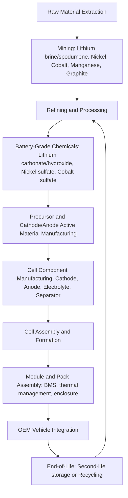

## Battery Cost Trajectories and Supply Chain Economics

### Historical Cost Trajectory

Lithium-ion battery pack prices have declined dramatically since commercial introduction, following a pattern commonly analyzed through experience-curve (learning-rate) economics. According to BloombergNEF's annual Battery Price Survey, the volume-weighted global average pack price fell from approximately $1,474/kWh in 2010 (in real 2025 dollars) to a record low of $108 per kilowatt-hour in 2025, representing a 93% decline since 2010. The year-on-year decline from 2024 to 2025 was 8%, driven by continued cell manufacturing overcapacity, intense competition, and the ongoing shift to lower-cost lithium iron phosphate (LFP) chemistry, despite rising metal costs. This followed a steeper decline the prior year, when the average fell from $139/kWh in 2023 to $115/kWh in 2024, a roughly 20% drop. [BNEF: Lithium-ion battery pack prices fall to $108/kWh, stationary ... +2](https://www.ess-news.com/2025/12/09/bnef-lithium-ion-battery-pack-prices-fall-to-108-kwh-stationary-storage-becomes-lowest-price-segment/)

This trajectory is typically modeled using an experience curve (also called a Wright's Law or learning curve) of the form:

$$C(Q) = C_0 \times \left(\frac{Q}{Q_0}\right)^{-b}$$

Where $C(Q)$ is unit cost at cumulative production $Q$, $C_0$ is cost at reference production $Q_0$, and $b$ is the learning elasticity. The **learning rate** $LR = 1 - 2^{-b}$ expresses the percentage cost reduction for each doubling of cumulative production. Lithium-ion battery packs have historically exhibited learning rates in approximately the 15–21% range across various academic and industry studies. [Inference — the exact learning rate is sensitive to the study period, technology scope (cell-only vs. full pack), and whether raw material price cycles are controlled for; treat any single point estimate as indicative rather than precise.]

---

### Cost Structure Decomposition

A battery pack's cost breaks down into several layers, each with distinct economic drivers:

$$C_{pack} = C_{cell} + C_{module/pack\ assembly} + C_{BMS} + C_{thermal\ management} + C_{enclosure}$$

For EV applications in 2025, cell costs averaged $79/kWh, representing roughly 80% of the total pack price — indicating that cell-level chemistry and manufacturing scale, rather than pack integration, are the dominant cost lever. [evinfrastructurenews](https://www.evinfrastructurenews.com/ev-technology/bloomberg-nef-lithium-ion-battery-pack-prices-drop-worldwide-ev-applications-hit-by-higher-materials-cost)

Within the cell itself, cost further decomposes into:

| Component | Approximate Share of Cell Cost | Primary Cost Driver |
| --- | --- | --- |
| Cathode active material | 30–45% | Metal prices (Li, Ni, Co, Mn, or Fe/P for LFP) |
| Anode active material | 10–15% | Graphite/synthetic graphite processing |
| Electrolyte | 5–10% | Lithium salt (LiPF6) pricing |
| Separator | 4–8% | Specialty polymer film manufacturing |
| Cell manufacturing (labor, capex amortization, yield) | 20–30% | Gigafactory scale, automation, yield rates |
| Other (current collectors, casing) | 5–10% | Copper/aluminum pricing |

[Inference — these percentage ranges are drawn from industry cost-teardown analyses (e.g., BNEF, academic battery cost models) and vary by chemistry, cell format (cylindrical, prismatic, pouch), and manufacturer; they should be treated as illustrative rather than universal.]

---

### Chemistry-Driven Price Divergence

Battery chemistry is now a first-order determinant of pack price. In the 2025 BNEF survey, average LFP battery pack prices across all segments came in at $81/kWh while nickel manganese cobalt (NMC) packs were at $128/kWh — a roughly 37% premium for NMC over LFP. [taiyangnews](https://taiyangnews.info/business/bloombergnef-battery-pack-prices-hit-new-low-in-2025)

This divergence reflects fundamental raw-material differences:

- **LFP (lithium iron phosphate)**: Cathode built on iron and phosphate — both abundant, low-cost, and geographically diversified inputs. LFP eliminates cobalt and nickel entirely, avoiding their price volatility and supply concentration. Trade-offs include lower energy density (affecting vehicle range per kg of battery) and, historically, weaker cold-temperature performance, though these gaps have narrowed with cell-to-pack (CTP) and blade-cell packaging innovations that improve volumetric efficiency.
- **NMC (nickel manganese cobalt)**: Higher energy density supports longer range in a given pack volume/mass, but exposes cost to nickel and cobalt markets, both of which have exhibited high price volatility and significant supply concentration (cobalt production is heavily concentrated in the Democratic Republic of Congo).

The industry-wide shift toward LFP — particularly in standard-range and cost-sensitive vehicle segments — is a structural factor in the aggregate pack price decline documented above, since it changes the *product mix* being averaged, not only the price of any single chemistry.

---

### Segment and Regional Price Variation

Battery pricing is not uniform across end-use segments or geographies. In 2025:

- **Stationary storage** pack prices fell to $70/kWh, a 45% decline from 2024, making it the cheapest segment for the first time — reflecting less stringent energy-density requirements (stationary applications are less mass/volume-constrained than vehicles) and a chemistry mix skewed heavily toward LFP. [taiyangnews](https://taiyangnews.info/business/bloombergnef-battery-pack-prices-hit-new-low-in-2025)
- **Battery electric vehicle (BEV)** packs averaged $99/kWh in 2025, the second consecutive year below the $100/kWh threshold. [evinfrastructurenews](https://www.evinfrastructurenews.com/ev-technology/bloomberg-nef-lithium-ion-battery-pack-prices-drop-worldwide-ev-applications-hit-by-higher-materials-cost)
- **Regionally**, China recorded the lowest average price at $84/kWh, while North America and Europe were 44% and 56% higher respectively, reflecting higher local production costs, imports, and policy impacts. [taiyangnews](https://taiyangnews.info/business/bloombergnef-battery-pack-prices-hit-new-low-in-2025)

The regional gap is a central concern in transportation and industrial policy, since it directly affects EV manufacturing cost competitiveness across trade blocs and motivates domestic content requirements (e.g., critical mineral and battery component sourcing rules tied to EV purchase incentive eligibility in various jurisdictions).

---

### Supply Chain Structure

The lithium-ion battery supply chain spans multiple upstream and midstream tiers before reaching cell and pack assembly:

**Key structural features of this chain:**

1. **Upstream concentration risk**: Lithium extraction is concentrated in a small number of countries (Australia for hard-rock spodumene; Chile, Argentina, and China for brine-based production), and cobalt refining/mining is heavily concentrated around the Democratic Republic of Congo for extraction and China for refining. This concentration creates geopolitical and single-point-of-failure risk that is distinct from the chemistry-driven cost differences discussed above.
2. **Midstream refining dominance**: China holds a disproportionate share of global battery-grade chemical refining capacity (lithium hydroxide/carbonate conversion, precursor cathode material production) even where raw ore is mined elsewhere, meaning upstream mining diversification does not automatically translate into midstream supply chain diversification.
3. **Cell manufacturing scale economics**: Gigafactory-scale cell production benefits from steep capital cost amortization and yield-rate learning, meaning cost per kWh falls significantly as a given production line matures and cumulative output rises — this is the primary mechanism behind the experience-curve dynamics described earlier.

---

### Raw Material Price Volatility and Its Feed-Through to Pack Costs

Unlike the smooth multi-year decline in *pack* prices, upstream *raw material* prices — particularly lithium — have exhibited sharp cyclical volatility that only partially and with a lag feeds through to finished pack pricing (due to long-term offtake contracts, hedging, and inventory buffering by cell manufacturers).

Recent lithium carbonate price action illustrates this volatility:

- Lithium carbonate prices fell substantially from 2022 highs through much of 2024–2025 as mining output expanded faster than EV demand growth, with lithium prices falling nearly 90% from 2022 to mid-2025. [bslbatt](https://bslbatt.com/blogs/lithium-battery-price-2025-current-costs-trends-and-changes/)
- From a mid-2025 trough, battery-grade lithium carbonate spot prices rebounded more than 90%, driven by energy storage demand growth, low Chinese inventory, and the suspension of a major mine (CATL's Jianxiawo operation). [bslbatt](https://bslbatt.com/blogs/lithium-battery-price-2025-current-costs-trends-and-changes/)
- By early 2026, lithium carbonate prices pushed above $24,000 per tonne in January 2026, and lithium hydroxide crossed $23,000 per tonne — levels unseen since 2023, driven by a compounding shock from Zimbabwe's export curbs, uncertainty over Chinese mine restarts, and cost pressures linked to Strait of Hormuz shipping disruptions. [discoveryalert](https://discoveryalert.com.au/lithium-price-forecast-supply-tightening-ev-demand-2026/)[discoveryalert](https://discoveryalert.com.au/lithium-price-forecast-supply-tightening-ev-demand-2026/)
- Longer-term forecasts diverge: one industry analysis frames the period from 2026 to 2029 as a likely surplus phase driven by a robust project pipeline and slower demand growth, with a shift toward deficit projected from 2030 to 2035 due to underinvestment during the 2024–2025 downturn combined with accelerating demand. [discoveryalert](https://discoveryalert.com.au/lithium-price-forecast-supply-tightening-ev-demand-2026/)

This volatility matters directly for battery and EV cost economics because it demonstrates that **pack price and raw material price can move in opposite directions simultaneously** — as occurred through 2025, when pack prices hit a record low even as metal costs rose, reflecting offsetting effects from manufacturing overcapacity, competitive pricing pressure, and the LFP mix shift. [Inference — the degree to which future raw material price spikes will pass through to pack prices depends on manufacturer contract structures, hedging positions, and the pace of continued overcapacity, and cannot be forecast with precision from historical pattern alone.]

---

### Economic Framework: Why Pack Prices and Metal Prices Can Diverge

The apparent paradox of falling pack prices amid rising metal costs is explainable through a simple cost-decomposition identity:

$$\Delta C_{pack} = \Delta C_{materials} + \Delta C_{manufacturing} + \Delta C_{mix}$$

Where $\Delta C_{mix}$ captures the compositional shift toward lower-cost chemistry (LFP) and $\Delta C_{manufacturing}$ captures capacity-utilization and scale effects. When manufacturing overcapacity is severe — as has been the case in the global cell industry, where installed capacity has substantially exceeded actual demand — competitive pressure can compress margins and manufacturing costs enough to more than offset a rise in $\Delta C_{materials}$, producing a net pack price decline even in a rising-metals environment. This dynamic is analogous to margin compression seen in other commodity-processing industries during periods of overcapacity.

---

### Battery Supply Chain Cost Map (Illustrative)

<svg xmlns="http://www.w3.org/2000/svg" viewBox="0 0 800 460" font-family="Arial, sans-serif">
<text x="400" y="25" text-anchor="middle" font-size="16" font-weight="bold">EV Battery Pack Cost Composition, 2025 (svg_diagram)</text>

<rect x="150" y="60" width="140" height="320" fill="#2471a3" />
<text x="220" y="215" text-anchor="middle" font-size="12" fill="white">Cathode</text>
<text x="220" y="230" text-anchor="middle" font-size="11" fill="white">~30-45% of cell</text>
<rect x="150" y="60" width="140" height="60" fill="#1a5276" />
<text x="220" y="95" text-anchor="middle" font-size="11" fill="white">Anode 10-15%</text>
<rect x="150" y="120" width="140" height="40" fill="#5499c7" />
<text x="220" y="145" text-anchor="middle" font-size="11" fill="white">Electrolyte/Sep.</text>
<rect x="150" y="260" width="140" height="120" fill="#7fb3d5" />
<text x="220" y="325" text-anchor="middle" font-size="12" fill="black">Cell Mfg / Yield</text>

<rect x="400" y="60" width="140" height="304" fill="#a9cce3" />
<text x="470" y="210" text-anchor="middle" font-size="12">Cell Cost</text>
<text x="470" y="228" text-anchor="middle" font-size="11">~80% of pack</text>
<rect x="400" y="364" width="140" height="16" fill="#d4e6f1" />
<text x="470" y="376" text-anchor="middle" font-size="10">BMS + Assembly + Enclosure ~20%</text>

<text x="220" y="400" text-anchor="middle" font-size="13" font-weight="bold">Cell Composition</text>

<text x="470" y="400" text-anchor="middle" font-size="13" font-weight="bold">Pack Composition</text>

<line x1="290" y1="220" x2="400" y2="220" stroke="black" stroke-width="1" stroke-dasharray="3,3" />
</svg>

---

### Implications for EV and Energy Economics

1. **EV price parity with ICEVs**: Falling pack prices have been directly linked to EV-ICEV upfront price parity in some markets — EVs reached price parity with internal combustion engine vehicles in China in 2024, when EV battery packs first dropped below $100/kWh. Pack price trajectory is therefore one of the primary structural variables determining when and where EV acquisition-cost parity (and thus favorable TCO, as discussed in the preceding topic) is achieved. [evinfrastructurenews](https://www.evinfrastructurenews.com/ev-technology/bloomberg-nef-lithium-ion-battery-pack-prices-drop-worldwide-ev-applications-hit-by-higher-materials-cost)
2. **Grid storage economics**: The steep decline in stationary storage pack prices (to $70/kWh) directly affects the levelized cost of storage (LCOS) and, by extension, the economics of pairing battery storage with variable renewable generation — a core topic in broader electricity market and generation-mix economics.
3. **Policy exposure**: Because refining and cell manufacturing capacity remain geographically concentrated, EV and battery industrial policy (e.g., domestic content rules, critical mineral sourcing requirements tied to subsidy eligibility) directly interacts with achievable pack cost, creating a potential tension between localization goals and short-term cost minimization.
4. **Recycling as a supply chain hedge**: As the installed EV fleet ages, battery recycling and second-life applications are expected to become a growing secondary material source, potentially dampening long-run sensitivity to primary mining supply — though at present recycled material volumes remain a small fraction of total demand. [Inference — the pace at which recycling supply becomes material to overall cost trajectories depends on end-of-life battery volumes, collection infrastructure, and recycling process economics, none of which are yet mature at scale.]

---

**Next Steps**

- Experience curves and learning-rate estimation methodology in energy technologies
- LFP vs. NMC vs. emerging chemistries (sodium-ion, solid-state) comparative economics
- Critical mineral supply chain policy (domestic content rules, mineral security initiatives)
- Levelized cost of storage (LCOS) for grid-scale battery applications
- Battery recycling economics and second-life battery value chains
- Gigafactory capital cost structures and manufacturing scale economics
- Cobalt and nickel market structure and geopolitical concentration risk
- EV-ICEV price parity analysis by region and market segment