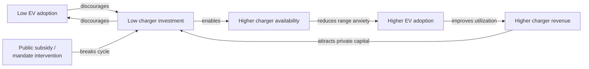
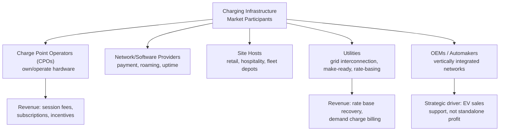

## Charging Infrastructure Investment Economics

### Definition and Scope

Charging infrastructure investment economics is the study of capital allocation, revenue models, risk structures, and market design governing the deployment of electric vehicle (EV) charging equipment — spanning residential (Level 1/2), public Level 2, and direct current fast charging (DCFC/Level 3) networks. It sits at the intersection of utility regulation, corporate finance, network economics, and transportation planning, and addresses a central coordination problem: charging infrastructure must be built ahead of EV adoption to avoid range anxiety deterring purchases, yet utilization (and therefore revenue) only materializes after adoption occurs — a classic chicken-and-egg market failure in network industries.

### Core Economic Framework: The Chicken-and-Egg Problem

**Key Points**

- EV charging exhibits classic two-sided network effects: charger deployment value depends on EV fleet size, while EV purchase decisions depend partly on charger availability.
- This creates a coordination failure similar to those studied in network industry economics (telecoms, early gas stations): private investors underinvest relative to the socially optimal level because early infrastructure captures only a fraction of the adoption benefit it enables.
- The standard economic remedy is public subsidy or mandate to bridge the gap until network effects become self-sustaining (the point where utilization-driven revenue covers costs without subsidy) — analogous to infant-industry protection arguments, but applied to physical network buildout rather than trade policy.
- [Inference] The precise EV penetration threshold at which charging networks become self-sustaining without subsidy is highly location- and segment-dependent (dense urban DCFC corridors reach viability far faster than rural or highway-corridor sites) and is not a single settled figure in the literature.

### Capital Cost Structure

Charging infrastructure costs break into several distinct categories, each with different economics:

| Cost Component | Level 2 (AC) | DC Fast Charging (DCFC) |
| --- | --- | --- |
| Hardware (per port) | Roughly $2,500–$7,000 | Roughly $30,000–$150,000+ depending on power rating |
| Installation/construction | Often comparable to or exceeding hardware cost | Frequently the dominant cost driver |
| Utility interconnection/make-ready | Low to moderate | Can be very high, especially where transformer/service upgrades are required |
| Networking/software (payment, uptime monitoring) | Ongoing SaaS-style fee | Ongoing SaaS-style fee |
| Demand charges (operating cost, not capex) | Minimal | Can be a very large share of operating cost |

[Unverified] Absolute dollar figures shift with hardware generation, labor markets, and site-specific electrical conditions; current vendor quotes and utility make-ready tariffs should be checked for any specific investment decision, as costs have historically fallen for hardware while grid interconnection costs have often risen due to queue congestion and transformer/equipment lead times.

**"Make-ready" costs** — the utility-side and site-side electrical work (transformers, conduit, trenching, panel upgrades) needed to deliver adequate power to a charging site — frequently exceed the cost of the charging hardware itself for DCFC installations, particularly at sites requiring new transformer capacity or service upgrades from the utility. This is a key reason utility make-ready programs (where the utility funds and owns infrastructure up to the meter, sometimes beyond) have become a central policy lever.

### Demand Charge Economics — The Central DCFC Profitability Problem

Demand charges are the single most consequential and often underappreciated economic factor in DCFC site profitability.

**Mechanism**: Commercial electricity tariffs typically bill customers not only for total energy consumed ($/kWh) but also for the peak instantaneous power drawn during a billing period ($/kW, measured over a 15-minute interval), reflecting the utility's cost of maintaining capacity to serve that peak.

**Why this disproportionately harms DCFC economics**: A DCFC station may draw very high power (e.g., 150–350 kW per session) for short bursts, then sit idle, producing a low **load factor**:

$$\text{Load Factor} = \dfrac{\text{Average Load (kW)}}{\text{Peak Load (kW)}}$$

A low load factor means the station pays for high peak capacity relative to the energy it actually delivers and monetizes, since demand charges are assessed on the peak regardless of how infrequently that peak occurs. Early-stage, low-utilization DCFC stations can see demand charges constitute a very large share (frequently cited in industry analysis as capable of exceeding half) of total monthly operating cost, which can render a site unprofitable even when the retail price charged to drivers appears healthy on a $/kWh basis. [Inference] The exact demand-charge share of costs varies enormously by utility tariff design and station utilization; this is a directional, widely-documented pattern rather than a fixed universal ratio.

**Standard mitigation strategies**:

- **Battery buffering (behind-the-meter storage)**: a stationary battery charges slowly from the grid during low-demand periods and discharges rapidly during vehicle charging sessions, smoothing the site's peak grid draw and reducing demand charges — trading capital cost of the battery against ongoing demand-charge savings.
- **Managed/smart charging and power-sharing**: software that caps or staggers simultaneous charging across multiple ports to limit facility-level peak draw.
- **Tariff redesign advocacy**: charging network operators and EV advocacy groups have lobbied utility regulators for EV-specific rate classes that reduce or eliminate demand charges during a network's ramp-up phase, sometimes replaced with subscription-style or energy-only pricing during a transition window.
- **Site clustering/co-location**: siting DCFC alongside other commercial loads (retail, food service) so that the DCFC's peak draw doesn't set a new, DCFC-specific peak on an otherwise low facility load.

### Revenue Models

**Key Points**

- **Pay-per-use ($/kWh or $/minute)**: the dominant retail model in most competitive markets; $/kWh pricing is generally preferred by regulators and consumers for transparency, though $/minute pricing has historically been used in jurisdictions with legal restrictions on selling electricity as a commodity by non-utility entities.
- **Subscription/membership models**: reduced per-session pricing in exchange for recurring fees, used by some networks to build predictable revenue and improve customer retention/loyalty.
- **Utility ownership/rate-basing**: in some jurisdictions, regulated utilities are permitted to own charging infrastructure and recover costs through rate base (i.e., all ratepayers, not just EV drivers, contribute via regulated rates), which changes the investment decision from a competitive-market IRR calculation to a regulatory prudency and rate-of-return framework.
- **Host-site revenue share / real estate model**: retail and hospitality property owners host chargers to capture dwell-time customer spending (e.g., convenience stores, shopping centers), treating the charger as a customer-acquisition tool rather than a standalone profit center — the calculus resembles anchor-tenant economics more than energy retailing.
- **Public incentive stacking**: many projects layer multiple subsidy sources (federal tax credits, state grants, utility make-ready programs) atop retail revenue, meaning the effective project IRR calculation must model incentive timing and eligibility conditions, not just projected utilization revenue.

### Investment Appraisal Framework

A standard project-finance approach to a charging site applies discounted cash flow (DCF) analysis with charging-specific adjustments:

$$NPV = \sum_{t=0}^{T} \dfrac{R_t - O_t - D_t}{(1+r)^t} - C_0$$

Where:

- $C_0$ = initial capital expenditure (hardware, installation, make-ready)
- $R_t$ = revenue in period $t$ (session fees, subscription revenue, incentive payments)
- $O_t$ = operating costs in period $t$ (energy commodity cost, demand charges, network/software fees, maintenance, land lease)
- $D_t$ = demand charge cost, isolated because of its outsized and non-linear sensitivity to utilization patterns (often modeled separately from average energy cost)
- $r$ = discount rate, typically reflecting the risk profile of early-stage charging assets (frequently higher than standard utility infrastructure discount rates given technology, demand, and utilization uncertainty)
- $T$ = project horizon, often 7–15 years for DCFC hardware given technology obsolescence risk

**Critical sensitivity variables**:

- **Utilization rate** — the single largest driver of DCFC project economics; low utilization is the most commonly cited reason early DCFC deployments underperform financial projections, since fixed costs (demand charges, land lease, network fees) are largely utilization-insensitive while revenue is directly proportional to utilization.
- **Charging speed/power rating** — higher-power DCFC hardware costs more but serves more vehicles per hour per port, improving revenue per dollar of capital if utilization is sufficient to fill the additional throughput capacity; if utilization is low, higher power mainly increases demand-charge exposure without proportional revenue gain.
- **Technology obsolescence and stranded-asset risk** — charging standards and connector types have shifted (e.g., the North American shift toward the NACS/Tesla connector standard alongside CCS), creating retrofit or replacement risk for hardware deployed on now-secondary standards. [Unverified] The pace and completeness of this standard consolidation across manufacturers and networks should be checked against current industry announcements, as commitments have evolved significantly and unevenly by manufacturer and timeline.

### Public Funding and Policy Mechanisms

**Example**

- **U.S. National Electric Vehicle Infrastructure (NEVI) program**: a federal formula-funding program (established under the Infrastructure Investment and Jobs Act) allocating capital to states to build DCFC stations along designated Alternative Fuel Corridors, generally structured to fund a share of project costs (with the remainder from private co-investment) and set minimum technical standards for reliability, spacing, and power rating.
- **Utility make-ready programs**: regulator-approved programs allowing utilities to fund and rate-base the electrical infrastructure serving charging sites, reducing developer upfront capital burden in exchange for utility ownership/cost-recovery rights over that portion of the asset.
- **EU Alternative Fuels Infrastructure Regulation (AFIR)**: sets minimum mandatory power output and spacing requirements for public charging infrastructure along the EU's core transport network (TEN-T corridors), functioning as a supply-side mandate rather than a direct subsidy, forcing deployment ahead of confirmed demand in specific corridors.
- **Tax credit mechanisms** (e.g., U.S. Alternative Fuel Vehicle Refueling Property Credit): investment tax credits reducing effective capex, typically capped per property and subject to eligibility conditions (e.g., location in specific census tract categories in some program designs).

[Unverified] Program funding levels, eligibility rules, and disbursement timelines for NEVI and related U.S. federal programs have been subject to policy and administrative changes; current program status should be verified against the latest Federal Highway Administration or Joint Office of Energy and Transportation guidance before use in any specific financial model.

### Market Structure and Competitive Dynamics

**Key Points**

- **Vertical integration** by automakers (building proprietary or semi-proprietary charging networks) is often justified less by standalone charging-segment profitability and more by its role in supporting vehicle sales and differentiating the ownership experience — an internalization strategy addressing the network-effect coordination failure described above.
- **Roaming and interoperability agreements** between charge point operators (allowing one network's payment/app credential to work on another's hardware) reduce the effective market fragmentation cost to consumers, improving utilization across the aggregate network — an economic argument for interoperability standards (e.g., Open Charge Point Protocol, OCPP) as a public good.
- **Reliability/uptime economics**: charger downtime has been identified in multiple industry surveys as a major consumer complaint and adoption barrier; from an investment perspective, this creates an argument for higher maintenance capex allocation than a naive utilization-only model would suggest, since unreliable hardware suppresses future utilization through reputational effects beyond the immediate session lost.

### Grid Integration and System-Level Cost Considerations

Charging infrastructure investment economics does not exist in isolation from the broader electricity grid:

- **Distribution grid upgrade costs**: concentrated DCFC clusters can require substation or feeder upgrades, and the economic question of who pays (site developer, utility ratepayers broadly, or a hybrid) is a live regulatory design issue with significant equity implications, since broad rate-basing spreads costs to non-EV-owning ratepayers.
- **Managed/smart charging as a grid asset**: charging load that can be shifted in time (especially residential and depot/fleet charging) has option value to the grid — it can absorb excess renewable generation or provide demand-response capacity, which some jurisdictions are beginning to compensate through time-of-use rates or explicit demand-response program payments, improving the effective revenue picture for flexible charging assets beyond simple session fees.
- **Vehicle-to-grid (V2G) potential**: bidirectional charging technology allows EV batteries to discharge back to the grid or building loads, creating a theoretical additional revenue stream (grid services, peak shaving); however, [Speculation] widespread commercial V2G revenue realization at scale remains constrained by hardware costs, battery warranty/degradation concerns from manufacturers, and immature market/regulatory structures for compensating distributed bidirectional resources, so this should be treated as an emerging rather than established revenue model in current investment appraisal.

### Illustrative Diagram: DCFC Site Cost Structure Sensitivity to Utilization (svg_diagram)

<svg xmlns="http://www.w3.org/2000/svg" viewBox="0 0 640 360">
<text x="320" y="24" text-anchor="middle" font-size="15" font-weight="bold" fill="#1a1a1a">DCFC Cost per kWh Delivered vs. Utilization (svg_diagram)</text>
<line x1="80" y1="300" x2="600" y2="300" stroke="#333" stroke-width="2" />
<line x1="80" y1="300" x2="80" y2="50" stroke="#333" stroke-width="2" />
<text x="340" y="330" text-anchor="middle" font-size="12" fill="#333">Utilization Rate (low → high)</text>
<text x="45" y="175" text-anchor="middle" font-size="12" fill="#333" transform="rotate(-90 45 175)">Effective Cost (\$/kWh)</text>
<path d="M 100 70 C 200 90, 260 200, 340 250 C 420 280, 500 290, 580 293" fill="none" stroke="#c0392b" stroke-width="3" />
<text x="150" y="65" font-size="11" fill="#c0392b" font-weight="bold">Blended cost/kWh</text>
<text x="480" y="285" font-size="10" fill="#333">Approaches energy-only cost</text>
<line x1="80" y1="120" x2="600" y2="120" stroke="#7f8c8d" stroke-width="1.5" stroke-dasharray="6,4" />
<text x="90" y="112" font-size="10" fill="#7f8c8d">Demand-charge-dominated zone</text>
<line x1="80" y1="270" x2="600" y2="270" stroke="#27ae60" stroke-width="1.5" stroke-dasharray="6,4" />
<text x="90" y="262" font-size="10" fill="#27ae60">Energy-cost-dominated zone (mature utilization)</text>
<text x="320" y="352" text-anchor="middle" font-size="11" fill="#555" font-style="italic">Illustrative schematic: fixed demand charges dominate cost per kWh at low utilization</text>
</svg>

### Key Risks Summary

| Risk Category | Description |
| --- | --- |
| Utilization risk | Adoption timing uncertainty directly drives revenue uncertainty |
| Demand charge exposure | Fixed peak-based costs disproportionately affect low-utilization sites |
| Technology/standard obsolescence | Connector and power-standard shifts can strand hardware value |
| Grid interconnection delay | Utility upgrade queues and permitting can delay revenue-generating operation |
| Policy/incentive dependency | Project viability sometimes contingent on subsidy programs subject to political change |
| Reliability/reputation risk | Downtime suppresses both current and future utilization |

### Interconnections with Broader Energy Economics

- **Network economics and two-sided markets**: shared theoretical foundation with telecom and platform economics regarding chicken-and-egg adoption problems.
- **Utility rate design and regulation**: demand charge structures and rate-basing decisions place charging economics squarely within traditional public utility commission regulatory frameworks.
- **Renewable energy integration**: managed charging and V2G connect directly to grid balancing and renewable curtailment reduction economics.
- **Energy poverty and equity**: charger siting decisions have direct equity implications, since underinvestment in lower-income or multi-unit-dwelling areas (where home charging access is limited) can reproduce transportation-cost disparities in the EV transition.

**Next Steps**

- Utility rate design and demand charge regulation
- Two-sided network effects and platform economics
- Vehicle-to-grid (V2G) technology and compensation mechanisms
- NEVI program structure and state implementation plans
- EV total cost of ownership (TCO) analysis
- Battery storage economics for behind-the-meter applications
- Renewable energy curtailment and managed/smart charging integration
- Charging equity and access in multi-unit dwellings and low-income communities