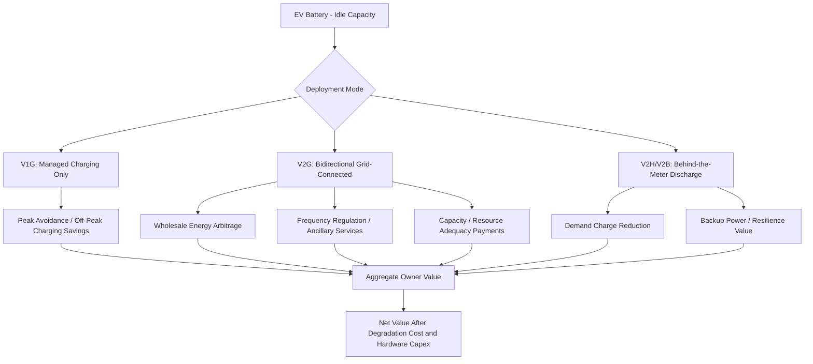

## Vehicle-to-Grid Economics and Demand Response Potential

### Conceptual Framework

Vehicle-to-grid (V2G) economics examines the value creation and cost structures associated with using electric vehicle (EV) batteries as bidirectional, distributed energy storage resources that can both draw power from and inject power back into the electrical grid. This extends the EV beyond its role as a transportation asset into a potential grid asset, fundamentally changing the economic calculus of vehicle ownership by introducing a revenue or cost-offset stream not present in unidirectional charging or in internal combustion vehicle ownership.

The core economic proposition rests on **temporal and locational arbitrage**: EVs sit idle (parked) for the vast majority of their operational life — commonly cited estimates suggest a typical passenger vehicle is parked over 90% of the time — during which the battery represents an underutilized asset that could, in principle, provide grid services during that idle window.

---

### Taxonomy of Vehicle-Grid Integration

V2G exists within a broader spectrum of vehicle-grid integration (VGI) strategies, distinguished by directionality and control sophistication:

| Strategy | Power Flow | Control Mechanism | Grid Value Created |
| --- | --- | --- | --- |
| Unmanaged (dumb) charging | Grid → Vehicle | None; charges immediately on plug-in | None; can worsen peak load |
| V1G (managed/smart charging) | Grid → Vehicle | Timing/rate of charge is controlled | Load shifting, peak avoidance |
| V2G (vehicle-to-grid) | Bidirectional | Discharge back to grid, then recharge | Peak shaving, frequency regulation, arbitrage |
| V2H (vehicle-to-home) | Bidirectional (behind the meter) | Discharge to home load/backup | Resilience, demand charge reduction |
| V2B (vehicle-to-building) | Bidirectional (behind the meter) | Discharge to commercial building load | Demand charge reduction, resilience |

V1G (unidirectional smart charging) is generally significantly less capital-intensive to deploy than true bidirectional V2G, since it requires only charging-schedule software rather than bidirectional power electronics, and is often the more economically viable near-term strategy for capturing a substantial share of available grid-value, even though it cannot provide discharge-based services.

---

### Revenue Stream Decomposition

The addressable value stack for a V2G-capable vehicle can be decomposed into distinct service categories, each with different market maturity, revenue potential, and technical requirements:

$$V_{total} = V_{energy\ arbitrage} + V_{demand\ charge\ reduction} + V_{frequency\ regulation} + V_{capacity/resource\ adequacy} + V_{resilience}$$

#### 1. Energy Arbitrage

Charging during low-price (typically off-peak, high-renewable-supply) periods and discharging during high-price peak periods:

$$\pi_{arbitrage} = \sum_t \left[ (P_{discharge,t} \times E_{discharged,t}) - (P_{charge,t} \times E_{charged,t}) \right] - C_{degradation}$$

The viability of arbitrage depends on the **spread** between off-peak and on-peak wholesale or retail electricity prices being large enough to exceed round-trip efficiency losses (typically 85–92% round-trip for modern lithium-ion systems) and the marginal battery degradation cost per cycle (discussed below). Arbitrage value is inherently tied to the volatility and diurnal shape of the local electricity price signal — it is structurally larger in markets with high renewable penetration and pronounced duck-curve dynamics (steep evening ramps as solar generation falls while demand rises) than in markets with flat, thermal-generation-dominated load curves.

#### 2. Demand Charge Reduction (Behind-the-Meter, V2H/V2B)

For commercial or residential customers on demand-charge-based tariffs, discharging the vehicle battery during the building's peak demand interval directly reduces the demand charge component of the electricity bill:

$$Savings_{demand} = P_{demand} \times \Delta kW_{peak\ reduction}$$

This is often the most economically compelling near-term V2G application for commercial fleet operators, since demand charges can represent a disproportionately large share of a commercial electricity bill relative to energy charges, and fleet vehicles parked on-site during business hours provide a predictable, schedulable discharge resource.

#### 3. Frequency Regulation and Ancillary Services

Grid operators require rapid, short-duration power injections/absorptions to maintain grid frequency stability. Battery storage — including aggregated EV fleets — is well suited to this service due to fast response times. Compensation is typically structured through capacity payments (for being available) plus performance payments (for actual service delivered), set through wholesale ancillary services markets operated by regional grid operators. [Unverified] — the specific market rules, eligibility requirements, and compensation levels for aggregated EV participation in frequency regulation markets vary substantially by grid operator/region and are subject to ongoing regulatory evolution; current market rules should be verified against the relevant grid operator's tariff and program documentation.

#### 4. Capacity/Resource Adequacy Payments

In markets with capacity markets or resource adequacy mechanisms, aggregated EV fleets (via a demand response aggregator or virtual power plant operator) may be compensated for committing to be available to reduce net grid demand during system stress events, functioning economically similar to a peaker plant capacity contract but fulfilled through demand reduction/discharge rather than generation.

#### 5. Resilience Value

For V2H/V2B applications, the ability to power a home or building during a grid outage carries an economic value distinct from wholesale market participation — typically estimated through avoided-outage-cost methodologies (value of lost load, avoided spoilage, avoided business interruption) rather than direct market pricing. This value is highly dependent on local outage frequency and duration, and is [Speculation] to generalize numerically across regions without local outage-history data.

---

### Vehicle-to-Grid Value Stack

---

### Cost Side: Battery Degradation from Cycling

The central economic tension in V2G is that discharge cycling for grid services adds incremental battery wear beyond what would occur from driving-only use, and this incremental degradation must be economically valued and netted against V2G revenue.

$$C_{degradation,cycle} = \frac{C_{replacement\ battery}}{N_{cycles,rated}} \times DoD_{factor}$$

Where $N_{cycles,rated}$ is the manufacturer-rated cycle life (typically expressed at a reference depth of discharge, e.g., 80% capacity retention after a stated number of full-equivalent cycles) and $DoD_{factor}$ adjusts for the fact that shallow, frequent V2G cycling (as opposed to deep daily driving-related discharge) generally produces different degradation characteristics than full-depth cycles — a relationship that is chemistry-dependent and not strictly linear.

Empirical findings on V2G-induced degradation have been mixed: several field studies and OEM-sponsored pilots have found that **modest, well-managed V2G cycling produces relatively small incremental degradation** relative to calendar aging and driving-related cycling, particularly when the battery management system limits depth of discharge and charge rate during grid-service events. However, results vary by chemistry (LFP cells generally tolerate cycling better than NMC), thermal management quality, and the specific charge/discharge profile used for grid services. [Inference — the degradation cost per V2G cycle is one of the most actively researched and debated parameters in V2G economics, and any specific numerical estimate should be treated as provisional and chemistry/study-specific rather than a settled industry-wide figure.]

This creates a key economic decision rule at the vehicle-owner level:

$$\text{Participate in V2G event if: } V_{marginal\ revenue} > C_{marginal\ degradation} + C_{opportunity\ (reduced\ range\ availability)}$$

---

### Hardware and Infrastructure Cost Barriers

Bidirectional V2G capability requires additional hardware beyond standard unidirectional charging:

- **Bidirectional onboard charger or bidirectional EVSE (charging equipment)**: Power electronics capable of converting DC battery power back to grid-compliant AC must exist either onboard the vehicle or in the charging unit itself, depending on architecture. This adds cost relative to unidirectional Level 2 equipment, and not all EV models on the market are equipped with bidirectional-capable onboard chargers, creating a vehicle-compatibility constraint on V2G's addressable market that is independent of the economic value proposition itself.
- **Grid interconnection and metering requirements**: Utility interconnection standards for behind-the-meter generation/discharge (historically developed for rooftop solar) generally extend to V2G, requiring compliant inverters, safety disconnects, and often utility approval processes analogous to distributed generation interconnection.
- **Communication and control infrastructure**: Participation in wholesale ancillary services or aggregated demand response programs typically requires telemetry and control software enabling an aggregator or grid operator to dispatch the vehicle's discharge remotely within owner-set constraints (e.g., minimum reserved range).

These hardware and integration costs represent a real capital barrier that must be amortized against the revenue streams above, and the current economics of V2G are often described in the literature as more favorable for fleet or aggregated commercial applications (where hardware cost can be spread across a larger, more predictable, professionally managed vehicle pool) than for individual private passenger vehicle owners, where per-vehicle hardware cost is harder to justify against a single vehicle's modest and intermittent grid-service revenue. [Inference — this fleet-favorability conclusion reflects a general pattern discussed across V2G economic literature and pilot program results, but the precise threshold at which V2G becomes net-positive for an individual owner depends on local electricity price volatility, applicable incentive programs, and vehicle/hardware cost, which vary too much for a single universal threshold to be stated.]

---

### Demand Response Potential: Aggregate Grid-Level Economics

Beyond individual vehicle or fleet economics, V2G and V1G managed charging are frequently analyzed for their aggregate potential to reshape grid-level load curves — a distinct economic question from individual owner profitability, concerning system-wide cost avoidance.

$$Value_{system} = \Delta C_{avoided\ generation\ capacity} + \Delta C_{avoided\ transmission/distribution\ upgrades} + \Delta C_{avoided\ curtailment}$$

Key mechanisms:

1. **Avoided peaker capacity**: If aggregated EV demand response can reliably shave system peak demand, it may reduce or defer the need for new peaking generation capacity (historically often natural gas peaker plants), which is among the most expensive generation capacity to build and operate on a per-MWh-delivered basis given low utilization.
2. **Avoided distribution infrastructure upgrades**: Managed charging that avoids concentrated local transformer or feeder overloading can defer the need for utility distribution system upgrades — a locally-specific value stream distinct from system-wide wholesale market value.
3. **Renewable curtailment reduction**: In grids with high variable renewable penetration, periods of oversupply (e.g., midday solar) can lead to curtailment (wasted generation). Coordinating EV charging to coincide with these oversupply periods can absorb otherwise-curtailed energy, effectively lowering the economic cost of renewable overbuild and improving the utilization of existing renewable assets.

The magnitude of aggregate demand response potential scales with EV fleet size, meaning its system-level economic significance is expected to grow as EV adoption increases — but realizing this potential depends on the deployment of managed charging infrastructure and appropriate price signals or dispatch mechanisms, neither of which is automatic simply because a large EV fleet exists.

---

### Illustrative Value Comparison Across VGI Strategies

<svg xmlns="http://www.w3.org/2000/svg" viewBox="0 0 800 440" font-family="Arial, sans-serif">
<text x="400" y="25" text-anchor="middle" font-size="16" font-weight="bold">Relative Complexity vs. Value Potential by VGI Strategy (svg_diagram)</text>

<line x1="90" y1="380" x2="750" y2="380" stroke="black" stroke-width="2" />
<line x1="90" y1="380" x2="90" y2="60" stroke="black" stroke-width="2" />
<text x="420" y="415" text-anchor="middle" font-size="13">Implementation Complexity / Hardware Cost</text>
<text x="35" y="220" text-anchor="middle" font-size="13" transform="rotate(-90 35 220)">Grid Value Potential</text>

<circle cx="150" cy="350" r="12" fill="#95a5a6" />
<text x="150" y="335" text-anchor="middle" font-size="11">Unmanaged</text>

<circle cx="280" cy="270" r="14" fill="#2471a3" />
<text x="280" y="255" text-anchor="middle" font-size="11">V1G</text>

<circle cx="450" cy="200" r="16" fill="#27ae60" />
<text x="450" y="185" text-anchor="middle" font-size="11">V2H / V2B</text>

<circle cx="640" cy="110" r="20" fill="#c0392b" />
<text x="640" y="90" text-anchor="middle" font-size="11">V2G (Aggregated Fleet)</text>

<line x1="150" y1="350" x2="640" y2="110" stroke="black" stroke-width="1" stroke-dasharray="4,3" />
</svg>

---

### Regulatory and Market Structure Considerations

- **Interconnection standards**: V2G's economic viability is gated by the pace at which utility interconnection standards (originally designed for distributed solar generation) are adapted or extended to accommodate bidirectional EV discharge, a regulatory process that varies significantly by jurisdiction.
- **Retail rate design**: Time-of-use, real-time pricing, or demand-charge tariff structures are prerequisites for most V2G value capture at the customer level — flat-rate electricity pricing structurally eliminates most arbitrage and demand-charge-reduction value, regardless of technical V2G capability.
- **Wholesale market access rules**: Aggregated small-scale resources (including EV fleets) participating in wholesale ancillary services or capacity markets typically require specific market rules enabling aggregator participation, minimum bid size accommodations, and telemetry standards — market design features that are still evolving in many regions. [Unverified] — the current state of aggregator market access rules is jurisdiction-specific and evolving; current program eligibility should be verified against the relevant grid operator's market rules.
- **Vehicle warranty treatment**: Whether V2G participation affects OEM battery warranty coverage is a commercially significant factor in owner adoption decisions, and warranty terms regarding V2G/cycling use vary by manufacturer. [Unverified] — specific manufacturer warranty policies on V2G participation should be verified directly with the OEM for any given vehicle model, as terms are subject to change and vary across manufacturers.

---

### Key Analytical Takeaways

1. V2G economics is fundamentally a **value-stacking problem**: no single revenue stream (arbitrage, frequency regulation, demand charge reduction, resilience) is typically sufficient alone to justify bidirectional hardware costs; viable business cases generally combine multiple value streams.
2. **Fleet and commercial applications currently present a more tractable near-term economic case** than individual private ownership, due to hardware cost amortization across more vehicles, more predictable parking/discharge schedules, and often more favorable demand-charge tariff exposure. [Inference]
3. **Degradation cost remains the key uncertainty** on the cost side of the V2G value equation, and its resolution (through continued field data and improved battery management strategies) is likely to be a major determinant of how quickly V2G economics improve over time.
4. **Regulatory and rate-design evolution is a binding constraint** on realized V2G value — the technical capability to provide grid services does not automatically translate into economic value without compatible market access rules and price signals.

---

**Next Steps**

- Wholesale ancillary services market structure and aggregator participation rules
- Time-of-use and real-time electricity pricing design for demand response
- Battery degradation modeling under cyclical (non-driving) discharge patterns
- Fleet electrification and depot-based V2G/V2B business case development
- Distributed energy resource (DER) aggregation and virtual power plant economics
- Interconnection standards for behind-the-meter bidirectional resources
- Renewable curtailment economics and managed charging as a curtailment-reduction tool
- Resource adequacy and capacity market mechanisms for demand-side resources