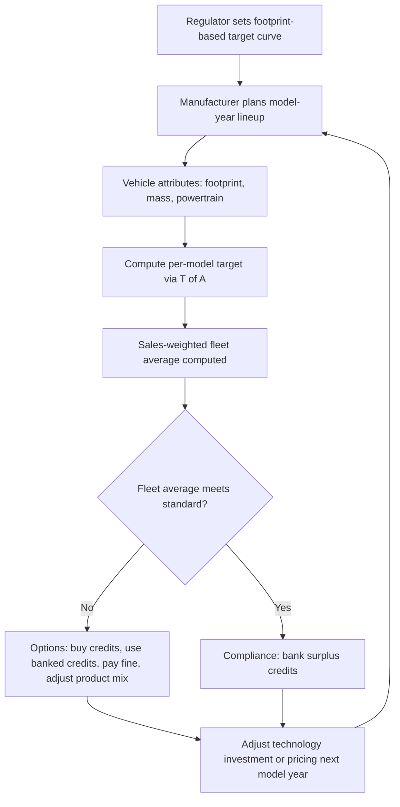

## Fuel Economy Standards and Their Economic Effects

### Overview

Fuel economy standards are regulatory instruments that mandate minimum fuel efficiency (or maximum fuel consumption/emissions) levels for vehicle fleets sold by manufacturers. They are among the most widely used policy tools for addressing externalities in transportation energy use, including energy security concerns, greenhouse gas emissions, and local air pollution. The canonical example is the U.S. Corporate Average Fuel Economy (CAFE) program, though analogous systems exist worldwide (EU CO₂ standards, Japan's Top Runner program, China's fuel consumption standards).

This topic sits at the intersection of environmental economics, industrial organization, and public finance, since fuel economy regulation interacts with fuel taxation, innovation incentives, and consumer behavior in ways that are frequently non-intuitive.

### Rationale for Regulation: Market Failures Addressed

**Key Points**

- **Energy security externality**: Oil dependence exposes economies to price volatility and geopolitical supply risk not fully priced by individual consumers.
- **Environmental externality**: Carbon emissions and local pollutants (NOx, PM) from fuel combustion are not internalized in the private cost of driving.
- **Energy paradox / consumer myopia**: A behavioral rationale holding that consumers systematically undervalue future fuel savings relative to upfront vehicle costs, due to high implicit discount rates, information asymmetries, or bounded rationality. This is contested in the literature — some studies find near-full valuation of fuel economy in vehicle prices, while others find underinvestment. [Inference — the size and even existence of the energy paradox remains an active empirical debate]
- **Principal-agent problems**: In fleet or rental contexts, the party choosing the vehicle (e.g., employer, dealer) may not bear the fuel costs.

The theoretically "first-best" instrument for the externalities above is a Pigouvian tax on fuel (or carbon), since it directly prices the externality regardless of how consumers achieve reductions (driving less, more efficient vehicles, alternative fuels). Fuel economy standards are a "second-best" instrument, used partly because fuel taxes face greater political resistance and partly to address the behavioral market failure that a fuel tax alone would not correct.

### Structure of Standards: Design Choices

**Key Points**

- **Fleet-average vs. per-vehicle standards**: Most modern systems (CAFE, EU) use fleet-wide sales-weighted averages rather than uniform per-vehicle minimums, allowing manufacturers flexibility in product mix.
- **Attribute-based standards**: Contemporary CAFE and EU standards set the target as a function of a vehicle attribute — typically footprint (wheelbase × track width) in the U.S., or mass in the EU. Each vehicle has its own target curve; the manufacturer's fleet average target is the sales-weighted average of individual vehicle targets.
- **Credit trading and banking**: Manufacturers can bank credits from over-compliance in one year/category for use in later years, and in some systems trade credits with other manufacturers.
- **Separate car/light-truck (or category) fleets**: The U.S. system historically distinguished passenger cars from light trucks (including SUVs and minivans), creating separate compliance obligations.

An attribute-based standard changes the economics of compliance substantially relative to a flat standard. Under a footprint-based standard, a manufacturer can meet its target partly by shifting sales toward vehicles with larger footprints, since those face a less stringent per-vehicle target — a form of standard-induced product repositioning distinct from pure efficiency improvement.

$$\text{Fleet Target} = \frac{\sum_i q_i \cdot T(A_i)}{\sum_i q_i}$$

where $q_i$ is sales volume of model $i$, $A_i$ is the attribute (footprint) of model $i$, and $T(\cdot)$ is the target function mapping attribute to required fuel economy (or maximum $g CO_2/mi$).

### Illustration: The Standard-Setting and Compliance Loop

### Compliance Cost Curve and Technology Adoption

Regulators and manufacturers evaluate compliance through marginal abatement cost (MAC) curves — the incremental cost of each successive fuel-saving technology (turbocharging with downsizing, cylinder deactivation, advanced transmissions, mild/full hybridization, lightweighting, aerodynamic improvements) ranked from cheapest to most expensive per unit of fuel economy gained.

$$MC(\Delta FE) = \frac{\partial C(\Delta FE)}{\partial (\Delta FE)}$$

A manufacturer facing a standard-compliance requirement equates marginal compliance cost across pathways: additional technology adoption, credit purchases (if allowed), and — as a last resort — fines (in the U.S. CAFE program, historically a per-mpg-per-vehicle civil penalty that some manufacturers, notably certain European luxury brands, have opted to pay rather than fully comply, an important empirical fact about how binding standards actually are for different market segments). [Unverified — the precise current per-vehicle penalty rate and which manufacturers pay it changes with rulemaking; verify against the latest NHTSA schedule for a specific model year]

### Economic Effects on Manufacturers

**Key Points**

- **Compliance cost pass-through**: Standard-induced technology costs are typically passed forward to consumers as higher vehicle prices, though the pass-through rate depends on market structure and competitive intensity.
- **Product-mix distortion**: Attribute-based standards can incentivize manufacturers toward larger vehicle footprints if the target curve is not calibrated tightly, partially offsetting intended fuel savings — an effect documented in empirical studies of the U.S. footprint standard.
- **Innovation incentive**: Standards act as a forcing function for R&D investment in efficiency-improving technology, potentially generating learning-by-doing and spillover benefits beyond what is privately optimal absent regulation.
- **Heterogeneous burden across manufacturers**: Firms with product portfolios concentrated in larger vehicles or performance segments face different marginal compliance costs than firms specializing in compact/efficient vehicles, creating competitive asymmetries.

**Example**

Consider two manufacturers facing the same footprint-based target curve:

- Manufacturer A sells primarily compact sedans (small footprint, stringent target). To comply, it must adopt marginal technologies costing, say, $40 per 0.1 gallon/100-mile improvement.
- Manufacturer B sells primarily large SUVs (large footprint, looser target, but starting from a lower baseline efficiency). Its marginal technology cost for the same improvement might be $25, because larger vehicles have more "room" for cost-effective measures (mild hybridization, aerodynamic tweaks) relative to their higher baseline fuel consumption.

The result is that compliance cost is not simply "one target for everyone" — it depends on interaction between existing technology penetration, vehicle class, and the specific target curve shape.

### Economic Effects on Consumers

**Key Points**

- **Purchase price effects**: Higher upfront vehicle prices from compliance technology costs.
- **Operating cost savings**: Reduced fuel expenditure over the vehicle's lifetime, which must be discounted and compared against the price premium.
- **Distributional effects**: Higher upfront prices can disproportionately affect lower-income buyers who are more likely to purchase used vehicles or face tighter credit constraints, even though fuel savings accrue over time; conversely, if standards are not to blame for higher prices in the used market immediately (a multi-year lag exists as regulated vehicles filter into the used fleet).
- **Vehicle-miles-traveled (VMT) rebound effect**: As per-mile fuel cost falls due to efficiency gains, the effective cost of driving declines, leading to some increase in miles driven — partially offsetting fuel savings.

The **rebound effect** is a central quantitative parameter in evaluating standards' net effect:

$$\varepsilon_{VMT, FE} = \frac{\% \Delta VMT}{\% \Delta \text{Fuel Cost per Mile}}$$

Empirical estimates in the literature for the U.S. long-run rebound effect commonly cluster in the 5–20% range (i.e., a 10% reduction in per-mile fuel cost increases VMT by roughly 0.5–2%), though estimates vary by study design, time period, and whether short-run or long-run elasticities are estimated. [Inference — treat any single point estimate with caution; the range itself reflects genuine empirical disagreement, not just estimation noise]

### The "Energy Paradox" Debate in Net Welfare Analysis

Whether fuel economy standards are welfare-improving hinges critically on the assumed magnitude of consumer undervaluation of fuel savings (if any). This changes the welfare calculus fundamentally:

- **If consumers are fully rational and forward-looking** (no energy paradox), an attribute-based standard imposes a cost on manufacturers/consumers that exceeds the value consumers place on the resulting fuel savings, and the standard's net welfare benefit rests entirely on the external costs it corrects (carbon, energy security, local pollution) minus the deadweight loss from the second-best (non-price) mechanism relative to a fuel tax.
- **If consumers systematically undervalue fuel savings** (energy paradox holds), a standard can generate a private welfare gain for consumers in addition to externality correction, since it "forces" a purchase decision closer to the consumer's own long-run interest.

This is the crux of a long-running dispute among energy economists (e.g., contrasting perspectives associated with researchers like Kenneth Gillingham, David Greene, and others), and regulatory impact analyses (such as those historically produced by the U.S. EPA/NHTSA joint rulemakings) have varied significantly across administrations partly due to differing assumptions on this parameter. [Inference — characterizations of "which side is right" would be an oversimplification of an unsettled empirical literature]

### Standards vs. Fuel Taxes: Comparative Efficiency

**Key Points**

- A fuel/carbon tax addresses the externality directly and is agnostic to the compliance pathway (efficiency, VMT reduction, fuel switching), making it generally more cost-effective per unit of externality reduced.
- Fuel economy standards only affect the efficiency margin, not the driving-frequency margin, and can even worsen the driving-frequency margin via the rebound effect.
- Standards avoid direct fuel price increases, making them more **politically durable** than taxes of comparable environmental stringency — an important political-economy consideration explaining their prevalence relative to carbon/fuel taxes in many jurisdictions, including the U.S.
- Standards impose compliance costs opaquely (embedded in vehicle prices) rather than transparently (at the pump), which affects public perception and political feasibility differently than a visible tax.

$$DWL_{\text{standard}} \geq DWL_{\text{tax}} \quad \text{(under full-rationality consumer assumption, for equivalent externality correction)}$$

This inequality is a standard theoretical result in the environmental economics literature — a fuel or carbon tax that achieves the same externality reduction as a fuel economy standard typically does so at lower or equal deadweight loss, because it does not distort the driving-frequency margin and lets each firm/consumer choose the cheapest abatement pathway. [Inference — this is a standard theoretical prediction under textbook assumptions; real-world DWL comparisons depend on the specific tax rate, standard stringency, and behavioral parameters assumed]

### Illustration: Comparative Mechanism (SVG Diagram)

<svg xmlns="http://www.w3.org/2000/svg" viewBox="0 0 760 380">
\<style\>
.title { font: bold 15px sans-serif; fill: #1a1a1a; }
.label { font: 12px sans-serif; fill: #333; }
.small { font: 10px sans-serif; fill: #555; }
.box { fill: #eef3fb; stroke: #3a5a8c; stroke-width: 1.5; }
.box2 { fill: #fdf0e6; stroke: #b5651d; stroke-width: 1.5; }
.arrow { stroke: #444; stroke-width: 1.5; fill: none; marker-end: url(#arrowhead); }
\</style\>
<text x="380" y="24" text-anchor="middle" class="title">Fuel Economy Standard vs. Fuel Tax — Margins Affected (svg_diagram)</text>
<rect x="40" y="55" width="300" height="120" rx="8" class="box" />
<text x="190" y="78" text-anchor="middle" class="label" font-weight="bold">Fuel Economy Standard</text>
<text x="60" y="100" class="small">- Targets vehicle efficiency only</text>
<text x="60" y="118" class="small">- No direct effect on per-mile cost</text>
<text x="60" y="136" class="small">- VMT margin untouched (rebound risk)</text>
<text x="60" y="154" class="small">- Cost embedded in vehicle price</text>
<rect x="420" y="55" width="300" height="120" rx="8" class="box2" />
<text x="570" y="78" text-anchor="middle" class="label" font-weight="bold">Fuel / Carbon Tax</text>
<text x="440" y="100" class="small">- Targets fuel consumption directly</text>
<text x="440" y="118" class="small">- Raises per-mile driving cost</text>
<text x="440" y="136" class="small">- Affects both efficiency and VMT</text>
<text x="440" y="154" class="small">- Cost visible at point of purchase (pump)</text>
<path d="M190,175 L190,220 L570,220 L570,175" class="arrow" />
<rect x="230" y="230" width="300" height="90" rx="8" fill="#eef7ee" stroke="#3a7a3a" stroke-width="1.5" />
<text x="380" y="253" text-anchor="middle" class="label" font-weight="bold">Shared Goal</text>
<text x="250" y="273" class="small">Reduce externalities: emissions, oil dependence,</text>
<text x="250" y="290" class="small">local pollution — but via different behavioral margins</text>
<text x="250" y="307" class="small">and with different political economy of visibility</text>

<text x="380" y="360" text-anchor="middle" class="small">Standards constrain the efficiency margin; taxes price the externality across all margins.</text>

</svg>

### Interaction with EV Policy and Transportation Transition

Within the broader chapter context of electric vehicles and transportation economics, fuel economy standards interact with EV-specific policy in several notable ways:

- **Zero-emission vehicle (ZEV) credit multipliers**: Many fuel economy/GHG standard frameworks (e.g., U.S. CAFE/GHG rules, EU CO₂ standards) grant manufacturers extra compliance credit per EV sold, sometimes weighted more heavily than the EV's actual measured efficiency would imply, effectively subsidizing EV compliance value within the fleet-average framework.
- **Utility factor for PHEVs**: Plug-in hybrid compliance calculations use a "utility factor" estimating the share of miles driven on electricity vs. gasoline, which affects the vehicle's counted fuel economy and has been a subject of methodological revision as real-world PHEV usage data has become available.
- **Fleet-average dilution effect**: As EV sales share rises, a manufacturer's fleet-average fuel economy calculation is mechanically improved (EVs often being assigned very high equivalent mpg figures), which can reduce the marginal pressure on internal combustion engine (ICE) technology improvement — a second-order effect regulators account for when setting future stringency.
- **Interaction with EV purchase incentives**: Fuel economy standards affect manufacturer supply-side incentives (compliance-driven EV production), while separate demand-side incentives (tax credits, rebates) affect consumer adoption; the two policy layers interact multiplicatively rather than additively in influencing overall EV market penetration. [Inference — the precise multiplicative vs. additive characterization is a simplification; actual interaction effects are studied empirically and vary by market]

### International Comparison

| Jurisdiction | Program | Metric | Structural Basis |
| --- | --- | --- | --- |
| United States | CAFE / EPA GHG standards | mpg / g CO₂ per mile | Footprint-based attribute standard |
| European Union | CO₂ emission performance standards | g CO₂/km | Mass-based attribute standard |
| Japan | Top Runner Program | km/L | Weight-class-based benchmarking |
| China | Fuel consumption standards + NEV mandate | L/100km + credit quota | Combined fuel economy standard and New Energy Vehicle credit trading |

**Key Points**

- The EU's mass-based approach has been criticized on grounds similar to the U.S. footprint critique: it can incentivize heavier vehicles since heavier vehicles receive looser targets.
- China's dual-credit system explicitly links fuel consumption compliance with NEV (EV/PHEV) credit requirements, creating direct cross-subsidization between ICE and EV compliance obligations within a single regulatory framework — a more integrated approach than the U.S./EU model of largely separate standard tracks.

### Empirical Evidence on Net Effects

**Key Points**

- Studies of the U.S. CAFE program's historical stringency increases (e.g., post-2007 Energy Independence and Security Act standards, and the 2012 GHG/CAFE joint rule) generally find measurable fuel economy improvements in the new-vehicle fleet, alongside evidence of some footprint-driven upsizing.
- Rebound effect estimates reduce, but do not eliminate, net fuel savings from stringency increases.
- Studies diverge on net consumer welfare effects depending on assumed valuation of fuel savings (the energy paradox parameter discussed above), meaning credible economists have reached different conclusions from similar data using different behavioral assumptions. [Inference — this reflects genuine methodological disagreement in the literature rather than a single settled consensus figure]

### Common Misconceptions

- **Misconception**: Fuel economy standards and fuel/carbon taxes achieve identical outcomes if calibrated to the same target reduction.

  **Correction**: They act on different behavioral margins (efficiency-only vs. efficiency-and-VMT) and have different cost-transparency and distributional properties.
- **Misconception**: Attribute-based standards are "loophole-free" once footprint or mass is fixed.

  **Correction**: Manufacturers can still respond by shifting the *distribution* of footprint/mass across their product lineup, which is itself a margin of adjustment the standard does not fully constrain.
- **Misconception**: EV credit multipliers make standards "easier" for all manufacturers equally.

  **Correction**: The compliance benefit scales with a manufacturer's existing EV sales share and portfolio mix, so the effective stringency reduction is highly heterogeneous across firms.

### Next Steps

**Related Topics**

- Pigouvian taxation and carbon pricing in transportation
- Rebound effect estimation methods and empirical literature
- Zero-emission vehicle (ZEV) mandates and credit trading systems
- EU Emissions Trading System interaction with transport
- Vehicle scrappage and used-vehicle market effects of regulation
- Manufacturer strategic response to attribute-based standards (footprint/mass gaming)
- Political economy of energy and environmental regulation design
- Life-cycle emissions accounting for EVs vs. ICE vehicles
- Consumer discount rates and the "energy paradox" literature
- Comparative regulatory design: CAFE vs. EU CO₂ standards vs. China's dual-credit system