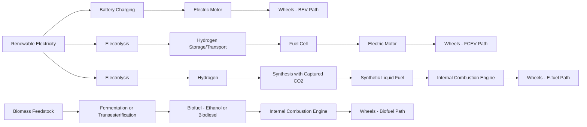

## Alternative Fuels: Hydrogen, Biofuels, and Synthetic Fuels Economics

### Overview

Alternative transportation fuels represent competing pathways to displace petroleum-based fuels, each with distinct cost structures, infrastructure requirements, and policy dependencies. Unlike battery electric vehicles (BEVs), which convert grid electricity directly to motion, hydrogen, biofuels, and synthetic fuels ("e-fuels") involve intermediate energy carriers with their own conversion losses, production economics, and distribution challenges. Evaluating these pathways requires comparing levelized cost of fuel, well-to-wheel efficiency, infrastructure capital intensity, and policy support mechanisms on a common basis.

### Comparative Framework: Energy Pathway Efficiency

**Key Points**

- **Well-to-wheel (WTW) efficiency** captures total energy losses from primary energy source to vehicle motion, and differs sharply across pathways.
- **Battery electric**: ~70–90% WTW efficiency (grid-to-wheel), the benchmark against which other pathways are typically compared.
- **Green hydrogen (electrolysis-based)**: Electricity → hydrogen (electrolysis, ~60–75% efficient) → compression/transport losses → fuel cell (~50–60% efficient) → motion, yielding overall WTW efficiency commonly cited in the 25–35% range.
- **E-fuels/synthetic fuels (electricity-based)**: Electricity → hydrogen → synthesis with captured CO₂ (Fischer-Tropsch or methanol-to-gasoline routes) → combustion in an internal combustion engine (~20–30% engine efficiency), yielding overall WTW efficiency commonly cited in the 10–20% range or lower.
- **Biofuels**: Efficiency is measured differently (land-to-wheel or biomass energy content to wheel) since the "input" is biomass rather than electricity; conversion efficiencies vary widely by feedstock and process (corn ethanol, cellulosic ethanol, biodiesel, renewable diesel).

[Inference — the specific efficiency percentages cited are representative ranges synthesized from technical literature; exact figures depend heavily on electrolyzer technology, fuel cell design, synthesis catalyst efficiency, and system boundaries assumed by a given study]

$$\eta_{WTW} = \eta_{\text{generation}} \times \eta_{\text{conversion}} \times \eta_{\text{transport/storage}} \times \eta_{\text{end-use}}$$

This multiplicative efficiency cascade is the central economic argument against hydrogen and e-fuels for light-duty passenger transport relative to direct electrification — each additional conversion step compounds energy losses, which translates directly into higher levelized fuel cost per mile driven, all else equal.

### Illustration: Energy Pathway Comparison

### Hydrogen Economics

**Key Points**

- **Production cost color spectrum**: "Grey" hydrogen (steam methane reforming, no carbon capture) is currently the cheapest production route; "blue" hydrogen (SMR with carbon capture) commands a premium for reduced emissions; "green" hydrogen (electrolysis powered by renewables) is generally the most expensive route today, though costs have been declining with electrolyzer scale-up.
- **Levelized cost of hydrogen (LCOH)** depends heavily on electricity price, electrolyzer capital cost, and capacity utilization (capacity factor), since electrolyzers are capital-intensive assets that need high utilization to amortize fixed costs.
- **Infrastructure capital intensity**: Hydrogen refueling stations require significantly higher capital investment per station than EV charging infrastructure, and hydrogen distribution (compression, liquefaction, or pipeline transport) adds substantial cost layers absent in electricity distribution via existing grid infrastructure.
- **Fuel cell vehicle (FCEV) total cost of ownership** has historically been higher than comparable BEVs for light-duty applications, though the comparison is more favorable for heavy-duty, long-haul, and applications requiring fast refueling and high utilization (e.g., long-haul trucking, forklifts, some transit and rail applications).

$$LCOH = \frac{CAPEX_{annualized} + OPEX + (P_{elec} \times E_{input})}{H_2 \text{ output}}$$

where $P_{elec}$ is the electricity price and $E_{input}$ is the electrolyzer's specific energy consumption per unit of hydrogen output.

**Example**

A green hydrogen facility with an alkaline electrolyzer consuming approximately 50 kWh per kg of hydrogen produced, running on electricity priced at $0.04/kWh at high capacity factor, faces an electricity input cost alone of roughly $2/kg H₂ before accounting for capital charges, water, and balance-of-plant costs — illustrating why cheap, high-utilization renewable electricity access is a first-order determinant of green hydrogen competitiveness, more so than electrolyzer efficiency improvements alone. [Inference — this is an illustrative arithmetic example using representative parameters, not a specific real-world facility's reported cost]

**Why heavy-duty vs. light-duty economics diverge**: Hydrogen's advantages — fast refueling (minutes vs. tens of minutes for fast charging), higher energy density by weight (favorable for range without proportional weight penalty), and better cold-weather performance relative to some battery chemistries — matter more for applications with high daily utilization and payload sensitivity (long-haul trucking, buses, some rail and maritime applications) than for typical passenger car use patterns, where BEV charging can be scheduled around idle time (overnight, at destinations).

### Biofuels Economics

**Key Points**

- **First-generation biofuels** (corn ethanol in the U.S., sugarcane ethanol in Brazil, soy/rapeseed biodiesel) use food-crop feedstocks and are the most mature and lowest-cost biofuel category, but face the "food vs. fuel" land-use debate and have contested net lifecycle carbon benefits depending on land-use-change assumptions.
- **Second-generation (cellulosic) biofuels** use non-food biomass (agricultural residues, dedicated energy crops, woody biomass) and offer better land-use and carbon profiles in principle, but face substantially higher production costs due to more complex feedstock pretreatment (breaking down lignocellulosic structure) and have struggled to achieve commercial-scale cost parity despite decades of policy support and R&D investment.
- **Renewable diesel (HVO) and sustainable aviation fuel (SAF)**: Produced via hydrotreating of fats, oils, and greases (used cooking oil, animal fats, vegetable oils), these are chemically similar to petroleum diesel/jet fuel ("drop-in" fuels) and have seen rapid capacity growth, particularly in aviation and heavy-duty applications where electrification is less near-term viable.
- **Feedstock cost dominance**: For mature biofuel pathways, feedstock cost typically represents 60–80% of total production cost, making biofuel economics highly sensitive to agricultural commodity price cycles and competing uses for the same feedstock (e.g., used cooking oil demand from both biodiesel and renewable diesel producers).

**Land-use economics** is a distinguishing feature of biofuels relative to hydrogen/e-fuels/BEVs: biofuel production competes for finite arable land with food production and other land uses, introducing an implicit land-opportunity-cost component into biofuel economics that has no direct analog in electricity-based pathways. This underlies the **indirect land-use change (ILUC)** debate: expanding biofuel feedstock cultivation on existing cropland can displace food production to new land elsewhere (including converted forest or grassland), generating carbon emissions not captured in direct production-cycle accounting. [Inference — ILUC magnitude estimates vary substantially across modeling studies and remain a genuinely contested area of applied economics/lifecycle assessment]

### Synthetic Fuels (E-Fuels) Economics

**Key Points**

- **Production route**: Synthetic fuels combine green hydrogen (from electrolysis) with captured carbon (from direct air capture or point-source industrial capture) via Fischer-Tropsch synthesis or methanol synthesis routes to produce drop-in liquid hydrocarbons (e-gasoline, e-diesel, e-kerosene/e-SAF).
- **Cost stacking**: E-fuel cost combines green hydrogen production cost (itself electricity-price-dependent) with carbon capture cost (particularly expensive for direct air capture relative to point-source capture) plus synthesis plant capital and operating costs — making e-fuels currently among the most expensive alternative fuel pathways on a per-unit-energy basis.
- **Primary use case**: The strongest economic argument for e-fuels is in applications where direct electrification or hydrogen are technically difficult or infeasible — aviation (energy density requirements), maritime shipping, and potentially retrofitting the existing ICE vehicle fleet without requiring vehicle replacement.
- **"Fuel of last resort" framing**: Because e-fuels are typically the most expensive pathway per unit of useful transportation energy delivered, energy economists generally view them as most economically justified for hard-to-electrify sectors rather than as a broad substitute for light-duty vehicle electrification. [Inference — this reflects a widely-held view among energy economists and technical analysts, but is a normative/strategic judgment about resource allocation, not a settled empirical fact, and is contested by proponents who argue for e-fuels' role in preserving existing vehicle fleet and infrastructure value]

### Comparative Cost Table (Illustrative Structure)

| Pathway | Primary Cost Drivers | Relative WTW Efficiency | Best-Fit Application |
| --- | --- | --- | --- |
| Battery Electric (BEV) | Battery cost, electricity price, charging infrastructure | High | Light-duty passenger, urban/regional |
| Green Hydrogen (FCEV) | Electrolyzer CAPEX, electricity price, refueling infrastructure | Low-Moderate | Heavy-duty, long-haul, high-utilization fleets |
| First-Gen Biofuels | Feedstock (crop) price, conversion plant scale | Moderate (land-adjusted) | Existing ICE fleet, near-term blending mandates |
| Cellulosic Biofuels | Feedstock pretreatment cost, enzyme/catalyst cost | Moderate | Aviation (SAF), long-term ICE fleet decarbonization |
| Synthetic E-Fuels | Green H₂ cost + carbon capture cost + synthesis CAPEX | Low | Aviation, maritime, legacy fleet decarbonization |

[Inference — "Relative WTW Efficiency" ratings are qualitative syntheses for comparative orientation, not precise benchmarked figures; actual values vary by specific technology vintage and system configuration]

### Policy Support Mechanisms and Their Economic Function

**Key Points**

- **Renewable Fuel Standard (RFS)** (U.S.): A quantity-based mandate requiring blending of specified biofuel volumes into the transportation fuel supply, creating a tradable credit market (RIN — Renewable Identification Numbers) whose price reflects the marginal cost gap between biofuel and petroleum-based fuel.
- **Low Carbon Fuel Standard (LCFS)** (California and adopted elsewhere): A performance-based standard requiring fuel providers to reduce the average carbon intensity of fuels sold, creating a credit-trading system where low-carbon fuel producers (including some hydrogen and biofuel pathways) generate tradable credits purchased by higher-carbon-intensity fuel providers.
- **Hydrogen production tax credits** (e.g., U.S. 45V clean hydrogen production credit under the Inflation Reduction Act): Tiered credits based on lifecycle carbon intensity of hydrogen production, directly targeting the cost gap between green and grey hydrogen. [Unverified — specific credit values, tiering thresholds, and implementation rules have been subject to ongoing regulatory guidance revisions; verify against current U.S. Treasury/IRS guidance for exact figures applicable to a given period]
- **EU Renewable Energy Directive (RED II/III)** sub-targets for advanced biofuels and renewable fuels of non-biological origin (RFNBO, covering e-fuels and green hydrogen) in the transport sector.
- **Blending mandates vs. carbon-intensity standards**: These represent different regulatory philosophies — mandates specify physical volumes, while carbon-intensity standards (like LCFS) are technology-neutral and let the market determine the least-cost combination of pathways to meet a carbon target, generally considered more economically efficient in the Pigouvian sense discussed in fuel economy standard analysis.

### The Common Economic Thread: Cost Parity Timelines

Across all three alternative fuel categories, achieving cost parity with incumbent fossil fuels (or with BEVs, in the case of the broader transportation decarbonization comparison) depends on a shared set of levers:

1. **Scale economies in production** (electrolyzer manufacturing scale, biorefinery scale, synthesis plant scale) reducing capital cost per unit of output.
2. **Renewable electricity cost declines**, which disproportionately benefit hydrogen and e-fuels given their electricity-intensive production.
3. **Carbon pricing or equivalent policy support** narrowing the cost gap with fossil incumbents by internalizing the emissions externality these fuels are designed to avoid.
4. **Infrastructure build-out economics**, where early-mover infrastructure investment faces a chicken-and-egg problem (low vehicle/demand volume discourages infrastructure investment, and vice versa) common to hydrogen refueling networks in particular.

$$\text{Cost Parity Year} = f(\text{learning rate}, \text{deployment scale}, \text{carbon price trajectory}, \text{competing pathway cost decline rate})$$

[Speculation — no single reliable point forecast exists for when any of these pathways reaches cost parity with incumbents across all use cases; published projections vary widely by institution, assumed policy trajectory, and technology learning curve assumptions, and have historically been revised substantially over time]

### Common Misconceptions

- **Misconception**: Green hydrogen and e-fuels are interchangeable near-term substitutes for battery electric vehicles in the light-duty passenger segment.

  **Correction**: The multiplicative efficiency losses in both pathways make them generally more expensive per mile than BEVs for typical passenger vehicle use patterns; their strongest economic case lies in applications where BEVs face technical limitations.
- **Misconception**: All biofuels have straightforwardly positive lifecycle carbon benefits proportional to their blend percentage.

  **Correction**: Lifecycle carbon accounting for biofuels depends heavily on feedstock choice, land-use assumptions (including indirect land-use change), and cultivation/processing energy inputs — first-generation biofuels in particular have contested net carbon benefits in some scenarios.
- **Misconception**: E-fuels allow the existing ICE vehicle fleet to be decarbonized at similar cost to grid decarbonization for EVs.

  **Correction**: E-fuel production cost currently substantially exceeds the cost of renewable electricity generation plus grid delivery on a per-mile-driven basis, reflecting the additional conversion steps involved.

### Next Steps

**Related Topics**

- Levelized cost of energy (LCOE) methodology and its adaptation to fuel pathways
- Carbon capture and direct air capture economics
- Renewable Identification Number (RIN) and Low Carbon Fuel Standard credit markets
- Electrolyzer technology types (alkaline, PEM, solid oxide) and cost trajectories
- Indirect land-use change (ILUC) modeling in biofuel lifecycle assessment
- Heavy-duty and long-haul trucking decarbonization pathway comparison
- Sustainable aviation fuel (SAF) mandates and aviation sector decarbonization economics
- Hydrogen refueling infrastructure chicken-and-egg investment problem
- Carbon pricing mechanisms and their interaction with fuel-specific mandates
- Grid decarbonization pace as a determinant of alternative fuel pathway competitiveness