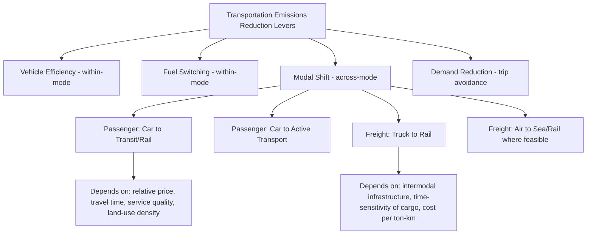

## Modal Shift Economics and Transportation Decarbonization

### Overview

Modal shift refers to the reallocation of passenger and freight movement across transportation modes — private vehicle, public transit, rail, cycling/walking, aviation, maritime, and pipeline — in response to relative price, time, and policy incentives. In the context of transportation decarbonization, modal shift is a distinct abatement lever from vehicle-level efficiency or fuel-switching (covered in fuel economy standards and alternative fuels topics): rather than making a given mode cleaner, it changes the *distribution of activity across modes*, exploiting the fact that modes differ substantially in energy intensity and emissions per passenger-km or ton-km.

This topic is fundamentally about transportation demand elasticities, cross-modal substitution, and the economic instruments (pricing, investment, land-use policy) that influence mode choice.

### Energy and Emissions Intensity Across Modes

**Key Points**

- Modes differ by roughly an order of magnitude or more in energy intensity per passenger-km or ton-km, making modal shift a potentially high-leverage decarbonization lever, particularly for freight and urban passenger travel.
- **Passenger transport** (approximate ordering, most to least energy-intensive per passenger-km): single-occupant car > taxi/rideshare > bus (low occupancy) > aviation (short-haul) > rail (intercity) > bus (high occupancy) > rail (electrified, high-speed) > cycling/walking (near-zero direct energy use).
- **Freight transport** (approximate ordering, most to least energy-intensive per ton-km): air freight >> truck (long-haul) > rail freight > maritime shipping (bulk) > pipeline (for applicable commodities).
- Occupancy/load factor is a first-order determinant of actual (not just theoretical) emissions intensity — an underutilized bus or half-empty train can have worse per-passenger-km emissions than an efficient, fully-loaded car, meaning modal shift benefits are conditional on maintaining or improving utilization rates in the receiving mode. [Inference — actual crossover points depend on specific vehicle/vessel technology, occupancy achieved, and electricity/fuel carbon intensity in a given location and time, so the ordering above is a general pattern rather than a universal ranking]

$$E_{\text{per passenger-km}} = \frac{E_{\text{total energy consumed}}}{N_{\text{passengers}} \times D_{\text{distance}}}$$

This denominator relationship explains why **occupancy/load factor policy** (e.g., high-occupancy vehicle lanes, transit frequency optimization, freight consolidation) is often as economically important as mode choice itself in realized emissions outcomes.

### Illustration: Modal Shift as a Distinct Abatement Lever

### Economic Drivers of Mode Choice: The Generalized Cost Framework

Transportation economists model mode choice using a **generalized cost** function that combines monetary and time costs into a single comparable metric:

$$GC_m = P_m + (VOT \times T_m) + \delta_m$$

where $GC_m$ is generalized cost of mode $m$, $P_m$ is the monetary price (fare, fuel, parking, tolls), $VOT$ is the traveler's value of time, $T_m$ is travel time by mode $m$, and $\delta_m$ captures non-price, non-time factors (comfort, reliability, safety perception, flexibility).

**Key Points**

- **Value of time (VOT)** is central and heterogeneous across travelers — commuters, business travelers, and leisure travelers exhibit systematically different VOT, which is why transit and rail compete more effectively for some trip purposes (commuting with predictable schedules) than others (time-sensitive business travel).
- **Cross-price elasticity between modes**: The responsiveness of mode-B demand to a price change in mode A. A positive cross-price elasticity between driving and transit (rising gas prices/parking costs increasing transit ridership) indicates substitutability; empirical estimates of this elasticity vary substantially by city, existing transit quality, and time period. [Inference — precise elasticity magnitudes are context-dependent and should be sourced from studies specific to the relevant metropolitan area or corridor rather than assumed universal]
- **Network and density effects**: Mode choice economics are not solely about per-trip pricing — transit and active transport viability depend heavily on land-use density and network completeness (the "last-mile problem"), meaning modal shift policy often requires complementary land-use and infrastructure investment rather than pricing alone.
- **Habit and status quo bias**: Behavioral economics literature finds mode choice exhibits inertia beyond what generalized cost models alone predict, meaning policy-induced price/time changes may take multiple years to translate into observed modal shift as habits adjust.

### Policy Instruments for Inducing Modal Shift

**Key Points**

- **Congestion pricing / cordon pricing**: Directly raises the price of driving in dense urban cores (e.g., London Congestion Charge, Stockholm congestion tax, New York's congestion pricing program), internalizing congestion and, incidentally, emissions externalities, while generating revenue often earmarked for transit investment.
- **Parking pricing and supply restriction**: Parking cost and availability function as an effective, though often underappreciated, lever on driving cost, since minimum parking requirements in zoning codes have historically subsidized driving by bundling "free" parking into building costs.
- **Fuel taxes and carbon pricing**: Raise the marginal cost of driving per km, with modal shift being one of several margins of behavioral response (alongside reduced trip frequency, fuel-efficient vehicle purchase, and trip-chaining).
- **Transit fare policy and subsidy**: Lowering transit fares (or eliminating them, as in some fare-free transit experiments) directly reduces the price term in the generalized cost function, though evidence on fare elasticity suggests fare changes alone often produce smaller ridership shifts than service quality (frequency, reliability) improvements. [Inference — the relative magnitude of fare elasticity versus service-quality elasticity varies by study and context; this is a general pattern noted in transit economics literature rather than a fixed ratio]
- **Freight-specific instruments**: Rail infrastructure investment, intermodal terminal subsidies, truck weight/emissions regulations, and low-emission zones for urban freight delivery.
- **Land-use and zoning reform**: Transit-oriented development, mixed-use zoning, and density increases near transit corridors reduce trip distances and improve the relative competitiveness of transit and active transport — a longer-timescale but potentially higher-leverage lever than pricing alone.

### Freight Modal Shift Economics

Freight modal shift economics differs meaningfully from passenger modal shift due to different decision-makers (logistics firms, shippers) and different cost structures.

**Key Points**

- **Rail vs. truck trade-off**: Rail freight has substantially lower energy intensity and emissions per ton-km than long-haul trucking, but trucking retains advantages in flexibility, speed, and door-to-door service without transshipment — meaning rail is generally most competitive for long-haul, non-time-sensitive, high-volume bulk or containerized freight, while trucking dominates shorter-haul and time-sensitive segments.
- **Intermodal infrastructure investment**: The economic viability of rail-truck intermodal shift depends heavily on terminal density and drayage (short-haul trucking to/from rail terminals) cost, since poor terminal access can erode rail's per-ton-km cost advantage once total door-to-door logistics cost is considered.
- **Maritime and inland waterway shift**: For applicable freight corridors, shifting from truck to maritime/inland waterway transport offers substantial emissions intensity reductions per ton-km, though transit time increases can be a binding constraint for just-in-time supply chains.
- **Break-even distance concept**: Rail (or intermodal) becomes cost-competitive with trucking only beyond a certain minimum haul distance, since rail's fixed terminal/handling costs must be amortized over the trip; below this break-even distance, trucking's lower fixed-cost structure dominates.

$$C_{\text{truck}}(d) = F_{\text{truck}} + v_{\text{truck}} \cdot d$$

$$C_{\text{rail}}(d) = F_{\text{rail}} + v_{\text{rail}} \cdot d, \quad \text{where } F_{\text{rail}} > F_{\text{truck}}, \, v_{\text{rail}} < v_{\text{truck}}$$

The break-even distance $d^*$ solves $C_{\text{truck}}(d^*) = C_{\text{rail}}(d^*)$, i.e., $d^* = \frac{F_{\text{rail}} - F_{\text{truck}}}{v_{\text{truck}} - v_{\text{rail}}}$. Rail's higher fixed terminal/handling cost ($F_{\text{rail}}$) but lower marginal per-km cost ($v_{\text{rail}}$) means it only becomes economical beyond this threshold distance.

**Example**

A shipper moving containerized goods 200 km faces a break-even distance for rail competitiveness of, say, 500 km in a given corridor (reflecting terminal handling costs on both ends plus drayage). Below that threshold, trucking remains the lower-cost option despite rail's lower per-km marginal cost, because the fixed terminal costs are not amortized over enough distance. [Inference — illustrative numerical example; actual break-even distances vary substantially by corridor, terminal infrastructure quality, and commodity type, and should be sourced from corridor-specific studies for real decisions]

### Illustration: Freight Mode Break-Even Distance (SVG Diagram)

<svg xmlns="http://www.w3.org/2000/svg" viewBox="0 0 720 380">
\<style\>
.title { font: bold 15px sans-serif; fill: #1a1a1a; }
.axis { stroke: #333; stroke-width: 1.5; }
.truckline { stroke: #b5651d; stroke-width: 2.5; fill: none; }
.railline { stroke: #2a6f97; stroke-width: 2.5; fill: none; }
.label { font: 12px sans-serif; fill: #333; }
.small { font: 10px sans-serif; fill: #555; }
.dash { stroke: #888; stroke-width: 1; stroke-dasharray: 4,3; }
\</style\>
<text x="360" y="24" text-anchor="middle" class="title">Truck vs. Rail Cost Curve and Break-Even Distance (svg_diagram)</text>
<line x1="80" y1="320" x2="660" y2="320" class="axis" />
<line x1="80" y1="320" x2="80" y2="50" class="axis" />
<text x="370" y="350" text-anchor="middle" class="label">Distance (km)</text>
<text x="30" y="185" text-anchor="middle" class="label" transform="rotate(-90 30 185)">Total Cost</text>
<line x1="80" y1="270" x2="660" y2="120" class="truckline" />
<text x="600" y="115" class="label" fill="#b5651d">Truck: high slope, low fixed cost</text>
<line x1="80" y1="230" x2="660" y2="150" class="railline" />
<text x="600" y="165" class="label" fill="#2a6f97">Rail: low slope, high fixed cost</text>
<line x1="330" y1="320" x2="330" y2="192" class="dash" />
<circle cx="330" cy="192" r="4" fill="#333" />
<text x="330" y="340" text-anchor="middle" class="small">d* (break-even distance)</text>

<text x="150" y="290" class="small">Truck cheaper here</text>

<text x="450" y="200" class="small">Rail cheaper here</text>

</svg>

### Interaction with Electric Vehicle Adoption

Within the chapter's EV focus, modal shift and vehicle electrification are complementary but distinct decarbonization strategies, and their interaction has specific economic nuances:

**Key Points**

- **EVs reduce but do not eliminate the case for modal shift**: Even a fully electrified vehicle fleet retains externalities that modal shift addresses but vehicle electrification does not — traffic congestion, road wear/infrastructure cost, urban land consumption for parking and roads, and (for electricity grids not yet fully decarbonized) upstream generation emissions.
- **Electrified transit as a complementary strategy**: Electrification of buses and rail compounds the emissions benefit of modal shift, since a passenger shifting from an ICE car to an electrified bus or train captures both the modal efficiency gain and the fuel-switching gain simultaneously.
- **Risk of policy substitution**: Some transportation economists caution that heavy policy and public attention on EV adoption can crowd out investment in transit, active transport infrastructure, and land-use reform, even though these strategies are not mutually exclusive and are argued by many analysts to be more cost-effective per ton of CO₂ abated in dense urban contexts specifically. [Inference — this is a policy-design concern raised in some transportation economics and urban planning literature, not a universally observed empirical outcome, and its magnitude/validity would depend on specific jurisdictions' policy portfolios]
- **Vehicle-miles-traveled (VMT) as the shared target variable**: Both EV adoption (indirectly, via the rebound effect discussed in fuel economy standards) and modal shift policy affect aggregate VMT, meaning the two strategies are best evaluated jointly against a shared metric of total vehicle-km traveled and its associated externalities (congestion, land use, safety), not solely tailpipe emissions per vehicle.

### Empirical Evidence and Measurement Challenges

**Key Points**

- **Elasticity estimation difficulty**: Isolating the causal effect of a specific pricing or infrastructure intervention on modal shift is complicated by confounding factors (simultaneous land-use changes, economic cycles, fuel price movements), meaning much of the modal shift literature relies on natural experiments (e.g., transit strikes, congestion pricing introduction events) for credible identification.
- **Induced demand as a complicating factor**: New transit or active transport infrastructure can induce entirely new trips rather than purely substituting for car trips, meaning gross ridership increases can overstate the net emissions benefit if a portion represents induced travel rather than mode substitution. [Inference — the magnitude of induced demand versus genuine substitution varies significantly by study and context, and is a genuinely debated empirical question in transportation planning literature]
- **Rebound at the system level**: If modal shift frees up road capacity (reduced congestion from some drivers switching to transit), remaining or new drivers may increase their own trip-making in response to improved travel times — an analog to the vehicle-level rebound effect but operating at the network level, sometimes termed "induced traffic" in the congestion literature.

### Common Misconceptions

- **Misconception**: Modal shift and vehicle electrification are competing, mutually exclusive decarbonization strategies.

  **Correction**: They address overlapping but distinct externalities (tailpipe/upstream emissions vs. congestion, land use, and grid-independent externalities) and are generally considered complementary in comprehensive transportation decarbonization strategies.
- **Misconception**: Building transit infrastructure automatically achieves proportional emissions reductions equal to the ridership gained.

  **Correction**: Net emissions benefit depends on how much ridership represents genuine substitution away from driving versus induced new travel, and on the occupancy/utilization achieved by the new transit service.
- **Misconception**: Freight modal shift to rail is unambiguously beneficial regardless of distance.

  **Correction**: Rail's cost and emissions advantage over trucking is distance-dependent due to fixed terminal/handling costs; below the break-even distance, trucking remains both cheaper and sometimes comparable or lower in total emissions once drayage and terminal handling are included.

### Next Steps

**Related Topics**

- Congestion pricing design and revenue allocation (London, Stockholm, NYC case studies)
- Value of time (VOT) estimation methods in transportation demand modeling
- Transit-oriented development and land-use/transport interaction economics
- Induced demand and induced traffic in transportation infrastructure investment
- Intermodal freight terminal economics and drayage cost structures
- Vehicle-miles-traveled (VMT) as a policy target versus tailpipe emissions metrics
- Behavioral economics of travel habit formation and status quo bias
- Rebound effect and induced traffic as network-level phenomena
- Active transport (cycling/walking) infrastructure cost-benefit analysis
- Comparative case studies: European vs. North American vs. Asian modal shift policy outcomes