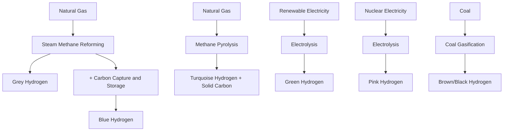

## Hydrogen Production Pathways and Cost Comparison

### Overview

Hydrogen production economics is foundational to evaluating the broader "hydrogen economy" thesis, since hydrogen has no natural primary energy source of its own — it must be produced from another energy input (natural gas, coal, electricity, biomass), meaning its cost and carbon intensity are entirely derived from the production pathway chosen. This topic surveys the major production pathways, their cost structures, and the analytical frameworks used to compare them on a common basis.

### The Hydrogen Color Taxonomy

**Key Points**

- **Grey hydrogen**: Produced via steam methane reforming (SMR) of natural gas without carbon capture. Currently the dominant global production method by volume and the lowest-cost pathway in most regions with access to inexpensive natural gas.
- **Blue hydrogen**: SMR (or autothermal reforming, ATR) combined with carbon capture and storage (CCS), capturing a substantial share (though not all) of process CO₂ emissions. Commands a cost premium over grey hydrogen reflecting CCS capital and operating costs, with the premium's magnitude also depending on the carbon capture rate achieved (higher capture rates generally cost disproportionately more at the margin).
- **Green hydrogen**: Produced via electrolysis of water using renewable electricity (wind, solar, hydro). Currently the most expensive mainstream pathway in most markets, though costs have declined with electrolyzer manufacturing scale-up and renewable electricity cost declines.
- **Turquoise hydrogen**: Produced via methane pyrolysis, splitting methane into hydrogen and solid carbon (rather than CO₂), avoiding direct CO₂ emissions from the reaction itself, though the pathway remains at an earlier commercial maturity stage than SMR/electrolysis. [Unverified — commercial-scale deployment status and cost data for methane pyrolysis are evolving; treat specific cost figures for this pathway with more caution than for SMR or electrolysis]
- **Pink/purple hydrogen**: Electrolysis powered by nuclear electricity, sometimes distinguished from "green" hydrogen due to nuclear's distinct electricity cost structure and capacity factor characteristics (very high, stable capacity factor, which benefits electrolyzer utilization economics).
- **Other terms** (brown/black hydrogen from coal gasification without capture) exist in the taxonomy but are regionally significant primarily where coal is the dominant industrial energy source.

This color taxonomy is an informal industry/policy convention rather than a rigorous technical classification, and terminology usage varies somewhat across jurisdictions and organizations. [Inference — while the general color associations described are consistently used across most industry and policy sources, exact boundary definitions (e.g., minimum capture rate to qualify as "blue") vary by regulatory framework and are not universally standardized]

### Illustration: Production Pathway Overview

### Steam Methane Reforming (SMR): Technical and Cost Basis

**Key Points**

- SMR reacts methane with high-temperature steam over a catalyst to produce hydrogen and CO₂, via the reaction $CH_4 + 2H_2O \rightarrow 4H_2 + CO_2$ (combining the reforming and water-gas shift reactions).
- SMR is a mature, high-throughput industrial process with decades of operational experience, primarily used for industrial hydrogen supply (ammonia production, oil refining) prior to its relevance for transportation/energy applications.
- **Cost structure**: SMR's levelized cost is dominated by natural gas feedstock price, with capital cost representing a comparatively smaller share for large-scale plants due to economies of scale in reforming plant construction.
- **Carbon intensity**: Grey hydrogen from SMR emits approximately 9–10 kg CO₂ per kg H₂ produced (a commonly cited industry figure), making unabated SMR a high-carbon-intensity production route relative to the electrolysis-based alternatives. [Inference — the precise emissions factor varies somewhat by plant efficiency and natural gas composition; the range cited is a widely-referenced industry approximation]

$$LCOH_{SMR} = \frac{CAPEX_{annualized} + OPEX_{fixed}}{H_2 \text{ output}} + (P_{NG} \times SEC_{NG})$$

where $P_{NG}$ is the natural gas price and $SEC_{NG}$ is the specific natural gas consumption per unit hydrogen output (a technology-dependent conversion factor).

### Blue Hydrogen: The CCS Cost Premium

**Key Points**

- Blue hydrogen adds carbon capture (typically targeting the concentrated CO₂ stream from the reforming reaction, and sometimes also the more dilute flue gas stream from process heating) plus CO₂ transport and geological storage costs to the SMR base cost.
- **Capture rate matters economically**: Capturing only the concentrated process stream (the water-gas shift off-gas) is comparatively lower-cost and can achieve capture rates in the 60–90% range depending on configuration; achieving higher overall capture rates (approaching 95%+) requires also capturing the more dilute flue gas stream, which is substantially more expensive per additional ton of CO₂ avoided. [Inference — specific capture rate and cost figures vary by plant design and are drawn from general CCS engineering literature rather than a single authoritative source; treat as representative ranges]
- **CO₂ transport and storage (T&S) cost** depends heavily on proximity to suitable geological storage formations (depleted oil/gas reservoirs, saline aquifers) and whether shared CO₂ transport infrastructure ("CO₂ hubs") is available, since dedicated pipeline infrastructure for a single facility is capital-intensive.
- Blue hydrogen is generally positioned as a **transitional pathway** — leveraging existing natural gas infrastructure and SMR plant experience while carbon capture and storage infrastructure and green hydrogen supply chains mature — though this framing is contested by some analysts who argue methane leakage across the natural gas supply chain (upstream production, transport) can substantially erode blue hydrogen's climate benefit relative to grey hydrogen if not tightly controlled. [Inference — the magnitude of upstream methane leakage and its effect on blue hydrogen's net lifecycle emissions is an actively studied and debated question in the academic literature, with results sensitive to assumed leakage rates]

### Green Hydrogen: Electrolysis Technology and Cost Drivers

**Key Points**

- **Electrolyzer technology types**:
  - **Alkaline electrolyzers**: Most mature, lowest capital cost per unit capacity, but lower current density and slower response to variable power input (a consideration for pairing with variable renewable electricity).
  - **Proton exchange membrane (PEM) electrolyzers**: Higher capital cost than alkaline but faster response time and higher current density, making them better suited to variable renewable electricity input; use of platinum-group catalysts is a notable cost factor.
  - **Solid oxide electrolyzers (SOEC)**: Operate at high temperature, offering potentially higher electrical efficiency (particularly when integrated with a waste heat source), but at an earlier commercial maturity stage than alkaline or PEM.
- **Levelized cost of hydrogen (LCOH) for green hydrogen** is driven by three primary factors: (1) electricity price, (2) electrolyzer capital cost (CAPEX per kW of capacity), and (3) capacity factor/utilization (since electrolyzers are capital assets requiring high utilization to amortize fixed costs over more output).
- **The capacity factor trade-off**: Pairing an electrolyzer with dedicated renewable generation (e.g., co-located solar) offers very low or zero electricity cost but low capacity factor (electrolyzer runs only when the sun shines, absent storage), while grid-connected operation offers higher capacity factor but exposes the electrolyzer to average grid electricity prices (or requires securing renewable power purchase agreements, which typically carry a premium over average grid price to guarantee "green" attribute claims).

$$LCOH_{green} = \frac{CAPEX_{elec} \times CRF}{CF \times 8760 \times \eta_{elec}} + \frac{OPEX_{fixed}}{CF \times 8760 \times \eta_{elec}} + \frac{P_{elec}}{\eta_{elec}}$$

where $CRF$ is the capital recovery factor, $CF$ is capacity factor, $\eta_{elec}$ is electrolyzer efficiency (kg H₂ per kWh input), and $P_{elec}$ is the electricity price. This formulation makes explicit that low capacity factor sharply raises the amortized capital cost component per unit of hydrogen output, even when electricity itself is cheap or free.

**Example**

An electrolyzer with a specific capital cost driving an annualized fixed cost that, spread over a 90% capacity factor, adds roughly $0.50/kg H₂ to levelized cost — but if the same electrolyzer instead runs at only 25% capacity factor (typical of direct-coupled, unstored solar-only operation), the same annualized fixed cost, spread over far less output, can add $1.80/kg H₂ or more, potentially outweighing the electricity cost savings from avoiding grid purchases entirely. [Inference — illustrative arithmetic example using representative parameters to demonstrate the capacity factor sensitivity mechanism, not a specific reported project's costs]

### Comparative Cost Table (Illustrative Structure)

| Pathway | Primary Cost Driver | Typical Capital Intensity | Carbon Intensity (relative) | Commercial Maturity |
| --- | --- | --- | --- | --- |
| Grey (SMR) | Natural gas price | Low-Moderate | High | Fully mature |
| Blue (SMR + CCS) | Natural gas price + CCS CAPEX/OPEX + CO₂ T&S | Moderate-High | Low-Moderate (depends on capture rate and upstream leakage) | Mature technology, growing deployment |
| Green (Electrolysis) | Electricity price + electrolyzer CAPEX + capacity factor | High | Very Low (grid-carbon-intensity dependent) | Commercial, scaling rapidly |
| Turquoise (Pyrolysis) | Natural gas price + pyrolysis reactor CAPEX + carbon co-product value | Moderate (emerging) | Low (direct process emissions) | Early commercial/demonstration |

[Inference — qualitative ratings synthesize general patterns from technical and policy literature for comparative orientation; precise cost figures shift with regional natural gas and electricity prices, carbon policy, and technology vintage, and should be sourced from current techno-economic studies for decision-relevant analysis]

### Illustration: LCOH Sensitivity Comparison (SVG Diagram)

<svg xmlns="http://www.w3.org/2000/svg" viewBox="0 0 720 400">
\<style\>
.title { font: bold 15px sans-serif; fill: #1a1a1a; }
.axis { stroke: #333; stroke-width: 1.5; }
.bar { stroke-width: 1; }
.label { font: 12px sans-serif; fill: #333; }
.small { font: 10px sans-serif; fill: #555; }
\</style\>
<text x="360" y="24" text-anchor="middle" class="title">Illustrative LCOH Cost Stack by Pathway (svg_diagram)</text>
<line x1="90" y1="340" x2="660" y2="340" class="axis" />
<line x1="90" y1="340" x2="90" y2="60" class="axis" />
<text x="30" y="200" text-anchor="middle" class="label" transform="rotate(-90 30 200)">Illustrative $/kg H2</text>
<rect x="130" y="290" width="90" height="50" fill="#c9d6e3" class="bar" stroke="#3a5a8c" />
<text x="175" y="360" text-anchor="middle" class="label">Grey</text>
<text x="175" y="280" text-anchor="middle" class="small">Feedstock-dominated</text>
<rect x="270" y="250" width="90" height="90" fill="#f5d9b8" class="bar" stroke="#b5651d" />
<text x="315" y="360" text-anchor="middle" class="label">Blue</text>
<text x="315" y="240" text-anchor="middle" class="small">+ CCS premium</text>
<rect x="410" y="130" width="90" height="210" fill="#d6ead6" class="bar" stroke="#3a7a3a" />
<text x="455" y="360" text-anchor="middle" class="label">Green</text>
<text x="455" y="120" text-anchor="middle" class="small">Electricity + CAPEX-driven, high variance</text>
<rect x="550" y="200" width="90" height="140" fill="#e8d6f0" class="bar" stroke="#7a3a8c" />
<text x="595" y="360" text-anchor="middle" class="label">Turquoise</text>
<text x="595" y="190" text-anchor="middle" class="small">Emerging, less certain</text>

<text x="360" y="390" text-anchor="middle" class="small">Bar heights are illustrative orderings only, not calibrated cost values.</text>

</svg>

### Policy and Market Support Mechanisms

**Key Points**

- **Production tax credits tiered by carbon intensity** (e.g., the U.S. 45V clean hydrogen production credit structure) directly target the cost gap between green/blue and grey hydrogen by providing a per-kg subsidy that scales inversely with lifecycle carbon intensity, effectively acting as a targeted Pigouvian-style correction for the hydrogen sector specifically. [Unverified — exact credit tier values, qualifying carbon intensity thresholds, and additionality/hourly-matching rules for electricity sourcing have been subject to extended regulatory guidance development; verify against current Treasury/IRS rules for figures applicable to a specific compliance period]
- **Contracts for difference (CfD) mechanisms** (used in the UK and elsewhere) guarantee green hydrogen producers a fixed strike price, with government paying the difference when market price falls below the strike price, reducing revenue risk and thereby lowering the cost of capital for green hydrogen projects.
- **Carbon border adjustment mechanisms (CBAM)** and industrial carbon pricing indirectly affect hydrogen economics by raising the cost of carbon-intensive alternatives (grey hydrogen, unabated industrial processes) that green/blue hydrogen could displace.
- **Additionality and "hourly matching" requirements** in green hydrogen electricity procurement rules (requiring electrolyzers to source genuinely additional renewable generation, matched on an hourly rather than annual basis) have significant cost implications, since strict hourly matching can reduce achievable capacity factor relative to annual-matching or grid-average accounting, directly affecting LCOH via the capacity factor sensitivity discussed above. [Inference — the "additionality debate" reflects a genuine and actively contested policy design question, where stricter rules improve environmental integrity claims but raise measured production costs; the framing here presents both sides without endorsing a specific threshold as correct]

### Common Misconceptions

- **Misconception**: The hydrogen color taxonomy (grey/blue/green) is a precise, universally standardized regulatory classification.

  **Correction**: It is a widely-used informal industry and policy convention; specific qualifying thresholds (e.g., minimum carbon capture rate for "blue," electricity sourcing rules for "green") vary by jurisdiction and program.
- **Misconception**: Green hydrogen cost is primarily determined by electrolyzer technology efficiency differences.

  **Correction**: Electricity price and capacity factor are typically larger cost determinants than incremental efficiency differences between electrolyzer technology types, particularly at current electrolyzer efficiency levels.
- **Misconception**: Blue hydrogen's climate benefit over grey hydrogen is straightforwardly proportional to its stated carbon capture rate.

  **Correction**: Upstream methane leakage across the natural gas supply chain is a separate and sometimes underappreciated factor that can materially affect blue hydrogen's net lifecycle emissions benefit, independent of the point-source capture rate achieved at the reforming facility itself.

### Next Steps

**Related Topics**

- Levelized cost of hydrogen (LCOH) modeling methodology and sensitivity analysis
- Carbon capture and storage (CCS) cost curves and CO₂ transport hub infrastructure economics
- Electrolyzer manufacturing scale-up and learning curve analysis
- Renewable electricity procurement rules (additionality, hourly matching) and their cost implications
- Hydrogen storage and transport economics (compression, liquefaction, pipeline blending, ammonia carriers)
- Methane leakage measurement and its role in natural gas and blue hydrogen lifecycle accounting
- Hydrogen demand-side applications and sector-specific cost-competitiveness (steel, ammonia, heavy transport)
- Contracts for difference and other de-risking mechanisms for early-stage clean energy technology
- Hydrogen hub and cluster development models (industrial co-location strategies)
- International hydrogen trade economics and shipping/carrier technology comparison