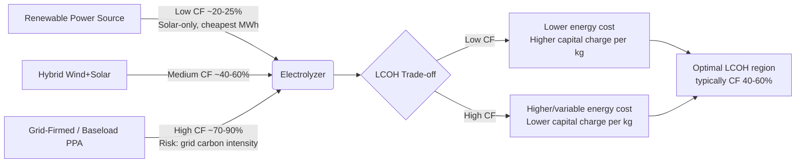
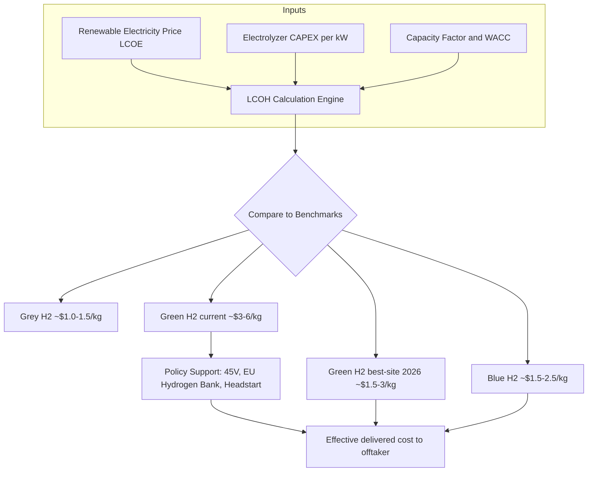

## Green Hydrogen Cost Curve and Electrolyzer Economics

### Overview

Green hydrogen is produced by splitting water into hydrogen and oxygen using an electrolyzer powered by renewable electricity. Its economics sit at the intersection of three cost drivers: the capital expenditure (CAPEX) of the electrolyzer stack and balance of plant, the cost and availability of renewable electricity (LCOE), and the utilization rate at which the asset runs. Unlike fossil-derived ("grey") or carbon-captured ("blue") hydrogen, green hydrogen's cost structure is dominated by electricity input rather than feedstock commodity price, which fundamentally changes how it should be modeled, financed, and sited.

The central analytical tool in this domain is the **Levelized Cost of Hydrogen (LCOH)** — the break-even sale price of hydrogen ($/kg) required to recover all capital and operating costs over a project's life, discounted at the project's cost of capital.

### The LCOH Framework

The standard levelized cost formula amortizes capital and operating expenditures over lifetime hydrogen output:

$$LCOH = \frac{\sum_{t=0}^{n} \frac{CAPEX_t + OPEX_t}{(1+r)^t}}{\sum_{t=0}^{n} \frac{H_{2,t}}{(1+r)^t}}$$

Where:

- $CAPEX_t$ = capital expenditure in year $t$ (electrolyzer stack, balance of plant, stack replacement events)
- $OPEX_t$ = operating expenditure in year $t$ (electricity, water, fixed and variable O&M)
- $H_{2,t}$ = hydrogen produced in year $t$ (kg)
- $r$ = discount rate (WACC)
- $n$ = project lifetime (years)

**Key Points**

- Electricity cost typically accounts for 60% to 75% of total LCOH, making it the single largest variable — a $10/MWh shift in power price can swing hydrogen cost by roughly $0.50/kg. [EPCLand](https://epcland.com/green-hydrogen-feed-cost-estimation/)
- LCOH is highly site-specific: it depends jointly on local renewable resource quality, grid/PPA structure, and financing terms — not on a single global benchmark figure.
- [Inference] Because electricity dominates OPEX, LCOH curves are more sensitive to capacity factor and power price than to electrolyzer CAPEX alone, once CAPEX falls below roughly $1,000/kW.

### The Simplified Energy-Cost Relationship

A widely used simplified form isolates the two dominant terms — energy cost and capital charge:

$$LCOH \approx \left(\frac{E}{1000}\right) \times P_{elec} + \frac{CAPEX \times CRF}{8760 \times CF \times \eta_{H_2}} + OPEX_{fixed \, \& \, variable}$$

Where:

- $E$ = specific electrolyzer energy consumption (kWh/kg H₂), typically **50–55 kWh/kg for PEM/alkaline** systems
- $P_{elec}$ = levelized electricity price ($/MWh)
- $CRF$ = capital recovery factor, $CRF = \frac{r(1+r)^n}{(1+r)^n - 1}$
- $CF$ = capacity factor (fraction of the year the plant operates at rated output)
- $\eta_{H_2}$ = a normalization term converting rated kW capacity into annual kg H₂ output

**Example**

Using representative 2026 mid-range assumptions (electrolyzer efficiency 50 kWh/kg, system CAPEX $800/kW, capacity factor 40%, availability 97%, water and consumables $0.05/kg, 7-year stack replacement interval at 30% of CAPEX): [Energy-solutions](https://energy-solutions.co/tools/green-hydrogen-cost)

1. **Energy term**: at $40/MWh electricity, $50 \text{ kWh/kg} \times \$0.040/\text{kWh} = \$2.00/\text{kg}$
2. **Capital charge term**: at ~8% WACC over 20 years ($CRF \approx 0.102$), $800/kW CAPEX, and 40% capacity factor, the annualized capital charge per kg works out to roughly $0.60–$0.90/kg depending on plant-level conversion efficiency
3. **Fixed/variable O&M and water**: approximately $0.10–$0.20/kg
4. **Stack replacement amortization**: adds roughly $0.10–$0.15/kg when spread over the operating life

**Output**: Total LCOH ≈ **$3.0–$3.5/kg** under these mid-case assumptions — consistent with current green hydrogen production costs of $3–$6/kg versus grey hydrogen from gas at roughly $1.5/kg. [Energy-solutions](https://energy-solutions.co/tools/green-hydrogen-cost)

### Electrolyzer Technology Comparison

Four commercial and near-commercial electrolyzer architectures dominate techno-economic analysis:

| Technology | Operating Temp | Typical Efficiency | 2026 System CAPEX ($/kW) | Strengths | Weaknesses |
| --- | --- | --- | --- | --- | --- |
| **Alkaline (AWE)** | 60–90°C | ~50–60 kWh/kg | $200–400 (component-level); ~$2,300 total installed cost (Western projects) | Most mature, lowest CAPEX, accounts for 70–90% of global shipments | Lower current density, slower response to power fluctuations, bulkier system |
| **PEM** | 50–80°C | ~50–55 kWh/kg | $400–600 (component-level); ~$2,550 total installed cost (Western projects) | Compact, rapid response to variable input, high-purity H2 at high current density | 15–30% cost premium from platinum/iridium catalysts |
| **AEM** | 40–60°C | Comparable to PEM | Emerging; targeting AWE-like cost | PEM-like purity at AWE-like cost using nickel/cobalt catalysts | Early commercial stage, limited long-duration field data |
| **SOEC** | 700–850°C | Thermodynamic efficiency above 90% LHV | $800–1,200 | Highest theoretical efficiency; can co-electrolyze steam/CO2 and use industrial waste heat | Limited by thermal cycling and material degradation; requires >60,000-hour stack lifetime for commercial viability |

**Key Points**

- AWE is generally most cost-effective for steady baseload power contexts, while PEM offers superior dynamic response and gas purity at higher cost. [ScienceDirect](https://www.sciencedirect.com/science/article/pii/S0306261925012450)
- Electric Hydrogen's high-pressure electrolyzer design directly outputs 30 bar and achieves whole-plant efficiency of 54 kWh/kg at full load in a 100 MW plant, illustrating that balance-of-plant integration — not just stack chemistry — materially affects delivered efficiency. [Eh2](https://eh2.com/wp-content/uploads/2025/01/Final_PEM_vs_Alkaline_December_2024_Whitepaper.pdf)
- [Unverified] Claims that alkaline is inherently "easier and lower cost to service" than PEM are contested in vendor-neutral technical literature; real-world O&M costs depend heavily on plant design and duty cycle.

### CAPEX Trajectory: A More Complicated Curve Than Expected

Conventional forecasting assumed electrolyzer CAPEX would follow a smooth experience/learning curve, similar to solar PV and lithium-ion batteries. Recent data complicates this narrative substantially.

**Key Points**

- Electrolyzer system costs rose by a median of 57% between 2022 and 2024, according to BloombergNEF's Electrolyzer Price Survey — reversing the steady cost-decline curve assumed by most 2020–2022 forecasts. [Green Fuel Journal](https://www.greenfueljournal.com/post/green-hydrogen-cost-economics-2026-the-real-path-to-price-parity)
- This reversal was driven by rising material costs, manufacturing and installation inflation, and deployment volumes well below projections, which prevented the learning-curve effects forecasters had assumed. [Green Fuel Journal](https://www.greenfueljournal.com/post/green-hydrogen-cost-economics-2026-the-real-path-to-price-parity)
- A significant regional cost gap has emerged: average system-level electrolyzer costs in China sit near $600/kW, while equivalent Western systems cost roughly four times as much, near $2,500/kW. [Green Fuel Journal](https://www.greenfueljournal.com/post/green-hydrogen-cost-economics-2026-the-real-path-to-price-parity)
- Chinese alkaline electrolyzers are marketed at $300–$700/kW (up to $1,300/kW for advanced systems), but verified installed cost once deployed in Western regulatory and labor environments rises to approximately $1,900/kW, reflecting BOP, permitting, and integration costs not captured in headline stack pricing. [Energy-solutions](https://energy-solutions.co/articles/sub/green-hydrogen-production-costs)
- [Inference] The gap between advertised component cost and "verified installed cost" is one of the most common sources of error in public green hydrogen cost narratives — headline $/kW figures frequently refer to stack-only pricing, not total installed cost (TIC).

This divergence matters for how the "cost curve" concept should be interpreted: rather than one universal downward curve, there are now effectively **two regional cost curves** — a fast-declining China-centric curve and a stagnant-to-rising Western curve — with the gap driven by supply chain localization, labor cost, and project-specific soft costs (permitting, grid interconnection, land).

### Degradation and Stack Replacement Economics

Electrolyzer performance is not static over the asset's operating life.

**Key Points**

- An electrolyzer running at 50 kWh/kg in Year 1 may degrade to 55 kWh/kg by Year 7, increasing power consumption by roughly 10% before a stack replacement is required. [EPCLand](https://epcland.com/green-hydrogen-feed-cost-estimation/)
- Stack replacement is typically modeled as a discrete capital event every 7–10 years, costing a fraction (commonly ~20–30%) of original system CAPEX, and must be included in the LCOH numerator as a time-shifted CAPEX term.
- [Inference] Because degradation raises specific energy consumption ($kWh/kg$) over time, projects that lock in fixed-price power purchase agreements (PPAs) face rising effective fuel cost per kg of output even at constant electricity price — a dynamic often omitted from simplified static LCOH models.

### Capacity Factor: The Central Trade-off

Capacity factor (the fraction of time the electrolyzer runs at rated output) creates a fundamental tension in system design:

- **High renewable-only capacity factor** (e.g., solar-only, ~25%) minimizes electricity cost but leaves expensive capital idle most of the year, raising the capital-charge component of LCOH. [Energy-solutions](https://energy-solutions.co/tools/green-hydrogen-cost)
- **Grid-connected or firmed renewable supply** (e.g., wind+solar hybrid, ~60%, or grid-firmed) raises utilization and spreads CAPEX over more output, but risks importing grid emissions intensity and higher marginal electricity cost, undermining the "green" additionality claim and cost basis simultaneously. [Energy-solutions](https://energy-solutions.co/tools/green-hydrogen-cost)

This trade-off is visualized below.

**Key Points**

- [Inference] For most current CAPEX ranges ($500–$2,500/kW), the LCOH-minimizing capacity factor tends to fall in the 40–60% range, balancing capital utilization against electricity cost escalation — though the exact optimum is highly sensitive to local PPA structure and grid carbon accounting rules (e.g., EU additionality/temporal correlation requirements).

### Sensitivity Analysis

LCOH sensitivity to the three primary levers, holding other assumptions constant:

$$\frac{\partial LCOH}{\partial P_{elec}} = \frac{E}{1000} \quad \Rightarrow \quad \Delta LCOH \approx \left(\frac{50}{1000}\right) \times \Delta P_{elec}$$

- Sensitivity analysis indicates that if electricity costs fall below $20/MWh and electrolyzer CAPEX reaches $400/kW, green hydrogen could reach cost parity with blue hydrogen ($1.5–2.5/kg) by 2030. [Research Square](https://www.researchsquare.com/article/rs-9675493/v1)
- Under an optimistic 2050 scenario, electrolyzer capital costs could fall to $88/kW for alkaline and $60/kW for PEM; under a pessimistic scenario, $388/kW and $286/kW respectively. [MDPI](https://www.mdpi.com/2673-4141/4/4/55)
- Combining declining electrolyzer costs with projected LCOE trajectories, global LCOH is projected to fall below $5/kg for solar, onshore wind, and offshore wind sources under both scenario sets. [MDPI](https://www.mdpi.com/2673-4141/4/4/55)
- DOE H2A analysis using a $2,000/kW installed capital cost benchmark produces an LCOH range of $5–$7/kg across different renewable electricity scenarios (before incentives). [Energy.gov](https://www.hydrogen.energy.gov/docs/hydrogenprogramlibraries/pdfs/24005-clean-hydrogen-production-cost-pem-electrolyzer.pdf)

**Example: Sensitivity table (illustrative, mid-CAPEX case)**

| Variable | Base Case | Low Case | High Case | LCOH Impact |
| --- | --- | --- | --- | --- |
| Electricity price | $40/MWh | $15/MWh | $70/MWh | ±$1.25–1.50/kg |
| System CAPEX | $800/kW | $400/kW | $1,500/kW | ±$0.50–0.80/kg |
| Capacity factor | 45% | 70% | 25% | ±$0.40–0.70/kg |
| WACC | 8% | 5% | 12% | ±$0.20–0.40/kg |

[Speculation] The table above is a synthesized illustrative sensitivity grid built from the cited ranges and standard LCOH elasticity behavior; exact figures will vary by model and should not be treated as a published benchmark.

### Policy and Incentive Effects on Effective LCOH

**Key Points**

- The U.S. offered a hydrogen production tax credit (45V) worth up to $3/kg, representing over $100 billion in potential aggregate value; eligibility has been contingent on evolving "three pillars" rules (additionality, temporal matching, deliverability) for qualifying clean electricity. [Gitnux](https://gitnux.org/green-hydrogen-statistics/)
- Policy friction is material: commentary describes "IRA 45V gridlock" alongside EU Hydrogen Bank auction mechanisms as competing policy-driven cost-support pathways, and project bankability has been sensitive to the pace and clarity of implementing guidance. [Energy-solutions](https://energy-solutions.co/articles/sub/green-hydrogen-production-costs)
- Australia's Hydrogen Headstart program committed roughly $2 billion in production support, and the EU Hydrogen Bank uses a fixed-premium reverse auction model to close the gap between LCOH and market willingness-to-pay. [Gitnux](https://gitnux.org/green-hydrogen-statistics/)
- [Inference] Because incentive value (e.g., $/kg tax credits) is typically additive rather than multiplicative, it has the largest proportional impact on lower-CAPEX, lower-electricity-price projects where baseline LCOH is already closer to fossil parity — meaning subsidies tend to accelerate the best sites disproportionately rather than uniformly lowering the global cost curve.

### Real-World Project Delivery Risk

**Key Points**

- A 2026 project-tracking audit describes a low single-digit-to-high-single-digit percentage FID (Final Investment Decision) achievement rate — roughly 4–7% — across announced projects ≥10 MW, alongside specific deferrals (e.g., BP AREH) and cancellations (e.g., Air Products). [Energy-solutions](https://energy-solutions.co/articles/sub/green-hydrogen-production-costs)
- Rising financing cost (WACC sensitivity) has been identified as a material driver of stalled project finance for green hydrogen. [Energy-solutions](https://energy-solutions.co/articles/sub/green-hydrogen-production-costs)
- Iridium catalyst supply is flagged as a structural bottleneck for PEM scale-up, with catalyst loading assumptions in the range of 300–500 kg per GW of installed capacity, implying multi-decade global iridium demand constraints if PEM captures a large market share. [Energy-solutions](https://energy-solutions.co/articles/sub/green-hydrogen-production-costs)
- [Inference] The gap between "announced pipeline" capacity and realized operating capacity is one of the most consequential — and frequently underweighted — variables in aggregate green hydrogen market forecasts; headline capacity figures should be treated as an upper bound, not an expected outcome.

### Cost-Curve Diagram

### Regional Cost Structure (SVG)

<svg xmlns="http://www.w3.org/2000/svg" viewBox="0 0 720 420" font-family="Arial, sans-serif">
<title>Regional electrolyzer installed cost comparison (svg_diagram)</title>
<text x="360" y="28" text-anchor="middle" font-size="18" font-weight="bold" fill="#1a1a1a">Regional Electrolyzer Installed Cost, 2026 (svg_diagram)</text>
<line x1="80" y1="360" x2="680" y2="360" stroke="#333" stroke-width="2" />
<line x1="80" y1="60" x2="80" y2="360" stroke="#333" stroke-width="2" />
<text x="30" y="365" font-size="12" fill="#333">$0</text>
<text x="20" y="245" font-size="12" fill="#333">$1000</text>
<text x="20" y="125" font-size="12" fill="#333">$2000</text>
<line x1="75" y1="245" x2="680" y2="245" stroke="#ddd" stroke-width="1" stroke-dasharray="4,4" />
<line x1="75" y1="125" x2="680" y2="125" stroke="#ddd" stroke-width="1" stroke-dasharray="4,4" />
<rect x="140" y="288" width="80" height="72" fill="#4CAF50" />
<text x="180" y="380" text-anchor="middle" font-size="13" fill="#222">China</text>
<text x="180" y="278" text-anchor="middle" font-size="12" fill="#222">~$600/kW</text>
<rect x="290" y="60" width="80" height="300" fill="#F44336" />
<text x="330" y="380" text-anchor="middle" font-size="13" fill="#222">Europe/US</text>
<text x="330" y="50" text-anchor="middle" font-size="12" fill="#222">~$2,500/kW</text>
<rect x="440" y="200" width="80" height="160" fill="#FF9800" />
<text x="480" y="380" text-anchor="middle" font-size="13" fill="#222">China-made (West-deployed)</text>
<text x="480" y="190" text-anchor="middle" font-size="12" fill="#222">~$1,900/kW</text>
<text x="360" y="405" text-anchor="middle" font-size="11" fill="#666">Illustrative bar heights derived from cited source ranges; not to precise scale</text>
</svg>

### Common Pitfalls in Green Hydrogen Cost Modeling

**Key Points**

- Confusing **stack-only** component cost with **total installed cost (TIC)**, which includes balance of plant, power electronics, water treatment, civil works, and installation labor — a gap that can be 2–4x the headline number.
- Ignoring **degradation-adjusted efficiency** and treating $kWh/kg$ as constant across the asset's full life.
- Applying a **single global LCOH figure** to investment decisions rather than site-specific modeling of local LCOE, grid rules, and capacity factor.
- Excluding **stack replacement** as a discrete future CAPEX event rather than folding it into a simplified flat OPEX add-on.
- Treating announced project **pipeline capacity** as equivalent to expected realized capacity, given low observed FID conversion rates. [Energy-solutions](https://energy-solutions.co/articles/sub/green-hydrogen-production-costs)

### Related Topics

- Blue hydrogen and carbon capture cost comparison (LCOH parity thresholds)
- Power purchase agreement (PPA) structuring for electrolyzer additionality compliance
- Hydrogen storage and transport cost stacking (compression, liquefaction, pipeline blending)
- EU Hydrogen Bank auction mechanics and contracts-for-difference design
- US 45V tax credit "three pillars" rulemaking and project bankability
- Iridium and platinum-group-metal supply chain constraints for PEM scale-up
- Electrolyzer stack degradation modeling and predictive maintenance economics
- Green ammonia and green steel as hydrogen derivative demand sinks
- Renewable curtailment monetization via flexible electrolyzer operation
- Learning-curve versus cost-inflation dynamics in capital-intensive clean tech deployment