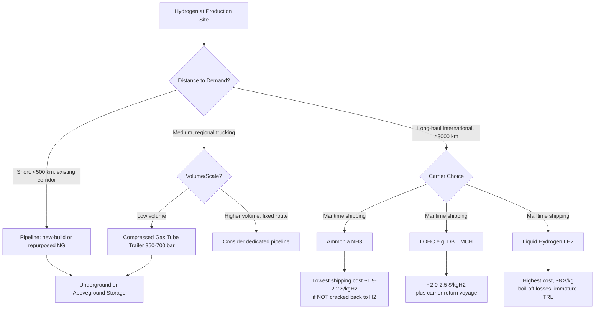
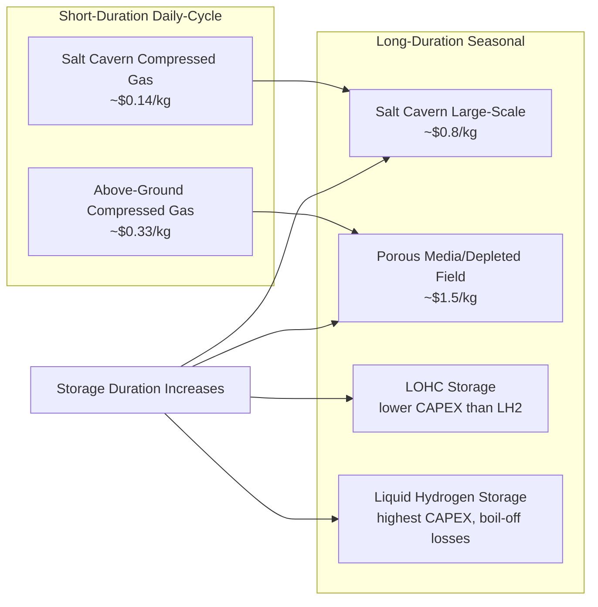

## Hydrogen Transport, Storage, and Infrastructure Economics

### Overview

Hydrogen's low volumetric energy density — 0.084 kg/m³ at ambient temperature and pressure versus roughly 0.7 kg/m³ for natural gas by comparable energy content — means that moving and storing it is technically and economically distinct from other energy carriers. Unlike production economics, where the electrolyzer and electricity price dominate, midstream hydrogen economics are governed by **energy penalties** (compression or liquefaction work), **capital intensity of carrier-specific infrastructure**, and **distance/scale breakpoints** that determine which transport mode is cheapest. This chapter covers compressed gas, liquefaction, pipelines, chemical carriers (ammonia, LOHC), and underground/aboveground storage economics.

**Key Points**

- The choice of transport pathway is primarily determined by the coupled effects of distance, throughput volume, and infrastructure maturity — not by which technology has the best standalone technical performance.
- Both compression and liquefaction impose substantial energy and capital penalties, such that the most technologically advanced option is not necessarily the most economically resilient one.

### Densification: Compression vs. Liquefaction

Hydrogen must be densified before most forms of transport or storage. The two primary physical densification routes carry very different energy penalties.

$$W_{compression} \approx 1.05 \text{ kWh/kg (20→350 bar, theoretical)} \quad \text{to} \quad 1.36 \text{ kWh/kg (700 bar, theoretical)}$$

$$W_{liquefaction} \approx 10\text{–}13 \text{ kWh/kg (industrial scale, 20 K)}$$

**Key Points**

- Theoretical isothermal compression work is low, but real-world data from DOE technology validation projects shows actual consumption is substantially higher: 2.05–4.0 kWh/kg at 350 bar and 3.1–6.4 kWh/kg at 700 bar, due to compressor inefficiency and heat generation during fast-fill cycles.
- This compression energy penalty represents roughly 5–15% of hydrogen's higher heating value — a direct efficiency loss layered on top of production-stage losses.
- Liquefaction to 20 K is far more energy-intensive at 10–13 kWh/kg for industrial-scale plants, representing 25–35%+ of hydrogen's own energy content.
- [Inference] Because liquefaction's energy penalty scales with absolute hydrogen throughput while compression's capital cost scales more with pressure and flow rate, liquefaction tends to be favored only where volumetric density is critical (e.g., long-haul maritime shipping) despite its higher energy cost.

**Example: Densification cost comparison**

| Method | Energy Penalty | Financial Cost Add | Notes |
| --- | --- | --- | --- |
| Compression to 350 bar (tube trailer) | 2.05–4.0 kWh/kg | $1.00–$1.50/kg | Standard for regional truck delivery |
| Compression to 700 bar | 3.1–6.4 kWh/kg | $1.50–$2.50/kg | Used for heavy-duty refueling stations |
| Liquefaction (industrial scale) | 10–13 kWh/kg | ~$2+/kg current; target ~$1/kg at scale | Enables highest volumetric density (~71 kg H2/m³) |

### Pipeline Transport Economics

Pipelines are the lowest-cost option for large, steady point-to-point flows where a corridor already exists or can be justified by scale.

**Key Points**

- Estimated pipeline transport cost ranges from €0.07 to €0.23 per kilogram per 1,000 km, driven by pipeline diameter, flow rate, and whether existing natural gas infrastructure can be repurposed.
- A separate levelized cost estimate places new-build large-diameter pipeline transport (e.g., 48-inch, 2+ million tonnes/year capacity, roughly 7.6 GW average energy flow) at approximately $0.2–$0.3+/kg per 1,000 km.
- High flow-rate, low-cost pipeline economics generally require aggregation of supply from multiple green and/or blue hydrogen production sites feeding a shared corridor.
- The IEA's Energy Technology Perspectives 2023 analysis concludes that transporting compressed hydrogen via repurposed long-distance gas pipeline — or new large-diameter pipe — would likely be cheaper than shipping in any carrier form, where geographically feasible.
- [Inference] Pipeline transport's strong cost advantage is conditional on utilization: because pipeline CAPEX is largely fixed regardless of throughput, underutilized or stranded pipeline assets can produce per-kg costs far above these headline ranges — a risk factor for early-stage hydrogen corridors built ahead of confirmed offtake.

### Pipeline Line-Packing and Diurnal Flexibility

Pipelines are not merely transport conduits; larger-diameter pipe segments can serve a dual role as short-duration storage via **line-packing** — using the compressibility of the gas within the pipe itself to buffer demand variability.

**Key Points**

- Analysis using flow-rate modeling indicates that large-diameter pipelines can accommodate substantial daily demand variation — even at aggregate demand levels of 1.5 billion kg/year — using active pipeline lengths of only 2,000–4,000 km for line-packing purposes.
- Small-diameter pipelines moving hydrogen at high pressure and high velocity experience the greatest pressure drops, making them less suited to long-distance, high-flow transport.

### Diagram: Hydrogen Midstream Pathway Decision Logic

### Chemical Carriers: Ammonia vs. LOHC vs. Liquid Hydrogen

For international, long-distance transport where pipelines are infeasible, hydrogen must be converted into a denser carrier for shipping, then potentially reconverted at the destination.

**Key Points**

- IEA analysis projects that by the end of the decade, shipping hydrogen as ammonia or LOHC will likely be cheaper than shipping it as liquefied hydrogen — even after including reconversion costs — at approximately $1.9–$2.2/kg H2 for ammonia and $2.0–$2.5/kg H2 for LOHC, compared to substantially higher costs for LH2.
- If ammonia is used directly as a fuel or feedstock ("as is") rather than cracked back to hydrogen, shipping cost drops further — potentially to about $1/kg of hydrogen content or less over distances up to 8,000 km — because the energy-intensive cracking step is avoided entirely.
- Roughly 43% of global hydrogen demand already goes toward ammonia production, meaning a large share of "hydrogen demand" met by ammonia shipments may never need reconversion, which materially changes the effective cost comparison versus pathways that do require cracking back to H2.
- Liquid ammonia achieves the highest volumetric hydrogen density among carriers (~121 kg H2/m³), ahead of liquid hydrogen (~71 kg H2/m³), DBT-based LOHC (~54 kg H2/m³), and 350-bar compressed hydrogen (~23 kg H2/m³).
- Separate route-specific shipping cost modeling found LH2 to be the most expensive of the three main carrier options, with ammonia cheaper than LOHCs, and delivered cost to Europe generally lower than to Japan on comparable export routes.
- One direct point-to-point model found LOHC delivery costs (using methylcyclohexane or dibenzyl toluene) in the range of €6.40–€8.10/kg H2 (on a €5/kg H2 production cost basis), underscoring that total delivered cost is highly sensitive to the specific carrier chemistry, route, and reconversion assumptions used in a given model.
- LOHC-based pathways are considered highly promising particularly for smaller-scale hydrogen demand, especially where salt-cavern storage is not geologically available.

**Trade-offs by carrier**

| Carrier | Round-trip requirement | Key advantage | Key drawback |
| --- | --- | --- | --- |
| Liquid Ammonia (NH3) | No return voyage needed | Mature global infrastructure (LPG/ammonia terminals), highest volumetric density, usable directly as fuel/feedstock | Toxic, corrosive; cracking back to H2 requires high-temperature process and adds substantial cost |
| LOHC (e.g., DBT, MCH) | Spent carrier must be returned to hydrogenation plant, doubling voyages | No boil-off, stable for months at ambient conditions, compatible with existing liquid-fuel logistics | Lower hydrogen content by weight, energy-intensive dehydrogenation, high-viscosity handling issues (DBT) |
| Liquid Hydrogen (LH2) | N/A (consumed as H2 directly) | Highest hydrogen purity delivered, no chemical conversion step | Highest energy penalty (10–13 kWh/kg), boil-off losses during storage/transfer, immature large-scale shipping fleet (low TRL for LH2 carriers) |

**Example**

The Hydrogen Energy Supply Chain project's Suiso Frontier vessel — the first purpose-built LH2 carrier, shipping hydrogen from Australia to Japan — represented roughly $350 million in investment, illustrating the scale of capital required to prove out LH2 shipping at even modest volumes. [Inference] The IEA's finding that ammonia and LOHC are likely to undercut LH2 shipping cost by the end of the decade suggests early LH2 shipping infrastructure may face stranded-asset risk unless liquefaction costs fall sharply toward the ~$1/kg target level.

### Storage Economics

Hydrogen storage falls into two broad categories: **short-duration/daily-cycle** storage (compressed gas, above or below ground) and **long-duration/seasonal** storage (large-scale underground caverns, chemical carriers).

**Key Points**

- Among daily-cycle storage technologies, compressed gaseous storage in salt caverns has the lowest levelized cost of hydrogen storage (LCHS) at approximately $0.14/kg H2, followed by above-ground compressed gaseous storage at approximately $0.33/kg H2.
- A representative salt cavern case (500 tonnes H2 capacity) costs approximately $18 million (~$36/kg H2 of capacity) to prepare; the levelized storage cost works out to about $1.2/kg if hydrogen is held for 120 days (4 months), but only a fraction of that — around $0.15/kg — for shorter storage durations, since capital cost is amortized over more storage cycles.
- Separate underground storage cost estimates give CAPEX ranges of $0.15–$0.60/kg for salt caverns, $0.30–$0.90/kg for depleted gas fields, and $0.40–$1.20/kg for aquifer storage, with cycle efficiencies ranging from roughly 70% to 95% depending on formation type.
- European underground storage assessment estimates levelized costs of $1.5/kg for porous media and $0.8/kg for salt caverns at large scale (minimum 0.5 TWh working gas energy), with potential to fall to as low as $0.4/kg after three "experience cycles" of learning-by-doing.
- Liquid hydrogen storage capital cost is more than twice that of gaseous storage and roughly four times that of LOHC-based storage, reflecting the cost of cryogenic insulation and boil-off management infrastructure.
- Some underground reservoir types face geological or biological constraints — hydrogen can interact with subsurface micro-organisms in certain reservoir types, limiting which sites are viable regardless of cost.

### Diagram: Storage Cost by Duration and Method

### End-to-End Delivered Cost: Illustrative Build-Up

Combining production, densification, transport, and storage into a single delivered-cost stack illustrates why hydrogen delivered to a refueling station or end-use site can be several multiples of the production-gate LCOH.

**Example**

Using representative figures from cited sources for a domestic truck-delivered pathway:

1. Green hydrogen production (LCOH at plant gate): ~$3.00–$3.50/kg (see prior chapter section on electrolyzer economics)
2. Compression to 350 bar for tube-trailer transport: +$1.00–$1.50/kg
3. Truck transport and regional distribution: variable, commonly modeled as part of the compression/logistics bundle above
4. Station storage, dispensing, and utilization losses: variable by station scale and utilization rate

For a liquefaction-based delivery pathway, one DOE-validated national lab model estimated a fully dispensed cost of $14.25/kg at the pump for a 27,000 kg/day liquid hydrogen supply chain (production, liquefaction, delivery, and dispensing combined, untaxed), illustrating how liquefaction-heavy pathways can multiply delivered cost relative to plant-gate LCOH.

**Output**: [Inference] Depending on pathway (pipeline vs. truck vs. liquefaction) and distance, delivered hydrogen cost can range from roughly 1.3x to 4x+ the plant-gate LCOH — meaning midstream economics can dominate total delivered cost as much as, or more than, production-stage economics, particularly for smaller-scale or longer-distance deliveries.

### Comparative Cost Table: Transport Mode by Distance/Scale

| Transport Mode | Best-Fit Distance | Best-Fit Scale | Approx. Cost Range | Key Constraint |
| --- | --- | --- | --- | --- |
| Pipeline (repurposed/new) | Short-medium (<1,000 km per corridor) | High volume, steady flow | ~$0.07–$0.23/kg per 1,000 km (existing estimates); ~$0.2–$0.3+/kg per 1,000 km (new large-diameter) | Requires committed offtake to justify fixed CAPEX; underutilization erodes economics sharply |
| Compressed gas truck/tube trailer | Short (<300–500 km) | Low-medium volume | +$1.00–$2.50/kg (compression + transport) | Payload limited by tank weight; energy penalty of compression |
| Liquid hydrogen (truck/rail/maritime) | Long-haul, especially maritime | Large point-to-point volumes | ~$2+/kg (current), target ~$1/kg at scale for liquefaction alone; ~$8/kg total delivered in some route studies | High energy penalty (10–13 kWh/kg), boil-off losses, immature carrier fleet |
| Ammonia (maritime) | International, long-haul (up to 8,000 km) | Large scale, mature ports | ~$1.9–$2.2/kg H2 (with cracking); ~$1/kg or less if used directly as NH3 | Cracking back to H2 adds significant cost; toxicity/handling requirements |
| LOHC (maritime/road) | International or regional, smaller-scale demand | Flexible, smaller volumes favored | ~$2.0–$2.5/kg H2 | Return voyage of spent carrier doubles logistics; energy-intensive dehydrogenation |

### Common Pitfalls in Midstream Hydrogen Economics

**Key Points**

- Comparing "theoretical" compression/liquefaction energy penalties (thermodynamic minimums) against real operational figures, which can be 2–5x higher due to compressor inefficiency and cycling losses.
- Excluding the return-voyage cost of spent LOHC carriers, which materially changes the cost comparison against ammonia (no return voyage required).
- Assuming ammonia shipping cost automatically includes cracking back to hydrogen — the lowest ammonia cost figures typically assume it is used "as is," not reconverted.
- Applying salt-cavern storage costs uniformly across geographies without accounting for the fact that suitable salt formations are geologically constrained and unavailable in many regions.
- Treating pipeline per-kg transport cost as fixed regardless of utilization — pipeline economics are strongly volume-dependent, and underutilized corridors can have dramatically higher effective per-kg costs than headline benchmarks suggest.

### Related Topics

- Green hydrogen cost curve and electrolyzer economics (upstream production cost linkage)
- Hydrogen refueling station economics and utilization rate sensitivity
- Repurposing natural gas pipeline infrastructure for hydrogen blending and pure H2 service
- Underground hydrogen storage geological siting criteria (salt caverns, depleted fields, aquifers)
- Ammonia cracking technology and catalyst economics for hydrogen reconversion
- LOHC catalyst systems and heat-integration design for dehydrogenation
- Hydrogen Energy Supply Chain (HESC) project case study and LH2 shipping lessons learned
- Port and terminal infrastructure investment for hydrogen/ammonia import-export hubs
- Boil-off gas management strategies in cryogenic hydrogen logistics
- Blending hydrogen into existing natural gas networks: technical limits and economic implications