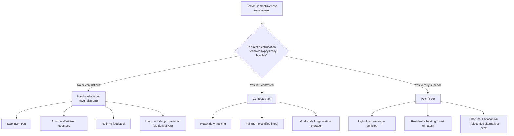

## End-Use Applications and Competitiveness by Sector

### Definition and Analytical Purpose

This topic evaluates where hydrogen is economically competitive as an energy carrier or feedstock relative to incumbent technologies (fossil fuels, direct electrification, biofuels) across the major demand sectors — industry, transportation, power generation, and buildings. Because hydrogen production, compression/liquefaction, transport, and conversion back to useful energy each impose efficiency losses and capital costs, the central economic question is not "can hydrogen do this?" but "does hydrogen outcompete direct electrification or alternative decarbonization pathways for this specific end use, given its cost structure and physical properties?" This sector-by-sector competitiveness assessment is the standard analytical framework used by the IEA, IRENA, BloombergNEF, and most academic techno-economic analyses of the hydrogen economy.

### Core Economic Framework: The "Ladder of Hydrogen Competitiveness"

**Key Points**

- Hydrogen's competitiveness is best understood as an inverse function of the availability of a cheaper direct-electrification alternative. Sectors split broadly into three tiers:
  1. **No-regrets/hard-to-abate applications** — sectors where hydrogen (or hydrogen-derived molecules) is currently one of few technically credible decarbonization pathways because direct electrification faces fundamental physical or process constraints (e.g., high-temperature process heat, chemical feedstock use).
  2. **Contested/competitive applications** — sectors where hydrogen competes directly with battery-electric or other alternatives, and the outcome depends heavily on relative cost trajectories, infrastructure availability, and duty-cycle requirements (e.g., heavy-duty trucking, some rail, shipping).
  3. **Poor-fit applications** — sectors where direct electrification is overwhelmingly more efficient and hydrogen faces a structural cost disadvantage due to conversion losses (e.g., light-duty passenger vehicles, residential space heating in most contexts).
- This tiering follows from a widely cited efficiency argument: producing hydrogen via electrolysis, compressing/transporting it, and reconverting it to motive power or heat typically involves cumulative round-trip efficiency substantially lower than delivering the same electricity directly to a battery or heat pump. [Inference] The magnitude of this efficiency gap varies by pathway and end-use configuration (fuel cell vs. combustion, compressed vs. liquid, transport distance), so it should be treated as a directional and well-established economic pattern rather than a single fixed multiplier applicable to every case.

### Sector 1: Industrial Feedstock Applications (Highest Competitiveness)

**Ammonia and fertilizer production** and **oil refining** are the two largest existing global hydrogen demand sources, and are structurally different from "new" hydrogen demand because hydrogen is already the required chemical input — the competitiveness question here is not hydrogen-versus-electrification but **grey hydrogen (from unabated natural gas reforming) versus blue hydrogen (with carbon capture) versus green hydrogen (from electrolysis)**.

- **Cost driver**: for grey hydrogen, natural gas price is the dominant input cost; for green hydrogen, electricity price and electrolyzer capital cost dominate.
- **Competitiveness threshold**: green hydrogen typically becomes cost-competitive with grey hydrogen in this sector when a combination of low-cost renewable electricity (frequently cited industry benchmarks reference sustained electricity prices in the range of roughly $20–30/MWh or below), low electrolyzer capex, high capacity factor, and/or a meaningful carbon price on the incumbent grey pathway align simultaneously. [Unverified] Precise crossover price points shift with natural gas prices, carbon price levels, and electrolyzer cost trajectories, and should be checked against current techno-economic analyses (e.g., IEA, IRENA, or BNEF hydrogen cost reports) for any specific investment decision, since these inputs have moved substantially in recent years.
- **This sector is considered a "no-regrets" first-mover market** because the offtake (ammonia/fertilizer plants, refineries) already exists, demand is well-characterized, and no new end-use conversion technology is required — the hydrogen simply substitutes for an existing feedstock stream.

### Sector 2: Steel Production (Hard-to-Abate, High Strategic Priority)

Steelmaking via **direct reduced iron (DRI) using hydrogen** as the reducing agent (replacing coal/coke in a blast furnace) is one of the most closely watched hard-to-abate applications.

**Key Points**

- Conventional blast furnace-basic oxygen furnace (BF-BOF) steelmaking uses coal/coke both as an energy source and as the chemical reducing agent that strips oxygen from iron ore — a role electricity alone cannot fulfill, making this a genuine hard-to-abate case rather than merely an efficiency-driven preference for hydrogen.
- H2-DRI routes (exemplified by projects such as HYBRIT in Sweden and various H2 Green Steel-style ventures) replace coal-based reduction with hydrogen-based reduction, then typically use an electric arc furnace (EAF) for final steel production.
- **Cost competitiveness** depends heavily on green hydrogen production cost, since hydrogen (rather than capital) is typically the largest variable cost component of H2-DRI steelmaking at current technology costs. [Inference] The specific green hydrogen price at which H2-DRI steel reaches cost parity with conventional BF-BOF steel is highly sensitive to the assumed carbon price, iron ore grade requirements (H2-DRI generally requires higher-grade ore), and regional electricity/gas price differentials, so published parity estimates vary considerably across studies and should be treated as scenario-dependent rather than a single benchmark figure.
- **Non-price competitiveness drivers**: government procurement mandates, "green steel" price premiums from downstream customers (e.g., automakers seeking low-carbon supply chains), and carbon border adjustment mechanisms (e.g., the EU's CBAM) function as demand-side supports that can improve project viability independent of pure production cost parity.

### Sector 3: Heavy-Duty Transportation (Contested Tier)

This is the most actively debated competitiveness question in the hydrogen economy, pitting **fuel cell electric vehicles (FCEVs)** against **battery electric vehicles (BEVs)** for trucking, buses, and some rail applications.

**Key Points**

- **Duty-cycle economics favor hydrogen** where vehicles require very high daily utilization, minimal downtime, and long range with fast refueling — because battery weight scales roughly linearly with required range and directly displaces cargo payload capacity, while hydrogen's superior gravimetric energy density (energy per unit weight) becomes increasingly advantageous as required range grows.
- **Duty-cycle economics favor batteries** where routes are shorter, predictable, and depot-based with overnight charging opportunity, since batteries currently offer meaningfully higher round-trip energy efficiency and (at present) generally lower total cost of ownership per mile for such duty cycles, while fuel cell trucks face both higher vehicle capital cost and highly uncertain hydrogen refueling infrastructure costs.
- **Total cost of ownership (TCO) crossover point**: numerous techno-economic studies (e.g., from ICCT, academic literature, and industry consortia) generally find the crossover — the route length/payload combination at which FCEV TCO becomes competitive with BEV TCO — shifts further in hydrogen's favor as battery pack costs fall more slowly than expected or as very long-haul, heavy-payload routes are considered, but shifts toward batteries as battery energy density and charging speed improve and as megawatt-class fast charging infrastructure develops. [Inference] Because both battery and hydrogen technology costs are moving simultaneously and infrastructure buildout for both pathways remains incomplete, published TCO crossover estimates vary substantially across studies and time periods, and current sources should be consulted for any time-sensitive competitiveness claim in this sector.
- **Infrastructure economics compounds the uncertainty**: hydrogen refueling stations for heavy trucking require substantial capital investment and face the same chicken-and-egg network economics problem discussed in EV charging infrastructure — station economics depend on fleet-scale offtake commitments that are themselves contingent on refueling availability, which has historically slowed commercial-scale hydrogen trucking corridor development relative to early projections.

### Sector 4: Maritime Shipping and Aviation (Hard-to-Abate via Derivatives)

**Key Points**

- Direct hydrogen use faces significant technical constraints in both sectors due to low volumetric energy density (energy per unit volume) even when liquefied, which is a major driver of onboard storage volume and range penalties.
- As a result, competitiveness analysis in these sectors increasingly centers on **hydrogen derivatives** rather than pure hydrogen: green ammonia and green methanol for shipping (compatible with modified internal combustion/dual-fuel engines), and **e-fuels/synthetic kerosene** (hydrogen combined with captured CO2) for aviation.
- **Cost driver**: derivative fuel cost is dominated by the underlying green hydrogen production cost plus the conversion step (e.g., Haber-Bosch for ammonia, Fischer-Tropsch-type synthesis for e-kerosene), meaning derivative fuel competitiveness is even more sensitive to hydrogen production cost than direct-use applications, since each conversion step adds both capital cost and efficiency losses.
- **Policy dependency**: given the significant cost gap between green shipping/aviation fuels and conventional bunker fuel or jet fuel at most current hydrogen production costs, near-term competitiveness in this sector is heavily dependent on blending mandates (e.g., aviation "sustainable aviation fuel" mandates in the EU and elsewhere) and carbon pricing rather than unassisted market cost parity. [Inference] This reflects a general pattern discussed across IEA and IRENA analyses rather than a single verified cost-parity date, since mandate structures and hydrogen cost trajectories continue to evolve.

### Sector 5: Power Generation and Long-Duration Energy Storage (Contested/Niche)

**Key Points**

- Hydrogen (or ammonia) combustion or fuel-cell-based power generation is generally not competitive against direct renewable generation, batteries, or other storage technologies for short-duration (hours) grid balancing, due to the multiplicative round-trip efficiency losses of the power-to-hydrogen-to-power pathway relative to battery storage's substantially higher round-trip efficiency.
- Hydrogen's niche is instead in **long-duration and seasonal storage**, where its ability to be stored at large scale for weeks-to-months (e.g., in salt caverns) at a lower marginal storage cost than batteries can outweigh its lower round-trip efficiency — a case where the low cost of storing energy for long idle periods matters more than the efficiency of converting it back.
- **Competitiveness threshold**: hydrogen-based long-duration storage tends to become more attractive as the share of variable renewable generation on a grid increases and seasonal generation mismatches grow (e.g., high solar-summer/low-solar-winter systems), because this is precisely the storage duration profile where battery capital costs scale unfavorably (batteries are capital-cost-efficient for short daily cycling but expensive per unit of energy capacity when sized for multi-week storage).

### Sector 6: Light-Duty Vehicles and Building Heat (Generally Poor Fit)

**Key Points**

- For passenger cars, the efficiency case for direct battery-electric drivetrains over hydrogen fuel cell drivetrains is widely considered one of the more settled competitiveness questions in the hydrogen economy literature, given BEVs' substantially higher well-to-wheel efficiency, more mature charging infrastructure, and lower vehicle cost trajectory — though a small number of manufacturers continue limited-scale hydrogen passenger vehicle programs, largely in specific markets with existing refueling infrastructure.
- For residential and commercial space/water heating, heat pumps generally offer substantially higher efficiency (delivering multiple units of heat energy per unit of electricity consumed, versus hydrogen combustion boilers which convert hydrogen to heat at efficiency levels closer to conventional gas boilers) in most climate contexts, making green hydrogen heating a comparatively costly pathway per unit of delivered heat in the majority of building-heat applications studied.
- **Where hydrogen heating retains a stronger argument**: existing natural gas grid repurposing in regions with high gas network penetration, where blending hydrogen into existing pipelines (up to certain volumetric limits before requiring pipeline/appliance modification) could theoretically leverage sunk infrastructure investment rather than requiring wholesale replacement with electric heating systems and grid capacity upgrades. [Unverified] The economic and technical viability of large-scale hydrogen blending or pure-hydrogen grid conversion for heating remains actively debated in the policy and engineering literature, with some studies finding it a costly and inefficient decarbonization pathway relative to electrification; current national-level hydrogen heating strategy decisions (e.g., UK, Netherlands, Germany policy reviews) should be checked for the latest position, as several governments have revised heating-sector hydrogen ambitions downward in recent policy cycles.

### Comparative Competitiveness Summary

| Sector | Hydrogen Role | Primary Competing Pathway | Relative Competitiveness |
| --- | --- | --- | --- |
| Ammonia/fertilizer feedstock | Direct chemical input | Grey/blue hydrogen (existing use) | High — established demand, clearest transition path |
| Oil refining feedstock | Direct chemical input | Grey/blue hydrogen (existing use) | High — established demand |
| Steel (DRI) | Reducing agent | Conventional BF-BOF (coal) | High strategic priority, cost-sensitive to green H2 price |
| Long-haul/heavy trucking | Fuel cell propulsion | Battery-electric trucking | Contested, duty-cycle dependent |
| Rail (non-electrified) | Fuel cell propulsion | Battery-electric or grid electrification | Contested, route-dependent |
| Shipping | Ammonia/methanol derivative fuel | Conventional bunker fuel, other e-fuels | Hard-to-abate, mandate-dependent |
| Aviation | Synthetic e-kerosene | Conventional jet fuel, biofuels | Hard-to-abate, mandate-dependent |
| Long-duration grid storage | Power-to-H2-to-power | Batteries (short-duration), pumped hydro | Niche, duration-dependent |
| Passenger vehicles | Fuel cell propulsion | Battery-electric vehicles | Generally poor fit |
| Building heating | Combustion/blending | Heat pumps, direct electrification | Generally poor fit in most climates |

### Illustrative Diagram: Competitiveness vs. Electrification Difficulty (svg_diagram)

<svg xmlns="http://www.w3.org/2000/svg" viewBox="0 0 640 400">
<text x="320" y="24" text-anchor="middle" font-size="15" font-weight="bold" fill="#1a1a1a">Hydrogen Competitiveness Map (svg_diagram)</text>
<line x1="90" y1="340" x2="600" y2="340" stroke="#333" stroke-width="2" />
<line x1="90" y1="340" x2="90" y2="50" stroke="#333" stroke-width="2" />
<text x="345" y="368" text-anchor="middle" font-size="12" fill="#333">Difficulty of Direct Electrification (low → high)</text>
<text x="55" y="195" text-anchor="middle" font-size="12" fill="#333" transform="rotate(-90 55 195)">Hydrogen Competitiveness</text>
<circle cx="150" cy="300" r="10" fill="#c0392b" />
<text x="150" y="320" text-anchor="middle" font-size="10" fill="#333">Passenger EVs</text>
<circle cx="180" cy="270" r="10" fill="#c0392b" />
<text x="180" y="255" text-anchor="middle" font-size="10" fill="#333">Home heating</text>
<circle cx="330" cy="190" r="12" fill="#e67e22" />
<text x="330" y="210" text-anchor="middle" font-size="10" fill="#333">Heavy trucking</text>
<circle cx="360" cy="160" r="12" fill="#e67e22" />
<text x="360" y="145" text-anchor="middle" font-size="10" fill="#333">Rail (non-electrified)</text>
<circle cx="420" cy="140" r="12" fill="#e67e22" />
<text x="420" y="160" text-anchor="middle" font-size="10" fill="#333">LDES</text>
<circle cx="510" cy="90" r="14" fill="#27ae60" />
<text x="510" y="75" text-anchor="middle" font-size="10" fill="#333">Steel (DRI)</text>
<circle cx="540" cy="70" r="14" fill="#27ae60" />
<text x="540" y="55" text-anchor="middle" font-size="10" fill="#333">Ammonia feedstock</text>
<circle cx="560" cy="110" r="14" fill="#27ae60" />
<text x="560" y="130" text-anchor="middle" font-size="10" fill="#333">Shipping/aviation fuels</text>
</svg>

### Key Interconnections with Broader Energy Economics

- **Levelized cost of hydrogen (LCOH)** — the underlying cost-per-kilogram metric that determines where a sector-level competitiveness threshold sits; sensitive to electrolyzer capex, capacity factor, and electricity price.
- **Carbon pricing and border adjustment mechanisms** — directly shift the competitiveness threshold for every sector by raising the effective cost of incumbent fossil pathways.
- **Electrolyzer capital cost curves and learning rates** — a primary driver of how quickly the "contested tier" sectors shift toward or away from hydrogen viability over time.
- **Hydrogen transport and storage economics** — pipeline, liquefaction, and shipping costs materially affect derivative fuel competitiveness in maritime and aviation sectors, since production-cost competitiveness alone does not guarantee delivered-cost competitiveness.

**Related Topics**

- Levelized cost of hydrogen (LCOH) modeling and sensitivity analysis
- Green vs. blue vs. grey hydrogen production economics
- Electrolyzer capital cost trends and learning curves
- Carbon border adjustment mechanisms and their effect on green steel/industrial competitiveness
- Battery vs. fuel cell total cost of ownership modeling for heavy-duty transport
- Hydrogen transport, storage, and pipeline infrastructure economics
- Power-to-X and synthetic fuel (e-fuel) production pathways
- Long-duration energy storage market design and valuation