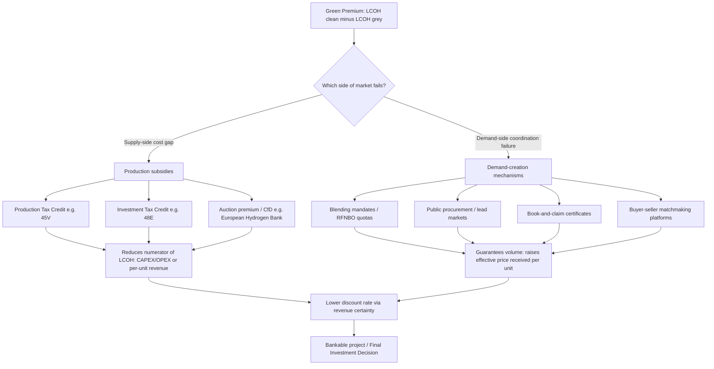

## Hydrogen Policy Support Mechanisms and Demand Creation

### Definition and Scope

Hydrogen policy support mechanisms comprise the set of government interventions designed to close the cost gap between low-emissions hydrogen (green, blue, pink, turquoise) and incumbent fossil-based hydrogen or fossil fuels, while demand-creation mechanisms address the parallel and equally binding constraint: the absence of buyers willing to sign firm, bankable offtake agreements. In energy economics terms, this is a two-sided market-failure problem — a supply-side cost externality (climate damages not priced into grey hydrogen) combined with a demand-side coordination failure (no single buyer wants to be first, and long-term contracts are scarce because end-use markets for hydrogen derivatives are themselves nascent). Policy design in this domain has shifted materially since 2023–2024 from supply-push instruments (grants, production tax credits) toward integrated supply-demand pairing, because supply-side subsidies alone have proven insufficient to trigger final investment decisions (FIDs) without a contracted buyer.

### The Core Economic Problem: The Green Premium

The central quantity these mechanisms are built to address is the **green premium** (or green hydrogen cost gap): the levelized cost difference between low-emissions hydrogen and grey (unabated, steam-methane-reformed) hydrogen or the fossil fuel it would displace.

$$\text{Green Premium} = LCOH_{clean} - LCOH_{grey}$$

Where $LCOH$ (Levelized Cost of Hydrogen) is a function of capital expenditure, electrolyzer or feedstock costs, capacity factor, cost of capital, and carbon price exposure:

$$LCOH = \frac{\sum_{t=0}^{n} \frac{CAPEX_t + OPEX_t}{(1+r)^t}}{\sum_{t=0}^{n} \frac{H_t}{(1+r)^t}}$$

where $r$ is the discount rate, $H_t$ is hydrogen output in year $t$, and $n$ is project life. Policy support mechanisms work by either (a) reducing the numerator (subsidizing CAPEX/OPEX), (b) reducing $r$ by de-risking cash flows through guaranteed revenue, or (c) raising the effective price received per unit of $H_t$ by creating or guaranteeing demand. Demand-creation mechanisms operate almost entirely through channel (c) and, by reducing offtake risk, indirectly reduce $r$ as well — which is why the two categories are treated together rather than as separable policy domains.

### Taxonomy of Support Mechanisms

#### Supply-Side (Production) Instruments

**Production Tax Credits (PTCs)**

A PTC pays a fixed subsidy per unit of qualified output, uncapped in aggregate volume, for a defined period after a facility is placed in service. The paradigm case is the US Section 45V Clean Hydrogen Production Tax Credit under the Inflation Reduction Act (IRA), which pays up to $3 per kilogram of clean hydrogen produced, agnostic to production method provided that its greenhouse gas emissions intensity is less than 0.45 kilograms of CO2-equivalent per kilogram of hydrogen. The credit is valid for 10 years after a plant's construction and uncapped, applying to every kilogram of qualified hydrogen regardless of volume, which economists generally regard as the most aggressive per-unit hydrogen subsidy globally. The credit amount is tiered by a lifecycle emissions ladder: a base credit amount of $0.60 per kilogram, multiplied by an applicable percentage based on emissions intensity, with the full $3/kg rate reserved for the cleanest tier and contingent on labor standards — failure to meet prevailing wage and apprenticeship requirements reduces the credit by 80%. [Stimulating Clean Hydrogen Demand: The Current Landscape | The Belfer Center for Science and International Affairs +3](https://www.belfercenter.org/research-analysis/stimulating-clean-hydrogen-demand-current-landscape)

A significant liquidity feature is transferability: under IRC Section 6418 the credit is eligible for elective transferability, allowing an eligible taxpayer to transfer all or a portion of the credit to an unrelated transferee for cash, which enhances liquidity for project developers who may lack sufficient tax liability to use the credit directly (a persistent problem with tax-credit-based subsidies for capital-intensive, pre-revenue projects). [Inference] This transferability and direct-pay design was a deliberate response to the well-documented "tax equity bottleneck" that limited uptake of earlier US renewable energy tax credits among developers without large tax appetite. [Unclekam](https://unclekam.com/tax-write-offs/deductions/clean-hydrogen-production-credit/)

Complementary to 45V is the Section 45Q carbon capture credit, used to subsidize blue hydrogen: the IRA contains a substantial increase in the value of the existing tax credit for carbon sequestration used to make blue hydrogen, and this credit provides up to $50 per ton of CO2 captured and stored, acting as a fiscal incentive for grey hydrogen producers to capture carbon from fossil-based production methods such as steam methane reforming. Economically, 45V and 45Q both function as instruments that reduce the price difference between clean hydrogen and more carbon-intensive alternatives, a gap that can be converted into an implicit carbon price for policy-comparison purposes. [Incentives for Clean Hydrogen Production in the Inflation Reduction Act +2](https://www.rff.org/publications/reports/incentives-for-clean-hydrogen-production-in-the-inflation-reduction-act/)

Legislative risk is material for PTC-style instruments: under the 2025 One Big Beautiful Bill Act (OBBBA), the §48E investment tax credit only applies to projects that begin construction after December 31, 2025, while §45V eligibility windows have compressed, with contractors needing to draft cost-overrun clauses that shift credit-eligibility risk back to developers since if placed-in-service slips past 2027 the §45V value disappears entirely. This illustrates a general economic property of PTCs relative to CfDs: PTCs carry legislative-durability risk (the credit can be amended or sunset by a future Congress) whereas CfD-style mechanisms, once contracted, are legally binding for their term regardless of subsequent policy shifts. [James Moore](https://www.jmco.com/articles/tax/hydrogen-fuel-cell-tax-credits/)

**Investment Tax Credits (ITCs)**

An ITC subsidizes a percentage of upfront capital cost rather than output, making it structurally different in the risk it transfers: ITCs de-risk construction but do not guarantee that the asset will be run economically once built, whereas PTCs only pay out if the plant actually produces. Under OBBBA, projects can finish construction before 2026 and claim the 30% ITC under §48E, or commission by 2027 and potentially stack the §45V credit for onsite hydrogen production, with a 5% safe-harbor construction-start rule and rising domestic-content thresholds of 45% in 2026, 50% in 2027, and 55% starting in 2028 required for full value — a design that couples the subsidy to industrial-policy goals (domestic manufacturing) alongside decarbonization goals. [James Moore](https://www.jmco.com/articles/tax/hydrogen-fuel-cell-tax-credits/)[James Moore](https://www.jmco.com/articles/tax/hydrogen-fuel-cell-tax-credits/)

Academic and think-tank literature is skeptical that ITCs alone are sufficient: investment-based incentives, including ITCs, can increase low-carbon capital formation but rarely deliver deep decarbonization on their own, particularly when market barriers persist, and nations often rely heavily on ITCs and targeted sectoral policies, yet this alone has not led to transformative hydrogen scale-up, because these policies tend to be fragmented or focused on early-stage project support without complementary measures addressing production scale, long-term market certainty, and infrastructure. [ScienceDirect](https://www.sciencedirect.com/science/article/pii/S036031992601894X)[ScienceDirect](https://www.sciencedirect.com/science/article/pii/S036031992601894X)

**Contracts for Difference (CfDs)**

A CfD is a two-way strike-price contract: if the market (reference) price falls below an agreed strike price, the government (or scheme administrator) pays the generator the difference; if the market price rises above the strike price, the generator pays back the surplus. In the originating UK electricity-market design, CfDs are the main market support mechanism for low-carbon electricity generation, administered by the Low Carbon Contracts Company, offering a fixed strike price to generators over a typically 15-year contract period, which provides financial certainty unlike the wholesale electricity market which can fluctuate significantly. Applied to hydrogen, the strike price is typically set relative to the cost of the fossil comparator (natural gas for industrial heat, diesel for transport), and the "market price" reference can be defined either as the wholesale gas-equivalent price or as an auction-clearing price for hydrogen itself. [Wikipedia](https://en.wikipedia.org/wiki/Contracts_for_Difference_(UK_energy))

The literature on comparative instrument effectiveness favors quantity-and-price-certain mechanisms like CfDs over pure tax incentives for investment mobilization: a review of policies mobilizing private finance for renewables found that quantity-based instruments such as auctions/tenders and feed-in tariffs with long-term contracts tend to be more effective and predictable in driving investment than tax breaks, which are often complex and less visible to investors. [Inference] This is consistent with standard project-finance theory: lenders discount future tax-credit cash flows more heavily than contractually guaranteed revenue streams, because tax credits are exposed to both legislative risk and the sponsor's own tax-position risk, while CfD payments are a direct government or counterparty obligation. [ScienceDirect](https://www.sciencedirect.com/science/article/pii/S036031992601894X)

**European Hydrogen Bank (Auction-Based CfD)**

The EU's flagship mechanism auctions a fixed premium (effectively a one-sided CfD, paid only when market price is below strike, with no clawback above it) per kilogram of renewable hydrogen to the lowest-bidding producers, funded initially through the EU Innovation Fund and increasingly through Member State "auctions-as-a-service." This model is a **reverse auction**: producers bid the subsidy level they require, and the auction clears at the lowest bids until the funding pool is exhausted, which is more allocatively efficient than administratively-set feed-in tariffs because it reveals the actual marginal cost of abatement across heterogeneous projects.

#### Demand-Side Instruments

**Blending Mandates and Renewable Fuel Quotas**

Blending mandates require regulated parties (fuel suppliers, utilities) to incorporate a minimum percentage of low-emissions hydrogen or its derivatives into a reference commodity stream (natural gas grid, transport fuel pool). The EU's approach under RED III sets Renewable Fuels of Non-Biological Origin (RFNBO) sub-targets: Germany's new rules introduce a phased RFNBO quota for the transport sector, starting with 0.1% in 2026, ramping up to 1.2% in 2030, and reaching 8% by 2040, putting Germany ahead of RED III's EU-wide RFNBO benchmark of just 1% by 2030. More broadly, Germany approved amendments to its greenhouse gas reduction quota setting binding green hydrogen and RFNBO fuel mandates for transport that exceed RED III targets, with fuel suppliers facing stricter emissions-reduction obligations, quotas rising from 10.6% in 2025 to 59% by 2040, part of which must be met using green hydrogen or other renewable fuels of non-biological origin. [H2euro](https://www.h2euro.org/whats-h2appening/2026-needs-radical-resolutions-for-h2-demand/)[H2euro](https://www.h2euro.org/whats-h2appening/2026-needs-radical-resolutions-for-h2-demand/)

Economically, a blending mandate is a quantity instrument that creates demand inelastically up to the mandated share — it socializes the green premium across all consumers of the blended commodity (e.g., all gas ratepayers) rather than concentrating it on early adopters, which is politically easier to sustain than a carbon tax of equivalent cost but can be regressive if the blended commodity is a necessity good. A related mechanism, blending into existing gas grids, also functions as demand insurance: blending hydrogen into the existing methane grid acts as a quasi-buyer-of-last-resort mechanism, ensuring producers have a constant offtake even when demand fluctuates. [Lexology](https://www.lexology.com/library/detail.aspx?g=cc6e1d84-41cc-4d35-aaba-85880e016af5)

**Public Procurement and Lead Markets**

Governments can use their purchasing power directly, particularly for public infrastructure and public fleets, to create guaranteed demand pools: in construction, quotas could require a minimum percentage of steel used in public infrastructure projects to be green, creating a stable market and encouraging domestic production, capitalizing on the government's considerable power as a purchaser of services to drive market change. A parallel private-sector variant targets low-price-elasticity market segments: in the luxury automotive sector, quotas could mandate the use of green steel in vehicle manufacturing, targeting less price-sensitive high-end consumers as a form of "wealth tax" that introduces green steel into the private sector without placing undue financial pressure on the broader economy, leveraging the sector's premium branding to drive early adoption. The IEA identifies public procurement as one of the highest-leverage near-term policy levers precisely because it does not require legislating an economy-wide mandate: priorities for unlocking demand include exploring new opportunities through public procurement and the creation of lead markets, and incorporating offtake as an eligibility criterion in support schemes for low-emissions hydrogen production projects. [Unlocking Green Hydrogen Projects Overcoming investment barriers - Lexology +2](https://www.lexology.com/library/detail.aspx?g=cc6e1d84-41cc-4d35-aaba-85880e016af5)

**Book-and-Claim Systems**

A book-and-claim (or certificate-based) system decouples the physical molecule from its environmental attribute, allowing a buyer anywhere in a shared network to purchase a certificate representing the emissions benefit of low-emissions hydrogen produced elsewhere, without needing physical delivery. Book-and-claim systems offer a practical way to address cost premiums in today's low-emissions hydrogen market — under this market-based approach, companies with a higher willingness to pay, such as consumer-facing food brands, cover the added cost of low-emissions hydrogen and claim the associated environmental attribute. This is analogous to Renewable Energy Certificates (RECs) in electricity markets and is identified as one of four core demand-side levers: book-and-claim systems, buyers' alliances, product standards, and public financial support — coordinated use of these tools can reduce risk, create credible demand, and help scale global hydrogen markets toward net-zero goals. [Energy Exchange](https://blogs.edf.org/energyexchange/2026/05/20/four-levers-that-can-unlock-hydrogen-demand-today/)[Energy Exchange](https://blogs.edf.org/energyexchange/2026/05/20/four-levers-that-can-unlock-hydrogen-demand-today/)

**Buyer-Seller Matchmaking Platforms**

The EU operationalized demand aggregation through the **Hydrogen Mechanism**, run under the European Hydrogen Bank: the Regulation on the internal markets for renewable gas, natural gas and hydrogen (EU/2024/1789) mandates the Commission to set up and operate the mechanism under the European Hydrogen Bank until the end of 2029. Structurally, the Mechanism is designed to empower stakeholders by matching and aggregating demand and supply, informing infrastructure development, and linking with financial solutions — in practice it collects market information on demand and supply for voluntary market participants and on financial solutions tailored for hydrogen, organizes calls for interest for the collected demand and supply volume with matchmaking services where volumes can be aggregated by profile or volume, and provides a platform for collecting interest in infrastructure project development. The first operational round showed meaningful supply-side interest but a more tentative demand response: the first call for interest launched on 12 November 2025, with the submission phase for supply offers closing on 2 January 2026, attracting more than 260 projects placed by European and international suppliers, while the offtake collection window ran from 20 January to 20 March 2026. [webinar eu hydrogen mechanisms offtake collection 2026 01 27 en +2](https://energy.ec.europa.eu/events/webinar-eu-hydrogen-mechanisms-offtake-collection-2026-01-27_en)

### Why Demand-Side Policy Has Lagged Supply-Side Policy

Global data through 2025–2026 shows a persistent asymmetry between announced production capacity and contracted demand. Global hydrogen demand grew almost 3% in 2025 to surpass 100 Mt, concentrated in traditional uses in industry and refining, while demand for low-emissions hydrogen specifically grew by 20% in 2025 to reach close to 1 Mt — however sluggish and uncertain policy implementation is failing to address the major barriers to adoption and preventing faster uptake. Offtake contracting has been essentially flat: new offtake agreements for low-emissions hydrogen reached 1.7 Mtpa in 2025, unchanged from 2024, with one-fifth of all new agreements being firm offtakes, concentrated in power generation, industry, and refining, and trade-oriented agreements exceeding domestic-use agreements for the first time. Set against announced project pipelines, this contracted volume is thin: global offtake agreements signed in 2024 reached 1.7 Mtpa, compared with 2.4 Mtpa in 2023, representing only about 5% of the potential production that announced projects could achieve by 2030, which the IEA estimates could reach 4.2 million tonnes per year, and these agreements cover roughly 80% uses in refining and chemical industries and hydrogen-based fuels in shipping, with smaller shares in aviation and power generation. [Demand – Global Hydrogen Review 2026 – Analysis - IEA +3](https://www.iea.org/reports/global-hydrogen-review-2026/demand)

Sector-specific policy traction varies widely. In aviation, Europe's mandates remain the only policy driver for adoption, with limited impact on ticket prices expected this decade, though investment in new production capacity is lagging as firm offtake agreements remain scarce; in the power sector, progress remains slow and concentrated in Japan and Korea, where policy support has helped Japanese projects reach investment decisions while changing policy priorities in Korea have produced a more cautious outlook than in previous years. Aggregate project economics reflect the same pattern: policy uncertainty and high costs were the most frequently cited reasons for project cancellations, but the deeper hurdle for hydrogen investment is the lack of offtakers and insufficient demand-side incentives — progress has been made on the demand side, but it remains low compared to the supply side, even as demand-side policies have advanced, frequently in the form of grants and sectoral quotas designed to reduce the cost gap between low-emission hydrogen and its fossil counterparts. Macro conditions have compounded the gap: a number of early-stage projects have been delayed or cancelled as developers respond to higher interest rates, rising equipment costs, and the need for secure offtake, marking a turning point where the hydrogen economy's progress is increasingly shaped by regulatory certainty, demand creation, and bankable project structures rather than policy ambition alone. [Demand – Global Hydrogen Review 2026 – Analysis - IEA +2](https://www.iea.org/reports/global-hydrogen-review-2026/demand)

### Offtake Contract Structuring and Counterparty Risk

A distinguishing feature of hydrogen relative to mature commodity or electricity markets is the absence of a liquid spot market or diversified buyer pool, which concentrates counterparty risk in single long-term contracts. unlike power markets, where mature grid infrastructure allows offtakers to be replaced relatively easily, hydrogen lacks the flexibility of a fully developed distribution network or liquid market. This has led financiers to look past contract tenor toward counterparty credit quality: traditional long-term offtake agreements, such as 15-year contracts, may not in themselves be sufficient, because the brittleness of single offtakers — particularly their ability to fulfil long-term agreements — has led financiers to consider alternative approaches; an offtake contract's tenure means little if the counterparty's credit isn't strong, and if a primary offtaker fails, secondary demand within the same hub or cluster becomes essential. This is why hydrogen hub/cluster policy design (co-locating multiple potential offtakers around shared infrastructure) is increasingly treated as a demand-security instrument in its own right, not merely an infrastructure-cost-sharing device. In practice, bankable projects tend to combine several of the instruments above: tools such as CfDs, blending mandates, and direct subsidies can help narrow the cost gap with incumbent fuels, reduce the green premium, and provide the stability needed to attract private-sector investment. [Unlocking Green Hydrogen Projects Overcoming investment barriers - Lexology +3](https://www.lexology.com/library/detail.aspx?g=cc6e1d84-41cc-4d35-aaba-85880e016af5)

### Comparative Framework: Instrument Selection Logic

| Policy Goal | Preferred Instrument Type | Risk Transferred To Producer | Risk Transferred To Government/Consumer |
| --- | --- | --- | --- |
| Lower production cost, uncertain volume | PTC (e.g., 45V) | Legislative/sunset risk, tax-appetite risk (mitigated by transferability) | Fiscal cost scales with output (uncapped) |
| Lower upfront capital barrier | ITC (e.g., 48E) | Operating risk (subsidy paid regardless of output) | Risk of subsidizing underutilized assets |
| Price certainty over long horizon | CfD / auction premium | Minimal price risk; some volume risk | Two-way exposure (clawback when prices rise) |
| Guaranteed volume demand | Blending mandate/quota | Compliance cost passed to mandated party | Diffuse cost across all consumers of blended commodity |
| Coordination failure among buyers | Book-and-claim, matchmaking platforms | Certificate market liquidity risk | Administrative/verification cost |
| Public-sector demand signal | Procurement mandates | Contract concentration risk | Budgetary cost, potential price premium paid |

### Illustrative Diagram: Policy Mechanism Interaction

### Worked Example: Effective Support Rate Comparison

**Example**

A hydrogen producer has an LCOH of $5.50/kg for green hydrogen against a grey hydrogen benchmark of $1.80/kg, implying a green premium of $3.70/kg.

- Under a 45V-style PTC at the top tier ($3.00/kg for 10 years), the residual unsubsidized gap is $0.70/kg, but this value is only realized if the producer has offtake for the volume produced — the PTC does nothing to guarantee a buyer exists.
- Under a CfD with a strike price set at $5.50/kg and a reference (grey-equivalent) price of $1.80/kg, the government pays the full $3.70/kg differential per unit sold, but critically the CfD only pays on volumes actually sold under the contract, so it inherently requires (and typically is bundled with) an offtake agreement — meaning CfDs address both the cost gap and part of the demand-certainty problem simultaneously, which is a key reason auction-based CfDs such as the European Hydrogen Bank model are increasingly favored over pure production credits in jurisdictions with underdeveloped hydrogen offtake markets.

**Key Points**

- Supply-side subsidies (PTC, ITC) lower the cost of production but do not, by themselves, solve the missing-offtake problem.
- Demand-side mechanisms (mandates, procurement, book-and-claim) create or guarantee a buyer but do not necessarily close the cost gap unless paired with a subsidy or premium.
- CfDs and auction-premium mechanisms are structurally distinctive because settlement is contingent on an actual sale, which forces the instrument to address supply cost and demand certainty jointly.
- [Inference] The IEA's own framing — that offtake and eligibility-linked design should be built into supply-side support schemes — implies a policy convergence trend toward hybrid instruments (e.g., subsidies conditioned on presenting a signed offtake contract) rather than treating supply and demand policy as separable tracks, consistent with the recommendation to incorporate offtake as an eligibility criterion in support schemes for low-emissions hydrogen production projects. [International Energy Agency](https://www.iea.org/commentaries/what-it-would-take-to-unlock-the-next-phase-of-hydrogen-growth)

### Practical Considerations for Policy Analysis

- **Fiscal exposure asymmetry**: Uncapped PTCs create open-ended fiscal liability that scales with sector success — a structural tension between "prove the subsidy is unnecessary by inducing rapid uptake" and "budgetary predictability," which is one reason PTC sunset and phase-down provisions are politically contentious and frequently amended (as with OBBBA's compressed 45V timeline).
- **Interaction with carbon border measures**: Demand-side mandates interact with trade policy; the EU's Carbon Border Adjustment Mechanism (CBAM), passed in April 2023 as part of the Fit for 55 package aiming to reduce EU greenhouse gas emissions by 55% by 2030, effectively extends the EU's domestic demand-side cost logic to imported hydrogen-intensive goods, reducing the risk of carbon leakage that a purely domestic mandate would otherwise create. [Belfer Center for Science and International Affairs](https://www.belfercenter.org/research-analysis/stimulating-clean-hydrogen-demand-current-landscape)
- **Instrument stacking risk**: [Inference] Because 45V, 45Q, and 48E can in some configurations be stacked with state-level incentives and long-term offtake premiums, analysts should verify current stacking rules and mutual-exclusivity clauses on a project-specific basis, since these provisions are amended frequently and vary by facility vintage (placed-in-service date) under OBBBA's transition rules.
- **Behavior may vary by jurisdiction and over time**: The specific credit values, quota percentages, and eligibility windows cited above (45V's $3.00/kg ceiling, RFNBO quota schedules, OBBBA construction-start deadlines) are current as of available sources but are subject to legislative and regulatory amendment; verify against the original statutory or regulatory text before use in financial modeling or compliance decisions.

### Related Topics

- Levelized Cost of Hydrogen (LCOH) modeling and sensitivity analysis
- Renewable Fuels of Non-Biological Origin (RFNBO) certification methodology under EU Delegated Acts
- Hydrogen hub/cluster economics and shared-infrastructure cost allocation
- Carbon Border Adjustment Mechanism (CBAM) and hydrogen-derivative trade flows
- Guarantees of Origin and cross-border hydrogen certificate mutual recognition
- Green premium pass-through economics in end-use sectors (steel, ammonia, aviation fuel)
- Project finance structuring for first-of-a-kind (FOAK) clean hydrogen facilities
- Comparative hydrogen strategy review: US IRA/OBBBA vs. EU Hydrogen Bank vs. Japan/Korea CfD-style schemes