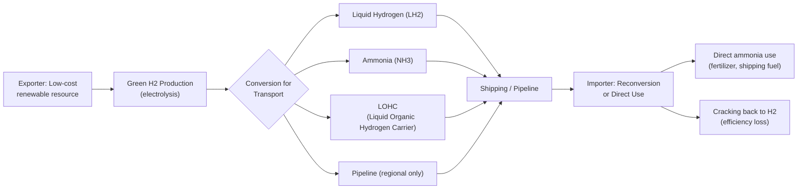

## International Hydrogen Trade Economics

### Definition and Scope

International hydrogen trade economics examines the emerging global market structure for exporting and importing hydrogen and hydrogen-derived commodities (ammonia, methanol, synthetic fuels, and potentially liquid hydrogen) between countries with comparative advantages in low-cost renewable or low-carbon hydrogen production and countries with structural demand deficits relative to their domestic production potential. It draws on classical international trade theory (comparative advantage, factor endowments), commodity shipping economics, and energy security policy, applied to a nascent commodity market still in early infrastructure buildout.

### Core Economic Rationale: Comparative Advantage in Renewable Resources

**Key Points**

- The foundational trade logic mirrors Ricardian/Heckscher-Ohlin comparative advantage: countries with abundant, low-cost renewable resource endowments (high-capacity-factor solar, wind, or hydropower) combined with available land can produce green hydrogen at substantially lower cost than countries with constrained renewable resources or high population density relative to land area.
- This creates a structural trade opportunity analogous to historical fossil fuel trade (e.g., Middle East oil exports to resource-poor, high-demand economies), but with a critical difference: renewable electricity itself is generally not economically transportable over intercontinental distances, so hydrogen (or its derivatives) functions as the **embodied energy carrier** that makes renewable resource endowments tradeable internationally for the first time at meaningful scale.
- **Likely exporter profile**: countries/regions with abundant land, high solar irradiance or wind resource, and lower population density relative to potential renewable generation capacity — commonly cited candidates in industry and government strategy documents include Australia, Chile, Morocco, Namibia, Saudi Arabia/Gulf states (leveraging existing energy export infrastructure and low-cost solar), and parts of North Africa.
- **Likely importer profile**: countries with high industrial energy demand, dense population relative to renewable resource potential, and existing energy import dependency — commonly cited candidates include Japan, South Korea, and Germany/parts of the EU.
- [Inference] This exporter/importer categorization reflects the consensus framing in IEA, IRENA, and national hydrogen strategy documents based on resource endowment analysis; actual trade flows will also depend on infrastructure buildout speed, bilateral agreements, and relative cost competitiveness that are still resolving, so specific country rankings should be treated as directional rather than fixed.

### Carrier Selection Economics

The choice of hydrogen carrier for international transport is a first-order economic decision, since each pathway imposes different capital costs, energy losses, and end-use compatibility constraints.

| Carrier | Key Advantage | Key Economic Drawback |
| --- | --- | --- |
| Liquid Hydrogen (LH2) | No reconversion step needed if end use is pure H2 | Very high liquefaction energy penalty (a significant share of the hydrogen's own energy content is typically consumed in cooling to cryogenic temperature) plus boil-off losses during storage/transport |
| Ammonia (NH3) | Mature global shipping/handling infrastructure (existing fertilizer trade); higher volumetric energy density than LH2; can be used directly as a fuel (shipping, power generation) without cracking | Requires energy-intensive Haber-Bosch synthesis; cracking back to pure H2 for other end uses imposes additional efficiency loss and capital cost |
| Liquid Organic Hydrogen Carriers (LOHC) | Can use existing liquid fuel infrastructure (tankers, some pipeline compatibility); stable at ambient temperature/pressure, reducing boil-off risk | Requires hydrogenation and dehydrogenation steps, both energy-intensive; carrier fluid must be returned to origin (round-trip logistics) |
| Methanol | Compatible with existing fuel infrastructure to a degree; liquid at ambient conditions | Requires captured CO2 as a co-feedstock, adding cost and supply chain complexity |
| Pipeline (gaseous H2) | Lowest cost per unit for high-volume, established routes | Only economically viable for regional/continental transport (e.g., intra-EU, potentially repurposed natural gas pipelines); not viable for intercontinental trade |

[Unverified] Relative efficiency losses and cost figures for each carrier vary significantly by study assumptions (distance, scale, technology maturity); current techno-economic comparisons (e.g., IEA Global Hydrogen Review, IRENA reports) should be consulted for specific numerical benchmarks, as carrier cost estimates have been revised repeatedly as pilot and early commercial projects generate real operating data.

**Key Points on carrier choice**:

- **Ammonia has emerged as the leading near-term internationally traded hydrogen derivative** in most industry analyses, primarily because it leverages existing global shipping, port, and storage infrastructure built for the fertilizer trade, substantially reducing first-mover infrastructure capital risk relative to entirely novel LH2 or LOHC supply chains.
- The **"double conversion penalty"** — converting hydrogen to ammonia for shipping, then cracking ammonia back to pure hydrogen at the destination (required when the end use needs pure H2 rather than ammonia itself) — imposes a meaningful cumulative efficiency loss that is a central input into delivered-cost competitiveness calculations, and is one reason many near-term projects target ammonia-direct end uses (fertilizer, shipping fuel, co-firing) rather than cracking-dependent pathways.

### Cost Structure of Traded Hydrogen

The delivered cost of internationally traded hydrogen to an importing country is generally decomposed as:

$$C_{delivered} = C_{production} + C_{conversion} + C_{shipping} + C_{reconversion} + C_{storage/regas}$$

**Key Points**

- $C_{production}$: the levelized cost of hydrogen (LCOH) at the export site, driven by renewable electricity cost, electrolyzer capex, and capacity factor — generally the largest single cost component in most published analyses, meaning exporter resource quality (renewable capacity factor) is a first-order determinant of overall trade competitiveness.
- $C_{conversion}$ and $C_{reconversion}$: capital and energy costs of converting hydrogen to a transportable carrier and back, which the "double conversion penalty" above captures.
- $C_{shipping}$: scales with distance and carrier energy density; ammonia's higher volumetric energy density relative to LH2 generally gives it a shipping cost advantage per unit of delivered energy over long distances, though this is offset by the additional cracking step if pure hydrogen is required downstream.
- $C_{storage/regas}$: import terminal infrastructure costs (analogous to LNG import terminal economics), which face similar first-mover capital risk and utilization uncertainty as export-side infrastructure.
- [Inference] Because most large-scale international hydrogen trade routes are still in pilot or early final-investment-decision stages rather than mature commercial operation, published delivered-cost estimates carry substantial uncertainty bands and should be treated as scenario projections rather than observed market prices.

### Infrastructure and Chicken-and-Egg Trade Problem

International hydrogen trade exhibits the same coordination failure discussed in domestic charging/refueling infrastructure economics, but at a larger capital scale and longer timeline: export-side electrolyzer and conversion facilities, shipping fleet capacity, and import-side terminal/cracking infrastructure must all be built roughly simultaneously and at compatible scale for any single trade route to function economically, yet no single participant wants to commit capital first without confirmed counterpart investment and offtake.

**Standard mitigation mechanisms observed in early projects**:

- **Long-term bilateral offtake agreements** between exporting-country producers and importing-country utilities/industrial buyers, providing revenue certainty that supports project financing (analogous to long-term LNG contracts historically underpinning that industry's buildout).
- **Government-to-government hydrogen trade agreements and strategic partnerships** — several countries have signed memoranda of understanding or formal partnerships explicitly aimed at de-risking early trade corridors (covering areas such as joint infrastructure investment, streamlined certification, and demand guarantees).
- **Blended public-private finance** for first-of-a-kind export facilities, similar in structure to the JETP-style blended finance mechanisms used in broader energy transition financing.
- **Hub-and-corridor strategies**: concentrating early infrastructure investment on a small number of high-confidence bilateral or regional trade corridors (rather than diffuse global trade) to reach minimum viable scale faster and reduce the number of simultaneous coordination failures that must be resolved at once.

### Certification, Standards, and Non-Price Trade Barriers

**Key Points**

- Because "green," "blue," "low-carbon," and "clean" hydrogen designations depend on production-method carbon intensity rather than a physically distinguishable product (hydrogen molecules are identical regardless of production method), international trade requires a **certification and guarantee-of-origin system** to allow importers to verify and value the carbon intensity of traded hydrogen — this is a genuine market-design requirement, not merely a bureaucratic formality, since price premiums for low-carbon hydrogen depend entirely on credible carbon-intensity verification.
- Multiple certification frameworks have emerged in parallel (including EU delegated-act-based rules under the Renewable Energy Directive, and various national/international voluntary standards), and **the lack of full international harmonization between these frameworks has been identified as a friction point** for cross-border trade, since exporters may need to certify against multiple, sometimes divergent, standards to access different importing markets.
- **Additionality and temporal/geographic matching rules** (requirements that renewable electricity used for electrolysis be newly built, and matched to production timing and location) — as embedded in frameworks such as the EU's rules for renewable hydrogen — directly affect exporter project economics, since stricter matching requirements can reduce achievable electrolyzer capacity factors (and thus raise LCOH) relative to a looser standard allowing grid-average or more flexible sourcing. [Unverified] Specific rule details and their stringency have been subject to ongoing regulatory revision; current EU delegated act text and any national equivalents should be checked for a specific compliance or investment analysis.

### Illustrative Diagram: Delivered Cost Build-Up for Traded Hydrogen (svg_diagram)

<svg xmlns="http://www.w3.org/2000/svg" viewBox="0 0 640 360">
<text x="320" y="24" text-anchor="middle" font-size="15" font-weight="bold" fill="#1a1a1a">Delivered Cost Stack: Export to Import (svg_diagram)</text>
<line x1="90" y1="310" x2="590" y2="310" stroke="#333" stroke-width="2" />
<line x1="90" y1="310" x2="90" y2="50" stroke="#333" stroke-width="2" />
<text x="45" y="180" text-anchor="middle" font-size="12" fill="#333" transform="rotate(-90 45 180)">Cost (\$/kg H2-equivalent)</text>
<rect x="120" y="150" width="90" height="160" fill="#27ae60" opacity="0.8" />
<text x="165" y="330" text-anchor="middle" font-size="10" fill="#333">Production (LCOH)</text>
<rect x="230" y="110" width="90" height="40" fill="#2980b9" opacity="0.8" />
<text x="275" y="330" text-anchor="middle" font-size="10" fill="#333">Conversion (NH3)</text>
<rect x="340" y="80" width="90" height="30" fill="#e67e22" opacity="0.8" />
<text x="385" y="330" text-anchor="middle" font-size="10" fill="#333">Shipping</text>
<rect x="450" y="45" width="90" height="35" fill="#8e44ad" opacity="0.8" />
<text x="495" y="330" text-anchor="middle" font-size="10" fill="#333">Reconversion</text>
<text x="165" y="145" text-anchor="middle" font-size="10" fill="#333" font-weight="bold">Largest share</text>
<text x="320" y="345" text-anchor="middle" font-size="11" fill="#555" font-style="italic">Illustrative schematic: production cost typically dominates total delivered cost</text>
</svg>

### Geopolitical and Energy Security Dimensions

**Key Points**

- Import-dependent industrialized economies (particularly Japan, South Korea, and EU member states with limited domestic renewable resources relative to industrial demand) view hydrogen trade partly through an energy security diversification lens — replicating and diversifying away from prior fossil fuel import dependency structures, rather than eliminating import dependency altogether.
- This motivates **portfolio diversification strategies** in national hydrogen strategies (securing supply from multiple exporting countries/regions rather than concentrated single-source dependency), an approach directly analogous to LNG and oil import diversification strategy historically.
- **Strategic competition for export market share** among candidate exporting countries has driven substantial early-stage government support (grants, tax incentives, streamlined permitting) for export-oriented green hydrogen megaprojects, reflecting a first-mover advantage logic in establishing trade relationships and infrastructure lock-in before competitor exporters do so.
- [Speculation] The extent to which hydrogen trade ultimately reduces or merely reshapes energy security dependency patterns (versus fossil fuel trade) remains a genuinely open question in the policy literature, since dependency on hydrogen-derivative imports could reproduce similar strategic vulnerabilities as fossil fuel import dependency, just with different exporting-country partners and different price volatility drivers.

### Comparative Framework: Hydrogen Trade vs. LNG Trade Precedent

Much of the current thinking about hydrogen trade infrastructure and contracting draws explicitly on the historical LNG (liquefied natural gas) trade build-out as a reference case, since LNG also required simultaneous, capital-intensive liquefaction, shipping, and regasification infrastructure investment to establish a functioning global market.

| Dimension | LNG Trade (historical precedent) | Hydrogen/Derivative Trade (emerging) |
| --- | --- | --- |
| Conversion penalty | Liquefaction energy loss, no reconversion step needed for most end uses | Conversion AND often reconversion (e.g., ammonia cracking) required |
| Contracting structure | Long-term take-or-pay contracts common in early market development | Similar long-term offtake structures emerging in early projects |
| Infrastructure specificity | Liquefaction/regas terminals are large, discrete, bilateral-route-specific assets | Similar infrastructure specificity, plus added carrier-choice uncertainty (NH3 vs. LOHC vs. LH2) not present in LNG's single-carrier market |
| Market maturity | Multi-decade market with liquid spot trading in later stages | Early-stage; spot market largely absent, dominated by bilateral negotiation |

[Inference] This LNG-analogy framing is a commonly used heuristic in industry and policy analysis for anticipating hydrogen trade market evolution, not a guarantee that hydrogen trade will follow an identical development trajectory, since hydrogen's multi-carrier complexity and current lack of price transparency present structural differences from the single-carrier LNG market.

### Key Interconnections with Broader Energy Economics

- **Levelized cost of hydrogen (LCOH)** — exporter-side production cost is the largest single input to delivered trade cost competitiveness.
- **Carbon border adjustment mechanisms and certification standards** — directly determine which traded hydrogen qualifies for price premiums or preferential market access in import markets with carbon-intensity-based regulations.
- **End-use sector competitiveness** — trade economics only matters where importing-country end uses (steel, ammonia, shipping fuel) are themselves competitive against electrification alternatives, linking directly back to sector-specific hydrogen competitiveness analysis.
- **Energy security and resource curse considerations** — export-dependent economies face analogous fiscal and economic diversification questions to traditional fossil-fuel-exporting economies, connecting to broader resource curse and just transition literature.

**Related Topics**

- Levelized cost of hydrogen (LCOH) modeling and regional cost curves
- Ammonia cracking technology and reconversion economics
- Certification and guarantee-of-origin systems for low-carbon hydrogen
- LNG trade market development as a historical analog
- End-use applications and sector-specific hydrogen competitiveness
- Carbon border adjustment mechanisms (CBAM) and trade policy interaction
- Export-economy fiscal dependency and resource curse dynamics
- Blended finance mechanisms for first-of-a-kind energy infrastructure