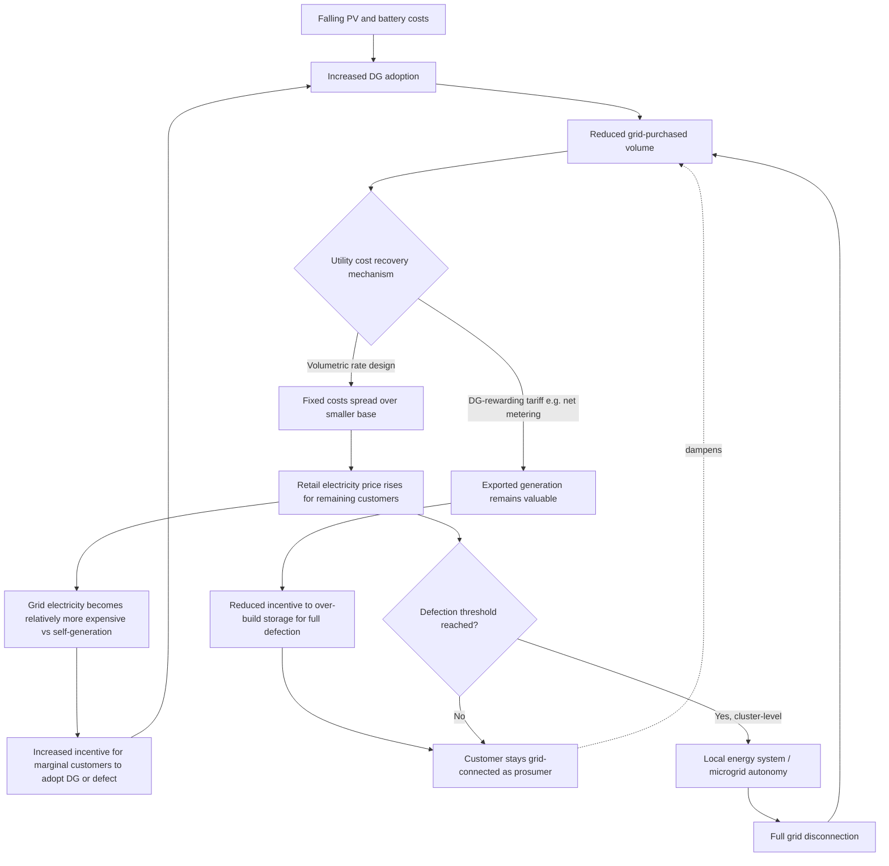

## Distributed Generation Economics and Grid Defection Risk

### Definition and Scope

Distributed generation (DG) economics examines the cost and value trade-offs facing end-use customers who install on-site generation and storage (rooftop solar, batteries, sometimes backup generators) rather than relying exclusively on grid-supplied electricity. Grid defection risk is the closely related utility-side concern: the possibility that falling DG and storage costs, combined with rising retail electricity prices, make full disconnection from the grid economically rational for a meaningful share of customers, which in turn threatens utility revenue recovery and can trigger a self-reinforcing cost spiral for those who remain grid-connected. These two phenomena are treated as a single economic system because the individual customer's defection decision and the utility's revenue-recovery mechanism are mutually dependent — one determines the incentive the other creates.

### The Core Economic Feedback Mechanism: The Utility Death Spiral

The **utility death spiral** is a positive feedback loop in which electric utility customers switch to distributed generation or improve efficiency, causing a steep decline in electricity demand purchased from the grid, which in turn drives up retail electricity prices for remaining customers (because most utility fixed costs must be recovered from a shrinking base of grid purchases), which further incentivizes additional customers to reduce their grid demand or defect entirely, and so on. This is a textbook example of a network-cost allocation externality: because utility distribution infrastructure has very high fixed costs but is typically recovered through volumetric (per-kWh) charges, any reduction in volumetric purchases by a subset of customers shifts the fixed-cost burden onto those who remain, independent of whether the departing customers still use the grid for backup or partial supply.

$$P_{retail} = \frac{C_{fixed} + C_{variable}(Q)}{Q}$$

As $Q$ (grid-purchased volume) falls due to DG adoption, and $C_{fixed}$ remains largely unchanged, $P_{retail}$ rises for the remaining volume — mechanically increasing the economic incentive for the next marginal customer to adopt DG or defect, which is the feedback loop's self-reinforcing step.

### Tariff Design as the Central Policy Lever

The single most consequential variable shaping both DG adoption and defection risk is how utilities compensate and price the interaction between customer-owned generation and the grid. System dynamics modeling comparing three utility business models — net metering, wholesale compensation, and demand-charge pricing — run from the present through 2050 finds that a utility death spiral requires a perfect storm of high intrinsic adoption rates, rising utility costs, and favorable customer financials occurring simultaneously, rather than being an automatic consequence of DG growth alone. Critically, the compensation structure itself determines which direction the feedback runs: pricing structures that reduce distributed generation compensation actually support grid defection, whereas pricing structures that reward distributed generation, such as net metering, reduce grid defection and the risk of a death spiral — because net metering keeps the economic value of staying grid-connected high (the customer is compensated well for exported energy) relative to the value of over-building on-site storage to become self-sufficient. [Inference] This is a somewhat counterintuitive policy result: utilities attempting to protect revenue by cutting net-metering compensation may inadvertently increase the very defection risk they are trying to prevent, since a worse on-grid deal for solar owners makes full self-sufficiency comparatively more attractive.

Empirically, this dynamic is playing out in current tariff reform: as utility rate structures shift away from net metering, increase unavoidable fixed costs, or restrict grid access, solar prosumers face an increasingly economic path to full grid defection, and this trend, coupled with rising grid electricity costs and continued declines in both photovoltaic (PV) and battery costs, has made economic grid defection and utility death spirals a salient live policy issue rather than a purely theoretical concern.

### Empirical Assessment: Is Mass Defection Actually Economic?

A key 2024 case-study analysis evaluated the profitability of grid defection using hybrid PV-diesel generator-battery systems across eighteen case studies spanning different U.S. irradiation zones, explicitly to test whether the death-spiral fear is empirically grounded rather than purely theoretical. The overall finding of that study was that the fear of a utility "death spiral" may be exaggerated, even though the same research separately identified specific U.S. states as currently being "ripe" for grid defection under prevailing rate and cost conditions. This is not a contradiction: it indicates that defection economics is highly location- and policy-specific rather than a uniform national trend — favorable solar irradiation, high retail electricity rates, and unfavorable net-metering terms must combine in a specific jurisdiction before defection becomes the dominant economic choice for a meaningful customer share. The same body of research explicitly flags that regulators must consider mass economic grid defection of hybrid PV-battery-generator systems as a near-term possibility and should design rate structures accordingly to keep solar producers grid-connected and avert death-spiral dynamics, even while concluding current mass defection risk is not yet realized broadly.

An important qualifier raised in this literature: technical/economic profitability of defection is a necessary but not sufficient condition for actual defection behavior — more research is needed on whether consumers will actually take the trouble and risk of defecting even where it pencils out financially, since defection also entails giving up grid reliability as a backstop and taking on operational responsibility for one's own power system.

### Emerging Business Model: Grid Defection as a Service

A notable commercial innovation identified in the literature is a "grid defection as a service" model, structurally analogous to existing energy-as-a-service or solar leasing programs: in this model, a business handles installation and operation of the defection-enabling hybrid system, taking the operational and technical burden off the individual consumer, and the business and the customer share the savings achieved through defection. [Inference] This model matters economically because it directly addresses the "will consumers bother" adoption-friction problem noted above — by outsourcing complexity and risk to a specialized operator, it could accelerate defection uptake in jurisdictions that are already economically ripe for it, independent of any further decline in hardware costs.

### Game-Theoretic Dimension: Strategic Interaction Among Customers

More recent modeling moves beyond individual cost-minimization to explicitly game-theoretic analysis, since one customer's defection decision changes the payoff faced by other customers (through the fixed-cost-reallocation mechanism described above). This literature situates individual and clustered defection within the broader rise of local energy systems: local energy systems such as microgrids and energy communities are increasingly seen as an integral component of the transition to renewable and decentralized energy systems, with Europe alone having more than 7,700 energy communities serving over 2 million consumers who are increasingly adopting distributed energy resources, some of which already operate independent internal electricity pricing for members. The defection decision in this framing is a threshold problem: as a local energy system accumulates enough distributed generation, storage, EV charging assets, and management software, it may reach a point of energy autonomy sufficient to justify defecting from the grid entirely to avoid ongoing connection costs, and conflicting interests among the consumers within such a cluster (some want to defect, others want to retain grid backup) create genuinely game-theoretic — not merely individually-optimizing — dynamics that earlier single-agent models overlooked. On a large scale, uncoordinated defection cascades of this kind may lead to price inflation for remaining grid customers, hindrance of the broader energy transition (since grid infrastructure planning becomes harder to justify economically), and in the extreme case, a genuine "death spiral" characterized as a domino effect of sequential disconnections.

### Policy and Planning Implications

The literature converges on a shared prescription despite differing emphasis: because a sudden, uncoordinated shift to widespread defection could place the residual cost burden onto remaining customers and further incentivize their defection in turn, any transition toward greater PV self-consumption and off-grid systems should proceed through gradual, well-sequenced policy changes that allow all stakeholders — utilities, remaining customers, and regulators — time to adapt, rather than occurring as an abrupt shock to the system. Two complementary regulatory strategies are repeatedly recommended:

- **Incorporate defection-probability forecasting into grid planning**: by incorporating grid defection prediction directly into grid expansion planning, utilities and regulators can make capacity expansion more efficient — for instance, policymakers can encourage independent microgrid development specifically in areas identified as having high defection probability, avoiding unnecessary and potentially stranded grid-expansion investment in those areas.
- **Offer selective off-grid or hybrid service options**: utility companies could selectively provide off-grid services directly to consumers where doing so is economic, effectively capturing the defection-driven revenue opportunity themselves (as a service provider) rather than losing the customer relationship entirely, and past research similarly indicates that averting a death spiral requires utilities to make grid-tied net metering more appealing, particularly to small businesses, rather than relying solely on defensive rate restructuring.

### Worked Example: Illustrating the Feedback Loop

**Example**

Consider a simplified utility with $100 million in annual fixed distribution costs, recovered volumetrically across 1,000 GWh of annual grid sales, yielding a baseline rate contribution of $0.10/kWh purely for fixed-cost recovery (ignoring variable generation cost for simplicity).

- If DG adoption reduces grid-purchased volume by 15% to 850 GWh, and the utility must still recover the same $100 million in fixed costs from the smaller base, the fixed-cost component of the rate rises to approximately $0.118/kWh — an 18% increase, borne entirely by the customers who did not adopt DG.
- This rate increase raises the payback-period attractiveness of DG and storage for the next marginal customer, since grid electricity has become comparatively more expensive without the customer's on-site generation cost changing.
- If, instead, the utility maintains strong net-metering compensation, this reduces the incentive for solar-owning customers to add enough storage to defect entirely (since exporting excess generation back to the grid remains financially attractive), keeping them as grid-connected — if lower-revenue — customers rather than pushing them toward full disconnection, illustrating the earlier finding that DG-rewarding tariffs reduce defection risk relative to DG-penalizing tariffs.

**Key Points**

- Grid defection risk and DG adoption economics are governed by the same core variable: the gap between the cost of grid electricity (as shaped by tariff design) and the levelized cost of self-generation plus storage.
- The death-spiral mechanism is a genuine, mathematically demonstrable feedback loop, but empirical case-study evidence suggests mass defection triggering a full death spiral requires a specific, currently uncommon combination of conditions rather than being an inevitable consequence of DG cost declines.
- Tariff design that reduces DG compensation to protect utility revenue can perversely increase defection incentives, while tariffs that reward DG (net metering) tend to reduce full-defection incentives, even though they reduce utility revenue per adopting customer in other ways.
- Location-specific factors (irradiation, retail rate levels, existing net-metering terms) mean defection economics vary enormously by jurisdiction; national-level statements about defection risk should be treated with caution absent local analysis.

### Illustrative Diagram: The Utility Death Spiral Feedback Loop

### Practical Considerations

- **Distinguish theoretical mechanism from empirical prevalence**: the death-spiral feedback loop is well-established analytically, but case-study evidence indicates actual mass defection remains limited to specific favorable jurisdictions rather than being a general near-term outcome; avoid treating theoretical possibility and empirical likelihood as the same claim.
- **Tariff reform carries directional risk**: because DG-compensation cuts can increase rather than decrease defection incentive under some models, utilities and regulators should model the full feedback response of a proposed tariff change rather than assuming that reducing net-metering compensation straightforwardly protects utility revenue.
- **Behavior may vary by jurisdiction and over time**: irradiation quality, local retail rate structures, storage cost trajectories, and specific net-metering or demand-charge rules differ substantially across utilities and change frequently through rate cases; the "ripe for defection" status of any given market should be re-verified against current local tariff filings before use in investment or policy analysis.

### Related Topics

- Levelized Cost of Storage (LCOS) and its role in defection-threshold calculations
- Demand-charge tariff design and its distinct incentive effects versus net metering
- Time-of-use and dynamic pricing as alternatives to net metering for DG compensation
- Microgrid and energy community formation economics and shared-cost allocation
- Non-wires alternatives and utility use of DG forecasting in capacity planning
- Cross-subsidization between DG adopters and non-adopters within a rate class
- Virtual power plant (VPP) aggregation as an alternative to individual customer defection
- Stranded asset risk for utility distribution infrastructure under high DG penetration scenarios