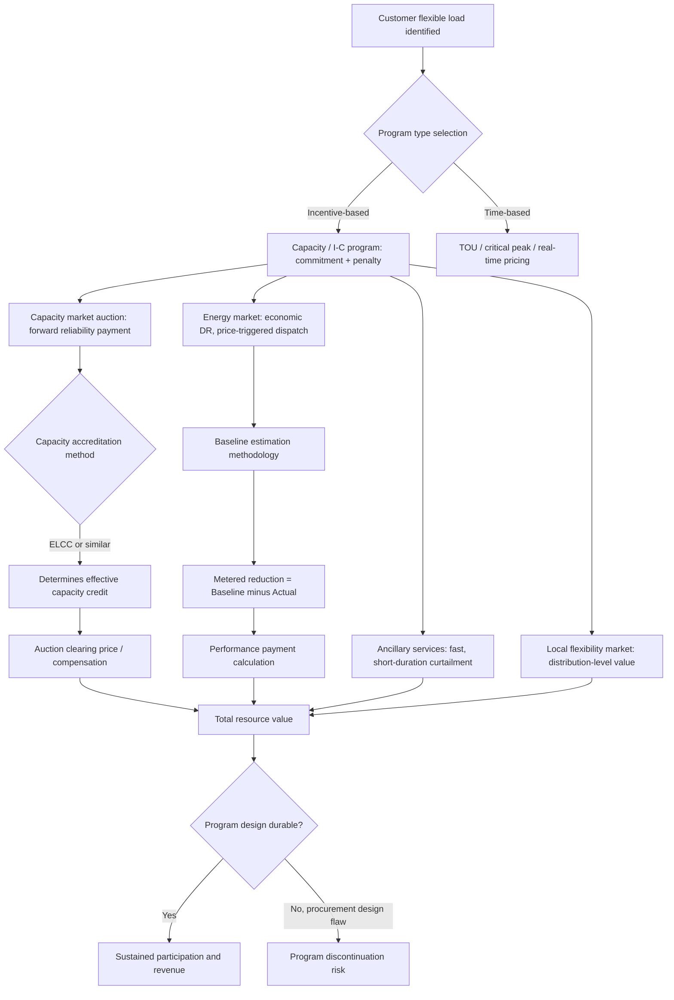

## Demand Response Program Design and Valuation

### Definition and Scope

Demand response (DR) program design and valuation is the economic and market-design discipline governing how electricity end-users are compensated for voluntarily reducing or shifting consumption, and how the resulting load reduction is measured, verified, and monetized across the different markets that will pay for it. DR sits at the intersection of price theory (customers respond to the marginal price and value of their own consumption) and market design (compensation mechanisms must be structured so that a real, verifiable, and reliable resource is created, rather than a compliance formality). Recently, this has shifted decisively from a regulatory-compliance framing toward a revenue-generating and infrastructure-cost-avoidance framing: the economics of demand response have shifted decisively — what was once a regulatory compliance checkbox is now a core revenue strategy and infrastructure cost-avoidance mechanism, driven by grid operators facing load-growth projections that exceed historical models.

### Program Taxonomy: Incentive-Based vs. Time-Based

DR programs are conventionally divided into two structural categories. **Incentive-based programs** pay customers directly for committing to and delivering load reductions, typically including penalties for non-response, and are exemplified by interruptible/curtailable (I/C) service and capacity market (CAP) programs, which improve system reliability and market liquidity by giving the system operator a contracted resource it can call on. **Time-based (price-based) programs** instead rely on differentiated pricing — time-of-use rates, critical peak pricing, or real-time pricing — to induce voluntary load-shifting through the ordinary price-elasticity response of demand, without a formal capacity commitment or penalty structure. Economic modeling of these categories typically formalizes customer response using the price elasticity of demand together with a customer benefit function, allowing a system operator to identify and deploy whichever program type best improves the load curve while remaining attractive enough to secure customer participation — since a technically optimal program that customers refuse to join delivers no real resource.

A further practical distinction separates programs by trigger condition: **emergency/reliability DR** is dispatched only during system stress conditions (scarcity, forecast shortfalls, extreme weather), while **economic DR** is dispatched based on market price signals rather than emergency conditions — when wholesale prices spike due to demand peaks, transmission congestion, or generation scarcity, economic DR resources reduce load and capture the resulting price differential, which transforms demand response from an occasional emergency tool into a continuous, price-arbitrage-based revenue stream. However, economic DR generally offers lower value than other demand response program types and carries more compliance complexity, since payment is contingent on the customer accurately demonstrating a load reduction relative to a counterfactual baseline rather than simply being available on call.

### The Four Primary Monetization Channels

Demand response resources can be monetized across four primary market types, and mature DR programs increasingly stack participation across more than one simultaneously:

**Capacity Markets**

Capacity markets compensate resources for being available to deliver load reduction when called, functioning as a forward-looking reliability insurance product rather than a real-time energy product. Grid operators typically project capacity needs several years ahead (commonly a three-year forward window), then hold an auction in which resources — including demand response aggregators — bid to provide that capacity; aggregators fulfill their capacity commitment by enrolling individual companies willing to participate in DR events. Capacity programs are the most common demand response mechanism used to address threats of power outages and supply imbalances, primarily focused on alleviating grid-wide constraints rather than localized network issues.

**Energy Markets (Economic DR)**

Customers may participate in day-ahead or real-time energy markets, typically through an intermediary Curtailment Service Provider, offering load-reduction capability directly into the wholesale market; importantly, economic DR participants in the energy market are compensated only for load reductions that are not part of normal operations, meaning the baseline-measurement problem (establishing what the customer would have consumed absent the DR event) is central to this revenue channel's integrity.

**Ancillary Services Markets**

DR resources can also offer into ancillary services markets for much shorter curtailment durations — ranging down to minutes or even seconds — providing frequency regulation, reserves, or other fast-response grid services that command a premium for speed and precision relative to slower capacity or energy-market products.

**Emerging: Local/Distribution-Level Flexibility Markets**

A newer regulatory development is extending DR monetization below the wholesale/transmission level to the distribution grid itself. In Europe, the regulatory shift is significant: in March 2025 the EU Agency for the Cooperation of Energy Regulators (ACER) submitted its proposed Network Code on Demand Response to the European Commission, with national enforcement expected by 2027, and the code's most consequential provision mandates Local Flexibility Markets — a standardized mechanism allowing distributed resources to provide grid services at the distribution level, not only in wholesale markets. [Inference] This represents a structural broadening of DR valuation beyond bulk-system reliability toward locational, distribution-network-specific value (e.g., deferring a specific substation upgrade), which requires more granular locational price signals than most existing wholesale-market-oriented DR programs currently provide.

### Program Design Parameters

Beyond market-channel selection, DR program design involves several structural choices that materially affect both customer participation and resource reliability:

- **Notice/lead time**: Programs vary from very short notice (minutes, for fast ancillary-service-type products) to substantially longer lead times (up to 24 hours for traditional, manually-curtailed industrial load programs), with the traditional model requiring fixed curtailment plans and lengthy lead times of several hours to a day ahead, giving participating companies time to adjust operations. Modern, automated programs increasingly compress this window through remote, software-driven curtailment rather than manual planning.
- **Compensation structure**: Retail demand response programs typically remunerate customers through capacity payments, based on the committed available load reduction, and/or performance payments, based on the delivered demand reduction actually achieved, with capacity payments generally used to incentivize enrollment while performance payments reward actual delivery; some programs impose penalties for failure to deliver committed load reductions.
- **Asset scope and hybridization**: Some program designs allow retail customers with on-site (local) generation to participate, where increased distributed energy resource (DER) output reduces net load in a way that is functionally equivalent to demand reduction from the grid's perspective, blurring the line between demand response and distributed generation as reliability resources.
- **Aggregation model**: Individual customer loads, especially residential and small commercial, are typically too small to bid directly into wholesale capacity or energy markets; aggregators (curtailment service providers, DR aggregators) pool many customers' load-reduction capability into a single tradable resource, which is now the dominant commercial structure for reaching the smaller end of the customer base.

### Valuation Challenges

**The Baseline Problem**

Correctly valuing delivered demand response fundamentally depends on establishing an accurate counterfactual baseline — what the customer would have consumed had the DR event not occurred — since payment for performance-based programs is calculated as the difference between this baseline and actual metered consumption during the event. This has been a long-standing and unresolved measurement challenge in the literature: baseline estimation methodologies range from simple historical-average methods to more sophisticated statistical approaches such as probabilistic baseline estimation using Gaussian processes, precisely because poorly-specified baselines create both under-compensation (discouraging participation) and over-compensation/gaming risk (a documented historical problem, since past FERC settlements have specifically addressed attempts to "game" demand response program baselines). [Inference] The persistence of this problem across more than a decade of published literature suggests baseline estimation remains a genuinely unresolved measurement question rather than a solved engineering detail, and program designers should expect ongoing methodology disputes rather than a single settled standard.

**Capacity Accreditation and Effective Load-Carrying Capability (ELCC)**

A more recent and consequential valuation shift concerns how much "real" capacity credit a DR resource is assigned in resource-adequacy accounting, since a resource that can only sustain a short curtailment duration provides less true reliability value than firm, dispatchable generation of the same nameplate size. This has become directly contentious in practice: PJM's Independent Market Monitor concluded that results of the 2025/2026 Base Residual Auction were significantly affected by flawed market design decisions, including PJM's Effective Load-Carrying Capability (ELCC) accreditation approach, alongside market power concerns related to the withholding of demand resources and high offers — illustrating that capacity-value methodology, not just underlying physical resource availability, materially affects auction clearing prices and the compensation DR ultimately receives. California's experience offers a parallel cautionary lesson on program-design risk: the Demand Response Auction Mechanism (DRAM), once the state's flagship program for integrating third-party DR into utility resource planning, was discontinued after 2024, having struggled with the transition from pilot to permanent procurement — a demonstration that program design matters as much as underlying policy intent, since a policy-supported concept can still fail commercially if procurement mechanics are not built for durability. California's newer capacity accreditation process, taking effect in 2026, signals continued regulatory effort to integrate DR more rigorously into resource adequacy following that experience.

### Macro Context Driving DR Valuation Upward

Structural grid conditions are currently increasing the system-level value assigned to demand response as a reliability resource. PJM's capacity market has moved from managing surplus to managing scarcity, a transition driven by an unprecedented surge in demand from the rapid expansion of large-load data centers and broader economy-wide electrification, combined with the accelerated retirement of dispatchable generation due to environmental policy and economics, and significant supply-chain and permitting frictions extending the time required to bring new generation online — a scarcity condition anticipated to persist for some time because new generation cannot be built fast enough to offset combined retiring supply and surging demand. In direct response, the PJM Board of Managers, on January 16, 2026, directed staff to undertake a holistic review of capacity market design and investment incentives, reflecting the Board's recognition that current market price volatility carries broader implications for how resources like demand response are compensated and integrated into reliability planning going forward. [Inference] This scarcity environment structurally favors higher DR valuation over time, since the marginal reliability value of any dispatchable-or-curtailable resource rises as the reserve margin tightens, but it also increases regulatory and market-monitor scrutiny of DR accreditation methodology, as the PJM ELCC dispute illustrates.

### Worked Example: Comparing Compensation Streams

**Example**

A commercial customer with 500 kW of curtailable load is deciding how to enroll a DR resource.

- Under a **capacity-only program**, the customer receives a fixed annual capacity payment for committing to be available (e.g., a $/kW-year rate), regardless of how many times it is actually called, but faces a penalty if it fails to perform when dispatched — this favors customers who value revenue certainty and have low opportunity cost of occasional curtailment.
- Under an **economic (energy market) program**, the customer earns money only when it actually curtails load during a price spike, calculated as the metered baseline-minus-actual difference multiplied by the prevailing wholesale price — this can offer higher per-event payouts during scarcity conditions but carries revenue uncertainty and baseline-dispute risk, and is generally regarded as lower-value and more compliance-complex than capacity programs.
- A customer able to stack participation — capacity payments for availability, plus opportunistic economic DR dispatch, plus ancillary services for very short, high-value curtailment windows — captures multiple, largely independent revenue streams from the same underlying flexible load, which is the direction commercial DR aggregation has moved as automated, remote curtailment has made rapid multi-market dispatch operationally feasible.

**Key Points**

- DR valuation is not a single number but a stack of potentially co-monetizable revenue streams (capacity, energy, ancillary services, and increasingly local flexibility markets), and program design should be evaluated against which streams a given load profile can realistically access.
- Baseline methodology is not a settled solved problem; it remains a live source of both under-compensation risk and gaming risk, and has been the subject of dispute and regulatory action for well over a decade.
- Capacity accreditation methodology (e.g., ELCC) can materially change realized compensation independent of the physical resource's actual reliability contribution, and is currently an active area of regulatory dispute in major U.S. capacity markets.
- Program design durability matters as much as policy support: DRAM's discontinuation despite being California's flagship third-party DR integration mechanism demonstrates that procurement-mechanism design failures can end a policy-favored program.

### Illustrative Diagram: DR Program Design and Valuation Flow

### Practical Considerations

- **Distinguish committed capacity value from delivered performance value**: a resource can be well-compensated for availability yet deliver little real energy reduction if baseline measurement or dispatch call frequency is poorly calibrated; program evaluation should track both dimensions separately.
- **Regulatory and market-design risk is material and current**: ongoing disputes over ELCC methodology, the ACER Network Code's Local Flexibility Market mandate, and post-DRAM capacity accreditation reform in California indicate that DR compensation rules are actively being rewritten in major markets; figures and rules cited here should be re-verified against current market-operator tariffs and FERC/regulatory filings before use in financial modeling.
- **Behavior may vary by market structure**: capacity market design (PJM's RPM/BRA structure, California's resource adequacy framework, EU network codes) differs substantially by jurisdiction, and DR valuation conclusions drawn from one market should not be assumed to transfer directly to another without adjustment for local rules.

### Related Topics

- Effective Load-Carrying Capability (ELCC) methodology and its application to non-generation resources
- Baseline estimation methods for demand response performance measurement
- Virtual power plant (VPP) aggregation as a DR delivery and monetization architecture
- Locational marginal pricing and its interaction with distribution-level flexibility markets
- Capacity market design reform (PJM Reliability Pricing Model, resource adequacy construct comparisons)
- Time-of-use and critical peak pricing elasticity estimation
- Curtailment Service Provider business models and aggregator economics
- Grid defection and distributed generation economics as a substitute/complement to demand response