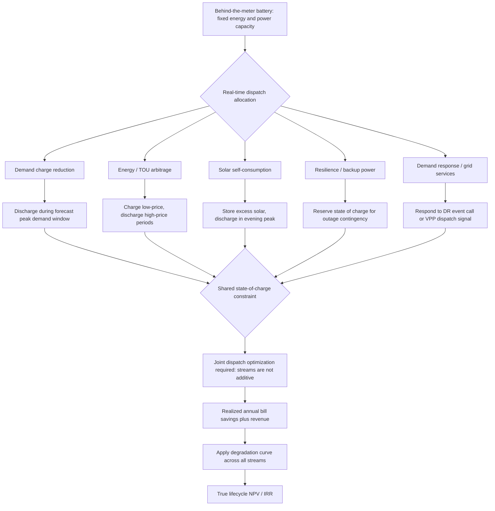

## Behind-the-Meter Storage Economics

### Definition and Scope

Behind-the-meter (BTM) storage economics analyzes the value creation, cost structure, and investment returns of battery energy storage systems (BESS) installed on the customer side of the utility revenue meter — meaning the storage asset interacts directly with a specific site's load and tariff structure rather than participating in wholesale markets as a standalone, grid-connected asset. A behind-the-meter asset is any generation or storage device connected on the customer side of the utility revenue meter, which is the defining structural feature that separates BTM economics from front-of-meter (utility-scale, wholesale-market) storage economics: value is realized primarily through bill reduction against a specific retail tariff, rather than through wholesale energy or capacity market clearing prices.

### Core Value Streams

BTM storage economics for commercial and industrial (C&I) solar-plus-storage projects are driven by five stackable value streams: demand charge reduction, energy arbitrage, solar self-consumption, resilience value, and grid services or tariff programs. Each stream monetizes a different aspect of the battery's charge/discharge flexibility, and most bankable modern projects combine several simultaneously rather than relying on a single stream.

**Demand Charge Reduction (Peak Shaving)**

Demand charges are a separate utility bill component, distinct from volumetric energy charges, based on a customer's maximum power draw (typically measured in kW) during a billing period, reflecting the higher cost utilities incur to build and maintain capacity for a customer's peak load rather than their average consumption. These charges are financially significant: demand charges can comprise 30 to 70 percent of a customer's total utility bill, making demand charge reduction one of the single highest-leverage value streams for C&I storage. The mechanism is straightforward — a battery charges during low-demand periods and discharges during the site's peak demand window, lowering the metered maximum and therefore the demand charge calculated from it. A concrete illustration: with a commercial demand charge rate of $15 per kilowatt and a peak demand reduction from 125 kW to 60 kW, battery storage could reduce the demand charge by close to $1,000 for that billing period, amounting to roughly $11,700 in annual savings from demand charge reduction alone. Modern dispatch systems achieve meaningful, repeatable reductions: a BESS dispatched against forecast peaks can reliably shave 20–40% of monthly peaks if the forecasting and control stack are competent, though this depends heavily on the shape of the underlying load curve — sites with a flat or persistently high (platform-shaped) load profile have little shaving headroom, since trimming such a load requires a disproportionately large storage system and the economics deteriorate quickly, whereas sites with narrow, well-defined peak-demand events are the most economically attractive candidates for demand-charge-focused storage.

**Energy (Time-of-Use) Arbitrage**

Arbitrage value is created by charging the battery when energy is cheap (off-peak, or from excess on-site solar) and discharging when energy is expensive (on-peak or during high spot-market prices), capturing the price differential. Arbitrage revenue is fundamentally a function of the price spread available to the site: wide spread, high revenue; narrow spread, low revenue, meaning arbitrage economics are highly tariff- and market-specific rather than a fixed, generalizable value. A structural shift in this value stream has been underway as more industrial customers move from fixed time-of-use tariffs to direct spot-market exposure: the once-stable peak-valley spread is becoming a spot price curve that moves with underlying supply and demand, which means peak-valley arbitrage still matters but its certainty is falling — a system that only charges and discharges on a fixed schedule cannot properly capture value once prices become genuinely dynamic, requiring an energy management system (EMS) capable of real-time monitoring, load prediction, dynamic reserve management, and fast response rather than a static schedule.

**Solar Self-Consumption**

Where storage is co-located with on-site solar PV, the battery can store excess midday generation for use during evening peaks, increasing the share of solar generation the site consumes directly rather than exporting it (often at a lower compensation rate than the retail rate it would otherwise displace). This is functionally a form of arbitrage but against the site's own generation profile rather than the grid tariff structure, and its value depends heavily on the relative compensation for self-consumed versus exported solar energy.

**Resilience Value**

Storage can keep critical loads energized during grid outages, providing backup power value that is harder to price precisely than the other value streams but can dominate the investment case in specific high-outage-risk contexts. This has been most dramatically illustrated in the South African market, where the Eskom load-shedding environment has collapsed payback periods for C&I battery storage to 2–4 years on pure resilience value alone, without needing to rely on tariff arbitrage or demand charge reduction at all — an extreme example of how grid reliability conditions, not just tariff design, can independently drive BTM storage economics.

**Grid Services and Demand Response Participation**

Where local market rules allow, behind-the-meter storage can also participate in demand response or ancillary services programs, layering a wholesale-market-adjacent revenue stream on top of the primarily retail-tariff-driven value streams above. Regional regulatory permissiveness varies substantially: certain Australian states (New South Wales, Victoria, South Australia) permit aggregated virtual power plant (VPP) participation alongside demand tariff reduction, allowing a single BTM asset to stack retail bill savings with wholesale-adjacent VPP revenue.

### Revenue Stacking: Economics and Constraints

Individually, several of these value streams are frequently insufficient to justify investment on their own: demand charge savings alone might yield a long payback, and time-of-use arbitrage alone might not pencil at all — but stacking demand charge reduction, arbitrage, solar self-consumption, and demand response participation on the same battery changes the project's economics class entirely, often being the deciding factor between an unbankable and a bankable project.

However, revenue stacking is subject to a critical physical constraint that distinguishes it from simply summing independent income sources: stacked revenue is not additive, because every value stream draws on the same finite energy and the same state of charge. A kilowatt-hour of stored energy discharged to shave a demand peak is a kilowatt-hour that cannot simultaneously be sold into an arbitrage opportunity or reserved for a demand response event — the battery's total energy throughput and power capacity must be allocated across competing uses, and an optimal dispatch strategy requires actively deciding, hour by hour, which value stream that particular unit of stored energy should serve. [Inference] This means naive project financial models that simply sum the theoretical maximum value of each stream independently will systematically overstate real achievable revenue; credible modeling must solve a joint dispatch optimization that allocates a single, shared energy resource across all target value streams simultaneously. Reinforcing this same caution from a different angle, industry due-diligence standards now explicitly flag double-counting the same kWh across revenue streams as a red flag that lenders and insurers screen for in bankable project models, alongside a related error: ignoring degradation in year-on-year value, since a static annual value stack that does not account for battery capacity fade can overstate 15-year net present value by 15–25%, given that degradation must flow through every revenue stream calculation, not merely the raw energy-throughput figure.

### Cost Structure and Typical Returns

For a representative C&I configuration — a 1 MW / 2 MWh lithium iron phosphate (LFP) battery energy storage system co-located with a 2–3 MW rooftop or carport photovoltaic array — installed costs in the 2025–2026 period sit in the $280–$450/kWh range for the DC block across EU and US markets, with simple payback periods of 4–8 years and unlevered internal rates of return (IRRs) of 11–18% once available incentives and full revenue stacking are applied. [Inference] The wide spread in both cost and return figures reflects the strong sensitivity of BTM storage economics to local tariff structure and regulatory permissiveness for stacking, rather than indicating that any single "typical" project economics figure is broadly representative across markets.

Critically, within BTM economics, the dominant sensitivity is not CAPEX — it is the site's demand charge structure, solar generation profile, and the number of bankable revenue streams that local regulators actually allow to be stacked. This is an important framing distinction from utility-scale storage economics, where capital cost and wholesale price volatility tend to dominate the investment case: for BTM projects, the regulatory and tariff-design environment often matters more than the hardware cost itself, since two otherwise-identical batteries installed under different tariff structures or stacking permissions can have dramatically different payback periods.

### Rate Design as the Primary Economic Determinant

The economics of owning a BTM storage system are heavily influenced by rate design, since the customer's potential bill reduction depends directly on the applicable tariff rate structure and on what the customer is paid for any electricity exported when discharging the system. Public utility commissions, in setting this rate design, must balance multiple policy objectives — encouraging efficient competition, controlling monopoly pricing, and ensuring reliable, equitable service — while also determining effective recovery of the utility's revenue requirement and efficient, forward-looking price signals; these regulatory choices directly determine which BTM value streams exist and how large they are at any given site. Where a supply tariff is unbundled or pass-through — meaning the customer sees each individual cost component (energy, capacity, network charges) separately rather than a single blended rate — this transparency provides a more nuanced price signal that can be particularly valuable for sites with meaningful ability to flex their usage timing, since it reveals precisely which cost component a battery dispatch strategy should target.

### Worked Example: Combining Multiple Use Cases

**Example**

Consider a supermarket site combining several use cases on a single battery system, illustrating realistic multi-stream dispatch: the battery charges overnight during off-peak tariff rates to build sufficient state of charge to shave the site's early-morning demand peak (a demand-charge-reduction action), then charges again from excess rooftop solar generation during the middle of the day specifically to target the site's very expensive evening peak rate (a combined solar-self-consumption-plus-arbitrage action). This layered dispatch pattern — off-peak charge for morning peak shaving, solar charge for evening peak arbitrage — demonstrates that a single battery asset's state of charge must be actively managed across the day to serve different value streams at different times, rather than following one fixed, unchanging charge/discharge schedule; in practice, working out whether a battery is a good investment and determining its best operating strategy involves considerably more complexity than this simplified illustration, since real dispatch must also account for demand forecast uncertainty, solar generation variability, and tariff structure interactions simultaneously.

A separate concrete illustration of stacked value in a European market: a facility on a day-ahead indexed spot-price contract might realize approximately €12,000 per year in spot-price arbitrage value alone (benefiting from generous solar-driven midday intraday price spreads), plus additional avoided penalty fees for exceeding contracted capacity limits, for a total annual benefit on the order of €42,000 when demand-charge and arbitrage value are combined at that specific site.

**Key Points**

- Demand charge reduction is typically the single highest-leverage BTM value stream for C&I customers, given that demand charges alone commonly represent 30–70% of the total bill, but its magnitude depends heavily on how narrow and predictable the site's peak-demand events are.
- Revenue stacking materially improves project economics but is constrained by shared state-of-charge — stacked value streams compete for the same finite energy and power capacity and must be jointly optimized, not simply summed.
- Regulatory permissiveness for stacking (which value streams a jurisdiction allows a single asset to monetize simultaneously) is often a more decisive economic variable than the battery's hardware cost.
- Degradation must be modeled through every revenue stream over the asset's life, not applied only to a single energy-throughput figure, or project NPV will be materially overstated.
- Resilience value can independently dominate the investment case in high-outage-risk grid environments, collapsing payback periods well below what tariff-arbitrage-only economics would produce.

### Illustrative Diagram: BTM Storage Value Stack and Dispatch Logic

### Practical Considerations

- **Avoid naive value-stream summation**: because stacked revenue draws on shared, finite battery capacity, financial models that add up the theoretical maximum of each value stream independently will overstate achievable returns; a joint dispatch-optimization approach is necessary for a credible project model.
- **Model degradation across the full revenue stack**: a static, single-year value estimate applied uniformly across a 15-year project life can overstate NPV by 15–25%, so degradation curves should be applied to every revenue stream, not just the raw energy-throughput or arbitrage calculation.
- **Site load-curve shape governs demand-charge value more than annual consumption**: before sizing a project, the 15-minute load curve — peak height, duration, frequency, and predictability — is a more important sizing input than total annual energy consumption, since flat or persistently high loads offer little peak-shaving headroom regardless of total consumption volume.
- **Behavior may vary by market and regulatory regime**: installed cost ranges, achievable IRRs, and which value streams may be legally stacked differ substantially by jurisdiction (e.g., US, EU, Australian, South African, and Southeast Asian markets each show materially different economics and permitted stacking rules in current reporting); figures cited here should be re-verified against current local tariff structures and regulatory rules before use in investment decisions.

### Related Topics

- Levelized Cost of Storage (LCOS) as a cost metric and its limitations for investment decision-making
- Demand response program design and valuation as a complementary or competing revenue stream
- Virtual power plant (VPP) aggregation models for stacking BTM assets into wholesale-facing resources
- Battery degradation modeling and cycle-life economics across chemistries (LFP vs. alternatives)
- Grid defection and distributed generation economics as related customer-side investment decisions
- Tariff design (unbundled/pass-through vs. blended rates) and its effect on flexible-load value visibility
- Solar-plus-storage co-optimization and inverter/interconnection sizing constraints
- Dispatch optimization algorithms for multi-value-stream battery operation