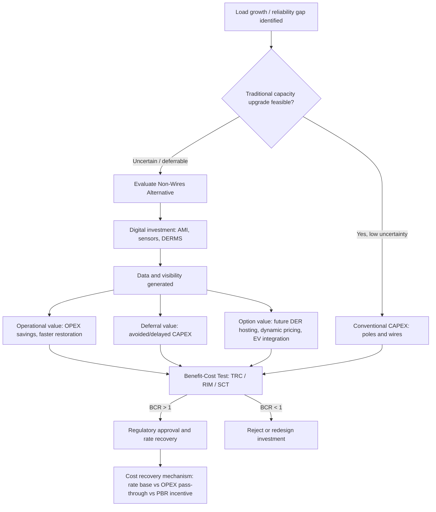

## Smart Grid Investment and Digitalization Economics

### Definition and Scope

Smart grid investment and digitalization economics is the branch of energy economics that studies the costs, benefits, financing structures, and regulatory treatment of upgrading electricity networks with digital sensing, communication, control, and automation technologies. It sits at the intersection of network economics (natural monopoly regulation), investment theory (capital budgeting under uncertainty), and information economics (value of data and observability).

A "smart grid" layers digital infrastructure onto the traditional electromechanical grid:

- **Advanced Metering Infrastructure (AMI)** — smart meters with two-way communication
- **Distribution Automation (DA)** — remote-controlled switches, reclosers, fault detection/isolation/restoration (FDIR)
- **Sensors and monitoring** — phasor measurement units (PMUs), line sensors, transformer monitors
- **Communication networks** — fiber, cellular (LTE/5G), RF mesh, power-line carrier
- **Grid management software** — Advanced Distribution Management Systems (ADMS), Distributed Energy Resource Management Systems (DERMS), Outage Management Systems (OMS)
- **Cybersecurity layers** protecting all of the above

Digitalization economics asks: what is the optimal investment level and pace, who pays, who benefits, and how should regulators evaluate these investments relative to conventional "poles and wires" capital?

---

### Why Digitalization Is an Economic Problem, Not Just an Engineering One

Traditional grid investment follows a straightforward engineering-economics logic: build capacity to meet forecast peak demand plus a reliability margin, using a well-understood cost-per-MW benchmark. Digitalization breaks this pattern in several ways:

1. **Benefits are diffuse and multi-dimensional.** A smart meter's value comes from time-of-use billing enablement, outage detection, reduced meter-reading labor, theft detection, and support for future DER integration — benefits that accrue to different parties (utility, ratepayers, third-party aggregators) over different time horizons.
2. **Option value dominates.** Much of digital infrastructure's value lies in enabling *future* flexibility (e.g., hosting more solar, enabling dynamic pricing, integrating EVs) rather than solving a *current* problem. This makes real options analysis more appropriate than simple discounted cash flow (DCF).
3. **Network effects and complementarities.** A DERMS is far more valuable if AMI and communication infrastructure already exist; investments are not independent, so sequencing matters economically.
4. **Rapid technology depreciation.** Unlike a transformer with a 40-year life, communication and software assets may be economically obsolete in 5–10 years, complicating traditional rate-base depreciation schedules.
5. **Data as a joint product.** Digitalization investments produce data as a byproduct with option value for future analytics, raising questions about who owns and monetizes it.

---

### The Economic Case for Smart Grid Investment

#### Sources of Value

**Key Points**

- **Operational efficiency (OPEX savings):** Remote meter reading eliminates manual reads; automated fault location reduces truck rolls and restoration time; predictive maintenance reduces unplanned outages.
- **Deferred/avoided capital expenditure:** Better visibility into loading allows utilities to defer traditional "poles and wires" upgrades by using non-wires alternatives (NWAs) — targeted demand response, storage, or DER dispatch instead of a substation upgrade.
- **Reliability improvements:** Automated fault isolation reduces the System Average Interruption Duration Index (SAIDI) and System Average Interruption Frequency Index (SAIFI), which have monetizable value via the Value of Lost Load (VoLL).
- **DER integration and hosting capacity:** Digitalization (especially DERMS) allows higher penetration of distributed solar, storage, and EVs on existing infrastructure without physical upgrades, by enabling dynamic hosting capacity and active network management.
- **Demand-side flexibility monetization:** Smart meters and communication enable time-varying rates, demand response programs, and eventually transactive energy markets.
- **Revenue protection:** Reduced non-technical losses (theft, meter tampering) directly improve utility cash flow.
- **Resilience:** Faster situational awareness and self-healing feeders reduce the economic cost of extreme weather events.

#### The Benefit-Cost Framework

Utilities and regulators typically evaluate smart grid investments using a benefit-cost ratio (BCR):

$$BCR = \frac{\sum_{t=0}^{T} \frac{B_t}{(1+r)^t}}{\sum_{t=0}^{T} \frac{C_t}{(1+r)^t}}$$

where $B_t$ are quantified benefits (OPEX savings, avoided capacity costs, reliability value, DER hosting value) in year $t$, $C_t$ are costs (capital, O&M, cybersecurity, decommissioning of legacy meters), and $r$ is the discount rate — typically the utility's weighted average cost of capital (WACC) or a regulator-approved social discount rate for public-interest tests.

A project with $BCR > 1$ is economically justified in principle, but regulators often require a **Total Resource Cost (TRC) test**, a **Ratepayer Impact Measure (RIM) test**, and a **Societal Cost Test (SCT)** in parallel, since a project can pass one test and fail another (e.g., AMI often has a positive TRC but a negative RIM if bill savings exceed avoided utility costs).

**[Inference]** In practice, many jurisdictions weight the TRC or a jurisdiction-specific hybrid test most heavily in approval decisions, though the exact test hierarchy is regulator- and state/country-specific and should be verified against the applicable regulatory code.

---

### Cost Structure of Smart Grid Investment

| Cost Category | Examples | Nature |
| --- | --- | --- |
| Capital (CAPEX) | Smart meters, sensors, ADMS/DERMS software licenses, communication network build-out | Front-loaded, rate-based (if regulator-approved) |
| Operating (OPEX) | Data management, software maintenance/subscription (SaaS), cybersecurity operations, staff retraining | Ongoing, often growing over time |
| Integration | IT/OT (information technology/operational technology) system integration, legacy system interfacing | One-time but often underestimated |
| Cybersecurity | Intrusion detection, patching, compliance audits (e.g., NERC CIP in North America) | Ongoing, growing with attack surface |
| Stranded costs | Early retirement of legacy analog meters or SCADA systems | One-time write-off |
| Data governance | Privacy compliance, data warehousing, analytics platforms | Growing OPEX category |

A distinguishing economic feature: digital assets shift utility cost structure from being CAPEX-heavy (favored under traditional cost-of-service, rate-of-return regulation, which rewards rate-basing capital) toward OPEX-heavy (software subscriptions, cloud services). This creates a regulatory friction known informally as the **"software valley of death"** — utilities under a rate-of-return model have a built-in incentive to prefer CAPEX solutions (which earn a return) over OPEX solutions (which are typically just passed through as an expense) even when the OPEX option is more efficient. **[Inference]** This asymmetry is widely discussed in regulatory economics literature as a structural bias, though its magnitude varies by jurisdiction and rate design.

---

### The Regulatory Economics of Cost Recovery

Because distribution utilities are regulated natural monopolies, smart grid investment economics cannot be separated from rate-making design.

#### Traditional Cost-of-Service Regulation (Rate-of-Return)

Under this model, the utility earns a return on its rate base:

$$\text{Revenue Requirement} = O\&M + D + T + (RB \times r)$$

where $O\&M$ is operating and maintenance expense, $D$ is depreciation, $T$ is taxes, $RB$ is the rate base (net capital investment), and $r$ is the allowed rate of return.

This structure historically produces the **Averch-Johnson effect**: because utilities earn a return only on capital, they are incentivized to over-capitalize (build hardware) even when a cheaper operating expenditure (e.g., a software or as-a-service solution) would deliver equivalent value at lower total cost. This is a central critique in digitalization economics — the regulatory model itself can misallocate the capital/software mix.

#### Performance-Based Regulation (PBR)

To correct CAPEX bias and better align incentives with outcomes, many regulators are shifting toward or supplementing cost-of-service with PBR mechanisms:

- **Revenue caps / price caps (RPI-X):** Revenue or price growth is capped, decoupling utility profit from the volume of capital deployed.
- **Multi-Year Rate Plans (MYRPs):** Rates are set for 3–5 years based on forecast productivity, giving utilities the flexibility (and incentive) to choose the least-cost mix of CAPEX and OPEX.
- **Performance Incentive Mechanisms (PIMs):** Financial rewards/penalties tied to specific metrics — SAIDI/SAIFI, DER interconnection speed, customer satisfaction, cybersecurity posture.
- **Totex (Total Expenditure) regulation:** Used prominently in the UK (Ofgem's RIIO framework — Revenue = Incentives + Innovation + Outputs), where CAPEX and OPEX are pooled into a single allowance, removing the structural bias toward capital.

**[Inference]** RIIO-style totex regulation is generally regarded in the regulatory economics literature as better suited to digitalization investment because it is technology-neutral between hardware and software solutions, though empirical evidence on outcomes is still developing and jurisdiction-specific.

---

### Investment Appraisal Methods

#### 1. Discounted Cash Flow (DCF) / Net Present Value (NPV)

Standard approach for well-understood, low-uncertainty investments (e.g., AMI rollout with known meter costs and known OPEX savings):

$$NPV = \sum_{t=0}^{T} \frac{B_t - C_t}{(1+r)^t}$$

#### 2. Real Options Analysis (ROA)

Because digital infrastructure creates future flexibility (e.g., a communication network installed for AMI can later support DERMS, EV smart charging, and dynamic pricing at low marginal cost), NPV alone systematically undervalues these investments — it ignores the value of the *option* to expand or pivot later.

The value of a phased investment can be modeled as a compound option:

$$V = NPV_{\text{base}} + \text{Option Value (expansion, deferral, abandonment)}$$

A simplified real-options framing uses a binomial or Black-Scholes-type structure where:

- **Underlying asset value** = present value of future cash flows from the flexibility enabled (e.g., avoided distribution upgrades from DER hosting capacity)
- **Strike price** = cost of exercising the option (e.g., cost to deploy DERMS given AMI/communication already exists)
- **Volatility** = uncertainty in DER adoption rates, technology costs, and policy support

**[Inference]** Real options valuation is increasingly recommended by academic and consulting literature for grid modernization business cases, but few utilities formally implement full options-pricing models in regulatory filings; most instead use qualitative "strategic value" adders or scenario-based sensitivity analysis as a practical proxy.

#### 3. Multi-Criteria Decision Analysis (MCDA)

Used when benefits are not easily monetized (e.g., resilience, equity, cybersecurity risk reduction). Weights are assigned to criteria (cost, reliability, environmental, equity, strategic optionality) and alternatives are scored — common in regulatory Integrated Distribution System Planning (IDSP) filings.

---

### Non-Wires Alternatives (NWAs) as a Digitalization Economics Case Study

NWAs are a canonical example of digitalization creating a genuine substitute for traditional capital investment.

**Traditional approach:** Forecasted load growth exceeds substation/feeder capacity → build new substation ($10–50M+ capital project, multi-year lead time).

**NWA approach:** Use digital visibility (AMI, sensors) plus targeted DER dispatch (demand response, batteries, efficiency) to keep peak load under the constraint, deferring or avoiding the capital project.

The economic comparison is a straightforward deferral-value calculation:

$$\text{Deferral Value} = C_{\text{upgrade}} \times \left[1 - \frac{1}{(1+r)^n}\right]$$

where $C_{\text{upgrade}}$ is the cost of the deferred capital project and $n$ is the number of years the upgrade is postponed. If the NWA's levelized annual cost is below this deferral value (plus any incremental reliability/service value), it is economically preferred.

**Example**

A utility forecasts a substation upgrade costing $20M is needed in 5 years due to load growth. Using AMI data to enable a targeted demand response program costing $800,000/year could defer this by 5 years.

- Deferral value at $r = 7\%$: $20{,}000{,}000 \times [1 - 1/(1.07)^5] = 20{,}000{,}000 \times 0.2874 \approx \$5.75M$
- NWA cost over 5 years (undiscounted for simplicity): $800{,}000 \times 5 = \$4M$
- Since deferral value ($5.75M) exceeds NWA cost ($4M), the NWA is economically justified — before even counting the option that load growth may not materialize, avoiding the capital cost entirely.

---

### Data as an Economic Asset

Digitalization generates granular data (interval meter reads, sensor telemetry, outage events) with several distinct economic properties:

- **Non-rivalrous:** The same data can be used simultaneously for billing, planning, and DER program design without depletion.
- **High fixed cost, near-zero marginal cost of reuse:** Once collected, additional analytical uses are cheap, implying strong returns to finding new applications.
- **Option value:** Data collected for one purpose (billing) often has unanticipated future value (grid planning, DER siting, resilience analytics) — an externality that pure cost allocation to the originating program tends to undervalue.
- **Privacy and access-cost tradeoffs:** Granular consumption data raises privacy costs; data-sharing rules (open data platforms, DER-friendly hosting capacity maps) affect third-party market entry (aggregators, VPP operators) and hence broader market efficiency.

**[Inference]** Some regulators are beginning to require open, standardized hosting-capacity and interconnection data as a competition-enabling policy, treating grid data access similarly to essential-facilities doctrine in other network industries, though this remains an evolving and jurisdiction-specific regulatory area.

---

### Diagram: Smart Grid Investment Decision and Value Flow

---

### Diagram: CAPEX vs OPEX Incentive Bias Under Rate-of-Return Regulation (svg_diagram)

<svg xmlns="http://www.w3.org/2000/svg" viewBox="0 0 700 380">
<text x="350" y="25" text-anchor="middle" font-size="16" font-weight="bold" fill="#1a1a1a">CAPEX vs OPEX Incentive Bias (svg_diagram)</text>
<line x1="80" y1="320" x2="80" y2="50" stroke="#333" stroke-width="2" />
<line x1="80" y1="320" x2="650" y2="320" stroke="#333" stroke-width="2" />
<text x="40" y="185" text-anchor="middle" font-size="12" fill="#333" transform="rotate(-90 40,185)">Utility Return Earned</text>
<text x="365" y="355" text-anchor="middle" font-size="12" fill="#333">Investment Type</text>
<rect x="150" y="90" width="90" height="230" fill="#4a7cb5" />
<text x="195" y="80" text-anchor="middle" font-size="12" fill="#1a1a1a">Hardware CAPEX</text>
<text x="195" y="340" text-anchor="middle" font-size="11" fill="#333">(sensors, meters)</text>
<rect x="330" y="270" width="90" height="50" fill="#c0504d" />
<text x="375" y="260" text-anchor="middle" font-size="12" fill="#1a1a1a">Software/SaaS OPEX</text>
<text x="375" y="340" text-anchor="middle" font-size="11" fill="#333">(analytics, DERMS license)</text>
<rect x="500" y="150" width="90" height="170" fill="#9bbb59" />
<text x="545" y="140" text-anchor="middle" font-size="12" fill="#1a1a1a">PBR/Totex Model</text>
<text x="545" y="340" text-anchor="middle" font-size="11" fill="#333">(neutral treatment)</text>

<text x="195" y="200" text-anchor="middle" font-size="11" fill="`#ffffff`">Earns rate</text>

<text x="195" y="215" text-anchor="middle" font-size="11" fill="`#ffffff`">of return</text>

<text x="375" y="290" text-anchor="middle" font-size="10" fill="`#ffffff`">Pass-through</text>

<text x="375" y="302" text-anchor="middle" font-size="10" fill="`#ffffff`">only</text>

<text x="545" y="225" text-anchor="middle" font-size="11" fill="`#1a1a1a`">Outcome-based</text>

<text x="545" y="240" text-anchor="middle" font-size="11" fill="`#1a1a1a`">incentive</text>

</svg>

---

### Risks and Challenges in Smart Grid Investment Economics

**Key Points**

- **Technology obsolescence risk:** Communication protocols and hardware standards (e.g., early RF mesh AMI networks) can become obsolete before the end of their depreciation schedule, creating stranded asset risk borne by ratepayers or shareholders depending on prudency review outcomes.
- **Cybersecurity as a growing cost center:** Every new digital endpoint (smart meter, sensor, control device) expands the attack surface. Cybersecurity spending is a rising share of digitalization OPEX and is increasingly subject to its own regulatory compliance regimes (e.g., NERC CIP in North America, NIS2 in the EU).
- **Interoperability and vendor lock-in:** Proprietary communication protocols or software platforms can create switching costs, reducing the utility's future bargaining power and potentially locking in higher long-run costs — an economic externality not always captured in initial BCR analysis.
- **Equity and the "digital divide":** Benefits of dynamic pricing and DER programs may accrue disproportionately to customers who can afford enabling technology (smart thermostats, storage, EVs), while AMI's fixed cost is recovered from all ratepayers — a distributional concern increasingly incorporated into RIM/equity tests.
- **Split incentives between transmission and distribution:** In vertically unbundled markets, distribution-level digitalization may create system-wide value (e.g., transmission congestion relief) not compensated within the distribution utility's revenue framework — a classic externality problem.
- **Uncertain benefit realization:** Many projected OPEX savings and DER-hosting benefits depend on customer adoption behavior, which is inherently uncertain and often overestimated in initial business cases. **[Inference]** Ex-post evaluations of AMI programs in various jurisdictions have found realized benefits sometimes fall short of initial forecasts, though results vary substantially by program design and region and should be checked against specific program evaluations.

---

### Comparative Regulatory Approaches (Illustrative)

| Region/Framework | Approach | Key Mechanism |
| --- | --- | --- |
| United Kingdom (Ofgem RIIO) | Totex-based price control | Pools CAPEX/OPEX; output and innovation incentives |
| United States (varies by state) | Mostly traditional cost-of-service, increasing PBR pilots | Rate base for CAPEX; some states (e.g., Hawaii, Illinois) use PIMs |
| European Union | National regulators under EU electricity market directives | Increasing emphasis on smart metering mandates and unbundled DSO data access |
| Australia (AER) | Building Block/Totex hybrid | Efficiency benefit-sharing schemes for OPEX innovation |

**[Unverified]** Specific mechanism names, thresholds, and current program status vary by jurisdiction and are subject to periodic regulatory reform; figures above should be verified against the current regulator's published framework before use in jurisdiction-specific analysis.

---

### Worked Example: AMI Business Case Summary

**Example**

A mid-sized distribution utility (500,000 customers) evaluates full AMI deployment.

- Capital cost: $150 per meter × 500,000 = $75M, amortized over 15 years
- Annual OPEX savings (avoided manual meter reading, faster outage detection): $8M/year
- Avoided non-technical losses (theft/tampering reduction): $2M/year
- Enabled demand response value (avoided peaker capacity): $3M/year, phased in over 5 years
- Discount rate: 7%

Simplified NPV over 15 years (steady-state benefits from year 6 onward, ramping years 1–5):

$$NPV \approx \sum_{t=1}^{15}\frac{B_t}{(1.07)^t} - 75{,}000{,}000$$

With $B_t$ growing from ~$8M in year 1 to $13M/year by year 6 onward, this yields a positive NPV in most standard business-case templates, and the project would typically pass a TRC test. However, a RIM test may be marginal or negative if bill savings to participating customers exceed the net system benefit, which is why AMI cost recovery in many jurisdictions is structured as a rate-based, all-customer charge rather than an opt-in program charge. **[Inference]** Actual RIM outcomes are highly case-specific and depend on rate design; this example illustrates the *type* of tension involved, not a generalizable numeric outcome.

---

### Key Formulas Summary

- Revenue requirement (cost-of-service): $RR = O\&M + D + T + (RB \times r)$
- Benefit-cost ratio: $BCR = \dfrac{PV(\text{Benefits})}{PV(\text{Costs})}$
- Deferral value: $\text{Deferral Value} = C_{\text{upgrade}} \times \left[1 - \dfrac{1}{(1+r)^n}\right]$
- Levelized cost comparison for NWA vs traditional upgrade: compare $\dfrac{\sum C_{NWA,t}/(1+r)^t}{\sum \text{MWh avoided}_t/(1+r)^t}$ against the utility's avoided capacity cost per MWh

---

### Related Topics

- Distributed Energy Resource Management Systems (DERMS) architecture and economics
- Value of Lost Load (VoLL) estimation methods
- Performance-Based Regulation (PBR) and Ofgem RIIO framework deep dive
- Non-Wires Alternatives (NWA) procurement and competitive solicitation design
- Time-of-use and dynamic/critical-peak pricing economics
- Hosting capacity analysis and dynamic operating envelopes for DER interconnection
- Cybersecurity investment economics in critical infrastructure (NERC CIP, NIS2)
- Real options valuation applied to infrastructure investment
- Transactive energy markets and peer-to-peer trading platforms
- Data governance, ownership, and monetization frameworks for utility data
- Averch-Johnson effect and regulatory capital bias literature
- Vehicle-to-grid (V2G) economics and smart EV charging infrastructure
- Microgrid investment economics and resilience valuation