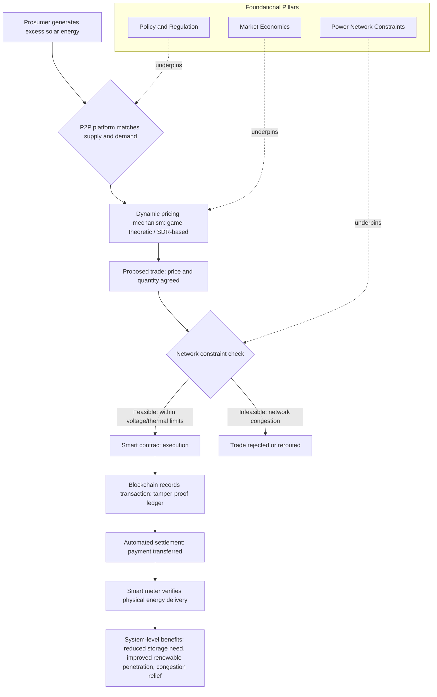

## Peer-to-Peer Energy Trading and Blockchain Applications

### Definition and Scope

Peer-to-peer (P2P) energy trading is a market structure in which prosumers (customers who both produce and consume energy, typically via rooftop solar) and consumers exchange locally-produced electricity directly with one another, rather than exclusively buying from and selling to a centralized retailer or utility. Blockchain technology has emerged as the leading enabling infrastructure for these markets because it can automate settlement, verify transactions, and establish trust among many small, mutually anonymous participants without requiring a single centralized trusted intermediary. The underlying economic driver is straightforward: the increasing amount of distributed power generation from rooftop solar panels allows new electricity markets to emerge in which prosumers and consumers can trade locally produced energy, creating a genuinely new transaction layer that did not exist when electricity flowed one-way from centralized generation to passive consumers.

### Economic Value Proposition

When optimally designed, P2P trading can provide win-win economic benefits to all related stakeholders — prosumers, consumers, retailers, and aggregators — with fair access to distributed energy resources. The specific system-level economic and technical benefits identified in the literature include: improved system efficiency, reduced energy storage capacity requirements (since local trading can substitute for storage as a way to balance local supply and demand), reduced primary energy consumption, improved renewable energy penetration, avoided energy quality devaluation, and mitigation of stressed grid power conditions together with voltage support and congestion management benefits for the local distribution network. [Inference] This bundling of benefits suggests P2P trading is valued not merely as a novel retail billing mechanism but as a genuine grid-services tool — the same trading activity that lets a prosumer monetize excess solar generation can simultaneously reduce local network stress, which is a rare case of a customer-facing market mechanism generating positive externalities for the broader distribution system rather than merely redistributing value among participants.

### Role of Blockchain: Why This Technology, Specifically

Blockchain's specific contribution to P2P energy trading centers on automation and trust rather than on the trading concept itself, which could in principle be implemented with a centralized database. Employing blockchain technology improves the automation level in P2P trading, thus decreasing the need for human intermediary interactions, improving security through transparent, tamper-proof, and secure systems, and accelerating real-time settlements through smart contracts. The core mechanism enabling this is smart-contract-based execution: the transaction information, payment process, and market platform of integrated energy trading are executed directly on the blockchain through smart contracts, thereby eliminating third parties from the settlement process entirely. This matters economically because it directly reduces transaction costs for very small-value trades (a prosumer selling a few kilowatt-hours of surplus solar to a neighbor) that would otherwise be uneconomic to clear through a conventional brokered market with per-transaction intermediary fees.

### The Blockchain Trilemma as an Economic Constraint

A significant technical limitation shaping P2P blockchain economics is the widely-recognized blockchain "trilemma": the difficulty of simultaneously achieving scalability, security, and decentralization in a single blockchain design, since improving one property typically requires trading off against one or both of the others. This constraint has direct practical bite in the energy-trading context: while the use of blockchain technology has increasingly emerged in energy markets and shows great potential to facilitate P2P energy trading, blockchain technology is still in its infancy, meaning it is not yet being used to its full potential — the trilemma is specifically cited as a central open challenge requiring dedicated scalability solutions. The stakes of this constraint are magnified by the transaction pattern P2P energy trading actually generates: energy markets under deregulation require massive volumes of very small (micro-level) transactions, and this transaction volume becomes a genuine performance bottleneck for existing general-purpose blockchain solutions such as Hyperledger and Ethereum, motivating research into lightweight, purpose-built blockchain frameworks specifically designed to support secured, high-throughput micro-transactions rather than adapting general-purpose blockchain infrastructure originally designed for lower-frequency, higher-value transactions.

### Market Structure: The Three Foundational Pillars Framework

A comprehensive literature review drawing on 168 reviewed documents — spanning academic research, pilot projects, and regulatory case studies — identifies three foundational pillars required for a P2P energy transaction to succeed in a smart grid context using blockchain: **market economics**, the **power network** (physical grid constraints), and **policy and regulation**. This same review found the existing research effort is heavily skewed toward one pillar: 60–65% of the reviewed literature focused on P2P business model design using market economics, while 35–38% focused on power systems for optimal network scheduling and capacity allocation, and only 1–2% delved into P2P trading policy and regulatory requirements. [Inference] This is a striking and economically consequential imbalance: because policy and regulatory clarity is the pillar with by far the least research attention, yet is also typically the binding constraint on whether a P2P market can legally operate at scale in a given jurisdiction, this gap suggests that real-world deployment barriers are currently under-studied relative to the theoretical market-design and grid-integration questions that dominate the academic literature — meaning practical implementation risk for a P2P platform may be considerably higher than the volume of favorable market-economics research alone would suggest.

This same review's key finding is that despite growing academic and industry interest, the real-world implementation of P2P trading remains limited due to a fragmented understanding across these three critical dimensions — reinforcing that the gap between theoretical promise and commercial deployment is attributable specifically to the underdeveloped synergy across market design, network constraints, and regulatory frameworks, not to any single dimension in isolation.

### Pricing Mechanisms

Because P2P markets must clear trades among many small, heterogeneous, and often intermittent participants (given that solar prosumer generation is inherently variable), dynamic and game-theoretic pricing approaches dominate the proposed mechanism design literature, in contrast to the simpler fixed feed-in-tariff-style pricing typical of conventional grid-connected solar compensation. One representative approach prices energy dynamically based on the real-time supply-to-demand ratio (SDR), simulating non-cooperative games among sellers and using a Stackelberg game structure to model negotiation between buyers and sellers — this pricing model conveys energy transfer signals to customers through price variation across different time points, incentivizing users to increase investment in renewable energy generation by increasing their potential trading profits, while aiming to ensure all participants achieve better economic outcomes than they would under a conventional retail-only structure. Other proposed market-clearing mechanisms in the literature include a generalized Nash equilibrium-based distributed market-clearing approach modeling prosumers as part of a generalized aggregative game, aiming to guarantee convergence toward a strategically stable and economically advantageous system outcome, as well as bilateral contract network mechanisms and network-loss-allocation methods that assign transaction fees based on the actual network losses a given P2P transaction imposes on the distribution grid — an important economic refinement, since a P2P trade between geographically distant participants imposes greater network losses (and therefore greater true system cost) than one between adjacent neighbors, even though both may appear identical from a pure energy-accounting perspective.

### Network Constraint Integration

A recurring theme in the more recent technical literature is that a purely economic (market-layer) view of P2P trading is insufficient on its own, because trades that are economically attractive to the parties involved may not be physically feasible given real distribution network constraints (voltage limits, thermal line ratings, congestion). The existing literature has predominantly focused on this business/market layer — specifically market design and loss allocation — while comparatively less attention has gone to jointly evaluating whether proposed P2P transactions are actually acceptable given the physical constraints inherent to the network, though this is recognized as a necessary complement rather than an optional add-on: a robust P2P framework must evaluate and accept or reject energy transactions based on network physical constraints, not merely based on whether a willing buyer and seller have agreed on price and quantity.

### Commercial Applications and Platform Examples

Beyond pure academic and pilot-scale research, blockchain applications in the energy sector extend to two related but distinct commercial models. **P2P trading platforms** — commercial examples cited in the literature include PowerLedger — allow consumers and producers to exchange surplus energy directly, bypassing traditional retail intermediaries, functioning as the commercial-scale realization of the academic P2P trading concept described above. A related but distinct application is **energy asset tokenization**, where blockchain enables fractional-ownership tokenization of renewable energy assets themselves (rather than tokenizing the energy trades), making generation asset ownership accessible to a broader range of investors — one cited example is a platform issuing "Solar NFTs" on a blockchain, each representing a fractional stake in a solar farm, a model that democratizes investment opportunity by allowing token holders to earn revenue from the underlying farm's electricity sales while simultaneously helping solar farm developers raise capital more efficiently than through conventional project financing alone. [Inference] This tokenization model is economically distinct from P2P energy trading proper: it monetizes fractional ownership of a generation asset rather than the marginal kilowatt-hour of energy itself, meaning it addresses a capital-formation problem (financing new renewable generation) rather than a real-time energy-balancing problem, even though both applications share the same underlying blockchain infrastructure and trust-automation rationale.

### Sector-Coupled and Multi-Service Business Models

More recent analysis extends beyond electricity-only P2P trading to sector-coupled energy communities that integrate trading, flexibility services, and cross-sector coordination across electricity, heating, and mobility. Drawing on six diverse pilot deployments, this research finds that blockchain-enabled remuneration and automated settlement can support not just direct P2P energy trading but also flexibility services and integration across multiple energy vectors, with blockchain and digitalization more broadly found to improve transparency and trust in community energy markets. However, the same analysis is explicit that these benefits are conditional rather than automatic: effective scaling requires regulatory adaptation, flexible business models, and sustained user engagement, echoing the earlier point that market-design innovation alone, without corresponding regulatory clarity and genuine ongoing participant engagement, is insufficient for real-world commercial success. The process of aligning business models with new digital capabilities is described as inherently iterative, shaped by local needs, technical constraints, and evolving regulatory frameworks — a framing that cautions against treating any single P2P/blockchain business model as a universally transferable template across jurisdictions.

### Worked Example: A Simplified P2P Trade

**Example**

A residential prosumer generates excess solar energy during midday that exceeds their own consumption. Under a conventional net-metering arrangement, this excess is exported to the grid and compensated at a utility-set export rate, which may be substantially below the retail rate the prosumer would otherwise pay to import energy.

- Under a P2P trading platform, the same excess energy could instead be offered directly to a nearby consumer at a price negotiated between the retail import rate (the consumer's alternative cost) and the utility export rate (the prosumer's alternative revenue) — a price range within which both parties are economically better off than their respective utility-mediated alternatives.
- A smart contract on the underlying blockchain can automatically execute this trade once matching supply and demand are identified, verify the physical delivery via smart meter data, and settle payment without requiring either party to trust the other directly or route the transaction through a human-intermediated billing process.
- A network-constraint check (per the pillar framework above) would need to confirm the local distribution segment connecting the two parties can physically accommodate the trade without violating voltage or thermal limits before the transaction is finalized — a step that pure market-layer designs can overlook if not explicitly engineered into the platform.

**Key Points**

- P2P energy trading's core economic proposition is capturing value currently lost in the gap between conventional retail import rates and utility export/feed-in rates, splitting that gap between trading counterparties.
- Blockchain's specific value-add is automated trust and settlement for very small, high-frequency transactions, not the trading concept itself — but current general-purpose blockchain infrastructure faces real scalability constraints against the transaction volumes P2P energy markets actually generate.
- Successful real-world deployment requires synergy across market economics, physical network constraints, and regulatory frameworks; research and platform design currently over-weight market economics relative to the policy/regulatory dimension, which appears to be an underappreciated practical bottleneck.
- Asset tokenization (fractional generation-asset ownership) and P2P energy trading (marginal kilowatt-hour exchange) are related but economically distinct blockchain applications solving different problems — capital formation versus real-time balancing.

### Illustrative Diagram: P2P Blockchain Trading Transaction Flow

### Practical Considerations

- **Distinguish pilot-scale research from commercial deployment maturity**: the bulk of available literature is academic modeling, simulation, or small-scale pilot analysis rather than evidence from mature, large-scale commercial markets; claims about P2P trading's economic benefits should be understood as largely theoretical or early-stage-empirical rather than proven at grid scale.
- **Regulatory feasibility should be verified independently, not assumed**: given that policy and regulation is both the least-studied of the three foundational pillars and frequently the binding real-world constraint, any specific jurisdiction's legal treatment of direct peer-to-peer electricity sales (which in many places may require a retail supply license or specific regulatory exemption) should be verified directly rather than inferred from the market-design literature.
- **Behavior may vary by blockchain architecture and platform**: performance, security, and cost characteristics differ substantially between blockchain platforms (e.g., Ethereum vs. Hyperledger Fabric vs. purpose-built lightweight frameworks) and between public/permissionless versus private/permissioned deployment models; conclusions about scalability or transaction cost from one platform architecture should not be assumed to transfer to another without verification.

### Related Topics

- Local flexibility markets and their relationship to P2P trading platforms
- Energy community and microgrid business model design
- Smart contract architecture for automated multi-party energy settlement
- Distribution network hosting capacity and its constraint on P2P transaction feasibility
- Renewable energy asset tokenization and fractional-ownership investment models
- Game-theoretic and auction-based pricing mechanisms for decentralized energy markets
- Grid defection and distributed generation economics as related prosumer decision contexts
- Behind-the-meter storage economics and its substitutability with P2P trading for local balancing