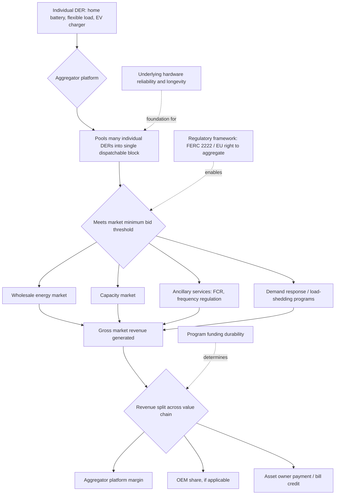

## Aggregators and Virtual Power Plant Business Models

### Definition and Scope

A **virtual power plant (VPP)** is the software-and-hardware system that coordinates a fleet of distributed energy resources (DERs) — residential batteries, solar PV, flexible commercial loads, EV chargers, and small-scale generation — so that, in aggregate, they behave as a single dispatchable resource capable of participating in wholesale and grid-service markets. An **energy aggregator** is the commercial business built around this coordination capability: a business that pools many small distributed energy resources into a single dispatchable block large enough to participate in wholesale and grid-service markets, then dispatches them, settles the resulting revenue, and splits it with the individual asset owners. This is a genuine and useful distinction, since the technical orchestration question (how pooled assets are coordinated) and the commercial question (how the business pooling them makes money and shares it) are related but analytically separable — a fleet can be technically well-orchestrated yet commercially unviable, or vice versa. VPPs are no longer experimental demand-response pilots but are increasingly treated as a baseline dispatchable capacity layer for modern grid operators, delivering wholesale market services at a reported capital efficiency of 2.9–4.3 times better than building new natural gas peaker plants for comparable dispatchable capacity.

### Core Aggregator Business Model Structure

The foundational commercial logic of aggregation rests on scale: individual distributed assets (a single home battery, one commercial building's flexible HVAC load) are typically too small, individually, to meet wholesale or ancillary-service market minimum-bid thresholds, so an aggregator's central function is assembling many such small assets into a combined block that can clear these thresholds and be dispatched as a coordinated unit. The aggregator business model traditionally splits revenue from successful capacity tenders and actual deliveries of grid services between the VPP operator and the individual asset owners whose devices are networked into the fleet. This revenue-splitting arrangement is the central commercial mechanism connecting the aggregator's market access to the asset owner's financial incentive to enroll and remain enrolled.

A key structural feature of the aggregator model, distinguishing it from a conventional generation-owning utility or independent power producer, is that aggregators do not need to invest in the physical buildup of flexible power generation capacity themselves — they instead monetize existing, distributed, customer-owned assets that were typically installed for other primary purposes (bill savings, backup power, EV charging) and repurpose their flexibility as a secondary revenue stream. [Inference] This asset-light structure is likely the single largest driver of the rapid growth in aggregator business models relative to conventional generation investment, since it substantially lowers the aggregator's own capital intensity and risk exposure compared to building or owning generation directly.

### Aggregator Types: Independent vs. Supplier-Affiliated

Aggregators split structurally into two broad categories. **Independent aggregators** operate without being tied to a specific retail electricity supplier, focusing purely on the market-access and dispatch-optimization function; cited examples include Next Kraftwerke and Voltalis in the European market. **Utility or supplier-aggregators** are affiliated with an existing electricity retailer or utility (cited examples include Engie and EDF), which can bundle aggregation services with the customer's existing retail electricity relationship. Regulatory frameworks have increasingly formalized market access for aggregators independent of retail supplier relationships: the EU's "right to aggregate" and the U.S. FERC Order 2222 are the two major regulatory developments cited as establishing independent aggregator market access, allowing distributed energy resources to participate directly in wholesale markets through aggregation regardless of which retail supplier a given customer uses — a significant regulatory unbundling that removes a potential structural barrier to independent aggregator business models.

### Revenue Channels and Illustrative Compensation Levels

Aggregator and VPP revenue derives from several distinct market channels, and reported compensation figures vary substantially by market, technology, and dispatch characteristics:

- **Frequency Containment Reserve (FCR) and balancing/ancillary services**: cited illustrative revenue figures for one major European independent aggregator range from €50–150/MWh depending on the specific market accessed (EPEX Spot, RTE adjustment, or FCR), reflecting the premium paid for fast-responding, short-duration reserve capability.
- **Load-shedding / demand response calls**: a cited example aggregating residential water heaters (using short, largely imperceptible 20–30 minute interruptions) reports load-shedding revenue in the range of €30–60 per MW per hour during actual dispatch calls.
- **Residential aggregation (batteries + solar)**: illustrative figures suggest relatively modest per-household annual revenue — roughly €50–100 per household per year — which nonetheless aggregates to meaningful scale across a large portfolio (cited as stacking to €10–20 million for a 100,000-home portfolio), and separately, figures citing €50–150 per kWh of storage capacity annually from grid services (varying by region and system operator participation) alongside larger primary customer-payment revenue of roughly €180–250 per month per residential system combining solar generation credit and storage benefit.
- **Commercial/industrial load shifting**: reported revenue for shifting flexible commercial and industrial loads (data centers, factories, warehouses shifting loads by 1–4 hours) is considerably higher per unit of capacity than residential aggregation — cited in the range of €200–500 per MW per year — reflecting the larger, more predictable, and more valuable flexibility that concentrated commercial loads can offer relative to dispersed residential assets.

[Inference] The wide variance in these figures — both across market types and across different sources reporting on similar market segments — indicates that VPP and aggregator revenue is highly dependent on local market design, which specific grid services a jurisdiction allows DERs to provide, and the technical characteristics (speed, duration, reliability) of the specific asset class being aggregated; single point-estimate figures should be treated as illustrative rather than broadly generalizable across markets.

### Market Scale and Growth Trajectory

Aggregate market-sizing estimates vary by methodology and scope but consistently indicate substantial growth. One market analysis estimates the virtual power plant market was valued at approximately $2.98 billion in 2025, projected to grow at a compound annual growth rate of 32.28% from 2026 to 2032, reaching nearly $21.18 billion by 2032, with the residential segment currently holding the largest revenue share, driven by widespread smart meter adoption, smart home appliances, and interoperability with home energy management systems. A separate, more platform-revenue-focused estimate for 2026 states that global aggregated VPP capacity crossed 55–70 GW with dispatchable volume of approximately 12 GW, generating approximately $3.5–5.5 billion in annual platform revenue (explicitly excluding asset-level energy sales, meaning this figure captures aggregation/orchestration platform revenue specifically, not total value flowing to underlying asset owners). A third estimate frames the combined market (energy trading plus grid services revenue) at €8–12 billion globally in 2026, projected to reach €30–50 billion by 2030. [Inference] These figures differ enough in scope and methodology (platform revenue vs. total market value vs. combined trading-plus-services revenue) that they should not be treated as directly comparable estimates of "the same number" — they likely reflect genuinely different measurement boundaries rather than simple forecasting disagreement, and any specific figure cited should be checked against its stated scope before use in analysis.

### Emerging Business Model Categories

Recent industry analysis of the U.S. market identifies an evolving, more differentiated set of VPP business models beyond the original single-device residential aggregation template, including **building- and portfolio-based aggregation**, which aggregates value across multifamily, commercial, and C&I property portfolios rather than relying only on individual, single-device customer participation, with building owners, operators, or specialized platforms coordinating assets and sharing value jointly across energy optimization, demand response, and other grid services. This model addresses a specific commercial friction identified in the multifamily context: for multifamily buildings, the central challenge is aligning owner economics with operational simplicity, since property owners want new revenue streams from demand flexibility and DERs, but fragmented utility programs, complex enrollment requirements, and limited resident engagement tools often make scaling participation across a portfolio difficult — the business models gaining traction in this segment are specifically those combining energy management, resident incentives, and automated demand response into a single platform that monetizes flexibility without adding meaningful operational burden to property management teams.

### Regulatory and Funding Uncertainty as a Structural Business Risk

A significant and current risk factor in VPP business model economics is program funding durability, illustrated concretely by California's experience. California, while boasting what advocates describe as the largest virtual power plant in the country (and possibly the world) and continuing to set new records for deployed capacity, has simultaneously cut state funding for aggregation, and as of the most recent reporting had not made a final long-term decision on the future of its demand-side grid-services program (DSGS) — the current path appears to function as a temporary bridge for summer 2026 while state leaders consider shifting participation into a different, CPUC-run demand response structure in later years. This keeps the program alive in the near term but stops short of giving developers, aggregators, and customers the durable, multi-year funding certainty needed to justify continued scaling investment; the broader implication drawn is that California recognizes the value of virtual power plants but has not yet resolved how they should be funded and institutionalized on a lasting basis. This funding uncertainty interacts directly with a separate margin-compression pressure: the economics of traditional demand response are getting squeezed, especially once revenue must be divided across multiple parties in the value chain — original equipment manufacturers (OEMs), aggregators, and end customers — meaning even in markets with durable programs, the number of parties splitting a given revenue pool is itself a first-order determinant of whether the economics work for any single participant.

Regulatory fragmentation across different VPP business models, technologies, use cases, and grid services is explicitly recognized as a barrier to sound state-level policymaking: the variety of VPP business models, technologies, use cases, and system services makes state regulators' decision-making increasingly difficult, which has motivated coordinated efforts such as the VPP Convergence Project working with the National Association of Regulatory Utility Commissioners specifically to bring clarity and standardization to these regulatory decisions across jurisdictions.

### Selection Criteria for Asset Owners

For individual asset owners and developers deciding which aggregator to enroll with, the recommended evaluation approach treats aggregator selection analogously to selecting a fund manager: on track record, on the clarity of the net deal actually offered (after revenue splits and any fees), and on the quality of the underlying trading and dispatch operation — rather than choosing based on the headline revenue-split percentage advertised or the polish of a consumer-facing application, since a favorable-looking headline split from an aggregator with poor dispatch execution or unreliable market access can yield worse net realized revenue than a less flashy but operationally excellent competitor.

A related, foundational point emphasized in this literature is that aggregation economics ultimately begin with the underlying hardware asset itself: reliable, fast, long-life batteries that qualify cleanly for ancillary services and run cheaply for fifteen years are described as the foundation everything else in the aggregation business is built on — the framing offered is that getting the hardware right gives the aggregation business a genuine chance at success, while getting the hardware wrong means no amount of trading or dispatch cleverness can rescue the underlying economics. [Inference] This suggests hardware quality and aggregator software/trading sophistication are not substitutes for one another in this business model — both are necessary, and a sophisticated trading platform cannot compensate for an unreliable or short-lived underlying asset fleet.

### Worked Example: Simplified Revenue Split

**Example**

Consider a residential battery owner enrolled with an aggregator, where the aggregator's platform dispatches the battery into a regional ancillary services market.

- The aggregator pools this battery together with thousands of similar residential batteries to meet the minimum bid-size threshold for the ancillary services market — a threshold the individual battery could never meet alone.
- When the pooled fleet is dispatched and earns, say, a hypothetical $100/kW-year in that market, the aggregator's platform and trading operation retain a portion of this revenue as their commercial margin (covering software, market access, dispatch operations, and profit), while the remainder flows back to the individual asset owner as a bill credit or direct payment.
- The asset owner's actual realized value depends not only on the headline gross market revenue but critically on: (a) the specific revenue-split percentage the aggregator contract specifies, (b) how many total parties in the value chain (aggregator, OEM, potentially a separate software provider) are drawing a share before the residual reaches the customer, and (c) the aggregator's actual dispatch reliability and market-access quality, since a technically inferior trading operation may fail to capture the full available market revenue in the first place, shrinking the total pool available to be split regardless of the nominal split percentage.

**Key Points**

- The aggregator's core economic function is pooling small, individually sub-scale distributed assets into a block large enough to access wholesale and ancillary-service markets, monetizing existing customer-owned hardware without the aggregator itself investing in generation capacity.
- Revenue figures across residential, commercial, and industrial aggregation vary enormously by market, asset class, and specific grid service, and reported figures should be treated as illustrative examples rather than universal benchmarks.
- Regulatory and program-funding durability is a material, currently unresolved business risk even in the most mature VPP markets (illustrated by California's funding uncertainty), and margin compression from multi-party revenue splitting is squeezing traditional demand-response-based aggregation economics.
- Underlying hardware reliability and longevity is described as the necessary foundation for aggregation economics; sophisticated trading and dispatch software cannot substitute for a well-functioning physical asset fleet.
- Asset owners should evaluate aggregators on net realized value and dispatch quality, not headline revenue-split percentages alone.

### Illustrative Diagram: Aggregator and VPP Value Chain

### Practical Considerations

- **Verify revenue figures against current, jurisdiction-specific data**: because reported compensation levels vary substantially by market design, asset class, and reporting methodology, and because this is a rapidly evolving commercial space, specific $/kW-year or €/MWh figures cited in any given source should be re-verified against current market data before use in financial modeling.
- **Assess program funding durability, not just current program existence**: as California's DSGS experience illustrates, a currently-active and even record-setting program can still carry meaningful funding uncertainty; asset owners and developers should distinguish between an aggregation opportunity that exists today and one with durable, multi-year policy support.
- **Behavior may vary by regulatory jurisdiction**: FERC Order 2222 implementation timelines and specifics differ by U.S. regional transmission organization, and EU right-to-aggregate implementation differs by member state; aggregator market access and revenue-stacking permissions should be confirmed for the specific jurisdiction in question rather than assumed from general regulatory principles.

### Related Topics

- FERC Order 2222 implementation and its effect on DER wholesale market access
- Demand response program design and valuation as a component of aggregator revenue
- Behind-the-meter storage economics as the underlying asset class most commonly aggregated
- Peaker plant displacement economics and VPP capital efficiency comparisons
- Multifamily and portfolio-based DER aggregation platform design
- Peer-to-peer energy trading as an alternative or complementary DER monetization model
- Grid defection and distributed generation economics as related customer-side decision contexts
- Frequency Containment Reserve (FCR) and ancillary services market structure