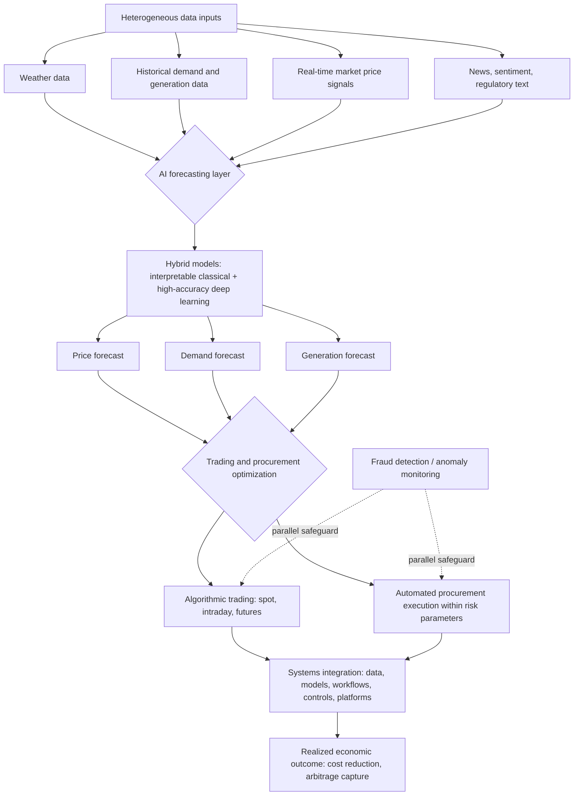

## Data Analytics and AI Applications in Energy Markets

### Definition and Scope

Data analytics and AI applications in energy markets encompass the use of machine learning, statistical modeling, and algorithmic decision systems to forecast prices and demand, optimize trading and procurement decisions, detect anomalies and fraud, and manage risk across increasingly complex, data-rich energy systems. The underlying economic rationale is that the energy sector has structural characteristics making it particularly well-suited to AI application: it generates enormous volumes of operational data, it operates critical infrastructure where failures are extremely costly, and its economics are fundamentally tied to optimizing the balance between supply and demand at every moment — a balance that becomes progressively harder to manage manually as the global energy sector undergoes a profound and multidimensional transformation driven by decarbonization policies, increasing electrification, large-scale integration of renewable energy sources, and growing digitalization of energy infrastructure, all of which have significantly increased system complexity and forced operation under high uncertainty, strong temporal variability, and tight economic, environmental, and reliability constraints simultaneously.

### Core Application Category: Forecasting

Forecasting is the most mature and widely deployed AI application category in energy markets, spanning price forecasting, demand forecasting, and generation forecasting (particularly for variable renewable sources). AI-driven models leverage large volumes of heterogeneous data — from sensors, supervisory control systems, weather services, and energy markets themselves — to offer forecasting, optimization, control, and decision-support capability that would be infeasible using purely manual or classical statistical approaches given the scale and dimensionality of the underlying data. In the specific application of energy trading, short-term price forecasting models that integrate weather, demand, generation, and market data simultaneously achieve forecast accuracies that allow more effective bidding strategies and hedging positions than would be possible using any single data source in isolation.

Within the technical forecasting literature, hybrid modeling approaches that combine classical and modern machine learning techniques are an active area of methodological development. One representative approach combines Principal Component Analysis (PCA) with Long Short-Term Memory (LSTM) neural networks for dynamic energy price correlation forecasting, exploiting complementary strengths of each technique: PCA provides transparent, interpretable insight into the underlying correlation structure driving energy price relationships at low computational cost, while LSTM achieves materially higher predictive accuracy — reported as 8.7% lower mean squared error and 11.4% lower mean absolute error relative to the PCA-only approach — by capturing nonlinear temporal dependencies that a purely linear, interpretability-focused method cannot represent. [Inference] This PCA-plus-LSTM pairing illustrates a broader pattern in applied energy-market AI: rather than choosing a single "best" model, practitioners increasingly favor hybrid architectures that trade off interpretability against raw predictive accuracy deliberately, since regulatory and risk-management contexts in energy trading often require some degree of model explainability that a pure deep-learning "black box" approach cannot easily provide.

### Core Application Category: Trading and Procurement Optimization

AI systems for energy trading and market operations provide significant documented advantages in execution speed and scale that exceed human trading capability. Algorithmic trading systems can execute thousands of small transactions in real time across electricity markets, capturing arbitrage opportunities and optimizing portfolio positions across spot, intraday, and futures markets at speeds no human trader can match — a capability directly relevant to markets like the demand response and behind-the-meter storage arbitrage contexts discussed elsewhere in this material, where price spreads can be narrow and fleeting. For large industrial energy consumers specifically, AI procurement systems continuously monitor energy prices and automatically execute purchasing decisions within predefined risk and cost parameters, minimizing cost over rolling time horizons without requiring constant manual monitoring.

The reported economic impact of this capability is material: energy companies with sophisticated AI trading capabilities report improvements in energy procurement cost of 5–12% compared to manual trading approaches. Beyond procurement specifically, broader estimates for AI's economic impact across energy operations suggest energy management AI reduces costs by 12–20%, and predictive maintenance applications (using AI to anticipate equipment failure before it occurs) typically pay back their implementation cost within 12–18 months. [Inference] These figures, drawn from industry-practitioner rather than peer-reviewed academic sources, likely represent achievable outcomes under favorable implementation conditions (sufficient data quality, organizational buy-in, appropriate use-case selection) rather than guaranteed or average results across all deployments — actual realized savings for any specific organization would depend heavily on baseline process maturity and data infrastructure quality prior to AI adoption.

Importantly, sophisticated industry analysis explicitly cautions against a one-size-fits-all deployment approach: a single AI solution will not transform energy trading uniformly, because AI creates value differently across power, pipeline gas, LNG, liquids, and financial markets, reflecting each commodity's distinct tempo, constraints, data characteristics, and operational workflows. This leads to a further important distinction in where different AI techniques add the most value: predictive models and optimization techniques matter most in quantitative markets (where data is abundant, well-structured, and price formation is relatively transparent), while AI agents — systems capable of more autonomous, multi-step decision-making — play a comparatively larger role in physical, logistics-heavy environments (such as pipeline gas or LNG shipping, where operational and logistical complexity, rather than pure price prediction, is the binding constraint). Realizing competitive advantage from any of these capabilities depends on connecting data, models, workflows, controls, and existing trading platforms so that AI-generated insights move reliably into actual trading and operational action — a systems-integration challenge that is often understated relative to the model-development challenge itself, since a highly accurate forecasting model delivers no economic value if its output cannot be operationally acted upon in time.

### Core Application Category: Fraud Detection and Market Security

A distinct but related application category applies AI specifically to securing energy market transactions and detecting anomalous or fraudulent activity, an application that has grown in relevance alongside the expansion of digitally-mediated and blockchain-based energy transactions (including the peer-to-peer trading platforms discussed elsewhere in this material). This application draws directly on techniques developed in adjacent financial-fraud-detection domains — machine learning-based financial fraud detection methodologies, originally developed for building robust predictive models of general transactional security, are being adapted specifically to secure energy transactions and support broader energy market stability. [Inference] The cross-domain borrowing of fraud-detection techniques from mainstream financial services into energy markets suggests that as energy trading becomes more digitally mediated and decentralized (through blockchain-based platforms, automated trading systems, and distributed transaction networks), it increasingly faces the same integrity and security challenges that conventional financial markets have already had to address, making this a natural and somewhat lower-risk area for technology transfer between domains.

### Broader Financial and Economic Context

The application of AI and machine learning to energy market forecasting and trading sits within a broader trend of AI and ML adoption across finance and economics more generally, where an enormous increase in data production has opened substantial potential for financial analysis, allowing complex patterns in large data volumes to be processed and interpreted by advanced ML algorithms in ways that reveal market sentiment, economic indicator relationships, and systemic risk signals that traditional analytical methods could not readily surface. A specific and growing sub-application relevant to energy markets is natural language processing (NLP) applied to financial and news text, sentiment data, and regulatory reports, which is transforming how market participants understand and anticipate market-moving narratives; illustratively, research on business news sentiment specifically in the energy stock market context has found that sentiment analysis is an efficient method for making short-term stock market predictions, extending the general finance-sector NLP trend into an energy-specific application. [Inference] This suggests that price-relevant information in energy markets increasingly flows not just through traditional quantitative channels (supply, demand, weather data) but also through textual and sentiment channels (news, regulatory announcements, social commentary), and sophisticated market participants are increasingly incorporating both information types into a combined forecasting and trading framework rather than relying on quantitative data alone.

### Worked Example: Illustrating the Forecasting-to-Trading Value Chain

**Example**

Consider a large industrial energy consumer implementing an AI-driven procurement system.

- The system ingests weather forecasts, historical demand patterns, generation forecasts (particularly relevant where renewable generation is a significant grid component), and real-time market price signals as combined inputs to a short-term price forecasting model.
- Based on the resulting price forecast and the consumer's own load forecast, the AI procurement system automatically executes purchasing decisions across spot and intraday markets within pre-defined risk parameters (e.g., maximum exposure to any single price scenario, or a required minimum hedge ratio), rather than requiring a human trader to manually monitor prices and execute trades continuously.
- If this system achieves the reported 5–12% improvement in procurement cost relative to manual trading approaches, the economic value captured scales directly with the consumer's total energy spend — meaning the absolute dollar value of AI-driven procurement optimization is largest for the most energy-intensive industrial consumers, which is consistent with why large industrial energy consumers and utilities are the most frequently cited beneficiaries of this specific application in the available literature, since [Inference] a percentage-based cost improvement naturally generates the greatest absolute payback for entities with the largest baseline spend, making implementation economics most favorable for these consumer classes specifically.

**Key Points**

- Forecasting (price, demand, and generation) is the most mature AI application category in energy markets, with hybrid modeling approaches (combining interpretable classical techniques with higher-accuracy deep learning methods) representing current best practice where both explainability and accuracy are required.
- No single AI solution transforms energy trading uniformly across all energy commodities; value creation, and the relative importance of predictive models versus more autonomous AI agents, differs by commodity type and market structure.
- Reported cost-improvement figures (5–12% procurement cost improvement, 12–20% broader energy management cost reduction, 12–18 month predictive-maintenance payback) originate primarily from industry-practitioner sources rather than peer-reviewed studies and should be treated as illustrative of achievable outcomes under favorable conditions rather than guaranteed or universally applicable results.
- Realizing value from AI forecasting and trading models depends critically on systems integration — connecting model output reliably into actual trading, procurement, or operational action — which is a distinct and often underestimated challenge relative to model development itself.
- Fraud detection and market security applications are increasingly borrowing techniques from mainstream financial fraud detection as energy trading becomes more digitally mediated and decentralized.

### Illustrative Diagram: AI-Driven Energy Market Decision Pipeline

### Practical Considerations

- **Distinguish academic benchmark improvements from operational business outcomes**: model-level accuracy improvements reported in academic literature (e.g., percentage reductions in forecasting error metrics) do not automatically translate one-to-one into the business-level cost or revenue improvements reported in industry sources; the two categories of figures should not be conflated when evaluating a specific AI investment.
- **Evaluate model choice against explainability requirements, not accuracy alone**: in regulated trading and risk-management contexts, a marginally less accurate but more interpretable model may be preferable to a higher-accuracy black-box model, depending on the specific regulatory and internal governance requirements the application must satisfy.
- **Behavior may vary by commodity market and organizational context**: reported cost-improvement figures and optimal AI technique selection differ substantially across power, gas, LNG, and other energy commodity markets, and across organizations with different baseline data infrastructure maturity; specific figures cited here should be treated as illustrative examples rather than universally applicable benchmarks, and should be re-verified against current, source-specific reporting before use in investment decisions.

### Related Topics

- Demand response program design and valuation as a data-intensive dispatch optimization problem
- Aggregator and virtual power plant business models as consumers of AI-driven dispatch optimization
- Smart grid investment and digitalization economics as the data-infrastructure foundation for AI applications
- Peer-to-peer energy trading and blockchain applications as a related digitally-mediated market structure
- Renewable generation forecasting methodologies and their role in grid balancing
- Natural language processing applications in financial and regulatory text analysis
- Responsible AI frameworks (explainability, robustness, accountability) applied to energy market models
- Algorithmic trading risk management and market microstructure in electricity markets