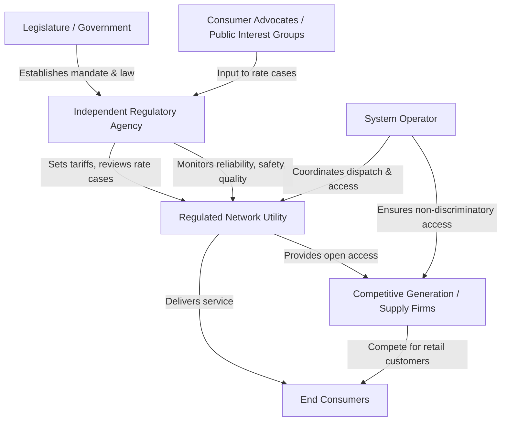

## Rationale for Regulating Natural Monopolies in Energy

### Definition and Core Concept

A natural monopoly exists when a single firm can supply an entire market at lower cost than any combination of two or more firms could. This condition arises from the underlying cost structure of the industry rather than from anticompetitive behavior or legal barriers to entry.

The formal condition for a natural monopoly is subadditivity of the cost function. For a single-product firm, cost function $C(Q)$ is subadditive at output $Q$ if:

$$C(Q) < \sum_{i=1}^{n} C(q_i) \quad \text{for any } \sum_{i=1}^{n} q_i = Q, \; n \geq 2$$

This means splitting total output $Q$ among multiple firms always costs more in aggregate than having one firm produce it all.

### Economic Sources of Natural Monopoly in Energy

**Economies of Scale**

Energy transmission and distribution networks exhibit declining average total cost (ATC) over a large range of output because fixed costs (poles, wires, pipelines, substations, transformers) are enormous relative to the marginal cost of serving one additional unit of throughput.

$$ATC(Q) = \frac{FC}{Q} + AVC(Q)$$

As $Q$ increases, $\frac{FC}{Q}$ falls, pulling ATC down even if average variable cost (AVC) is roughly constant. In electricity and gas networks, this effect persists across a very large output range because fixed infrastructure costs dwarf variable operating costs.

**Economies of Scope**

A single integrated network (e.g., one set of distribution wires) can serve many customer classes and end-uses more cheaply than parallel duplicate networks. Joint costs of the shared asset (rights-of-way, poles, trenches) are lower than the sum of costs from building separate parallel systems.

**High Sunk and Fixed Costs Relative to Variable Costs**

Transmission lines, gas pipelines, substations, and local distribution grids require enormous upfront capital investment that cannot be redeployed to other uses once installed. This creates a cost structure where:

- Marginal cost of transmitting/distributing one more unit is low
- Average cost is high at low volumes and falls sharply with volume
- Duplication of the physical network is economically wasteful

**Network Effects and Physical Indivisibility**

Grids and pipeline systems function as integrated physical networks. Splitting a service territory between competing wired networks (e.g., two competing distribution grids serving the same street) means each firm operates at a fraction of efficient scale, and the fixed cost burden of trenching, right-of-way acquisition, and equipment is duplicated rather than shared.

### Where Natural Monopoly Applies in the Energy Sector

Natural monopoly characteristics differ across segments of the energy value chain. This distinction underlies the standard "unbundling" logic in energy sector restructuring.

| Segment | Natural Monopoly? | Rationale |
| --- | --- | --- |
| Generation | No | Multiple plants can compete; scale economies exhaust at moderate plant sizes relative to market size |
| Transmission (high-voltage) | Yes | Duplicating high-voltage lines is economically wasteful; strong scale economies |
| Distribution (local wires/pipes) | Yes | Local wires/pipes to homes and businesses exhibit the strongest natural monopoly characteristics |
| Retail supply | No (in restructured markets) | Billing, customer acquisition, and marketing do not require a single dominant firm |
| System operation/dispatch | Yes (functionally) | A single coordinating entity is needed for grid balancing and reliability |

This is why most restructured electricity and gas markets vertically "unbundle" the network (regulated monopoly) from generation and retail (competitive segments).

### Market Failure Without Regulation

**Unregulated Monopoly Pricing**

Absent regulation, a profit-maximizing natural monopolist sets output where marginal revenue equals marginal cost ($MR = MC$), producing quantity $Q_m$ and charging price $P_m$ above the competitive/efficient price. This generates:

- **Allocative inefficiency**: Price exceeds marginal cost ($P > MC$), so output is below the socially optimal level
- **Deadweight loss**: The triangle of lost consumer and producer surplus from underproduction relative to the efficient quantity $Q^*$ where $P = MC$
- **Wealth transfer**: Monopoly rents transferred from consumers to the monopolist via prices above cost

**Diagram: Natural Monopoly Pricing Outcomes (svg_diagram)**

<svg viewBox="0 0 640 460" xmlns="http://www.w3.org/2000/svg" font-family="Helvetica, Arial, sans-serif">
<text x="320" y="24" text-anchor="middle" font-size="16" font-weight="bold" fill="#1a1a1a">Natural Monopoly Pricing Outcomes (svg_diagram)</text>
<!-- Axes -->
<line x1="80" y1="400" x2="600" y2="400" stroke="#333" stroke-width="2"/>
<line x1="80" y1="400" x2="80" y2="50" stroke="#333" stroke-width="2"/>
<text x="610" y="405" font-size="13" fill="#333">Q (Output)</text>
<text x="55" y="55" font-size="13" fill="#333">P ($)</text>
<!-- Demand curve (downward sloping) -->
<line x1="120" y1="80" x2="560" y2="380" stroke="#2563eb" stroke-width="2.5"/>
<text x="565" y="378" font-size="12" fill="#2563eb">D (Demand)</text>
<!-- MR curve (steeper downward) -->
<line x1="120" y1="80" x2="360" y2="380" stroke="#dc2626" stroke-width="2.5"/>
<text x="365" y="382" font-size="12" fill="#dc2626">MR</text>
<!-- ATC curve (declining, gently curved) -->
<path d="M 120 340 Q 300 200 560 175" stroke="#16a34a" stroke-width="2.5" fill="none"/>
<text x="565" y="172" font-size="12" fill="#16a34a">ATC</text>
<!-- MC curve (below and roughly parallel to ATC, declining) -->
<path d="M 120 300 Q 300 175 560 155" stroke="#ea580c" stroke-width="2.5" fill="none" stroke-dasharray="6,3"/>
<text x="565" y="152" font-size="12" fill="#ea580c">MC</text>
<!-- Vertical reference lines -->
<!-- Qm: unregulated monopoly quantity (MR=MC intersection, approx x=290) -->
<line x1="290" y1="400" x2="290" y2="205" stroke="#666" stroke-width="1" stroke-dasharray="3,3"/>
<text x="278" y="415" font-size="12" fill="#333">Qm</text>
<!-- Pm: monopoly price on demand curve at Qm -->
<line x1="80" y1="230" x2="290" y2="230" stroke="#666" stroke-width="1" stroke-dasharray="3,3"/>
<text x="55" y="234" font-size="12" fill="#333">Pm</text>
<!-- Qs: socially optimal (P=MC intersection with demand, approx x=430) -->
<line x1="430" y1="400" x2="430" y2="330" stroke="#666" stroke-width="1" stroke-dasharray="3,3"/>
<text x="420" y="415" font-size="12" fill="#333">Q*</text>
<!-- Ps: efficient price = MC at Q* -->
<line x1="80" y1="330" x2="430" y2="330" stroke="#666" stroke-width="1" stroke-dasharray="3,3"/>
<text x="55" y="334" font-size="12" fill="#333">P=MC</text>
<!-- Qr: fair-return regulated (P=ATC intersection, approx x=360) -->
<line x1="360" y1="400" x2="360" y2="272" stroke="#666" stroke-width="1" stroke-dasharray="3,3"/>
<text x="350" y="415" font-size="12" fill="#333">Qr</text>
<line x1="80" y1="272" x2="360" y2="272" stroke="#666" stroke-width="1" stroke-dasharray="3,3"/>
<text x="45" y="276" font-size="12" fill="#333">P=ATC</text>
<!-- Points -->
<circle cx="290" cy="230" r="4" fill="#dc2626"/>
<circle cx="430" cy="330" r="4" fill="#2563eb"/>
<circle cx="360" cy="272" r="4" fill="#16a34a"/>

<text x="270" y="60" font-size="11" fill="#555">Unregulated: P=Pm (highest), Q=Qm (lowest) → deadweight loss</text>

<text x="270" y="435" font-size="11" fill="#555">Efficient (P=MC): Q* highest, but Ps < ATC → firm makes losses</text>

</svg>

The diagram illustrates the classic dilemma: setting price at marginal cost ($P = MC$, socially optimal, quantity $Q^*$) causes the firm to lose money because ATC exceeds MC at that output (since ATC is still declining). Setting price at average total cost ($P = ATC$, "fair-return" regulation, quantity $Q_r$) allows the firm to break even but sacrifices some allocative efficiency relative to marginal-cost pricing.

**The Marginal-Cost Pricing Problem**

Because average total cost is declining throughout the relevant range (a defining feature of natural monopoly), marginal cost lies below average total cost:

$$MC(Q) < ATC(Q) \quad \text{whenever } ATC(Q) \text{ is declining}$$

If a regulator forces $P = MC$ for allocative efficiency, the firm's revenue fails to cover total cost, requiring a subsidy or alternative financing mechanism. This is the foundational tension that shapes most utility rate-making frameworks (see **Two-Part Tariffs and Ramsey Pricing** below).

### Core Rationale for Regulation

**1. Preventing Monopoly Pricing / Protecting Consumer Welfare**

Since duplicating the network is inefficient (ruling out competition as a disciplining force), some other mechanism must prevent the sole supplier from exploiting captive customers. Regulation substitutes for the competitive constraint that would otherwise discipline price and quality.

**2. Achieving Allocative Efficiency**

Regulation aims to push price closer to marginal cost than an unconstrained monopolist would choose, reducing deadweight loss while balancing the firm's need to recover costs.

**3. Ensuring Cost Recovery and Financial Viability (Fair Rate of Return)**

Regulators must allow the utility to recover prudently incurred costs plus a reasonable return on invested capital, or the firm cannot attract capital for essential infrastructure investment. This is the basis of **rate-of-return regulation**:

$$\text{Revenue Requirement} = O\&M + D + T + (RB \times r)$$

Where:

- $O\&M$ = operating and maintenance expenses
- $D$ = depreciation
- $T$ = taxes
- $RB$ = rate base (net invested capital)
- $r$ = allowed rate of return

**4. Preventing Underinvestment and Ensuring Reliability/Universal Service**

Energy networks are essential infrastructure with strong public-interest characteristics (reliability, safety, universal access). An unregulated monopolist facing no competitive threat has weak incentives to invest in reliability, maintenance, or service quality beyond the minimum needed to avoid customer defection—which is limited in a true monopoly. Regulation imposes service quality standards, reliability metrics (e.g., SAIDI/SAIFI in electricity), and investment obligations.

**5. Addressing Information Asymmetry**

The regulated firm knows its true costs, demand elasticities, and investment needs far better than the regulator (a classic **principal-agent problem**). Regulatory institutions (cost audits, rate cases, benchmarking, incentive regulation) exist partly to mitigate this asymmetry and limit **regulatory capture** and cost padding (the **Averch-Johnson effect**, where rate-of-return regulation can induce overinvestment in capital relative to the cost-minimizing input mix).

**6. Correcting for Absence of Contestability**

Even where entry is not legally barred, high sunk costs mean the market is not "contestable" in the Baumol sense—a potential entrant cannot enter, undercut, and exit costlessly if the incumbent responds with lower prices. This removes the threat of entry as a competitive discipline, reinforcing the need for regulatory oversight rather than reliance on potential competition.

### Historical and Institutional Context

**Rate-of-Return Regulation (Traditional Model)**

Historically dominant in the U.S. (state Public Utility Commissions) and many jurisdictions worldwide. Regulators set prices to allow recovery of prudent costs plus a fair return on rate base. Criticized for weak cost-control incentives and the Averch-Johnson capital bias.

**Price-Cap / Incentive Regulation (RPI-X)**

Developed prominently in the UK (Littlechild, 1983) for privatized utilities. Prices are capped to rise with inflation (RPI) minus an efficiency factor ($X$):

$$P_t = P_{t-1} \times (1 + RPI - X)$$

This shifts risk to the firm and creates stronger incentives for cost reduction, since the firm retains efficiency gains between price reviews.

**Revenue Cap Regulation**

Common in transmission and distribution regulation today (e.g., many U.S. states, UK's RIIO framework, Australia's AER). Caps total allowed revenue rather than per-unit price, decoupling utility profitability from sales volume—important for accommodating energy efficiency and distributed energy resource growth without penalizing the utility financially.

**Structural Separation / Unbundling**

Rather than regulating an integrated monopolist across the whole value chain, many jurisdictions (EU Third Energy Package, U.S. FERC Order 888/889, and others) require legal or functional unbundling: competitive segments (generation, retail) are deregulated while the natural monopoly network segment (transmission, distribution) remains regulated, often with open, non-discriminatory third-party access.

### Two-Part Tariffs and Ramsey Pricing (Addressing the Cost-Recovery Problem)

**Two-Part Tariffs**

A common practical solution to the $MC < ATC$ problem: charge a fixed fee (recovering fixed costs) plus a per-unit usage charge close to marginal cost.

$$\text{Total Bill} = F + p \times Q$$

Where $F$ is a fixed connection/demand charge and $p \approx MC$. This allows usage-based pricing to remain efficient at the margin while the fixed charge recovers the network's sunk costs—common in electricity and gas distribution tariff design.

**Ramsey Pricing**

When multiple customer classes exist with different price elasticities, Ramsey pricing sets markups over marginal cost inversely proportional to elasticity of demand, minimizing the efficiency loss from cost-recovery constraints:

$$\frac{P_i - MC_i}{P_i} = \frac{-\lambda}{\varepsilon_i}$$

Where $\varepsilon_i$ is the price elasticity of demand for class $i$, and $\lambda$ is a constant reflecting the revenue shortfall to be recovered. Classes with more inelastic demand (e.g., residential baseload) bear proportionally higher markups than classes with elastic demand (e.g., large industrial customers with fuel-switching options).

### Regulatory Governance Structures

**Mermaid Diagram: Regulatory Oversight Structure for Energy Natural Monopolies**

### Practical Example: Electricity Distribution Utility

Consider a local electricity distribution company (LDC) serving a metropolitan area.

- **Fixed cost**: $500 million in poles, wires, transformers, substations (sunk, network-specific)
- **Marginal cost of distributing one additional kWh**: Relatively low, dominated by losses and minor wear
- **Result**: Average cost per customer falls sharply as more customers connect to the same grid; a second competing wired network would double fixed costs for no corresponding efficiency gain

A regulator (e.g., a state Public Utility Commission or national energy regulator) would:

1. Approve the LDC's rate base and allowed capital investments
2. Set a revenue requirement or price cap covering prudent costs plus a fair return
3. Impose reliability standards (e.g., maximum allowed outage minutes per customer per year)
4. Require open, non-discriminatory access so competitive retailers or generators can use the wires
5. Periodically review costs and efficiency performance in rate cases or regulatory resets (e.g., every 4–5 years under UK RIIO or similar frameworks)

### Contemporary Challenges to the Natural Monopoly Rationale

**Distributed Energy Resources (DERs) and Grid Edge Technology**

Rooftop solar, batteries, and demand response technologies are eroding the historically clean separation between "natural monopoly network" and "competitive generation," since some DERs can substitute for traditional network investment (non-wires alternatives). [Inference] This is prompting regulators in several jurisdictions to experiment with performance-based regulation and total expenditure (totex) frameworks that treat capital and operating expenditure more neutrally, though the pace and form of adoption vary significantly by jurisdiction.

**Contestability at the Margins**

Microgrids and behind-the-meter generation raise questions about whether parts of historically monopolistic distribution service are becoming more contestable, though the core wires-and-poles network generally retains strong natural monopoly characteristics. [Unverified] The extent to which this erodes the traditional regulatory rationale in any specific jurisdiction depends on local regulatory policy choices that continue to evolve.

**Regulatory Risk and Behavior**

Actual regulatory outcomes depend on institutional design, political economy, and regulator independence; the theoretical rationale for regulation does not guarantee that any specific regulatory regime achieves efficient outcomes in practice. [Inference] Regulatory capture, information asymmetries, and political interference can undermine the intended efficiency and consumer-protection goals even where the underlying natural monopoly rationale for regulation is sound.

### Key Points

- Natural monopoly arises from subadditive cost functions driven by economies of scale, scope, and high sunk/fixed costs relative to variable costs
- In energy, transmission and distribution networks are the classic natural monopoly segments; generation and retail supply are typically contestable and can be deregulated
- Unregulated monopoly pricing causes allocative inefficiency and deadweight loss
- Because $MC < ATC$ throughout the declining-cost region, marginal-cost pricing alone cannot achieve full cost recovery — this is the central technical rationale for regulatory intervention and rate design tools like two-part tariffs and Ramsey pricing
- Regulation substitutes for missing competitive discipline, aiming to balance allocative efficiency, cost recovery, service quality, and investment incentives
- Regulatory design has evolved from traditional rate-of-return regulation toward incentive-based mechanisms (price caps, revenue caps, performance-based regulation) to address weak cost-control incentives

### Related Topics

- Rate-of-return regulation and the Averch-Johnson effect
- Price-cap (RPI-X) and revenue-cap regulation design
- Unbundling and vertical separation in electricity and gas markets
- Open access and non-discriminatory third-party network access regimes
- Ramsey pricing and second-best welfare optimization
- Performance-based regulation (PBR) and totex frameworks
- Regulatory capture theory and principal-agent problems in utility regulation
- Contestable markets theory (Baumol, Panzar, Willig)
- Non-wires alternatives and the regulatory treatment of distributed energy resources
- Independent system operators and market design for grid coordination