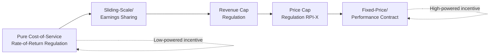
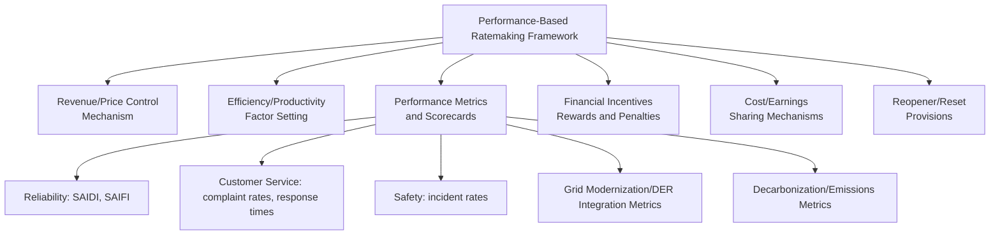

## Incentive Regulation: Price Caps, Revenue Caps, and Performance-Based Ratemaking

### Definition and Core Concept

Incentive regulation refers to a family of ratemaking frameworks designed to give regulated energy utilities explicit financial incentives to reduce costs, improve efficiency, and enhance service quality — in contrast to traditional cost-of-service (rate-of-return) regulation, where costs are passed through to ratepayers with limited reward for efficiency gains. The central design principle is decoupling the firm's profitability from its realized costs over a defined regulatory period, so that the firm retains (or bears) the difference between allowed and actual costs.

The theoretical foundation draws on **mechanism design** and the **principal-agent problem**: the regulator (principal) cannot directly observe the utility's true cost-minimizing effort level (hidden action) or true cost structure (hidden information), so incentive regulation uses high-powered contracts to induce efficient behavior indirectly.

### The Regulatory Incentive Spectrum

Incentive regulation frameworks exist on a spectrum from "low-powered" (cost-of-service) to "high-powered" (fixed-price) incentives, based on how tightly the firm's revenue is linked to its realized costs.

At the low-powered end, costs are fully passed through (weak efficiency incentive, low firm risk). At the high-powered end, the firm bears full cost/benefit of its performance (strong efficiency incentive, high firm risk). Most modern frameworks sit between these extremes.

### Price Cap Regulation (RPI-X)

**Origin and Core Mechanism**

Developed by Stephen Littlechild for the UK's privatized utilities in the early 1980s as an alternative to U.S.-style rate-of-return regulation. Rather than regulating profit directly, the regulator caps the *price* the utility may charge, allowing it to rise with general inflation minus an efficiency offset:

$$P_t = P_{t-1} \times (1 + RPI_t - X)$$

Where:

- $RPI_t$ = a general price/inflation index (Retail Price Index in the original UK design; other jurisdictions use CPI or GDP deflators)
- $X$ = an efficiency factor set by the regulator, reflecting expected productivity gains the firm should achieve

**Multi-Year Price Control Periods**

Price caps are typically fixed for a multi-year period (commonly 4–5 years) between regulatory resets. During this period, the firm keeps any cost savings beyond the assumed $X$ factor as profit, and bears any cost overruns as losses. This creates the central incentive property of price-cap regulation: because the price path is fixed independent of the firm's realized costs during the control period, marginal cost reductions translate directly into marginal profit.

**The Ratchet Effect and Regulatory Lag**

The efficiency incentive is strongest immediately after a price control is set and weakens as the next reset approaches, because the regulator will use realized costs and profits from the current period as an input to setting the next period's $X$ factor (the **ratchet effect**). This creates a dynamic incentive problem: firms may strategically time efficiency gains or under-invest late in a control period to avoid revealing information that would lead to a tougher $X$ in the subsequent reset. [Inference] Empirical evidence on the magnitude of ratchet effects varies by sector and jurisdiction, and depends heavily on specific reset methodologies used.

**Limitations of Basket-Wide Price Caps**

A single output-price cap gives no incentive regarding *how* the firm achieves compliance across a multi-product basket—it can favor high-margin services and neglect others unless individual sub-caps or price structures are specified. This is one reason single-output price caps have been extended into more granular basket or tariff-basket designs.

### Revenue Cap Regulation

**Core Mechanism and Rationale**

Revenue cap regulation caps the utility's *total allowed revenue* rather than the per-unit price:

$$RR_t = RR_{t-1} \times (1 + I_t - X_t) \pm Z_t$$

Where:

- $RR_t$ = allowed revenue requirement in year $t$
- $I_t$ = inflation index
- $X_t$ = efficiency factor
- $Z_t$ = exogenous cost adjustment ("Z-factor," for events outside management control, e.g., major storm restoration costs, new legal mandates)

**Volume Decoupling**

The key distinguishing feature of revenue caps relative to price caps is that total revenue is fixed regardless of the quantity sold. This "decouples" utility profitability from sales volume, which matters critically for network utilities because:

- Under price caps or traditional volumetric rate design, a utility earns more revenue when customers use more energy — creating a disincentive for the utility to support energy efficiency or demand-side management programs that reduce its own sales
- Under revenue caps, if actual sales volumes come in below the volumes assumed when the cap was set, the utility typically recovers the shortfall (or returns the surplus) through a **true-up mechanism** in a subsequent period, insulating the utility's revenue from volume risk

This makes revenue caps the preferred structure in jurisdictions actively promoting energy efficiency and distributed energy resources, since it removes the utility's financial disincentive toward reducing throughput. Widely used for electricity and gas *distribution and transmission* networks (e.g., UK Ofgem's RIIO framework, many Australian and U.S. state distribution utilities).

**Price Cap vs. Revenue Cap: Volume Risk Allocation**

| Dimension | Price Cap | Revenue Cap |
| --- | --- | --- |
| What is fixed | Per-unit price | Total allowed revenue |
| Volume risk borne by | Utility (revenue varies with sales) | Ratepayers (via true-up) or shared |
| Utility incentive toward sales volume | Positive (more sales = more revenue) | Neutral (decoupled) |
| Suitability for energy efficiency goals | Weaker alignment | Stronger alignment |
| Common application | Historically generation/retail-adjacent tariffs | Transmission/distribution networks |

### Performance-Based Ratemaking (PBR)

**Definition**

Performance-Based Ratemaking (PBR) is a broader umbrella term encompassing price caps, revenue caps, and additional explicit performance metrics and financial rewards/penalties tied to specific outcomes beyond simple cost efficiency — such as reliability, customer satisfaction, safety, and increasingly, decarbonization and grid modernization outcomes.

**Core Components of a PBR Framework**

**Reliability Performance Metrics**

Electricity distribution PBR frameworks commonly incorporate standardized reliability indices:

$$SAIDI = \frac{\sum (\text{Customers Interrupted} \times \text{Interruption Duration})}{\text{Total Customers Served}}$$

$$SAIFI = \frac{\text{Total Number of Customer Interruptions}}{\text{Total Customers Served}}$$

Where $SAIDI$ (System Average Interruption Duration Index) measures average outage minutes per customer per year, and $SAIFI$ (System Average Interruption Frequency Index) measures the average number of interruptions per customer per year. Utilities may face financial penalties for underperformance against historical benchmarks or peer comparisons, and sometimes rewards for exceeding targets.

**Earnings Sharing Mechanisms (ESM)**

To mitigate the risk that a fixed price/revenue path over- or under-rewards the firm relative to a "fair" return, many PBR frameworks include earnings sharing: if the utility's realized return on equity (ROE) exceeds a specified deadband above the authorized ROE, a portion of the excess is shared with ratepayers (via rebates or future rate reductions); conversely, some frameworks share downside shortfalls back to the utility's benefit.

$$\text{Sharing} = \begin{cases} 0 & \text{if } ROE_{actual} \in [ROE_{auth} - d, \; ROE_{auth} + d] \\ s \times (ROE_{actual} - ROE_{auth} - d) & \text{if } ROE_{actual} > ROE_{auth} + d \end{cases}$$

Where $d$ is the deadband and $s$ is the sharing percentage. This softens high-powered incentives, trading some efficiency incentive strength for reduced firm risk and reduced political/regulatory controversy over "excessive" profits.

### The X-Factor: Setting the Efficiency Offset

**Total Factor Productivity (TFP) Approach**

The $X$-factor is commonly derived from econometric benchmarking of historical **Total Factor Productivity** growth in the regulated industry relative to the broader economy:

$$X = (TFP_{industry} - TFP_{economy}) + \text{output growth adjustment}$$

**Yardstick Competition / Benchmarking**

Where multiple utilities operate in non-competing service territories (common in distribution), regulators can use **yardstick competition** (Shleifer, 1985): comparing each utility's costs against a peer benchmark (frontier or average cost model, often using Data Envelopment Analysis or Stochastic Frontier Analysis) to set efficiency targets, rather than relying solely on each firm's own historical cost trajectory. This addresses information asymmetry because a firm's incentive to overstate its own costs is undercut by comparison to peers facing similar operating conditions.

### The RIIO Framework (UK) — A Comprehensive PBR Example

Ofgem's RIIO framework ("Revenue = Incentives + Innovation + Outputs"), introduced from 2013 onward for UK gas and electricity network companies, is a widely referenced comprehensive PBR model. [Inference] Details of RIIO have evolved across successive price control periods (RIIO-1, RIIO-2, and subsequent iterations), so specific parameter values or scheme names should be verified against Ofgem's current published price control documents rather than treated as fixed indefinitely.

Key structural features generally associated with the RIIO approach:

- Long price control periods (commonly 5–8 years) to strengthen long-term efficiency incentives and support long-term infrastructure planning
- Totex (total expenditure) approach treating capital expenditure (capex) and operating expenditure (opex) neutrally, reducing the traditional bias toward capital-intensive solutions inherent in rate-base-driven regulation
- Explicit output/outcome categories (e.g., reliability, safety, environmental impact, customer satisfaction, connections) with associated financial incentives
- Innovation funding mechanisms to support new technology trials outside the standard price control

### Comparative Summary Table

| Framework | Primary Lever Fixed | Efficiency Incentive Strength | Volume Risk | Typical Use Case |
| --- | --- | --- | --- | --- |
| Rate-of-Return (Cost-of-Service) | None (costs passed through) | Low | Utility bears limited volume risk (volumetric rates) | Traditional/legacy regulation, generation cost recovery |
| Price Cap (RPI-X) | Per-unit price | Moderate–High | Utility bears volume risk | Historic UK/Latin American privatizations, some retail tariffs |
| Revenue Cap | Total revenue | Moderate–High | Ratepayers bear volume risk (via true-up) | Modern transmission/distribution regulation |
| Earnings Sharing / Sliding Scale | Partial (ROE deadband) | Moderate (dampened) | Shared | Transitional frameworks, politically sensitive settings |
| Comprehensive PBR (e.g., RIIO-style) | Revenue + multi-dimensional outputs | High, multi-dimensional | Typically decoupled (revenue cap-based) | Modern network regulation with reliability/decarbonization goals |

### Practical Example: Comparing Utility Outcomes Under Different Frameworks

Consider a distribution utility with an initial approved revenue requirement of $100 million, assumed inflation of 3%, and an efficiency ($X$) factor of 1.5%.

**Under Price Cap**: If sales volume grows 2% but the utility achieves 1% real cost reduction beyond the assumed $X$, it retains that additional 1% as profit; if sales volume falls due to a mild winter, actual revenue falls even though its cost base is largely fixed (network costs are mostly fixed, not variable with volume).

**Under Revenue Cap**: The same mild winter causing lower sales volume does not reduce utility revenue — a true-up mechanism recovers the shortfall from ratepayers (typically with a lag, e.g., recovered in the following year's rates), while the 1% cost efficiency gain is still retained as profit until the next reset.

### Risks and Criticisms of Incentive Regulation

**Quality Degradation Risk**

High-powered cost incentives, if not paired with robust output/quality metrics, can incentivize utilities to under-invest in maintenance or service quality to inflate short-term profit — a core reason PBR frameworks incorporate explicit reliability and safety metrics with financial consequences.

**Information Requirements for Effective Benchmarking**

Yardstick competition and TFP-based X-factor setting require substantial, comparable historical cost and output data across firms; smaller jurisdictions or those with only one or two utilities may lack sufficient peer data for robust benchmarking. [Unverified] The practical robustness of any given benchmarking methodology depends significantly on data quality and comparability across the specific utilities being benchmarked, which varies by jurisdiction and dataset.

**Complexity and Regulatory Cost**

Comprehensive PBR frameworks with multiple output metrics, sharing mechanisms, and reopener provisions require significant regulatory technical capacity and stakeholder engagement to design, monitor, and enforce — a nontrivial institutional capacity requirement (see **Regulatory Institutions and Independence Design**).

**Asset Stranding and Energy Transition Interaction**

As decarbonization reduces throughput on gas networks or shifts investment needs rapidly (e.g., grid modernization for electrification and DER integration), traditional TFP-based X-factors calibrated on historical productivity trends may not reflect the cost realities of a transitioning system. [Inference] This has prompted regulatory experimentation with more forward-looking, scenario-based approaches to setting efficiency targets and allowed expenditure, though the specific methodologies remain an active area of regulatory reform across jurisdictions.

### Key Points

- Incentive regulation decouples utility profitability from realized costs to induce efficiency, in contrast to pass-through cost-of-service regulation
- Price caps fix per-unit price (utility bears volume risk); revenue caps fix total revenue (ratepayers typically bear volume risk via true-up), making revenue caps better aligned with energy efficiency and DER policy goals
- The $X$-factor, typically derived from TFP benchmarking or yardstick competition, sets the efficiency target embedded in the price/revenue path
- Performance-Based Ratemaking (PBR) extends cost efficiency incentives to explicit multi-dimensional output metrics (reliability, safety, customer service, decarbonization) with associated financial rewards/penalties
- Earnings sharing mechanisms and reopener provisions moderate the risk exposure of high-powered incentive schemes
- The ratchet effect and quality-degradation risk are persistent design challenges requiring careful metric design and multi-year commitment periods

### Related Topics

- Total Factor Productivity benchmarking and yardstick competition (Shleifer)
- Rate-of-return regulation and the Averch-Johnson effect
- Regulatory institutions and independence design
- Reliability metrics: SAIDI, SAIFI, and utility performance standards
- Totex (total expenditure) regulatory frameworks and capex/opex neutrality
- Decoupling mechanisms and utility business model reform for energy efficiency
- Data Envelopment Analysis and Stochastic Frontier Analysis in regulatory benchmarking
- Cost of capital determination and allowed rate of return methodologies
- Non-wires alternatives and performance incentives for DER integration
- International comparative case studies: UK RIIO, U.S. state PBR proceedings, Australian AER frameworks