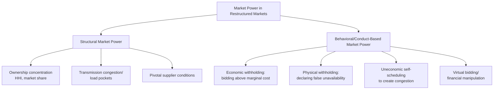
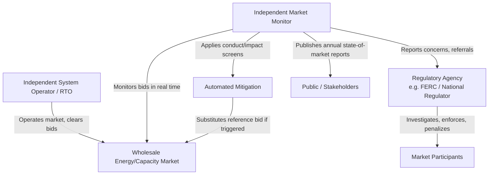

## Market Power Mitigation in Restructured Markets

### Definition and Core Concept

Market power mitigation refers to the set of structural rules, monitoring systems, and behavioral/price interventions used by system operators and regulators to prevent generators, transmission owners, or other participants in restructured (liberalized) wholesale energy markets from exercising **market power** — the ability of a firm to profitably raise price above competitive levels (typically approximated by short-run marginal cost) by unilaterally or collectively withholding output or manipulating bids.

Market power mitigation exists because restructuring electricity and gas sectors from vertically integrated monopolies into competitive wholesale markets does not automatically produce competitive outcomes. Physical and structural features specific to electricity make these markets unusually susceptible to the exercise of market power relative to typical competitive goods markets.

### Why Electricity Markets Are Structurally Prone to Market Power

**Non-Storability and Instantaneous Balancing**

Electricity cannot be economically stored at scale in most systems, and supply must equal demand instantaneously to maintain grid frequency and stability. This eliminates the ability of buyers to substitute intertemporally (e.g., stockpiling during low-price periods), removing a demand-side discipline present in most storable-goods markets.

**Inelastic Short-Run Demand**

Retail electricity demand is typically not exposed to real-time wholesale prices (due to flat retail tariffs, limited metering granularity, or regulatory retail price caps), making short-run demand highly price-inelastic:

$$\varepsilon_D = \frac{\% \Delta Q_D}{\% \Delta P} \approx 0 \text{ (short run)}$$

With inelastic demand, even small reductions in available supply can cause disproportionately large price increases, magnifying the profitability of unilateral withholding.

**Transmission Constraints and Locational Market Power**

Congestion on the transmission network can isolate parts of the grid into smaller effective markets during high-demand periods, even where the broader system has ample competitive supply. A generator located within a transmission-constrained "load pocket" may become **pivotal** (essential to meeting local demand) even if it holds a small share of system-wide capacity.

**Pivotal Supplier Dynamics and Peak-Period Concentration**

Because generation capacity must be sized for peak demand (with substantial idle capacity most of the year), during high-demand or high-outage periods, the residual supply available from lower-cost units may be insufficient to meet demand without the highest-cost or largest supplier — making that supplier "pivotal" even in an otherwise competitive market.

### The Residual Supply Index (RSI) — Measuring Pivotal Supplier Risk

A standard structural screen for market power potential is the **Residual Supply Index**, which measures whether a given firm's capacity is needed to meet demand after excluding that firm's own output:

$$RSI_i = \frac{\text{Total Market Supply} - Q_i}{\text{Total Market Demand}}$$

Where $Q_i$ is firm $i$'s available capacity. If $RSI_i < 1$ for firm $i$, that firm is **pivotal** — meaning demand cannot be met without its output, giving it substantial unilateral market power regardless of its overall market share. RSI is widely used by Independent System Operators (ISOs) and Regional Transmission Organizations (RTOs) as a real-time and planning-stage market power screen.

### The Lerner Index — Measuring Realized Market Power

The degree of market power actually exercised can be measured using the **Lerner Index**, comparing price to marginal cost:

$$L = \frac{P - MC}{P}$$

Where $L = 0$ indicates competitive (marginal-cost) pricing and higher values indicate greater markup. In wholesale electricity market monitoring, market monitors routinely compare bid prices or clearing prices against estimated marginal cost (based on fuel costs, heat rates, and variable O&M) to identify potential exercises of market power.

### Structural vs. Behavioral Market Power

**Structural market power** arises from underlying ownership concentration and physical grid conditions independent of any specific firm behavior — addressed primarily through structural remedies (divestiture, market design rules, capacity limits).

**Behavioral (conduct-based) market power** refers to specific actions taken by a participant to exploit structural conditions — addressed through monitoring, bid mitigation, and enforcement penalties.

### Measuring Market Concentration: HHI

The **Herfindahl-Hirschman Index (HHI)** is the standard structural screen for market concentration, calculated as the sum of squared market shares of all firms in the relevant market:

$$HHI = \sum_{i=1}^{n} s_i^2 \times 10{,}000$$

Where $s_i$ is firm $i$'s market share (as a decimal). U.S. antitrust guidelines and many electricity market monitors use conventional thresholds: HHI below 1,500 is generally considered unconcentrated, 1,500–2,500 moderately concentrated, and above 2,500 highly concentrated — though these thresholds originate from merger-review antitrust practice and their direct application to electricity markets (where product/geographic market definition is complex due to transmission constraints and time-varying demand) requires caution. [Inference] Electricity-specific market power screening generally supplements HHI with dynamic measures like RSI/pivotal supplier analysis because static HHI calculated over a broad geographic/time-averaged market can understate localized or peak-period market power.

### Categories of Market Power Mitigation Mechanisms

**1. Structural Remedies (Ex Ante, Long-Term)**

Address market power potential before it can be exercised, through market structure design.

- **Divestiture requirements**: Mandating that a formerly vertically integrated utility sell off generation assets to reduce concentration upon market restructuring (used in several U.S. state restructuring processes in the late 1990s)
- **Ownership caps**: Limiting the share of generation capacity or transmission any single entity may own in a given market or zone
- **Functional/ownership unbundling**: Separating transmission ownership/operation from generation and retail supply ownership to prevent a vertically integrated firm from favoring its own generation via discriminatory transmission access
- **Virtual power plant (VPP) auctions / capacity divestiture auctions**: Requiring a dominant generator to auction off "virtual" capacity contracts (financial rights to a portion of its output) to reduce its effective ability to withhold physical supply profitably — used notably in some European markets historically (e.g., French VPP mechanisms) to address incumbent dominance

**2. Market Design Remedies (Structural, System-Level)**

- **Locational Marginal Pricing (LMP)**: Pricing electricity separately at each grid node to reflect transmission congestion, reducing (though not eliminating) the ability of transmission-constrained pockets to hide behind system-average pricing
- **Demand response and elastic demand programs**: Actively increasing demand-side price responsiveness to reduce the profitability of supply withholding
- **Sufficient interconnection and transmission expansion**: Reducing the frequency and severity of load-pocket conditions that create localized pivotal suppliers
- **Forward capacity/energy markets with adequate lead time**: Allowing new entry to discipline incumbents' ability to exercise market power in the short run

**3. Conduct and Impact Screens (Real-Time/Ex Post Monitoring)**

Independent Market Monitors (IMMs), typically operating as an independent unit within or reporting alongside the ISO/RTO, apply a **two-pronged test** widely used across U.S. ISO/RTO markets (adapted from FERC-endorsed frameworks, notably in PJM, MISO, and other RTOs):

$$\text{Conduct Screen: bid price} > \text{competitive reference price threshold}$$

$$\text{Impact Screen: bid materially affects market clearing price}$$

A bid or offer is only subject to mitigation if it fails **both** screens — i.e., it is priced significantly above a competitive benchmark (conduct) *and* it has a material effect on the market outcome (impact). This two-pronged structure avoids penalizing legitimately high bids from genuinely scarce or high-cost units that do not actually move the market price.

**4. Bid Mitigation and Price Caps**

- **Offer caps**: Absolute caps on the price a generator may bid into the wholesale energy market (e.g., historical caps used in early U.S. RTO markets, and administrative price caps still used as a backstop in most U.S. ISO markets)
- **Automated Mitigation Procedures (AMP)**: Automated, real-time systems that detect conduct/impact screen failures and substitute a reference-level (cost-based) bid in place of the submitted bid before market clearing
- **Local market power mitigation (LMPM)**: Geographically targeted mitigation applied specifically to generators in transmission-constrained zones identified as structurally uncompetitive, rather than system-wide caps

**5. Ex Post Enforcement and Penalties**

Regulatory bodies (e.g., FERC's Office of Enforcement in the U.S., national competition authorities and energy regulators in the EU under REMIT — the Regulation on Energy Market Integrity and Transparency) investigate and penalize proven manipulation after the fact, including civil penalties, disgorgement of unjust profits, and market participation bans.

### Institutional Architecture of Market Monitoring

Independent Market Monitors are typically structurally separated from the ISO/RTO's market operations function to avoid conflicts of interest, and report both to the ISO board and directly to the external regulator — an institutional design reflecting the same independence principles discussed under **Regulatory Institutions and Independence Design**.

### Practical Example: Load-Pocket Market Power Scenario

Consider a metropolitan load pocket served by three transmission lines, with local demand of 2,000 MW at peak. Local generation available: Firm A (800 MW), Firm B (700 MW), Firm C (400 MW). Total local supply = 1,900 MW, but transmission import capacity into the pocket is limited to 300 MW during a planned outage.

Effective supply = 1,900 MW (local) + 300 MW (import) = 2,200 MW against 2,000 MW demand — seemingly adequate. However, if Firm A withholds 300 MW of its capacity (economic withholding, bidding it at an uncompetitively high price so it doesn't clear), effective available supply drops to 1,900 MW against 2,000 MW demand, forcing the system operator to accept higher-priced supply or curtail load — and $RSI_A$ falls below 1, confirming Firm A's pivotal status during this contingency. This is precisely the type of scenario that local market power mitigation and automated mitigation procedures are designed to detect and neutralize by substituting a cost-based reference bid for Firm A's withheld capacity.

### Historical Case Reference: California Electricity Crisis (2000–2001)

[Inference] The California electricity crisis is widely cited in the regulatory economics literature as a canonical example of the consequences of inadequate market power mitigation combined with specific market design flaws (including a requirement that utilities buy exclusively in the volatile spot market, retail price caps that suppressed demand response, and insufficient local market power screens), though the precise apportionment of causes (market design vs. exercised market power vs. supply/hydro conditions) has been subject to extensive subsequent economic and regulatory analysis and remains an area where reasonable analyses differ on relative weighting. The episode is generally credited with substantially accelerating the development of formal Independent Market Monitor institutions and structured conduct/impact mitigation frameworks across U.S. RTOs in subsequent years.

### Comparative Summary of Mitigation Approaches

| Mechanism Type | Timing | Example Tools | Primary Target |
| --- | --- | --- | --- |
| Structural remedies | Ex ante, long-term | Divestiture, ownership caps, unbundling | Underlying concentration |
| Market design | System-level, ongoing | LMP, demand response, transmission expansion | Systemic pivotal-supplier conditions |
| Real-time monitoring/mitigation | Continuous, automated | Conduct/impact screens, AMP, offer caps | Behavioral withholding in real time |
| Ex post enforcement | After the fact | Investigations, penalties, disgorgement | Deterrence of manipulation |

### Contemporary Challenges

**Renewable Integration and Changing Pivotal Dynamics**

As variable renewable generation displaces conventional thermal capacity, the identity and timing of pivotal suppliers can shift — for example, toward flexible gas peakers or battery storage operators during periods of low renewable output, requiring market monitors to continually update structural screens rather than relying on static historical concentration measures. [Inference] The specific market power implications of high renewable penetration are still an active area of empirical research and likely vary significantly by market design and resource mix.

**Capacity Markets and Missing Money**

Some restructured markets supplement energy-only markets with separate capacity markets to address the "missing money" problem (energy market revenues alone may be insufficient to support long-term investment given price caps and administrative mitigation), which introduces a parallel set of market power considerations specific to capacity auction design (e.g., minimum offer price rules to prevent uneconomic entry from depressing capacity prices).

**Cross-Border and Multi-Jurisdictional Coordination**

Interconnected regional markets (e.g., the EU internal electricity market, coordinated U.S. RTO seams) raise market power mitigation questions that span multiple regulatory jurisdictions, requiring coordination mechanisms among national/regional regulators and market monitors.

### Key Points

- Electricity markets are structurally prone to market power due to non-storability, inelastic short-run demand, and transmission-constrained pivotal supplier dynamics
- The Residual Supply Index (RSI) and Lerner Index are core quantitative tools for identifying pivotal supplier conditions and measuring realized market power respectively
- Mitigation operates across four layers: structural remedies (divestiture, ownership caps), market design (LMP, demand response), real-time conduct/impact screening with automated mitigation, and ex post enforcement
- The two-pronged conduct/impact test is the standard basis for real-time bid mitigation in most U.S. ISO/RTO markets, ensuring only bids that are both suspicious and market-moving are mitigated
- Independent Market Monitors are structurally separated from ISO/RTO market operations to preserve monitoring independence and credibility
- Renewable integration and capacity market design are reshaping the practical focus of market power mitigation frameworks

### Related Topics

- Locational Marginal Pricing (LMP) and nodal market design
- Independent System Operators (ISOs) and Regional Transmission Organizations (RTOs)
- Capacity markets and the "missing money" problem
- Regulatory institutions and independence design
- Demand response and price-responsive demand programs
- REMIT and EU wholesale energy market integrity regulation
- FERC market-based rate authority and enforcement framework
- California electricity crisis (2000–2001) as a market design case study
- Herfindahl-Hirschman Index applications in energy antitrust analysis
- Market power implications of high renewable and storage penetration