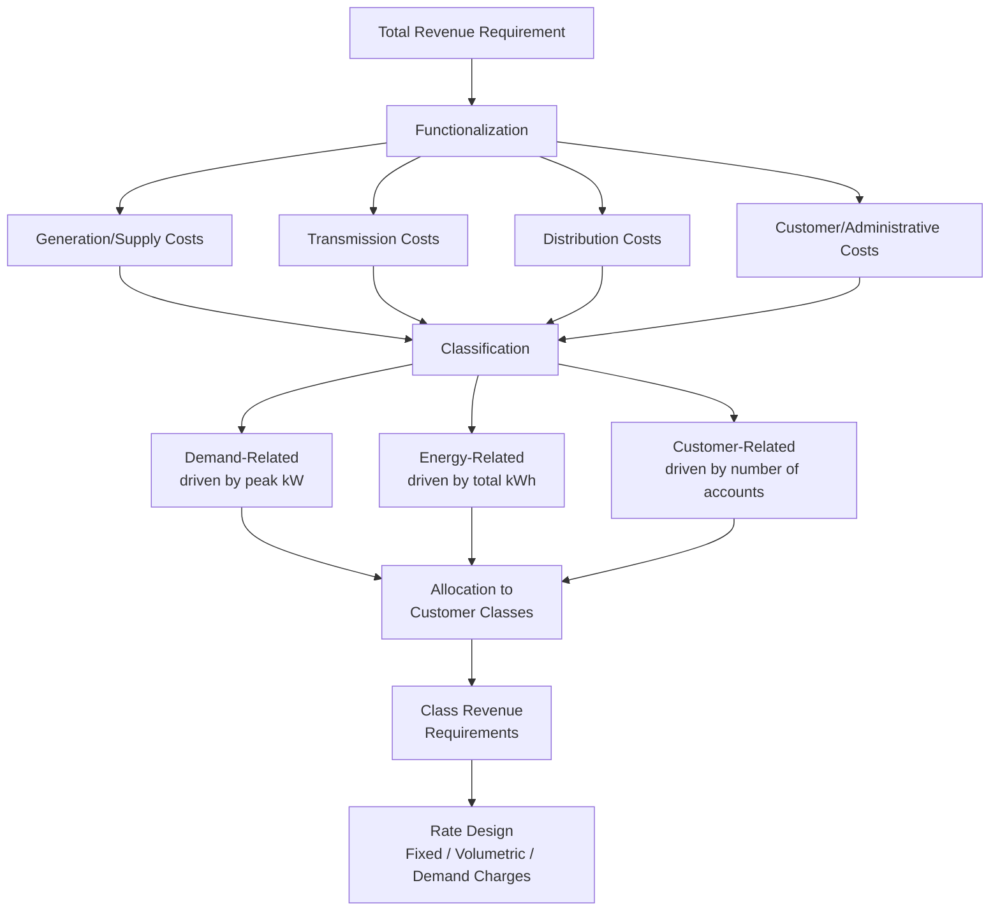

## Cross-Subsidization and Tariff Design Principles

### Definition and Core Concept

Cross-subsidization occurs when one class of energy customers pays a price that deviates from the cost of serving them, with the resulting surplus or deficit implicitly transferring value to or from another customer class. Tariff design principles are the analytical framework regulators and utilities use to allocate costs across customer classes and rate structures, determining how much cross-subsidization exists, whether it is intentional (policy-driven) or incidental (a byproduct of historical rate design), and whether it is economically or socially justified.

Cross-subsidization is not inherently undesirable — some forms are deliberate instruments of social or industrial policy (e.g., subsidizing low-income or rural consumers). The central technical and normative task of tariff design is distinguishing **efficient, transparent, policy-directed subsidies** from **inefficient, opaque, and often regressive implicit subsidies** embedded in poorly designed rate structures.

### Types of Cross-Subsidization

**1. Inter-Class Cross-Subsidization**

Occurs between distinct customer classes (residential, commercial, industrial) when the price paid by one class exceeds or falls short of its true cost to serve, with the difference offset by another class.

**2. Intra-Class Cross-Subsidization**

Occurs within a single customer class when a uniform tariff structure causes some customers (e.g., low-usage or high-load-factor customers) to pay more relative to cost-to-serve than others within the same nominal rate class.

**3. Geographic Cross-Subsidization**

Occurs when customers in low-cost-to-serve areas (dense urban) pay the same rate as customers in high-cost-to-serve areas (remote rural), a common and often deliberate policy choice to promote **universal service** and rate uniformity across a national or regional footprint.

**4. Temporal Cross-Subsidization**

Occurs when flat, time-invariant tariffs cause off-peak users to subsidize peak-period users, since system costs (particularly capacity/network costs) are driven disproportionately by peak demand but flat tariffs recover these costs uniformly across all consumption regardless of timing.

### Cost Causation as the Normative Benchmark

The foundational principle used to evaluate whether cross-subsidization exists is **cost causation** — the idea that, absent explicit policy objectives to the contrary, a customer class or individual customer should pay in proportion to the costs they cause the system to incur. Deviation from cost causation is the standard technical definition of a cross-subsidy.

$$\text{Cross-subsidy}_i = R_i - C_i$$

Where $R_i$ is revenue collected from class $i$ and $C_i$ is the fully allocated cost to serve class $i$. A positive value indicates class $i$ subsidizes others; a negative value indicates class $i$ is subsidized.

### Efficient Component Pricing and the Marginal Cost Benchmark

Economically efficient tariff design, in the absence of a cost-recovery constraint, would set price equal to marginal cost for each unit of consumption:

$$P = MC$$

As established under **Rationale for Regulating Natural Monopolies**, this alone typically fails to recover total cost for a natural monopoly network because $MC < ATC$ throughout the declining-cost region. Tariff design therefore requires mechanisms to recover the residual fixed-cost gap without abandoning efficiency principles entirely — the central technical challenge addressed by two-part tariffs and Ramsey pricing.

### Two-Part and Multi-Part Tariff Structures

**Two-Part Tariffs**

$$\text{Total Bill} = F + p \times Q$$

Where $F$ is a fixed (typically monthly) charge recovering network/connection fixed costs, and $p$ is a volumetric (per-unit) charge set close to marginal cost. This structure separates the **cost-recovery function** (via $F$) from the **efficient price-signal function** (via $p$), which is the standard economic rationale for including a fixed charge in utility tariffs.

**Three-Part Tariffs (Common for Commercial/Industrial Customers)**

$$\text{Total Bill} = F + (d \times D_{max}) + (p \times Q)$$

Where $D_{max}$ is the customer's peak demand (kW) and $d$ is a demand charge per kW. This structure recovers capacity-related costs (driven by the customer's peak demand contribution) separately from both fixed connection costs and volumetric energy costs — reflecting the fact that network and generation capacity costs are driven primarily by peak demand, not total energy consumed.

### Rate Design Objectives: The Bonbright Principles

James Bonbright's classic 1961 framework, *Principles of Public Utility Rates*, remains the standard reference articulating the (sometimes competing) objectives tariff design must balance:

| Principle | Description |
| --- | --- |
| Revenue sufficiency | Rates must generate revenue sufficient for the utility's financial integrity |
| Revenue stability | Rates should provide predictable revenue year to year |
| Rate stability | Customers should face predictable, gradually changing rates over time |
| Fairness of cost apportionment | Rates should reflect cost causation among customer classes |
| Avoidance of undue discrimination | Similarly situated customers should be treated similarly |
| Efficiency (economic signaling) | Rates should send efficient price signals encouraging economically efficient consumption |
| Simplicity and understandability | Rates should be practical to administer and understandable to customers |

These objectives frequently conflict — for example, efficiency-oriented time-varying rates may reduce rate stability and simplicity — and tariff design in practice represents a negotiated balance among them, mediated through the regulatory process.

### Cost Allocation Methodologies

Before rates can be designed, total utility revenue requirement must be allocated across customer classes using a **cost allocation study**, typically following a three-step process.

**Functionalization**: Separating total costs by the function of the underlying asset (generation, transmission, distribution, customer service).

**Classification**: Categorizing each functional cost as demand-related (driven by peak capacity needs), energy-related (driven by total throughput), or customer-related (driven by the number of accounts, independent of usage — e.g., metering, billing).

**Allocation**: Distributing classified costs across customer classes using allocation factors (e.g., each class's contribution to system peak demand, or its share of total energy consumption), commonly using methods such as the **coincident peak (CP) method**, which allocates demand-related costs based on each class's usage precisely at the time of system peak, or the **non-coincident peak (NCP) method**, based on each class's own individual peak regardless of timing relative to system peak.

### The Residential Fixed-Charge Debate

A prominent contemporary tariff design controversy concerns the appropriate size of the residential fixed monthly charge, illustrating the practical tension between cost causation and other Bonbright principles.

**Case for higher fixed charges**: A substantial share of distribution network costs are driven by the fact of connection (poles, wires, meters, service drops) rather than by volume consumed; recovering these costs volumetrically, particularly under a revenue cap or declining-sales environment, can misallocate cost responsibility and create a "utility death spiral" risk where distributed generation adopters reduce their volumetric bills disproportionately relative to the fixed costs they still impose on the network.

**Case for lower fixed charges (higher volumetric rates)**: High fixed charges reduce the price signal for conservation and rooftop solar/energy-efficiency adoption (since a larger share of the bill becomes unavoidable regardless of consumption), and are often criticized as regressive because fixed charges represent a larger proportion of the bill for low-usage (often lower-income) households.

[Inference] This trade-off does not have a single economically "correct" resolution independent of the specific policy weights a jurisdiction places on efficiency, equity, and utility financial stability; different regulators have reached materially different conclusions on appropriate fixed-charge levels, and outcomes continue to evolve as DER penetration increases.

### Net Metering as a Cross-Subsidization Case Study

**Mechanism**

Under traditional (retail-rate) **net metering**, a rooftop solar customer's excess generation exported to the grid is credited at the full retail electricity rate, rather than at the wholesale or avoided-cost value of that exported energy.

**The Cross-Subsidy Argument**

Since the retail rate embeds recovery of fixed network costs (poles, wires, administrative costs) within a volumetric charge, a net-metered customer who reduces net metered consumption to near zero can substantially reduce their contribution to fixed network cost recovery while still relying on the grid for backup power, effectively shifting that unrecovered fixed cost onto non-solar customers.

$$\text{Implicit subsidy per exported kWh} = P_{retail} - P_{avoided\ cost}$$

Where $P_{avoided\ cost}$ represents the utility's actual avoided cost of that exported energy (wholesale energy value plus any avoided capacity/losses value). [Inference] The magnitude and even the direction of net metering's net welfare effect (accounting for avoided transmission losses, avoided capacity investment, and environmental externalities alongside the fixed-cost recovery shift) has been the subject of extensive and often conflicting cost-benefit studies commissioned by different stakeholders, and results are sensitive to specific jurisdictional assumptions about avoided costs and externality valuation.

**Alternative Compensation Mechanisms**

Many jurisdictions have moved toward alternatives designed to reduce this cross-subsidy concern:

- **Net billing**: Compensating exports at avoided-cost or wholesale value rather than full retail rate
- **Value-of-solar tariffs**: Explicitly calculating a rate reflecting the full set of costs and benefits solar exports provide to the grid
- **Minimum bill / fixed charge increases**: Ensuring solar customers contribute a minimum toward fixed network costs regardless of net consumption

### Lifeline Rates and Explicit Social Tariffs

In contrast to the often-unintentional cross-subsidies discussed above, many jurisdictions implement **explicit, transparent subsidy mechanisms** for low-income or low-usage (often low-income proxy) customers as a deliberate social policy instrument:

- **Lifeline/inclining block rates**: A low, often below-cost rate for an initial "lifeline" consumption block (covering basic needs), with progressively higher rates for consumption above that threshold
- **Targeted bill assistance programs**: Direct subsidies or rate discounts funded through a separate, transparent surcharge on other customers or general government revenue, rather than embedded invisibly within the general rate structure

The key design distinction favored in modern regulatory economics is that **explicit, transparent, and targeted** subsidies (funded via clearly identified mechanisms and directed at defined beneficiary populations) are generally preferred over **implicit, opaque, and untargeted** cross-subsidies embedded in general rate structures, because explicit mechanisms allow the true cost of the social policy to be identified, debated, and adjusted, whereas implicit subsidies obscure this cost and can misdirect benefits to unintended recipients (e.g., a uniform national tariff subsidizing wealthy rural second-home owners as much as low-income rural residents).

### Time-of-Use and Dynamic Pricing as Anti-Cross-Subsidy Tools

**Time-of-Use (TOU) Rates**

$$P_t = \begin{cases} P_{peak} & \text{if } t \in \text{peak hours} \\ P_{off-peak} & \text{if } t \in \text{off-peak hours} \end{cases}$$

TOU rates directly address temporal cross-subsidization by charging higher prices during system peak periods (when capacity costs are actually incurred) and lower prices off-peak, more closely aligning individual customer bills with the costs they actually cause.

**Critical Peak Pricing and Real-Time Pricing**

More granular dynamic mechanisms — critical peak pricing (very high prices during a small number of pre-declared critical hours per year) and real-time pricing (prices tracking wholesale market conditions continuously) — further refine the cost-causation alignment, at the expense of rate stability and simplicity (per the Bonbright trade-offs above).

### Comparative Summary: Tariff Structures and Cross-Subsidy Implications

| Tariff Structure | Cost Recovery Basis | Cross-Subsidy Risk | Typical Application |
| --- | --- | --- | --- |
| Flat volumetric rate | Energy only | High (fixed costs recovered per kWh regardless of peak contribution or connection cost) | Legacy residential tariffs |
| Two-part tariff (fixed + volumetric) | Connection + energy | Moderate (still no demand/peak signal) | Standard residential/small commercial |
| Three-part tariff (fixed + demand + volumetric) | Connection + capacity + energy | Low (best cost-causation alignment) | Commercial/industrial customers |
| Inclining block rate | Energy, tiered | Intentional (subsidizes low-usage block) | Residential lifeline/conservation policy |
| Time-of-use rate | Energy, time-differentiated | Low for temporal dimension | Modern residential/commercial with AMI |
| Retail-rate net metering | Energy, netted | High (fixed cost recovery erosion) | Distributed solar compensation (legacy) |

### Key Points

- Cross-subsidization is formally defined as the deviation between revenue collected from a customer class and the cost actually caused by that class; deviations can be intentional policy tools or unintentional byproducts of rate design
- Cost allocation proceeds through functionalization, classification (demand/energy/customer-related), and allocation to customer classes before rate design begins
- Two- and three-part tariffs exist specifically to separate fixed-cost recovery from efficient marginal-cost price signaling
- The Bonbright principles provide the standard normative framework balancing revenue sufficiency, cost-causation fairness, efficiency, and simplicity — objectives that frequently conflict in practice
- Net metering exemplifies a modern cross-subsidization debate, where retail-rate crediting of exports can shift fixed network cost recovery onto non-participating customers
- Explicit, transparent, targeted subsidy mechanisms (lifeline rates, direct bill assistance) are generally preferred in regulatory economics over implicit, opaque cross-subsidies embedded in uniform rate structures

### Related Topics

- Rationale for regulating natural monopolies in energy
- Incentive regulation: price caps, revenue caps, and performance-based ratemaking
- Time-of-use, critical peak, and real-time dynamic pricing design
- Cost of service studies and allocation methodologies (coincident vs. non-coincident peak)
- Net metering, net billing, and value-of-solar tariff design
- Utility death spiral and revenue decoupling mechanisms
- Advanced Metering Infrastructure (AMI) as an enabler of granular tariff design
- Universal service obligations and geographic rate averaging
- Energy poverty and lifeline rate program design
- Demand charges and their role in commercial/industrial rate structures