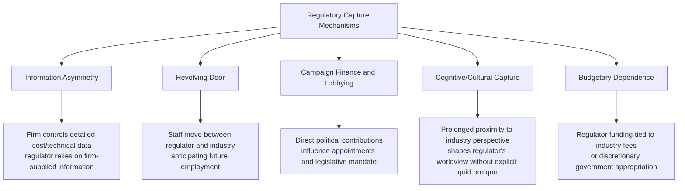

## Regulatory Capture and Political Economy of Energy Regulation

### Definition and Core Concept

Regulatory capture describes the process by which a regulatory agency, created to act in the public interest, comes to be dominated by the interests of the industry it regulates rather than the broader public it is meant to serve. Political economy of energy regulation is the broader analytical lens examining how concentrated interest groups, information asymmetries, institutional incentives, and electoral/political pressures shape regulatory outcomes — often producing results that diverge systematically from the efficiency and welfare objectives outlined under **Rationale for Regulating Natural Monopolies**.

This topic connects directly to **Regulatory Institutions and Independence Design**: independence is the primary institutional defense against capture, but independence design alone does not guarantee that capture is avoided in practice — the mechanisms and incentives underlying capture must be understood to evaluate why formal safeguards succeed or fail.

### Stigler's Economic Theory of Regulation

**Core Thesis**

George Stigler's 1971 paper "The Theory of Economic Regulation" fundamentally reframed regulation not as a public-interest correction to market failure, but as a good or service that industries actively *demand* and that politicians *supply* in exchange for political support (votes, campaign contributions, favorable coverage). In this framework, regulation is frequently used by incumbent firms to protect themselves from competition (entry barriers, price floors) rather than to protect consumers.

$$\text{Regulation is supplied to the group willing to pay the most in political support}$$

**Why Concentrated Industry Interests Tend to Dominate**

Stigler's theory rests on **Olson's logic of collective action** (Mancur Olson, 1965): a small number of firms with large individual stakes in a regulatory outcome face low organizing costs and strong individual incentives to lobby, while a large, diffuse population of consumers — each bearing only a small individual cost from a captured regulatory decision — faces a severe free-rider problem in organizing collective opposition.

$$\text{Per-firm stake} \gg \text{Per-consumer stake}, \quad \text{despite} \quad \text{Total consumer stake} > \text{Total firm stake}$$

This asymmetry in organizing capacity, not any inherent malice or corruption, is the structural foundation of capture risk in Stigler's framework — it applies even where regulators and firms act with full legal propriety.

### Peltzman's Extension: The Political Support Function

Sam Peltzman (1976) extended Stigler's model into a formal **political support-maximizing** framework, in which the regulator (or the politician overseeing the regulator) sets prices to maximize political support, balancing gains from favoring the regulated firm (contributions, lobbying support) against losses from angering consumers (votes, public backlash) if prices are set too high.

$$\max_{P} \; M(P) = f(\pi(P), CS(P))$$

Where $M$ is political support/majority, $\pi(P)$ is regulated firm profit as a function of price $P$, and $CS(P)$ is consumer surplus as a function of price. This model predicts that observed regulated prices will typically fall *between* the pure monopoly price and the pure competitive price — neither actor's interest is fully served, but the outcome reflects the relative political weight of concentrated producer interests versus diffuse consumer interests.

### Mechanisms of Capture in Energy Regulation

**1. Information Asymmetry**

The regulated utility possesses vastly superior information about its own true costs, technical constraints, demand forecasts, and investment needs than the regulator can independently verify. This is a persistent structural feature of rate-of-return and cost-of-service regulation (see **Incentive Regulation**), not merely a transitional problem, since even sophisticated regulators cannot replicate the firm's internal operational knowledge at reasonable cost.

**2. Revolving Door**

Regulatory staff and commissioners frequently move between regulatory agencies and the industries they oversee — before, during, or after their regulatory tenure. [Inference] The empirical literature on revolving-door effects finds mixed and context-dependent results: some studies document measurable pro-industry bias associated with revolving-door career patterns, while others find limited or statistically weak effects once technical expertise requirements (which naturally draw personnel from industry, since that is where the relevant expertise resides) are controlled for. The net effect likely depends heavily on the specific institutional safeguards in place (e.g., cooling-off periods, recusal rules).

**3. Campaign Finance and Lobbying**

In jurisdictions where regulatory commissioners are elected or appointed by elected officials, energy utilities and industry associations frequently engage in substantial lobbying and campaign contribution activity, creating potential channels of influence over the selection and behavior of regulators, even where individual regulatory decisions are not directly purchased.

**4. Cognitive or Cultural Capture**

A subtler mechanism than direct quid pro quo influence: regulators who interact primarily and repeatedly with industry representatives, attend industry conferences, and rely on industry-generated technical framing over time may come to internalize the industry's perspective on what constitutes reasonable costs, appropriate risk, or feasible timelines — without any explicit corrupt exchange. This form of capture is particularly difficult to detect or legislate against because it operates through genuine belief rather than conscious self-interest.

**5. Budgetary and Resource Dependence**

Where regulatory agencies are underfunded relative to the technical sophistication of the firms they oversee, agencies may lack the staff capacity to independently verify firm-submitted data, effectively forcing reliance on the regulated firm's own analysis — a resource-driven capture channel distinct from, but reinforcing, the pure information asymmetry problem.

### Distinguishing Capture from Legitimate Industry Expertise

A significant analytical difficulty in identifying capture is that regulators legitimately *need* deep technical engagement with the regulated industry to make competent decisions — engineering standards, cost benchmarks, and technology assessments require input from those with direct operational expertise, who often work in or recently worked in the industry.

[Inference] The line between beneficial technical consultation (necessary for competent regulation) and problematic capture (systematic bias favoring the firm's interests over the public interest) is not always sharply observable from outside the regulatory process, and reasonable analysts can disagree about whether a specific regulatory outcome reflects legitimate technical judgment or captured decision-making. This ambiguity is itself a structural feature of the political economy of regulation, not merely a measurement limitation.

### Countervailing Forces and Capture Mitigation

**Multiple/Competing Interest Groups**

Where multiple organized interest groups have opposing stakes in a regulatory outcome (e.g., large industrial consumers favoring low rates vs. utility shareholders favoring high allowed returns vs. renewable developers favoring specific interconnection rules), the presence of competing organized interests can partially offset the pure producer-capture dynamic predicted by simple versions of Stigler's model — this is sometimes termed **countervailing power** or a more pluralistic "interest group competition" model of regulation (associated with scholars such as Gary Becker's 1983 extension of the economic theory of regulation).

**Consumer Advocate Institutions**

Many jurisdictions have established dedicated **consumer/ratepayer advocate offices** (e.g., state Offices of Public Counsel or Consumer Advocates in various U.S. states, similarly structured bodies in other countries) — publicly funded parties with formal standing to intervene in rate cases specifically to represent diffuse consumer interests, directly addressing the Olson collective-action asymmetry by providing dedicated professional representation for the otherwise underrepresented consumer side.

**Transparency and Public Participation Requirements**

Mandatory public comment periods, published written decisions with reasoning, open rate-case hearings, and freedom-of-information access to regulatory filings all increase the cost of purely captured decision-making by exposing regulatory reasoning to external scrutiny — a partial technological/procedural substitute for the missing consumer lobbying capacity.

**Yardstick Competition and Benchmarking**

As discussed under **Incentive Regulation**, comparing a firm's costs against peer utilities reduces the regulator's reliance on the firm's own self-reported cost data, directly mitigating the information-asymmetry channel of capture.

**Independent Market Monitors**

In restructured wholesale markets, the Independent Market Monitor function (see **Market Power Mitigation in Restructured Markets**) exists partly as an institutional response to capture risk, providing a dedicated, technically resourced entity whose mandate is specifically adversarial to market participant interests rather than facilitative.

### Political Economy Dynamics Specific to the Energy Transition

**Stranded Asset Politics**

Decarbonization policy creates concentrated losses for fossil fuel asset owners and employees (a classic Olson-style concentrated interest with strong incentive to organize opposition) against diffuse, longer-term climate benefits spread across the broader population — a political economy structure that, under Stigler/Peltzman logic, would predict systematic regulatory and legislative resistance to rapid stranded-asset write-downs, all else equal.

**Renewable Industry as an Emerging Concentrated Interest**

As renewable energy and battery storage industries have grown, they have themselves become organized, well-resourced lobbying interests, meaning some jurisdictions now exhibit competing concentrated-interest dynamics between incumbent fossil/utility interests and emerging clean-energy industry interests, rather than a single dominant captured relationship — an example of the Becker-style competing-interest-group dynamic playing out in real time in energy policy.

**State-Owned Enterprise Political Economy**

In jurisdictions where energy utilities remain state-owned (common in many developing and some developed economies), the political economy dynamic differs structurally from the private-firm capture model: rather than a private firm capturing an independent regulator, the risk is that the state-owned utility and the regulating ministry share the same ultimate principal (the government), creating an inherent conflict of interest that is difficult to resolve through independence design alone, since the "regulator" and the "regulated" may report, directly or indirectly, to the same executive authority. This is a primary rationale, discussed under **Regulatory Institutions and Independence Design**, for separating regulatory functions from ownership functions even where full privatization is not undertaken.

### Empirical Identification Challenges

Testing regulatory capture theories empirically is methodologically difficult because:

- Captured and non-captured (efficient, public-interest) regulatory decisions can look observationally similar if the "correct" cost-based outcome happens to coincide with the industry-favored outcome
- Regulators may have legitimate technical reasons for decisions that also happen to favor the regulated firm, making intent or causal capture difficult to isolate from correlation
- Political economy models generate testable predictions (e.g., Peltzman's prediction that regulated prices fall between monopoly and competitive levels) but calibrating the counterfactual competitive or monopoly benchmark price for a specific real-world utility is itself empirically demanding

[Unverified] Claims about the degree of capture in any specific real-world regulatory proceeding should generally be treated as contestable interpretive judgments rather than settled empirical facts, given these identification challenges, unless supported by specific documented evidence (e.g., disclosed communications, revealed conflicts of interest) rather than inferred purely from outcome patterns.

### Comparative Summary: Public Interest vs. Capture Theory Predictions

| Dimension | Public Interest Theory Prediction | Capture/Economic Theory Prediction |
| --- | --- | --- |
| Purpose of regulation | Correct market failure, maximize social welfare | Redistribute rents toward organized interests |
| Regulated price outcome | Approximates competitive/efficient price | Falls between competitive and monopoly price (Peltzman) |
| Entry barriers | Regulation minimizes unnecessary barriers | Regulation often used to erect barriers protecting incumbents |
| Information use | Regulator acts on best available social welfare data | Regulator relies heavily on firm-supplied, potentially biased data |
| Beneficiary of regulatory rents | Diffuse consumer base | Concentrated regulated industry |

### Key Points

- Stigler's economic theory of regulation reframes regulation as a good demanded by industry and supplied by politicians in exchange for political support, driven by asymmetric organizing incentives between concentrated producers and diffuse consumers (Olson's collective action logic)
- Peltzman's political support-maximization model predicts regulated outcomes typically fall between pure monopoly and pure competitive prices, reflecting the relative political weight of producer versus consumer interests
- Capture operates through multiple, sometimes overlapping mechanisms: information asymmetry, revolving-door employment, campaign finance/lobbying, cognitive/cultural capture, and budgetary dependence
- Distinguishing legitimate technical expertise reliance from problematic capture is inherently difficult and often not empirically resolvable with certainty
- Mitigation mechanisms include consumer advocate institutions, transparency/public participation requirements, yardstick competition/benchmarking, and independent market monitoring — largely designed to offset the specific collective-action and information asymmetries capture theory identifies
- Energy transition dynamics introduce new political economy patterns, including stranded-asset interest group resistance and emerging competing lobbying power from renewable energy industries

### Related Topics

- Regulatory institutions and independence design
- Incentive regulation and yardstick competition as capture-mitigation tools
- Market power mitigation and the role of Independent Market Monitors
- Olson's logic of collective action and interest group theory
- Consumer/ratepayer advocate institutional design
- State-owned enterprise governance and regulator-owner conflicts of interest
- Stranded asset risk and the political economy of decarbonization
- Comparative political economy of utility regulation across jurisdictions
- Behavioral and cognitive capture versus quid pro quo corruption models
- Transparency, public participation, and administrative procedure requirements in rate cases