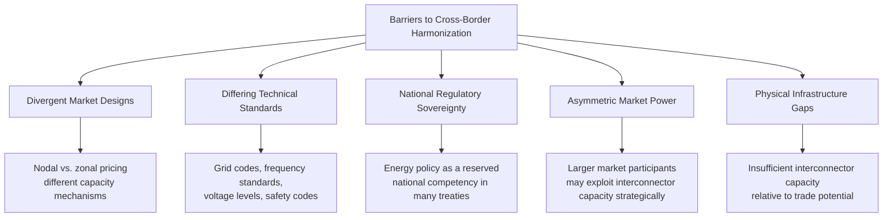
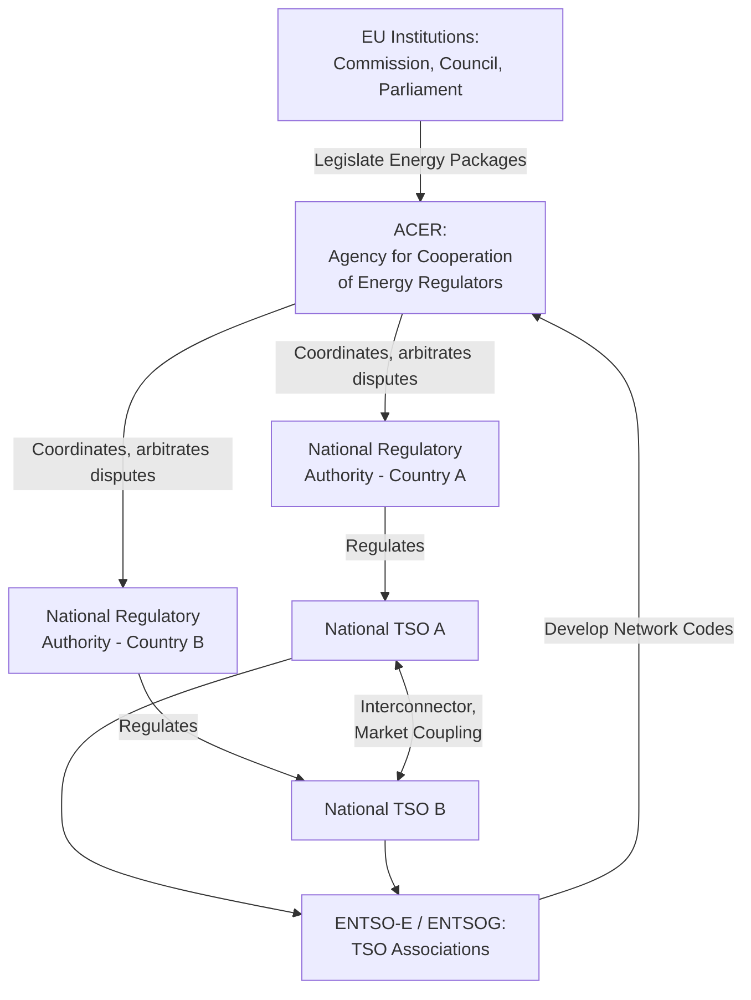

## International Regulatory Harmonization and Cross-Border Markets

### Definition and Core Concept

International regulatory harmonization in energy refers to the alignment of technical standards, market rules, licensing procedures, and regulatory frameworks across national jurisdictions to enable efficient cross-border trade in electricity, natural gas, and increasingly hydrogen and carbon. Cross-border energy markets are the physical and commercial infrastructures — interconnectors, pipelines, coupled power exchanges — through which this trade occurs. The central economic rationale is capturing gains from trade across geographically differentiated resource endowments, demand patterns, and generation cost structures, while the central governance challenge is that energy regulation is traditionally a matter of national (or sub-national) sovereignty, creating a persistent tension between national regulatory autonomy and the efficiency gains available from cross-border coordination.

### Economic Rationale for Cross-Border Energy Trade

**Gains from Price Convergence and Arbitrage**

Where two adjacent markets have different marginal generation costs due to differing resource mixes (e.g., hydro-rich Norway versus thermal-dependent continental Europe), interconnection allows electricity to flow from the lower-price to the higher-price market until prices converge (net of transmission losses and congestion costs), generating welfare gains analogous to standard gains from trade:

$$\text{Welfare Gain} = \int_{Q_1}^{Q_2} [P_{high}(Q) - P_{low}(Q)] \, dQ$$

Where the flow of electricity across the interconnector continues until the price differential equals the marginal cost of transmission (including congestion rent), at which point further trade offers no additional net gain.

**Resource Complementarity and Diversification**

Cross-border interconnection allows a wider geographic pooling of variable renewable generation (wind, solar) and diverse demand patterns (different time zones, climates, industrial structures), reducing the effective variability that any single national system must manage in isolation — a particularly significant driver behind interconnection expansion policy in regions undergoing rapid renewable buildout.

**Security of Supply and Reserve Sharing**

Interconnected systems can share reserve capacity and respond to contingencies (unplanned outages, extreme weather) using neighboring systems' spare capacity, reducing the total reserve margin each individual system must independently maintain — though this benefit depends on coordinated operational protocols and sufficient interconnector capacity being available precisely when needed.

### Barriers to Harmonization

**Divergent Market Designs**: Neighboring jurisdictions may use fundamentally different wholesale market structures (zonal versus nodal/locational marginal pricing, energy-only versus capacity-market systems), complicating direct price coupling and requiring translation mechanisms between market designs.

**Differing Technical Standards**: Grid codes, frequency and voltage standards, and interconnection technical requirements historically developed independently across national systems, requiring harmonization efforts before physical interconnection can operate efficiently and safely.

**National Regulatory Sovereignty**: Energy policy, including decisions about resource mix, security of supply, and pricing, is frequently treated as core national policy competency, creating institutional resistance to ceding regulatory authority to supranational bodies even where efficiency gains from harmonization are well established.

**Asymmetric Market Power at Interconnection Points**: A dominant generator in one jurisdiction may be able to exploit limited interconnector capacity strategically, extending market power concerns (see **Market Power Mitigation in Restructured Markets**) across borders in ways that a single national market monitor cannot fully address alone.

**Physical Infrastructure Gaps**: Harmonized rules cannot generate trade benefits without sufficient physical transmission/pipeline capacity; interconnector construction typically requires large capital investment, long permitting timelines, and cross-border cost allocation agreements, and can lag behind market design harmonization.

### Institutional Models for Cross-Border Coordination

**The European Union Model: Deep Legal Harmonization**

The EU represents the most developed model of formal supranational energy market harmonization, built through successive legislative packages:

- **First and Second Energy Packages (1996, 2003)**: Established basic principles of market opening, unbundling, and third-party network access
- **Third Energy Package (2009)**: Strengthened unbundling requirements, established National Regulatory Authorities (NRAs) with defined independence criteria, and created the **Agency for the Cooperation of Energy Regulators (ACER)** to coordinate cross-border regulatory issues and resolve disputes between NRAs
- **Network Codes and Guidelines**: Detailed, legally binding technical and market rules (e.g., capacity allocation and congestion management, balancing, connection codes) developed collaboratively through the European Network of Transmission System Operators (ENTSO-E for electricity, ENTSOG for gas) and approved through EU comitology processes
- **Market Coupling**: A specific harmonization mechanism (notably **Single Day-Ahead Coupling** and **Single Intraday Coupling**) whereby day-ahead and intraday electricity prices across participating EU member states are calculated jointly, with cross-border flows determined implicitly by the price coupling algorithm rather than through separate explicit transmission capacity auctions — a deep form of market integration going beyond mere information-sharing harmonization
- **Clean Energy Package (2019)** and subsequent reforms: Further refined rules for renewable integration, capacity mechanisms, and cross-border balancing

**The U.S. Model: Federal Jurisdiction Over Interstate Commerce**

Rather than harmonizing across fully sovereign nations, the U.S. addresses cross-border (interstate) coordination through federal constitutional authority: the **Federal Energy Regulatory Commission (FERC)** has jurisdiction over interstate transmission and wholesale electricity sales, and interstate natural gas pipeline transportation, under the Federal Power Act and Natural Gas Act. Regional Transmission Organizations (RTOs) such as PJM, MISO, and ISO-New England often span multiple states, operating a single integrated wholesale market and transmission planning process across state lines under FERC oversight — achieving a degree of "harmonization" through unified federal jurisdiction rather than treaty-based cooperation among fully sovereign entities. Coordination between RTOs at their "seams" (boundaries) and between the U.S. and Canadian/Mexican systems remains comparatively less deeply integrated than intra-EU coupling.

**Regional Power Pools in Developing/Emerging Markets**

Regional power pools represent an intermediate model, typically involving voluntary intergovernmental agreements among neighboring sovereign states without the deep supranational legal architecture of the EU:

- **Southern African Power Pool (SAPP)**: Facilitates trade among member utilities across Southern African Development Community countries through a coordinated but less centrally harmonized framework than the EU model
- **West African Power Pool (WAPP)**: Aims to interconnect national grids across ECOWAS member states and establish a regional electricity market
- **Central American Electrical Interconnection System (SIEPAC)**: Connects Central American countries via a regional transmission line and coordinated regional market operator (EOR, Ente Operador Regional)

[Inference] These regional pools generally exhibit a wide range of institutional maturity and harmonization depth depending on the specific pool, ranging from basic bilateral trading arrangements to more centralized regional dispatch and market-clearing mechanisms; the degree of actual market integration achieved varies significantly and should be assessed against current pool-specific documentation rather than assumed uniform across all regional pools.

### Cross-Border Infrastructure and Cost Allocation

**Interconnector Investment and Cost-Benefit Sharing**

A persistent technical and political challenge in cross-border infrastructure is allocating the cost of an interconnector between the jurisdictions it connects, since benefits (price convergence gains, reliability improvements) may accrue asymmetrically to each side. Mechanisms include:

- **Cost-Benefit Analysis (CBA) frameworks**: Formal methodologies (e.g., ENTSO-E's Ten-Year Network Development Plan cost-benefit methodology in the EU) to quantify and allocate costs proportionally to estimated benefits captured by each jurisdiction
- **Merchant interconnectors**: Privately financed interconnectors that recover costs through congestion rent (the price differential captured when flowing power from low-price to high-price zones) rather than through regulated cost allocation, shifting investment risk to private developers
- **Regulated cost-sharing agreements**: Formal treaties or regulatory decisions splitting interconnector costs according to negotiated shares, often used where merchant risk is deemed too high to attract private financing alone

**Congestion Revenue and Its Allocation**

$$\text{Congestion Rent} = (P_{high} - P_{low}) \times Q_{flow}$$

Where $Q_{flow}$ is the quantity flowing across the interconnector. This revenue (arising from the price differential when the interconnector is capacity-constrained) is typically allocated between the transmission system operators on each side according to a pre-agreed formula, and in EU market coupling is used to fund transmission infrastructure or offset network tariffs, per specific EU regulatory guidelines.

### Cross-Border Gas Markets and Pipeline Regulation

Natural gas cross-border trade introduces additional harmonization dimensions distinct from electricity:

- **Third-party access (TPA) to pipelines**: Legal requirement that pipeline owners provide non-discriminatory access to third-party gas shippers, a principle central to EU gas market liberalization and analogous to open-access requirements in electricity transmission
- **Entry-exit tariff systems**: A gas transport tariff design (widely adopted in the EU) charging shippers for capacity at network entry and exit points independent of the specific transport path taken through the network, simplifying cross-border trading relative to distance/path-based tariffs
- **LNG as a harmonization bypass**: Liquefied natural gas trade operates largely outside pipeline-based cross-border regulatory frameworks, since LNG cargoes can be redirected to whichever market offers the best price, creating a de facto globally arbitraged gas market segment that operates with less formal regulatory harmonization than pipeline-connected regional gas markets

### Emerging Cross-Border Harmonization Frontiers

**Cross-Border Carbon Pricing and Carbon Border Adjustment Mechanisms**

As jurisdictions adopt divergent carbon pricing regimes, mechanisms such as the EU's **Carbon Border Adjustment Mechanism (CBAM)** attempt to address competitiveness and carbon leakage concerns arising from uneven carbon pricing harmonization, representing an emerging and evolving area of cross-border energy/climate policy interaction. [Unverified] The specific scope, phase-in schedule, and covered sectors of such mechanisms are subject to ongoing legislative and regulatory development, so current details should be verified against the latest official regulatory text rather than assumed static.

**Hydrogen Market Harmonization**

As green/low-carbon hydrogen production and trade develop, jurisdictions are beginning to develop certification standards, cross-border transport infrastructure planning, and trade rules for hydrogen — an area where harmonization frameworks are still substantially less mature than for electricity or natural gas. [Speculation] Given the early stage of hydrogen market development globally, the eventual institutional architecture for cross-border hydrogen trade harmonization remains genuinely uncertain and is likely to be shaped significantly by which technical certification standards achieve broad international adoption in the coming years.

**Renewable Energy Certificate and Guarantee of Origin Harmonization**

Cross-border trade in renewable energy attributes (e.g., EU Guarantees of Origin, various national/regional Renewable Energy Certificate schemes) requires harmonized tracking, verification, and mutual recognition frameworks to prevent double-counting of renewable claims across jurisdictions — an increasingly important harmonization dimension as corporate renewable procurement and national decarbonization accounting become more cross-border in nature.

### Comparative Summary of Harmonization Models

| Model | Legal Basis | Degree of Integration | Example |
| --- | --- | --- | --- |
| Supranational legal harmonization | Treaty-based binding law, common institutions | Deep (market coupling, shared network codes) | European Union (ACER, ENTSO-E) |
| Federal constitutional jurisdiction | Domestic constitutional/federal law | Deep within jurisdiction (single sovereign) | United States (FERC, RTOs) |
| Voluntary regional power pool | Intergovernmental agreement among sovereign states | Variable, often shallower than EU model | SAPP, WAPP, SIEPAC |
| Bilateral interconnection agreements | Bilateral treaty or commercial agreement | Shallow (specific interconnector terms only) | Various cross-border interconnectors globally |
| Global commodity arbitrage (no formal harmonization) | Commercial contracts, general trade law | Market-driven convergence without regulatory harmonization | LNG spot trade |

### Key Points

- Cross-border energy trade generates welfare gains from price convergence, resource complementarity, and shared reserve capacity, analogous to standard gains-from-trade economics
- Harmonization is constrained by divergent market designs, technical standards, national regulatory sovereignty, and physical infrastructure gaps
- The EU represents the deepest model of supranational harmonization, using binding network codes, ACER coordination, and market coupling mechanisms to achieve price and rule integration across sovereign member states
- The U.S. achieves comparable coordination through federal constitutional jurisdiction (FERC) rather than treaty-based cooperation among fully sovereign entities
- Regional power pools in developing regions typically exhibit shallower and more variable harmonization depth than the EU model
- Interconnector cost allocation and congestion revenue distribution remain persistent technical and political challenges even where harmonized market rules exist
- Hydrogen market harmonization and cross-border carbon pricing mechanisms represent active, still-maturing frontiers of international energy regulatory coordination

### Related Topics

- Market power mitigation in restructured markets (cross-border dimension)
- Regulatory institutions and independence design (National Regulatory Authorities)
- Locational Marginal Pricing versus zonal pricing market design
- ENTSO-E network codes and the EU Ten-Year Network Development Plan
- Third-party access regimes in gas pipeline regulation
- Carbon Border Adjustment Mechanisms and cross-border carbon leakage
- Regional power pools in Africa, Latin America, and Southeast Asia
- Guarantees of Origin and renewable energy certificate trading systems
- Interconnector investment, merchant transmission, and cost-benefit allocation methodologies
- Emerging cross-border hydrogen trade and certification standards