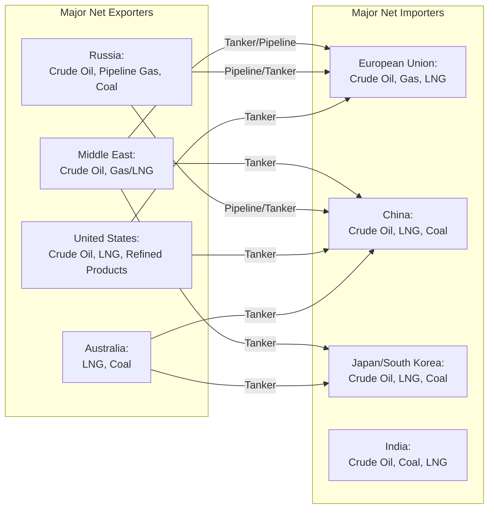

## Comparative Advantage and Energy Trade Patterns

### Definition and Core Concept

Comparative advantage is the economic principle explaining why countries specialize in and trade energy resources even when one country could produce all forms of energy more efficiently than another in absolute terms. First formalized by David Ricardo (1817), the principle holds that mutually beneficial trade arises from *relative* differences in opportunity cost across countries, not from *absolute* differences in productive efficiency. Applied to energy, this explains observed global trade patterns in crude oil, natural gas (pipeline and LNG), coal, refined products, and increasingly electricity and low-carbon commodities (hydrogen, ammonia, critical minerals).

### The Ricardian Framework Applied to Energy

**Absolute vs. Comparative Advantage**

A country has **absolute advantage** in energy production if it can produce a given quantity of energy using fewer resources (labor, capital, land) than another country. A country has **comparative advantage** if its *opportunity cost* of producing energy (measured in terms of the other goods forgone) is lower than another country's opportunity cost, even if it lacks absolute advantage in energy production itself.

$$\text{Opportunity Cost of Energy}_{\text{Country A}} = \frac{\text{Units of Other Good Forgone}}{\text{Units of Energy Produced}}$$

Trade is mutually beneficial whenever opportunity costs differ between two countries, because each can specialize in the good for which its opportunity cost is relatively lower and trade for the other.

**Simple Two-Country, Two-Good Illustration**

Consider two countries, each able to produce oil and manufactured goods with different labor productivity:

| Country | Labor Hours per Barrel of Oil | Labor Hours per Unit of Manufactured Good |
| --- | --- | --- |
| Country X | 2 | 4 |
| Country Y | 10 | 5 |

Country X has absolute advantage in both goods (fewer labor hours needed for each). However, Country X's opportunity cost of oil is 0.5 units of manufactured goods per barrel ($2/4$), while Country Y's opportunity cost of oil is 2 units of manufactured goods per barrel ($10/5$). Country X therefore has *comparative* advantage in oil (its relative cost of producing oil is lower), and Country Y has comparative advantage in manufactured goods — both countries gain from trade by specializing accordingly, even though Country X is absolutely more efficient at producing both goods.

### Sources of Comparative Advantage in Energy

**1. Resource Endowment (Ricardian/Heckscher-Ohlin Factors)**

The dominant driver of observed energy trade patterns is geological and geographic resource endowment — the presence of extractable hydrocarbon reserves, favorable hydro/geothermal geography, or high-quality wind/solar resources, which is largely exogenous to a country's labor or capital productivity in the broader economy.

$$\text{Comparative advantage in fossil fuels} \approx f(\text{proven reserves}, \text{extraction cost per unit})$$

Countries with large, low-extraction-cost reserves (e.g., Saudi Arabia's conventional onshore oil, with historically very low lifting costs) hold comparative advantage in fossil energy production largely independent of their broader economic productivity.

**2. Extraction and Production Cost Differentials**

Beyond simple resource presence, the marginal cost of extraction varies significantly by geology and technology — conventional Middle Eastern oil fields typically have substantially lower lifting costs than deepwater offshore fields or unconventional (shale/tight oil) resources, creating a cost-based hierarchy of comparative advantage even among countries that each possess some reserves.

**3. Renewable Resource Quality (Emerging Comparative Advantage Source)**

For renewable energy, comparative advantage increasingly derives from resource *quality* metrics such as capacity factor potential:

$$\text{Capacity Factor} = \frac{\text{Actual Energy Output}}{\text{Maximum Possible Output at Rated Capacity}}$$

Countries or regions with consistently high wind speeds, high solar irradiance (measured in kWh/m²/day), or strong hydro potential (elevation drop combined with reliable water flow) hold a natural comparative advantage in renewable electricity generation cost, analogous to fossil resource endowment — this is an increasingly important and evolving driver of trade patterns in electricity and derived commodities like green hydrogen.

**4. Refining and Value-Chain Position**

Comparative advantage in energy is not limited to raw resource extraction; countries can hold comparative advantage in downstream processing (refining, petrochemicals, LNG liquefaction/regasification) based on capital intensity, technical expertise, port infrastructure, and proximity to demand centers, independent of whether they hold comparative advantage in the underlying raw resource extraction itself.

**5. Infrastructure and Transport Cost Advantage**

Geographic proximity to major demand centers, combined with existing pipeline or shipping infrastructure, can create comparative advantage in delivered energy cost even absent superior resource quality — for example, pipeline gas typically holds a comparative transport-cost advantage over LNG for geographically proximate trade routes below certain distances, while LNG's flexibility and lower fixed infrastructure requirements can hold comparative advantage for longer or non-contiguous routes.

### Global Energy Trade Pattern Overview

[Inference] The specific magnitudes and bilateral flow patterns depicted above are illustrative of long-standing structural trade relationships; actual year-to-year trade volumes and bilateral routes shift with geopolitical events, sanctions regimes, and infrastructure changes (e.g., the substantial reconfiguration of European gas import patterns following 2022 disruptions to Russian pipeline supply), so current-year specific figures should be verified against up-to-date trade statistics rather than treated as static.

### Terms of Trade and Energy Exporter Dependence

**Terms of Trade Concept**

$$\text{Terms of Trade} = \frac{\text{Price Index of Exports}}{\text{Price Index of Imports}} \times 100$$

For energy-exporting economies with limited economic diversification, national income and government fiscal revenue become highly sensitive to global energy commodity price fluctuations, since the terms of trade move directly with export commodity prices while import prices (often manufactured goods, food, and services) are comparatively more stable.

**The "Resource Curse" and Dutch Disease**

[Inference] A substantial body of development economics literature discusses how heavy reliance on comparative advantage in a single natural resource export can be associated with certain negative macroeconomic and institutional outcomes in some resource-exporting economies — including real exchange rate appreciation crowding out other tradable sectors (**Dutch disease**, named after the Netherlands' experience following North Sea gas discovery) and governance/institutional quality challenges sometimes termed the **resource curse**. However, this literature also documents important counterexamples (e.g., Norway, Botswana) where strong institutional frameworks appear to have substantially mitigated these risks, indicating that the relationship between resource-based comparative advantage and adverse economic outcomes is heavily conditioned by domestic institutional quality rather being an automatic consequence of resource abundance itself.

### Comparative Advantage Dynamics: Shale Revolution Case Study

The U.S. shale (tight oil and shale gas) revolution, driven by the technological combination of horizontal drilling and hydraulic fracturing from the mid-2000s onward, is a well-documented example of comparative advantage shifting due to technological change rather than resource discovery. This significantly lowered the extraction cost of previously uneconomic unconventional hydrocarbon resources, transforming the United States from a growing net oil and gas importer into a major exporter of crude oil, refined products, and LNG within roughly a decade — illustrating how comparative advantage in energy trade is not fixed by geology alone but is jointly determined by geology *and* the prevailing extraction technology frontier, which itself evolves.

### Comparative Advantage in the Energy Transition

**Green Hydrogen and Renewable-Rich Geographies**

Countries with exceptionally high-quality solar or wind resources (e.g., parts of the Middle East, North Africa, Australia, Chile) are widely discussed as potential future comparative-advantage exporters of green hydrogen or hydrogen-derived commodities (ammonia, synthetic fuels), on the logic that abundant, low-cost renewable electricity is the dominant cost driver of electrolytic hydrogen production. [Speculation] Whether this theoretical comparative advantage translates into large-scale realized trade flows depends on unresolved questions including future electrolyzer cost trajectories, hydrogen transport/shipping economics, and demand-side policy support in importing countries, making the eventual scale and geographic pattern of global hydrogen trade substantially uncertain at this stage.

**Critical Minerals and the Electrification Value Chain**

The shift toward electrification and battery storage is creating new comparative advantage dynamics around critical mineral extraction (lithium, cobalt, nickel, rare earth elements) and battery/component manufacturing, with geological endowment again playing a dominant role (e.g., Chile and Australia in lithium, Democratic Republic of Congo in cobalt) alongside processing and manufacturing comparative advantage that has historically concentrated significantly in a small number of countries. [Inference] The geographic concentration of both extraction and midstream processing capacity for several critical minerals is a frequently cited factor in current energy security policy discussions, though the pace and success of diversification efforts by importing countries remains to be seen and is an active area of industrial policy.

**Stranded Comparative Advantage Risk**

Countries whose economic structure and comparative advantage are built around fossil fuel export face a distinct long-term risk: if global decarbonization substantially and durably reduces demand for their core export commodity, previously advantageous resource endowments could become economically stranded assets in aggregate — a macro-level analogue to the asset-specific stranded cost issues discussed under other regulatory topics in this chapter. The scale and timing of this risk is a subject of considerable ongoing analysis and depends heavily on the pace of global demand-side decarbonization, which remains genuinely uncertain.

### Trade Policy Distortions to Comparative Advantage

**Subsidies and State Ownership**

Many major energy-exporting economies feature substantial state ownership of resource extraction and, in some cases, subsidized domestic energy prices, which can distort the *revealed* trade pattern relative to the *underlying* comparative advantage that would prevail under fully market-determined pricing — complicating pure Ricardian analysis of observed trade flows.

**Export Restrictions and Strategic Reserves**

Some countries impose export quotas, licensing requirements, or maintain strategic reserves (e.g., the U.S. Strategic Petroleum Reserve) for energy security reasons, which can suppress or redirect trade flows relative to a pure comparative-advantage-driven pattern — an example of security/geopolitical objectives overriding narrow economic efficiency in trade policy (further explored under geopolitical topics in this chapter).

**Sanctions and Geopolitical Trade Redirection**

Sanctions regimes (e.g., historical and current sanctions affecting Iranian, Venezuelan, and Russian energy exports) can force substantial reconfiguration of trade flows away from the pattern that pure comparative advantage would otherwise predict, redirecting exports toward non-sanctioning countries often at a price discount, and requiring importing countries to source from higher-cost alternative suppliers — a clear illustration of geopolitical factors overriding, though not eliminating, underlying comparative-advantage-based trade incentives.

### Practical Example: Comparative Advantage Calculation

Consider two hypothetical countries producing crude oil and refined petrochemical products:

| Country | Barrels of Oil per Unit of Labor | Units of Petrochemicals per Unit of Labor |
| --- | --- | --- |
| Gulf State | 100 | 20 |
| Industrial State | 20 | 30 |

Opportunity cost of oil in Gulf State: $20/100 = 0.2$ units of petrochemicals per barrel.

Opportunity cost of oil in Industrial State: $30/20 = 1.5$ units of petrochemicals per barrel.

Since the Gulf State's opportunity cost of oil (0.2) is lower than the Industrial State's (1.5), the Gulf State holds comparative advantage in crude oil production and should specialize accordingly, exporting oil and importing petrochemicals; the Industrial State holds comparative advantage in petrochemical production. Both countries gain from trading according to this pattern relative to attempting self-sufficiency in both goods — illustrating, at a simplified level, the widely observed real-world pattern of crude oil exporters progressively investing in downstream refining/petrochemical capacity specifically to capture additional value-chain comparative advantage beyond raw resource export, rather than remaining purely upstream exporters indefinitely.

### Key Points

- Comparative advantage, not absolute advantage, explains mutually beneficial energy trade — countries specialize according to relative opportunity cost, not absolute production efficiency
- Resource endowment (reserves, extraction cost, renewable resource quality) is the dominant traditional driver of comparative advantage in energy, though technology change (e.g., the shale revolution) can shift comparative advantage independent of new resource discovery
- Terms-of-trade sensitivity and resource curse/Dutch disease dynamics are important but institutionally contingent risks for economies whose comparative advantage concentrates heavily in energy export
- The energy transition is creating new comparative advantage frontiers (renewable resource quality for green hydrogen, critical mineral endowment for electrification) whose eventual trade pattern significance remains genuinely uncertain
- Observed real-world trade flows reflect a combination of underlying comparative advantage and trade policy distortions including subsidies, state ownership, export restrictions, and geopolitical sanctions

### Related Topics

- OPEC and strategic behavior in oil markets
- LNG market globalization and pricing mechanisms (oil-indexed vs. spot/hub-based)
- Resource curse and Dutch disease in resource-dependent economies
- Geopolitics of pipeline infrastructure and energy security
- Strategic petroleum reserves and energy security policy
- Sanctions regimes and energy trade redirection
- Green hydrogen trade economics and certification standards
- Critical minerals supply chains and geopolitical concentration risk
- Terms of trade volatility and fiscal policy in resource-exporting economies
- Technological change and shifting comparative advantage (the shale revolution case)