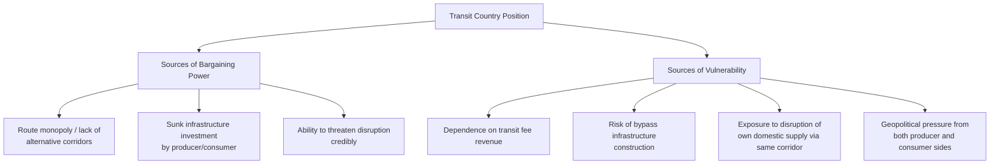
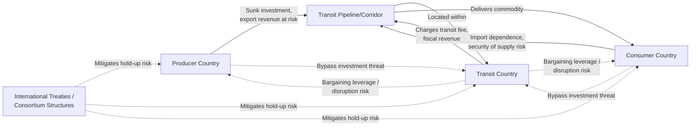

## Energy Corridors and Transit Country Economics

### Definition and Core Concept

An energy corridor is a fixed geographic pathway — pipeline route, maritime chokepoint, or transmission line — through which energy commodities move from producing regions to consuming markets. Transit country economics is the analytical framework examining the costs, benefits, risks, and strategic bargaining dynamics faced by countries whose territory lies along such a corridor but which are neither the primary producer nor the primary consumer of the energy flowing through it. Transit countries occupy a distinctive economic position: they can extract value from their locational position (transit fees, geopolitical leverage) while simultaneously bearing risks (supply disruption exposure, asset stranding, bilateral dependency) not faced by pure producers or pure consumers.

### Economic Rationale for Transit Infrastructure

**Natural Monopoly Characteristics of Transit Corridors**

Pipeline and transmission corridors exhibit strong natural monopoly characteristics analogous to domestic energy networks (see **Rationale for Regulating Natural Monopolies in Energy**): high fixed sunk costs, low marginal cost of throughput, and physical route constraints that make duplicate parallel infrastructure economically wasteful absent very large capacity needs. This creates the foundational economic tension of transit relationships — the transit country's segment of infrastructure has few substitutes in the short-to-medium run, giving it bargaining leverage disproportionate to the value it adds.

**Bilateral Monopoly / Bilateral Bargaining Structure**

Transit relationships are frequently characterized by **bilateral monopoly** conditions: a producer with limited alternative export routes bargaining with a transit country that has limited alternative revenue sources for that specific corridor, and often also with an importing country that has limited alternative supply sources via that route. Standard bilateral monopoly theory suggests the division of the transit rent between producer, transit country, and consumer depends on relative bargaining power, outside options, and the cost of alternative routes — rather than being pinned down by a unique competitive market price.

$$\text{Transit Rent} = P_{consumer} - P_{producer} - C_{transport}$$

Where the transit fee charged by the transit country is a negotiated share of this rent, bounded below by the transit country's opportunity cost of allowing passage and bounded above by the cost of the cheapest viable alternative route available to the producer/consumer pair.

### Sources of Transit Country Bargaining Power and Vulnerability

**Sources of Power**: A transit country's leverage derives primarily from the absence of economically comparable alternative routes in the relevant timeframe. Since pipeline and dedicated transmission infrastructure represents long-lived sunk investment by the producer (and often the consumer, via dedicated import infrastructure), the transit country can, in principle, threaten to disrupt or renegotiate terms after the infrastructure is built — a transit-specific manifestation of the same **time-inconsistency problem** discussed under **Regulatory Institutions and Independence Design**, but operating between sovereign states rather than between a regulator and a domestic firm.

**Sources of Vulnerability**: Transit countries are simultaneously vulnerable because: (1) transit fee revenue can represent a material share of fiscal revenue or GDP for smaller transit economies, creating dependence on the continuation of flows; (2) producers and consumers facing perceived transit risk have a strong incentive to invest in **bypass infrastructure** (alternative routes avoiding the transit country entirely), which — once built — permanently eliminates the transit country's leverage; and (3) where the transit country also depends on the same infrastructure for its own domestic energy supply (common in pipeline transit relationships), disruption used as a bargaining tactic can backfire directly on the transit country's own consumers.

### The Investment Hold-Up Problem in Transit Relationships

Formally, transit corridor economics is a specific application of the **hold-up problem** in contract theory (Klein, Crawford, and Alchian, 1978; Williamson, 1979): once relationship-specific sunk investment (the pipeline) is made, the party without an outside option is vulnerable to opportunistic renegotiation (**ex post opportunism**) by the party controlling the now-essential asset.

$$NPV_{producer} = -I_0 + \sum_{t=1}^{n} \frac{E[R_t \mid \text{transit terms}]}{(1+r)^t}$$

If producers anticipate that transit fees or terms may be revised opportunistically after $I_0$ is sunk, they will rationally discount expected future revenue, raise the required rate of return $r$ (a transit-specific risk premium), or seek institutional/contractual mechanisms (see below) to mitigate this risk before committing capital.

### Institutional Mechanisms to Mitigate Transit Risk

**Long-Term Take-or-Pay Contracts**

Producers, transit operators, and consumers frequently negotiate long-term contracts with **take-or-pay** provisions (the buyer pays for a minimum contracted volume regardless of whether it is actually taken) specifically to reduce the hold-up risk on both sides by locking in volumes, prices, and terms for extended periods (often 15–25 years for major pipeline projects), reducing the scope for opportunistic renegotiation during the contract term.

**International Treaty Frameworks**

- **Energy Charter Treaty (ECT)**: A multilateral treaty framework (with a shifting roster of signatories over time) historically intended to provide legal protections for cross-border energy investment and transit, including dispute resolution mechanisms. [Inference] The Energy Charter Treaty's membership and relevance have been subject to significant recent flux, with several countries withdrawing in recent years over concerns including its perceived tension with climate policy commitments; current membership status should be verified against up-to-date sources rather than assumed static.
- **Bilateral and trilateral transit agreements**: Specific treaties directly between producer, transit, and consumer states (or transit-specific protocols within broader trade agreements) establishing transit fee formulas, volume guarantees, and dispute resolution mechanisms tailored to a specific corridor.

**Third-Party Ownership and International Consortium Structures**

Some major transit pipelines are structured with multinational ownership consortiums (including producer-country, transit-country, and international financial institution stakeholders) specifically to align incentives and increase the political cost of unilateral disruption by any single party, since disruption would damage the interests of multiple stakeholders simultaneously rather than only the counterparties.

### Route Diversification as a Strategic Response

**Bypass Route Economics**

Given the hold-up risk inherent in single-corridor dependence, producers and consumers frequently invest in **route diversification** — constructing alternative pipelines or LNG export/import capacity specifically to reduce dependence on any single transit country, even where the bypass route has a higher standalone unit transport cost, because the diversification itself carries strategic option value in reducing exposure to transit risk.

$$\text{Value of Diversification} = \text{Expected Disruption Cost Avoided} - \text{Incremental Cost of Bypass Route}$$

**Historical Example Pattern: European Gas Corridor Diversification**

[Inference] European gas import infrastructure has, over an extended period, seen substantial diversification efforts including LNG import terminal expansion and alternative pipeline routes, partly motivated by a desire to reduce dependence on specific transit corridors and specific supplier relationships following periods of disputed transit terms and supply disruptions. The specific configuration of currently operating and planned pipeline and LNG infrastructure serving European markets has changed substantially over time and continues to evolve, so current-year specific infrastructure status should be verified against up-to-date sources rather than treated as fixed.

### Maritime Chokepoints as a Distinct Transit Category

Unlike pipeline transit (which typically involves clear bilateral/trilateral state relationships), **maritime chokepoints** — narrow shipping straits through which a large share of global seaborne energy trade must pass — represent a transit category governed by international maritime law (notably the UN Convention on the Law of the Sea, UNCLOS) rather than bilateral transit contracts, though the littoral states bordering these chokepoints often hold significant strategic leverage.

**Prominent Examples of Structural Chokepoint Roles**:

- **Strait of Hormuz**: The primary maritime route for crude oil and LNG exports from major Persian Gulf producers, widely recognized as one of the world's most strategically significant chokepoints given the volume of oil and gas transiting it and the absence of comparably low-cost bypass capacity for the volumes involved
- **Strait of Malacca**: The principal maritime route connecting Middle Eastern and African crude oil supplies to major East Asian demand centers (China, Japan, South Korea)
- **Suez Canal and SUMED Pipeline**: Key routes connecting Middle Eastern/Gulf supply to European and North American demand, with the parallel SUMED pipeline serving as a partial bypass option for the Suez Canal specifically for crude oil (though not for other vessel traffic)
- **Bosporus and Turkish Straits**: A key route for crude oil exports from Russian and Caspian producers to global markets, subject to specific international navigation conventions (the Montreux Convention) governing passage

[Unverified] The relative strategic significance and traffic volumes through specific chokepoints fluctuate with shifts in global trade patterns, sanctions regimes, and alternative pipeline capacity, so any specific volume or "percentage of global trade" figures commonly cited for these chokepoints should be checked against current data sources rather than assumed fixed over time.

### Transit Fee Revenue and Fiscal Dependence

For smaller transit economies, pipeline transit fees can represent a material component of government revenue and export earnings, creating a structural fiscal dependence analogous to (though generally smaller in scale than) the resource-export dependence discussed under **Comparative Advantage and Energy Trade Patterns**. This creates an asymmetric vulnerability: the transit country's leverage over the producer/consumer relationship is a double-edged sword, since disruption of the corridor — whether initiated by the transit country itself as a bargaining tactic, or by external conflict, sabotage, or producer/consumer-side bypass investment — directly threatens the transit country's own fiscal position.

### Governance and Risk Allocation Structure

### Practical Example: Stylized Transit Fee Negotiation

Consider a pipeline corridor where the producer's netback price without transit access is $40/barrel-equivalent (value in a landlocked alternative market), the consumer's willingness to pay at the delivery point is $70/barrel-equivalent, and the pure engineering transport cost (excluding any transit fee) is $10/barrel-equivalent. The maximum available transit rent to be divided is:

$$\text{Rent} = 70 - 40 - 10 = 20 \text{ (\$/barrel-equivalent)}$$

This $20 surplus is divided between the producer (as netback price improvement above $40), the transit country (as transit fee), and potentially the consumer (as delivered price below $70), with the actual division determined by relative bargaining power, the credibility of bypass alternatives available to producer and consumer, and the transit country's own opportunity cost of denying passage — illustrating why transit fee levels observed in practice vary substantially across different corridors even where engineering transport costs are similar, since the fee reflects bargained rent division rather than a cost-based competitive price.

### Contemporary Challenges

**Sanctions and Transit Complicity Risk**

Transit countries can face secondary sanctions risk or reputational/political pressure from consumer-side governments when transiting energy from a sanctioned producer, creating a distinct modern risk category layered on top of traditional commercial transit risk.

**Stranded Transit Infrastructure Risk in the Energy Transition**

[Inference] As global decarbonization potentially reduces long-term demand for fossil fuel throughput, transit countries whose fiscal position depends significantly on pipeline transit fees face a long-term revenue risk analogous to producer-country stranded asset risk discussed under **Comparative Advantage and Energy Trade Patterns**, though the specific timing and magnitude of this risk for any given transit corridor depends on demand trajectories that remain genuinely uncertain.

**Emerging Electricity and Hydrogen Transit Corridors**

As cross-border electricity interconnection (see **International Regulatory Harmonization and Cross-Border Markets**) and potential future hydrogen pipeline networks develop, analogous transit economics questions are beginning to emerge for electricity transmission corridors and prospective hydrogen transport infrastructure, though the institutional and contractual frameworks for these newer corridor types are considerably less mature than those developed over decades for oil and gas pipeline transit.

### Key Points

- Transit countries occupy a distinctive bilateral-monopoly bargaining position: their leverage derives from the absence of low-cost alternative routes, while their vulnerability derives from fiscal dependence on transit revenue and exposure to bypass investment
- The economics of transit relationships is a direct application of the hold-up problem in contract theory, since producer and consumer sunk investment in transit-specific infrastructure creates scope for opportunistic renegotiation by the transit country after investment is committed
- Long-term take-or-pay contracts, international treaty frameworks, and multinational consortium ownership structures are the primary institutional mechanisms used to mitigate transit hold-up risk
- Route and corridor diversification carries strategic option value even at higher standalone transport cost, because it reduces exposure to single-corridor transit risk
- Maritime chokepoints represent a structurally distinct transit category governed by international maritime law rather than bilateral transit contracts, though littoral states can still hold significant strategic leverage
- Transit fee levels reflect bargained rent division between producer, transit country, and consumer rather than a cost-based competitive price, explaining significant fee variation across corridors with similar engineering transport costs

### Related Topics

- Rationale for regulating natural monopolies in energy (network economics parallel)
- Regulatory institutions and independence design (time-inconsistency parallel)
- Comparative advantage and energy trade patterns
- International regulatory harmonization and cross-border markets
- Hold-up problem and relationship-specific investment in contract theory
- Take-or-pay contract structures in long-term energy supply agreements
- Energy Charter Treaty and international energy investment protection
- Maritime chokepoints and global energy security (Strait of Hormuz, Malacca, Suez)
- Sanctions regimes and secondary transit risk
- Stranded infrastructure risk in fossil fuel transit and export economies