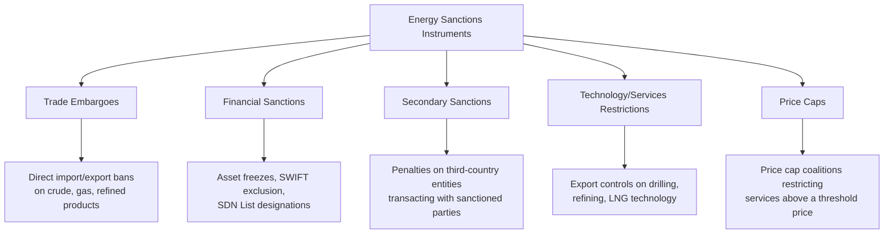

## Sanctions and Their Effects on Energy Markets

### Definition and Core Concept

Energy sanctions are restrictive economic measures — trade embargoes, financial restrictions, asset freezes, and secondary sanctions on third parties — imposed by states or coalitions of states to constrain a target country's ability to produce, export, finance, or technologically develop its energy sector, typically in pursuit of foreign policy, national security, or human rights objectives. Because energy commodities are highly fungible, globally traded, and central to both exporter fiscal revenue and importer economic stability, sanctions on major energy producers generate distinctive market distortions, price effects, and adaptive behaviors that differ systematically from sanctions on other economic sectors.

[Inference] Sanctions policy is an actively evolving current-affairs domain; the specific programs, licenses, and designated entities described below reflect conditions as documented through mid-to-late 2026 and should be verified against official sources (e.g., the U.S. Treasury's OFAC website, EU sanctions lists) for current status, given how frequently these measures change.

### Types of Energy-Related Sanctions Instruments

**Trade Embargoes**: Direct prohibitions on importing or exporting specific energy commodities from/to the target country, imposed unilaterally or by coalitions.

**Financial Sanctions**: Designation of energy companies, banks, or individuals on sanctions lists (e.g., OFAC's Specially Designated Nationals, or SDN, List), freezing assets and prohibiting transactions with designated entities — notably including the 2025 designation of major Russian oil companies Rosneft and Lukoil, which triggered blocking of entities owned 50 percent or more by those firms, including their international subsidiary networks.

**Secondary Sanctions**: Penalties imposed on third-country entities (banks, shippers, insurers, or even entire importing nations) that continue to transact with sanctioned parties, extending sanctions' practical reach beyond direct bilateral relationships. A 2026 legislative illustration is proposed U.S. legislation providing for secondary tariffs of up to 100% on goods from the largest purchasers of Russian crude oil and Russian natural gas, explicitly naming major importing countries as tariff targets.

**Technology and Services Restrictions**: Export controls denying the target country access to specialized drilling, refining, LNG liquefaction, or deepwater extraction technology, aimed at degrading long-term production capacity rather than immediately halting current output.

**Price Cap Mechanisms**: A coalition-based instrument (notably the G7-led price cap on Russian seaborne crude, introduced in 2022) permitting Western shipping, insurance, and financial services to be used for the target country's oil exports only if sold below a specified price threshold — constraining export revenue per barrel while avoiding a full physical supply disruption to global markets.

### Core Economic Mechanisms of Sanctions Impact

**Reduced Effective Global Supply and Price Effects**

When sanctions physically remove a major producer's volumes from accessible global markets (rather than merely redirecting them), the reduction in effective supply, combined with the generally inelastic short/medium-run nature of global oil demand, can generate significant price increases:

$$\Delta P \approx \frac{\Delta Q_{withdrawn}}{\varepsilon_D \times Q_{total}} \times P_{initial}$$

Where $\varepsilon_D$ is the price elasticity of demand (typically low in the short run for oil), meaning even a moderate percentage reduction in global supply can generate a disproportionately large price response, all else equal.

**Discount-Driven Reallocation Rather Than Full Withdrawal**

In practice, sanctioned energy commonly does not exit the global market entirely but is instead **reallocated at a discount** to buyers willing to bear the compliance, reputational, and payment-channel risk of transacting with a sanctioned counterparty. Analysis of the Russian sanctions episode found that intensifying competition among sanctioned oil exporters for a shrinking pool of buyers drove steep discounts, enabling China to save up to $28.8 million per day on imports at peak discount levels. This illustrates a general pattern: sanctions often function more as a mechanism for **rent redistribution** (from sanctioned producer to willing buyer, via the discount) than as complete removal of the commodity from global circulation.

**Market Concentration Among Remaining Buyers**

As Western buyers exit compliance, the sanctioned producer's customer base concentrates among a smaller set of countries willing to absorb political and financial risk. In the Russian case, this pattern manifested as a shift toward Chinese and Indian markets following the 2022 sanctions escalation, with India re-emerging as a major importer of Russian crude following a subsequent period of U.S. sanctions waivers, and Southeast Asia emerging as a new destination for these redirected flows.

### Evasion Mechanisms: The "Shadow Fleet" Phenomenon

A defining adaptive response to maritime oil sanctions has been the emergence of a **shadow fleet** — tankers, often aging vessels transferred to opaque ownership structures and flags of convenience, operating outside traditional Western shipping, insurance, and flagging services specifically to facilitate sanctioned trade while evading price cap and embargo enforcement. Market monitoring organizations have specifically identified that continued use of shadow fleet and transshipment networks allows sanctioned countries to bypass energy sanctions, underscoring an ongoing need for stronger and more unified enforcement among sanctioning coalition members.

**Transshipment and Blending**

A related evasion technique involves transshipping sanctioned crude through intermediate ports or blending it with non-sanctioned crude streams to obscure origin, complicating enforcement and verification for downstream buyers and regulators.

### Sanctions Waivers, General Licenses, and Policy Flexibility

Sanctioning authorities frequently retain administrative flexibility to issue temporary carve-outs when full enforcement would create unacceptable market disruption, illustrating that sanctions policy operates as a continuously adjusted instrument rather than a fixed, binary state.

**2026 Coordinated General License Episode**

In a notable illustration of this flexibility, OFAC issued a series of energy-related general licenses authorizing U.S. persons to purchase, sell, transport and otherwise deal in crude oil and petroleum products originating from Venezuela, Russia and Iran within a short period in 2026, while also expanding authorized trade and investment in Venezuela's minerals sector. For Venezuela specifically, this represented what was characterized as the most significant easing of Venezuela-related sanctions in years, reflecting the country's role as the effective gatekeeper to Venezuela's oil sector given that PdVSA controls the vast majority of the country's crude oil production and export infrastructure.

These licenses were structured as time-limited: the Russia-related license temporarily authorized, through May 16, 2026, the sale and delivery of Russian-origin crude oil and petroleum products already loaded on vessels—including blocked vessels—as of April 17, 2026, following the prior October 2025 designation of Rosneft and Lukoil on OFAC's SDN List. The Iran-related license similarly temporarily authorized, through April 19, 2026, the sale and delivery of Iranian-origin crude oil and petroleum products loaded on vessels as of March 20, 2026, including their importation into the United States. This time-limited structuring illustrates a common sanctions-policy pattern: using narrow, dated licenses to manage acute market stress without formally reversing the underlying sanctions designations.

**Emergency Waivers During Acute Supply Shocks**

Sanctions flexibility is also used reactively to offset physical supply disruptions elsewhere in the system. Following a period of severe disruption to Strait of Hormuz shipping, the United States issued sanctions waivers allowing countries to temporarily import crude oil from Russia to replace barrels that would normally come from the Gulf, illustrating how sanctions enforcement can be deliberately relaxed for one target when doing so serves a competing policy priority (global price/supply stability) — though such waivers are frequently short-lived, with the cited initial waivers expiring on April 4 and 11, 2026.

### Interaction Between Sanctions and Physical Supply Shocks

A critical analytical point is that sanctions effects on energy markets cannot always be cleanly separated from concurrent physical supply disruptions, since sanctioning authorities often calibrate enforcement intensity in response to prevailing market tightness. Market tracking through 2026 describes this dynamic explicitly: the largest disruption to global energy flows in history also disrupted the global energy sanctions regime in the first months of 2026, referring to disruption associated with conflict affecting the Strait of Hormuz — through which roughly 20 percent of global oil passes. This compound shock — physical chokepoint disruption layered on top of pre-existing sanctions on Russia and Iran — illustrates how sanctions policy and physical energy security risk (see **Energy Corridors and Transit Country Economics**) can interact and amplify one another rather than operating as independent variables.

### Sanctions, Regime Change, and Market Restructuring: Venezuela Case Pattern

The Venezuela sanctions episode illustrates how sanctions can be explicitly tied to political outcomes with direct energy market consequences. Reporting indicates that a US oil blockade intensified pressure on the Maduro regime ahead of his capture in January 2026, followed by general licenses that redirected some crude flows toward the United States. This sequence — sanctions/blockade, political outcome, subsequent licensing liberalization — represents a documented pattern in which energy sanctions serve as leverage toward a specific political objective, with market liberalization following as the objective is achieved. Prior to this shift, the Chinese market had emerged as the primary destination for Venezuela's crude oil during the sanctions period, illustrating the same buyer-reallocation pattern observed with Russian and Iranian sanctioned crude.

### Compliance Architecture: The Counterparty Exclusion Framework

Modern general licenses increasingly incorporate a standardized set of jurisdictional exclusions to prevent sanctions relief on one country from inadvertently benefiting other sanctioned jurisdictions. The 2026 licensing round retained an exclusion framework specifying that it does not authorize any transaction involving a person located in or organized under the laws of Iran, North Korea, Cuba, the Covered Regions of Ukraine, or the Crimea Region of Ukraine, or any entity owned or controlled by or in joint venture with such persons. Legal analysts noted that the addition of explicit North Korean, Cuban and Ukrainian territorial exclusions mirrors the counterparty-exclusion architecture of the recent Venezuelan general licenses, indicating OFAC is applying a consistent policy template across its energy-related licensing actions — a notable institutional development toward standardized, modular sanctions administration rather than fully bespoke licensing for each jurisdiction.

### Legislative Escalation Dynamics

Sanctions intensity is not solely an executive/administrative matter; legislative bodies can introduce parallel or more aggressive measures. A 2026 example is the Sanctioning Russia Act of 2026, introduced in the US Senate on 14 July, which includes new sanctions and tariffs against Russia and extends current sanctions on Iran, adding measures targeting Russia's shadow fleet and state-owned energy projects — directly aimed at the evasion mechanisms described above — alongside the secondary tariff provisions targeting major buyer countries.

### Comparative Summary: Sanctions Mechanisms and Market Responses

| Sanctions Instrument | Intended Effect | Common Market Adaptation |
| --- | --- | --- |
| Trade embargo | Full removal of target's exports from sanctioning bloc's market | Redirection to non-sanctioning buyers at a discount |
| Price cap | Constrain revenue-per-barrel while maintaining supply | Shadow fleet use to sell above cap outside price-cap-compliant services |
| SDN/entity designation | Block specific companies' financial access | Corporate restructuring, asset transfer to non-designated affiliates |
| Secondary sanctions/tariffs | Deter third-country purchases | Buyer concentration among large, sanctions-resilient economies (e.g., China, India) |
| Technology export controls | Degrade long-term production/refining capacity | Reliance on domestic or alternative-supplier technology, potential efficiency loss |
| General licenses/waivers | Manage acute market disruption without full policy reversal | Temporary, dated market re-entry; renewed uncertainty at expiration |

### Analytical Considerations and Uncertainty

[Inference] The net welfare and market-stability effects of energy sanctions regimes are subject to ongoing empirical assessment and depend heavily on enforcement intensity, the availability of evasion channels (shadow fleet capacity, alternative buyers), and the degree to which sanctions are calibrated against or reinforced by concurrent physical supply disruptions. Given the documented pattern of rapid, sometimes bidirectional policy shifts (designation followed by general license, waiver followed by expiration and renewed restriction) observed through 2026, [Unverified] any specific claim about the current sanctions status of a particular country, company, or trade route should be verified against the original regulatory source (e.g., OFAC's SDN List and general license texts, EU Official Journal sanctions listings) rather than relied upon from any single analysis, given how quickly these designations and licenses have been shown to change.

### Key Points

- Energy sanctions operate through embargoes, financial designations, secondary sanctions, technology restrictions, and price caps, often deployed in combination against the same target
- Sanctioned energy commodities are typically reallocated at a discount to willing buyers rather than fully removed from global markets, generating rent transfers to buyers willing to bear compliance risk
- Shadow fleet and transshipment networks represent a persistent, evolving evasion channel that ongoing enforcement efforts continue to target
- Sanctions policy is administered with significant tactical flexibility (general licenses, temporary waivers) allowing authorities to manage acute market disruption without reversing underlying sanctions designations
- Sanctions effects on energy markets frequently interact with concurrent physical supply shocks (e.g., chokepoint disruptions), complicating clean attribution of price and flow effects to sanctions alone
- Sanctions can be explicitly tied to political outcomes (regime change, negotiated settlements), with market liberalization following as leverage objectives are achieved

### Related Topics

- Energy corridors and transit country economics (chokepoint disruption interaction)
- Comparative advantage and energy trade patterns (trade redirection effects)
- OPEC and strategic behavior in global oil markets
- G7 price cap coalition mechanics and enforcement challenges
- Shadow fleet tracking and maritime sanctions evasion
- Strategic petroleum reserves and energy security policy responses to sanctions-driven shocks
- Secondary sanctions and extraterritorial jurisdiction in international law
- State-owned energy enterprises as sanctions targets (PdVSA, Rosneft, Lukoil case studies)
- Sanctions and regime change: political economy of coercive energy policy
- Compliance risk management for energy traders and financial institutions