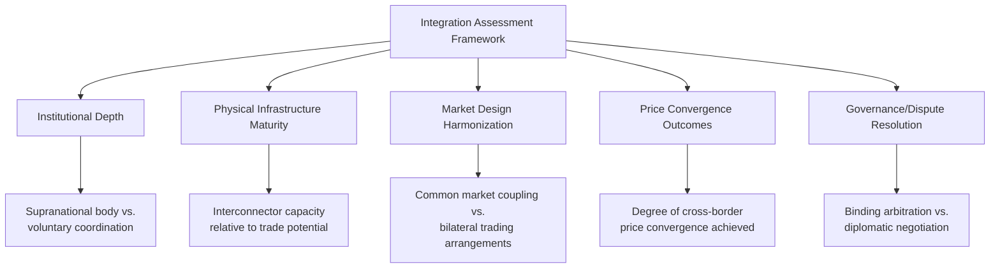

## Regional Energy Market Integration Case Studies

### Definition and Core Concept

Regional energy market integration refers to the process by which neighboring countries or sub-national jurisdictions align market rules, physical infrastructure, and regulatory frameworks to enable cross-border trade in electricity, natural gas, and related energy commodities as though operating within a single, larger market. This topic examines specific real-world integration efforts as applied illustrations of the theoretical framework established under **International Regulatory Harmonization and Cross-Border Markets**, highlighting how the depth, pace, and institutional design of integration vary substantially depending on regional political, economic, and infrastructural conditions.

### Analytical Framework for Comparing Integration Case Studies

Each case study below is assessed against a consistent set of dimensions to enable comparison:

### Case Study 1: The European Internal Energy Market

**Institutional Architecture**

The EU's internal energy market represents the deepest and most legally developed regional integration model globally, built incrementally through the First, Second, and Third Energy Packages, and subsequently the Clean Energy Package, as detailed under **International Regulatory Harmonization and Cross-Border Markets**. Central institutions include the Agency for the Cooperation of Energy Regulators (ACER), which coordinates National Regulatory Authorities and resolves cross-border disputes, and the European Network of Transmission System Operators (ENTSO-E for electricity, ENTSOG for gas), which develops legally binding network codes.

**Market Coupling as the Defining Mechanism**

The EU's **Single Day-Ahead Coupling (SDAC)** and **Single Intraday Coupling (SIDC)** mechanisms represent a qualitatively deeper form of integration than most other regional efforts: rather than merely facilitating bilateral capacity auctions between national markets, day-ahead electricity prices across participating member states are calculated jointly through a shared algorithm, with cross-border physical flows determined implicitly as a byproduct of price optimization rather than through separate explicit transmission rights trading.

**Outcomes and Ongoing Challenges**

[Inference] EU market coupling has generally been associated in the regulatory economics literature with measurable price convergence gains across participating bidding zones relative to pre-coupling conditions, though the degree of convergence varies by zone pair and time period, and remaining bottlenecks (interconnector capacity constraints, differing national capacity mechanisms, and bidding zone configuration disputes) continue to limit full convergence. The EU model's depth of legal harmonization — with directly applicable, binding network codes rather than voluntary guidelines — distinguishes it from every other case study in this section.

### Case Study 2: North American Regional Transmission Organizations

**Institutional Model: Federal Jurisdiction, Not Treaty-Based Cooperation**

As discussed under **International Regulatory Harmonization**, North American integration (specifically within the United States) is achieved primarily through federal constitutional authority rather than international treaty. The Federal Energy Regulatory Commission (FERC) oversees Regional Transmission Organizations (RTOs) such as PJM Interconnection, the Midcontinent Independent System Operator (MISO), and ISO New England, each of which operates a single integrated wholesale market spanning multiple states.

**Cross-Border U.S.-Canada Integration**

Beyond intra-U.S. RTO integration, significant electricity trade occurs across the U.S.-Canada border, particularly involving Canadian hydroelectric exports (notably from Quebec and British Columbia) to U.S. northeastern and northwestern markets respectively. This cross-border trade operates through a more limited institutional framework than either the EU model or intra-U.S. RTO integration — relying on bilateral interconnection agreements, coordinated reliability standards administered through the North American Electric Reliability Corporation (NERC), and specific transmission service agreements rather than a unified cross-border market-clearing mechanism.

**Seams Issues**

A persistent technical challenge specific to the North American model is the **seams problem** — inefficiencies arising at the boundaries between adjacent RTOs (or between RTO and non-RTO regions) where coordinated dispatch and pricing do not extend seamlessly across the boundary, potentially leaving cross-seam efficiency gains uncaptured despite both sides operating organized wholesale markets individually. [Inference] Addressing seams issues has been an ongoing subject of FERC proceedings and inter-RTO coordination efforts over an extended period, with the pace and completeness of resolution varying by specific RTO pair and issue.

### Case Study 3: Southern African Power Pool (SAPP)

**Institutional Structure**

SAPP, established in 1995 under the Southern African Development Community (SADC), coordinates electricity trade among member country national utilities across Southern Africa. Unlike the EU's supranational legal architecture, SAPP operates through voluntary intergovernmental cooperation among sovereign utilities, with a coordination center facilitating both long-term bilateral contracts and, in later stages of development, a day-ahead competitive market mechanism.

**Resource Complementarity as the Core Rationale**

SAPP's economic rationale closely mirrors the comparative advantage and resource-pooling logic discussed under **Comparative Advantage and Energy Trade Patterns**: the pool connects countries with substantial hydroelectric resources (e.g., Mozambique, Zambia, Democratic Republic of Congo) with countries historically more dependent on thermal generation (e.g., South Africa), enabling complementary trade based on differing resource endowments and seasonal hydrological patterns.

**Institutional Maturity Relative to EU Model**

[Inference] SAPP's institutional and market-design maturity is generally regarded as significantly less developed than the EU model, reflecting both a shallower legal integration architecture (voluntary utility cooperation rather than binding supranational law) and persistent physical infrastructure constraints, including interconnection capacity gaps between certain member countries and transmission reliability challenges. The specific current operational status of SAPP's competitive market segment relative to bilateral trading arrangements should be verified against current SAPP or SADC documentation rather than assumed static, given the pool's continued institutional evolution.

### Case Study 4: Central American Electrical Interconnection System (SIEPAC)

**Physical and Institutional Design**

SIEPAC connects the electricity grids of six Central American countries (Guatemala, El Salvador, Honduras, Nicaragua, Costa Rica, and Panama) via a dedicated regional transmission line, combined with a regional market operator, the **Ente Operador Regional (EOR)**, and a regional regulatory commission, the **Comisión Regional de Interconexión Eléctrica (CRIE)**.

**A Purpose-Built Regional Institution**

Unlike SAPP's evolution from pre-existing national utility cooperation, SIEPAC was substantially designed as a purpose-built regional integration project from its inception, including dedicated supranational regulatory (CRIE) and market operation (EOR) institutions specifically created for the regional market — representing an intermediate institutional depth between SAPP's voluntary cooperation model and the EU's deep supranational legal architecture, though operating at a considerably smaller physical and economic scale than either.

### Case Study 5: ASEAN Power Grid (Aspirational/In-Development)

**Concept and Rationale**

The ASEAN Power Grid concept, under discussion among Southeast Asian nations for an extended period, envisions interconnecting national grids across the Association of Southeast Asian Nations to enable regional electricity trade, motivated by similar resource-complementarity and reliability-pooling logic as other regional integration efforts, with particular emphasis in recent years on facilitating cross-border trade in renewable electricity (e.g., potential hydro exports from Laos to neighboring countries, and prospective solar resource pooling).

[Speculation] Given the aspirational, still-developing status of comprehensive multilateral ASEAN grid interconnection relative to the existing patchwork of bilateral cross-border electricity trade arrangements already in place among some member states (e.g., Laos-Thailand, Laos-Vietnam), the eventual institutional depth and timeline for a fully integrated ASEAN-wide market remain genuinely uncertain and dependent on evolving political and infrastructure investment commitments across multiple sovereign governments.

### Comparative Summary Table

| Case Study | Institutional Depth | Physical Integration | Market Design | Governance Body |
| --- | --- | --- | --- | --- |
| EU Internal Energy Market | Deep (binding supranational law) | Extensive, though bottlenecks remain | Market coupling (SDAC/SIDC) | ACER, ENTSO-E/ENTSOG |
| North American RTOs (intra-U.S.) | Deep (federal jurisdiction) | Extensive within RTO footprints | Unified LMP-based wholesale markets | FERC |
| U.S.-Canada cross-border | Shallow-moderate | Moderate, resource-driven | Bilateral agreements, reliability coordination | NERC, bilateral utilities |
| Southern African Power Pool | Moderate (voluntary intergovernmental) | Partial, capacity-constrained in places | Mixed bilateral contracts + emerging competitive market | SAPP Coordination Centre |
| SIEPAC (Central America) | Moderate (purpose-built regional bodies) | Single dedicated regional interconnection line | Regional market operator model | EOR, CRIE |
| ASEAN Power Grid | Early/aspirational | Partial bilateral links; multilateral grid still developing | Not yet fully harmonized | Under development |

### Cross-Cutting Lessons from Comparative Case Studies

**Institutional Depth Does Not Automatically Follow from Economic Rationale**

All cases share a similar underlying economic logic (gains from price convergence, resource complementarity, reserve sharing, per **International Regulatory Harmonization and Cross-Border Markets**), yet institutional depth varies enormously — indicating that political factors (willingness to cede aspects of national regulatory sovereignty, historical relationships among member states, pre-existing legal/institutional frameworks such as the EU's broader supranational architecture) are at least as important as economic rationale in determining the pace and depth of achieved integration.

**Physical Infrastructure and Institutional Design Often Develop Asynchronously**

Several cases illustrate that harmonized market rules and adequate physical interconnection capacity do not necessarily develop in lockstep — SAPP exhibits capacity constraints despite institutional cooperation frameworks having existed for an extended period, while SIEPAC's dedicated regional line represents a case of physical infrastructure and purpose-built regional institutions developed jointly from project inception.

**Smaller-Scale Regional Pools Face Distinct Coordination Costs**

Compared to the EU's large number of interconnected economies (creating more diversification value but also more coordination complexity), smaller regional pools like SIEPAC involve fewer member states, potentially easing political coordination but also limiting the scale of diversification and price convergence benefits achievable relative to larger, more diverse pools.

### Key Points

- The EU internal energy market represents the deepest regional integration case globally, distinguished by binding supranational network codes and market coupling mechanisms that jointly calculate prices across national bidding zones
- North American integration achieves similar depth to the EU within U.S. borders through federal constitutional jurisdiction (FERC/RTOs) rather than treaty-based cooperation, with shallower integration observed at U.S.-Canada cross-border and inter-RTO "seams"
- Regional pools in developing economies (SAPP, SIEPAC) generally exhibit more voluntary, less deeply harmonized institutional models than the EU, with varying degrees of physical infrastructure maturity
- SIEPAC illustrates a purpose-built regional institution model, combining dedicated regional regulatory (CRIE) and market operation (EOR) bodies designed jointly with the physical interconnection itself
- Aspirational multilateral frameworks such as the ASEAN Power Grid illustrate that comprehensive regional integration often develops gradually from bilateral arrangements, with the pace and eventual depth of multilateral integration subject to considerable political and infrastructural uncertainty
- Across all cases, institutional depth of integration depends substantially on political willingness to cede national regulatory autonomy, not solely on the underlying economic gains-from-trade rationale

### Related Topics

- International regulatory harmonization and cross-border markets
- Comparative advantage and energy trade patterns
- Energy corridors and transit country economics
- Locational marginal pricing and market coupling mechanisms
- Regulatory institutions and independence design (National Regulatory Authorities)
- Cross-border interconnector investment and cost-benefit allocation
- Regional reliability coordination bodies (NERC, ENTSO-E)
- Renewable resource pooling and cross-border trade in developing regions
- Political economy of ceding national regulatory sovereignty in energy policy
- Seams issues and inter-RTO coordination in North American electricity markets