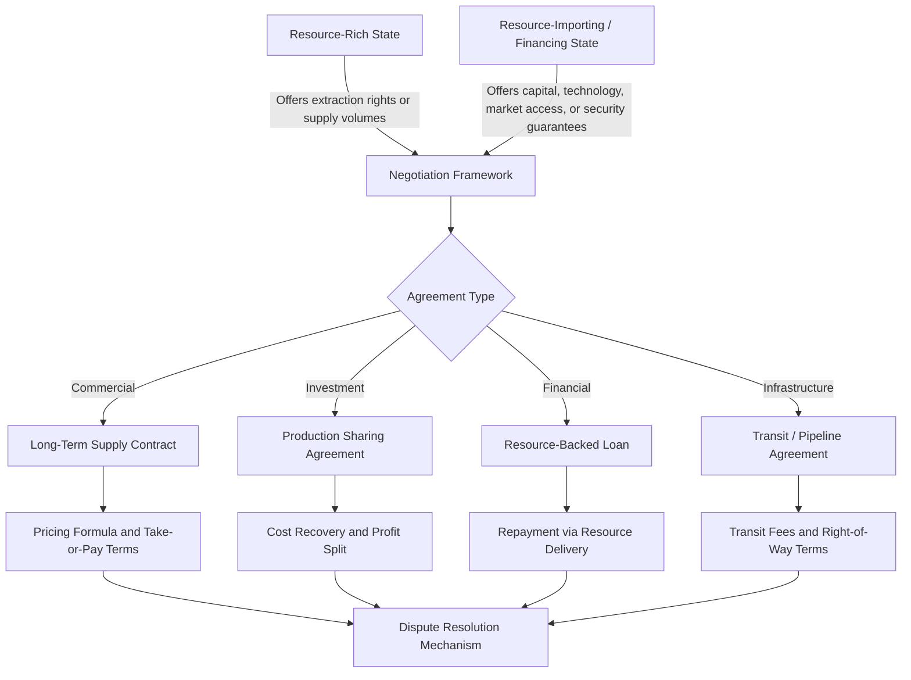

## Energy Diplomacy and Bilateral Resource Agreements

### Definition and Scope

Energy diplomacy refers to the conduct of foreign policy and international relations specifically oriented toward securing, controlling, or influencing the production, transit, and consumption of energy resources. It sits at the intersection of international relations theory, energy economics, and resource security studies. Bilateral resource agreements are the operational instruments of this diplomacy: formal or informal arrangements between two sovereign states (or between a state and a state-backed entity) governing the exploration, extraction, trade, financing, or transit of energy resources.

**Key Points**

- Energy diplomacy is distinguished from ordinary trade policy by the strategic weight assigned to energy security, i.e., the state's concern with continuity, affordability, and diversification of supply.
- Bilateral agreements contrast with multilateral energy governance (e.g., the International Energy Agency, the Energy Charter Treaty) by involving only two parties, which allows for tailored terms but reduces the norm-setting power that multilateral frameworks provide.
- The field overlaps with "resource diplomacy," "pipeline politics," and "energy statecraft," terms often used interchangeably in policy literature though they emphasize slightly different mechanisms (resource access, infrastructure control, and coercive/persuasive state behavior respectively).

### Theoretical Foundations

Three main schools of international political economy inform how energy diplomacy is analyzed:

- **Realist/geopolitical view**: States pursue energy agreements primarily to maximize relative power and reduce strategic vulnerability. Energy is treated as a security good, not merely an economic commodity. This view underpins concepts like "energy weapon" and "resource nationalism."
- **Liberal/institutionalist view**: Bilateral agreements are best understood as efficient contracting mechanisms that reduce transaction costs and expropriation risk under conditions of incomplete international governance. Repeated interaction and reputational concerns sustain cooperation absent a supranational enforcer.
- **Structuralist/dependency view**: Bilateral resource agreements between industrialized and resource-rich developing states are analyzed as mechanisms that can entrench asymmetric terms of trade, extraction-based economic structures, and "resource curse" dynamics.

[Inference] Most contemporary policy analysis blends these perspectives pragmatically rather than adhering strictly to one school, since real-world agreements typically show both efficiency-seeking and power-seeking motives simultaneously.

### Core Economic Rationale

From an energy economics standpoint, bilateral agreements address specific market failures and risks that pure spot markets do not resolve well:

1. **Asset specificity and hold-up risk**: Energy infrastructure (pipelines, LNG terminals, refineries) involves large sunk costs and immobile assets. Once built, either party can attempt to renegotiate terms opportunistically. Long-term bilateral contracts with take-or-pay clauses mitigate this hold-up problem.
2. **Price and volume risk**: Long-term agreements (historically common in natural gas trade) transfer price risk between buyer and seller through indexed pricing formulas, reducing exposure to spot market volatility.
3. **Security of supply/demand**: Exporters seek guaranteed offtake to justify investment; importers seek guaranteed supply to avoid disruption. This is a repeated bilateral bargaining problem, often modeled using Nash bargaining or cooperative game theory frameworks.
4. **Sovereign risk mitigation**: Agreements often embed dispute resolution mechanisms, stabilization clauses, and sometimes state guarantees to manage political risk in resource-rich but institutionally weak jurisdictions.

$$\text{Contract Value} = \sum_{t=1}^{T} \frac{(P_t - C_t) \cdot Q_t}{(1+r)^t}$$

Where $P_t$ is the contractually indexed price at time $t$, $C_t$ is the cost of extraction/transport, $Q_t$ is contracted volume, and $r$ is the discount rate reflecting sovereign and commercial risk. Bilateral negotiations largely concern the specification of $P_t$ (indexation formula), $Q_t$ (minimum offtake/take-or-pay), and risk-sharing clauses embedded in $r$.

### Typology of Bilateral Resource Agreements

**Key Points**

- **Government-to-Government (G2G) Agreements**: Formal intergovernmental accords, sometimes ratified as treaties, establishing frameworks for energy cooperation (e.g., joint pledges on pipeline construction, nuclear cooperation, or resource swaps).
- **Production Sharing Agreements (PSAs)**: A host government grants a foreign or state-owned company the right to explore and produce hydrocarbons in exchange for a share of output, common in Central Asia, West Africa, and Southeast Asia.
- **Concession Agreements**: Older model granting a company (often historically foreign-owned) rights over resource extraction for a fee or royalty, largely superseded by PSAs and service contracts since the mid-20th century wave of resource nationalism.
- **Long-Term Supply Contracts (LTCs)**: Bilateral commercial agreements (often state-to-state or state-to-company) for sustained delivery of oil, gas, or LNG, typically 10–25 years, with indexed pricing.
- **Loans-for-Resources (Resource-Backed Loans)**: A financing state or institution provides capital or infrastructure investment in exchange for guaranteed future resource deliveries or extraction rights, notably used in China's engagement with Angola, Venezuela, and Ecuador.
- **Swap and Barter Agreements**: Direct exchange of resources for goods, services, or debt relief, bypassing conventional currency-denominated trade (historically used by the Soviet Union and more recently in sanctioned-economy contexts such as Iran-China trade).
- **Transit and Pipeline Agreements**: Bilateral or trilateral accords governing the right of way, tariffs, and security guarantees for cross-border energy infrastructure (e.g., transit fee arrangements between Russia and Ukraine for gas pipelines).

### Key Instruments and Clauses

| Clause Type | Function | Common Context |
| --- | --- | --- |
| Take-or-pay | Buyer commits to pay for a minimum volume regardless of offtake | LNG and pipeline gas contracts |
| Destination clause | Restricts buyer from re-exporting or reselling the resource | Traditional gas contracts (increasingly challenged under competition law) |
| Price review/renegotiation | Allows periodic revision of pricing formula | Long-term oil and gas contracts |
| Stabilization clause | Freezes host-country fiscal/regulatory terms for contract duration | PSAs in politically volatile jurisdictions |
| Force majeure | Suspends obligations during extraordinary disruptive events | All major bilateral energy contracts |
| Sovereign guarantee | State backs the financial obligations of a national company | Resource-backed loans |
| Arbitration clause (ICSID/ICC) | Provides for international dispute resolution outside host courts | Cross-border investment and PSAs |

### Historical Evolution

- **Post-WWII to 1970s**: Dominated by concession agreements between Western oil majors ("Seven Sisters") and producing states, characterized by highly asymmetric terms favoring companies.
- **1960s–1970s resource nationalism**: Formation of OPEC (1960) and a wave of nationalizations shifted bargaining power toward producing states; PSAs and service contracts began replacing concessions.
- **1970s oil shocks**: The 1973 oil embargo demonstrated the coercive potential of energy diplomacy, cementing energy security as a central concern of importing-state foreign policy.
- **1990s–2000s**: Post-Soviet pipeline diplomacy (e.g., Caspian pipeline routing disputes such as Baku-Tbilisi-Ceyhan) illustrated how transit-route selection itself becomes a geopolitical instrument.
- **2000s–2010s**: Rise of China's "going out" strategy, using state financing and resource-backed loans to secure long-term hydrocarbon and mineral access in Africa, Latin America, and Central Asia.
- **2010s–2020s**: Rebalancing around LNG flexibility (destination-clause erosion, shorter contract tenors), and the emergence of critical mineral diplomacy (lithium, cobalt, rare earths) as an extension of the same bilateral logic to the energy transition.
- **2022–present**: The Russian invasion of Ukraine and subsequent sanctions regime triggered rapid reconfiguration of bilateral gas relationships, notably the EU's diversification away from Russian pipeline gas toward US, Qatari, and other LNG suppliers, illustrating how bilateral energy diplomacy responds abruptly to geopolitical rupture.

### Illustrative Case Studies

**Example**

- **Russia–Germany (Nord Stream pipelines)**: A bilateral infrastructure project embodying "Wandel durch Handel" (change through trade) diplomacy, later politically contested amid concerns over European dependency on a single supplier, and effectively terminated as a commercial relationship following 2022 sanctions and the Nord Stream pipeline sabotage.
- **China–Angola "Angola model"**: Infrastructure-for-oil loans in which Chinese state banks financed infrastructure development in exchange for guaranteed oil shipments, a template replicated with variations across several African oil producers. [Unverified] Precise current repayment terms are periodically renegotiated and not always publicly disclosed in full.
- **US–Saudi Arabia energy-security relationship**: A decades-long informal arrangement (dating to the 1945 Quincy Agreement framework) linking US security guarantees to reliable Saudi oil supply and OPEC price moderation, illustrating how bilateral energy diplomacy can be embedded within a broader security alliance rather than a single formal resource contract.
- **Qatar's LNG bilateral contracting**: Qatar has historically favored long-term (20+ year) bilateral LNG contracts with destination clauses to underwrite capital-intensive liquefaction trains, though it has gradually introduced more flexible terms in newer contracts to remain competitive against US LNG.
- **India–Russia post-2022 oil trade**: A rapid bilateral reconfiguration in which India substantially increased discounted crude oil imports from Russia following Western sanctions, demonstrating how price differentials created by sanctions regimes can realign bilateral trade flows even absent a formal new treaty framework.

### Diagram: Bilateral Energy Agreement Negotiation Structure

### Analytical Frameworks for Assessment

**Key Points**

- **Energy security matrix (4 As)**: Availability, Accessibility, Affordability, Acceptability — commonly used to evaluate whether a bilateral agreement genuinely improves a state's energy security position.
- **Dependency ratio analysis**: Measures the share of a state's energy consumption or export revenue tied to a single bilateral partner; high concentration ratios (analogous to a Herfindahl-Hirschman Index applied to trade partners) signal vulnerability to coercive leverage.
- **Bargaining power assessment**: Evaluates relative leverage based on resource scarcity, alternative suppliers/buyers available to each party, sunk infrastructure investment, and the financing party's capital cost advantage.
- **Political risk premium**: Quantifies additional required rate of return embedded in $r$ (see valuation formula above) to compensate for expropriation risk, regulatory instability, or contract renegotiation risk in the host jurisdiction.

$$HHI_{energy} = \sum_{i=1}^{n} s_i^2$$

Where $s_i$ is the share of total energy imports (or exports) sourced from (or destined to) partner $i$. Values approaching 10,000 (on a 0–10,000 scale, shares in percentage points) indicate near-total bilateral dependency, a common metric used in EU energy security assessments post-2022.

### Contemporary Issues and Emerging Dynamics

- **Critical minerals diplomacy**: Bilateral agreements are increasingly extending beyond hydrocarbons to lithium, cobalt, nickel, and rare earth elements essential for the energy transition, replicating historical oil/gas diplomacy patterns (e.g., US and EU critical minerals partnerships with Australia, Indonesia, and the Democratic Republic of Congo).
- **Hydrogen diplomacy**: Emerging bilateral frameworks (e.g., Germany-Namibia, Japan-Australia) aim to establish green/blue hydrogen supply chains ahead of anticipated demand, functioning as a forward-looking variant of traditional bilateral resource diplomacy.
- **Sanctions and secondary market realignment**: Sanctions regimes (Russia, Iran, Venezuela) have driven the emergence of "shadow" or discounted bilateral trade relationships, often facilitated through intermediary states or non-traditional payment mechanisms (e.g., yuan-denominated settlement, barter).
- **De-dollarization pressure**: Some bilateral energy agreements (e.g., Russia-China, Saudi Arabia-China discussions) have explored settlement in currencies other than the US dollar, with implications for petrodollar recycling dynamics. [Speculation] The extent to which this meaningfully displaces dollar-denominated energy trade in aggregate remains a contested and unresolved empirical question.
- **Contract renegotiation waves**: Periods of high commodity price volatility (2008, 2014-2016, 2022) historically trigger renegotiation demands from host states seeking a larger share of windfall profits, illustrating the incomplete-contract nature of long-duration bilateral agreements.

### Risks and Criticisms

**Key Points**

- **Resource curse amplification**: Poorly structured bilateral agreements, especially resource-backed loans with limited transparency, have been associated with debt distress and reduced fiscal accountability in some resource-rich developing states.
- **Debt-trap diplomacy debate**: A contested characterization (particularly applied to Chinese resource-backed lending) alleging that financing terms are structured to enable strategic asset seizure upon default. [Unverified] Empirical research is mixed on the prevalence and intentionality of this pattern across the full portfolio of relevant agreements, and characterizations vary significantly across studies and political contexts.
- **Democratic accountability gaps**: Bilateral resource agreements, particularly those with confidentiality clauses, can bypass parliamentary scrutiny and public disclosure norms applied to broader fiscal policy.
- **Environmental and social governance concerns**: Extraction-focused bilateral agreements have historically underweighted environmental remediation and local community compensation, prompting reform movements (e.g., Extractive Industries Transparency Initiative) advocating disclosure standards for such agreements.
- **Lock-in risk during energy transition**: Long-tenor fossil fuel bilateral contracts (20+ years) signed in the 2020s carry stranded-asset risk if global decarbonization trajectories accelerate faster than contract duration.

### Diagram: Energy Security Vulnerability from Bilateral Dependency (svg_diagram)

<svg xmlns="http://www.w3.org/2000/svg" viewBox="0 0 640 320">
\<style\>
.title{font:bold 15px sans-serif;fill:#1a1a1a}
.lbl{font:12px sans-serif;fill:#1a1a1a}
.small{font:10px sans-serif;fill:#444}
.axis{stroke:#333;stroke-width:1.5}
\</style\>
<text x="20" y="24" class="title">Bilateral Dependency vs. Supply Risk (svg_diagram)</text>
<line x1="70" y1="270" x2="600" y2="270" class="axis" />
<line x1="70" y1="270" x2="70" y2="40" class="axis" />
<text x="300" y="300" class="lbl">Import Concentration (share from single partner)</text>
<text x="25" y="160" class="lbl" transform="rotate(-90 25 160)">Supply Disruption Risk</text>
<circle cx="150" cy="230" r="10" fill="#4a90d9" />
<text x="165" y="234" class="small">Diversified LNG portfolio</text>
<circle cx="320" cy="150" r="10" fill="#e0a020" />
<text x="335" y="154" class="small">Moderate pipeline dependency</text>
<circle cx="500" cy="70" r="10" fill="#d94a4a" />
<text x="440" y="55" class="small">Single-pipeline, single-supplier lock-in</text>
<line x1="70" y1="270" x2="580" y2="60" stroke="#999" stroke-width="1" stroke-dasharray="4,4" />
<text x="420" y="255" class="small" fill="#777">Rising risk trendline</text>
</svg>

### Governance and Multilateral Overlays

Bilateral agreements do not exist in isolation; they interact with multilateral frameworks that can constrain or shape their terms:

- **WTO rules**: Discipline certain trade-distorting aspects of bilateral energy deals, though energy has historically been treated with significant carve-outs and exceptions relative to other goods.
- **Energy Charter Treaty (ECT)**: Provides investment protection and dispute resolution for cross-border energy investments among signatories, though several European states have withdrawn in recent years citing conflicts with climate policy commitments. [Unverified] The precise future membership composition of the ECT is subject to ongoing political negotiation and may change after this material was written.
- **IEA coordination mechanisms**: Among IEA member states, bilateral emergency-sharing and strategic petroleum reserve coordination agreements supplement purely commercial bilateral contracts.
- **EU internal energy market rules**: Constrain member states' bilateral gas and electricity agreements with third countries by requiring compatibility with EU competition law (notably relevant to the unbundling requirements affecting Gazprom-linked pipeline agreements).

### Practical Analytical Exercise

**Example**

Consider a hypothetical bilateral LNG agreement between an importing state (State A) and an exporting state (State B):

- Contract term: 15 years
- Contracted volume: 3 million tonnes per annum (mtpa), take-or-pay at 90%
- Pricing formula: linked to a regional gas hub index plus a fixed liquefaction/shipping margin
- Renegotiation clause: triggered if hub price deviates more than 25% from a rolling 3-year average

Analytical questions this structure raises for an energy economics assessment: (1) how does the take-or-pay percentage allocate volume risk between the parties; (2) does the pricing formula's chosen index expose State A to basis risk if its actual delivery point differs from the index location; (3) what is the effective political risk premium embedded in the margin relative to comparable agreements in the same period; (4) how does the renegotiation trigger affect the discounted contract value under different price volatility scenarios.

### Conclusion

Bilateral resource agreements function simultaneously as commercial risk-management instruments and as instruments of state power, and analyzing them purely through either an economic-efficiency lens or a pure geopolitics lens tends to miss significant explanatory factors. Effective analysis requires jointly considering contract structure (pricing, volume, and risk-sharing clauses), the relative bargaining power of the parties, and the broader geopolitical context in which the agreement is embedded, including its interaction with sanctions regimes, alliance structures, and multilateral governance frameworks. As the energy transition proceeds, the same bilateral diplomatic and contractual logic historically applied to oil and gas is increasingly being extended to critical minerals and hydrogen, suggesting continuity in the underlying economic and political mechanisms even as the specific resources at stake evolve.

**Related Topics**

- Resource nationalism and expropriation risk
- OPEC and cartel behavior in international energy markets
- LNG contract structures and destination clause litigation
- Critical minerals supply chains and geopolitics
- Sanctions regimes and energy trade rerouting
- Pipeline politics and transit-state leverage
- Sovereign wealth funds and resource revenue management
- The resource curse and Dutch disease
- Energy Charter Treaty and investor-state dispute settlement
- Hydrogen economy bilateral partnerships
- Petrodollar system and currency dynamics in energy trade
- Strategic petroleum reserves and multilateral supply-sharing agreements