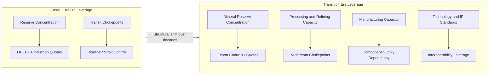

## Shifting Geopolitics of the Energy Transition

### Definition and Scope

This topic examines how the global shift from fossil-fuel-based energy systems toward low-carbon technologies (renewables, electrification, hydrogen, batteries) is restructuring international power relations, trade dependencies, and strategic vulnerabilities. Unlike the fossil-fuel era, where geopolitical leverage centered on the location of hydrocarbon reserves and transit routes, the energy transition redistributes leverage toward control over critical mineral deposits, manufacturing capacity, technological intellectual property, and grid infrastructure.

**Key Points**

- The transition does not eliminate energy geopolitics; it relocates the sources of leverage from subsurface resource endowment to mineral supply chains, industrial capacity, and technology standards.
- New "chokepoints" emerge in mineral processing and component manufacturing rather than solely in maritime straits or pipeline corridors, though physical transit chokepoints remain relevant for residual fossil fuel trade.
- The pace and unevenness of the transition across countries create asymmetric winners and losers, reshaping alliance structures and trade blocs.

### From Fuel Geopolitics to Mineral and Technology Geopolitics

**Key Points**

- **Fossil fuel geopolitics** was organized around reserve concentration (Middle East oil, Russian gas), transit infrastructure (Strait of Hormuz, Bab-el-Mandeb, Ukrainian pipeline transit), and cartel behavior (OPEC+).
- **Transition-era geopolitics** is organized around: (1) critical mineral reserve concentration (lithium, cobalt, nickel, rare earth elements, copper); (2) midstream processing and refining capacity, which is even more geographically concentrated than raw extraction; (3) manufacturing capacity for solar panels, wind turbines, batteries, and electrolyzers; and (4) intellectual property and technology standards governing next-generation systems.
- A key structural difference: fossil fuel reserves are geographically fixed by geology, whereas manufacturing and processing capacity is a function of industrial policy and capital investment, making transition-era leverage more mutable over policy-relevant timeframes.

$$\text{Supply Chain Concentration Risk} = \sum_{i=1}^{n} s_i^2 \quad \text{(HHI applied to each transition-critical input)}$$

Where $s_i$ is country $i$'s share of global production or processing capacity for a given mineral or component. [Inference] Analysts frequently note that HHI values for cobalt refining, rare earth separation, and battery cell manufacturing are substantially higher than comparable historical concentration in crude oil production, though exact figures shift as new capacity comes online and should be checked against current data for any specific claim.

### Critical Minerals as the New Strategic Resource

- **Lithium**: Concentrated extraction in Australia, Chile, Argentina, and China (the "Lithium Triangle" for brine-based extraction in South America), with China holding a disproportionate share of global lithium refining capacity regardless of where raw ore is mined.
- **Cobalt**: The Democratic Republic of Congo accounts for a large majority of global mined cobalt supply, while Chinese firms control a substantial share of DRC cobalt mining assets and global refining capacity, creating a two-layer concentration (geographic extraction plus corporate/national control of processing).
- **Rare earth elements (REEs)**: China dominates both mining and, more critically, separation and refining capacity, a position built over decades of deliberate industrial policy; this gives Beijing potential leverage over magnet production essential to wind turbines and electric vehicle motors.
- **Nickel and copper**: More geographically diversified than lithium or cobalt, but copper in particular faces long-term supply-demand tightening concerns given its ubiquity across grid infrastructure, EVs, and renewable generation equipment.
- **Graphite**: Another China-concentrated input, particularly for battery anode material, with China controlling a large share of natural graphite processing.

**Example**

China's 2023 and subsequent export control measures on gallium, germanium, and graphite-related technologies illustrate how mineral and processing leverage can be operationalized as a diplomatic instrument analogous to historical OPEC production decisions, though the mechanisms (export licensing versus production quotas) and the affected value chains differ substantially.

### Manufacturing Capacity as Geopolitical Leverage

**Key Points**

- Solar photovoltaic manufacturing (polysilicon, wafers, cells, modules) is heavily concentrated in China across nearly every stage of the value chain, a position resulting from sustained industrial policy investment beginning in the 2000s.
- Battery cell manufacturing (particularly lithium-ion) is dominated by a small number of Chinese, South Korean, and Japanese firms, with Western and Indian capacity expansion underway but starting from a smaller base as of the mid-2020s.
- Wind turbine manufacturing is more geographically diversified (China, Europe, US) but component supply chains, particularly for permanent magnets used in direct-drive turbines, still route through Chinese rare earth processing.
- Electrolyzer manufacturing for green hydrogen is an earlier-stage industry with less entrenched concentration, making it a contested space for industrial policy competition among the EU, US, Japan, South Korea, and China. [Unverified] The eventual market structure for electrolyzer manufacturing remains uncertain and subject to which countries' industrial policies prove most effective at scale.

### Diagram: Fossil Fuel vs. Transition-Era Geopolitical Leverage Points

### Reconfiguration of Alliances and Trade Blocs

- **US Inflation Reduction Act (IRA) and friend-shoring**: The IRA's domestic content and free-trade-agreement-partner sourcing requirements for EV and battery tax credits function as an explicit instrument of transition-era industrial and geopolitical policy, incentivizing supply chain relocation away from geopolitical rivals.
- **EU Critical Raw Materials Act**: Establishes benchmarks for domestic extraction, processing, and recycling capacity, alongside diversification targets limiting reliance on any single third country for strategic raw materials, an explicit policy response to the mineral-concentration risk described above.
- **Minerals Security Partnership**: A US-led coalition of resource-consuming democracies coordinating investment in mineral supply chains outside China, illustrating bloc-formation dynamics analogous to historical energy-importer coordination (e.g., the IEA's founding in response to the 1970s oil shocks).
- **China's Belt and Road Initiative extension to minerals**: Continued Chinese state-backed investment in African, Latin American, and Southeast Asian mineral extraction and processing assets, extending the resource-backed financing model previously used for hydrocarbons.
- **Resource-rich developing states' bargaining position**: Countries such as Indonesia (nickel), Chile (lithium), and the DRC (cobalt) have pursued export bans or beneficiation requirements (mandating in-country processing rather than raw ore export) to capture more value-chain rent, echoing the resource-nationalism dynamics of 1960s-70s oil politics.

### Diagram: Transition-Era Bloc Formation (svg_diagram)

<svg xmlns="http://www.w3.org/2000/svg" viewBox="0 0 640 340">
\<style\>
.title{font:bold 15px sans-serif;fill:#1a1a1a}
.lbl{font:12px sans-serif;fill:#1a1a1a}
.small{font:10px sans-serif;fill:#333}
.box{stroke:#333;stroke-width:1.2;fill:#eef4fb}
.boxalt{stroke:#333;stroke-width:1.2;fill:#fbeeee}
\</style\>
<text x="20" y="24" class="title">Transition-Era Bloc Formation (svg_diagram)</text>
<rect x="30" y="50" width="230" height="90" class="box" rx="6" />
<text x="45" y="75" class="lbl">Resource-Consuming Bloc</text>
<text x="45" y="95" class="small">US, EU, Japan, South Korea</text>
<text x="45" y="112" class="small">Minerals Security Partnership</text>
<text x="45" y="129" class="small">Friend-shoring / IRA / CRMA</text>
<rect x="380" y="50" width="230" height="90" class="boxalt" rx="6" />
<text x="395" y="75" class="lbl">China-Centered Processing Bloc</text>
<text x="395" y="95" class="small">Dominant refining/manufacturing</text>
<text x="395" y="112" class="small">Belt and Road mineral investment</text>
<text x="395" y="129" class="small">Export licensing leverage</text>
<rect x="200" y="200" width="230" height="100" class="box" rx="6" />
<text x="215" y="225" class="lbl">Resource-Rich Developing States</text>
<text x="215" y="245" class="small">Indonesia, DRC, Chile, Argentina</text>
<text x="215" y="262" class="small">Beneficiation mandates</text>
<text x="215" y="279" class="small">Export restrictions as leverage</text>
<line x1="145" y1="140" x2="280" y2="200" stroke="#555" stroke-width="1.2" />
<line x1="495" y1="140" x2="360" y2="200" stroke="#555" stroke-width="1.2" />
</svg>

### Winners, Losers, and Structural Asymmetries

**Key Points**

- **Relative winners**: States with domestic mineral endowments combined with processing/manufacturing capability (currently disproportionately China), and states able to attract capital for rapid buildout of alternative supply chains (parts of the US, EU, and allied Asian economies).
- **States facing transition risk**: Traditional hydrocarbon exporters heavily reliant on oil and gas rents (Gulf states, Russia, Nigeria, Venezuela) face a long-term fiscal and macroeconomic adjustment challenge as global oil and gas demand growth slows, though the timeline for peak demand remains actively debated. [Speculation] The precise pace of decline in hydrocarbon export revenues for any given exporter depends heavily on assumptions about global decarbonization speed, and forecasts vary substantially across institutions (IEA, OPEC, and industry analysts have published materially different demand trajectories).
- **Mineral-rich but processing-poor states**: Countries with raw mineral endowments but limited domestic refining capacity (many African and Latin American producers) risk replicating the "resource curse" dynamic from the fossil fuel era unless they successfully capture midstream value through beneficiation policy.
- **Gulf state diversification responses**: Saudi Arabia, UAE, and Qatar have pursued sovereign wealth fund diversification and downstream/petrochemical investment, alongside emerging positioning in green hydrogen and solar, as hedges against long-term hydrocarbon demand risk.

### Grid, Interconnection, and Electrification Geopolitics

- **Cross-border electricity interconnectors**: As electrification deepens, transmission interconnectors between countries (e.g., proposed Morocco-UK subsea cable, Gulf state grid interconnections, EU internal market coupling) become new categories of strategic infrastructure analogous to historical gas pipelines, with associated questions of dependency and control.
- **Green hydrogen trade corridors**: Emerging bilateral and regional partnerships (e.g., EU-North Africa, Japan-Australia, Germany-Namibia) aim to establish hydrogen or ammonia export corridors, effectively creating a new category of long-distance energy trade requiring new shipping, storage, and port infrastructure.
- **Undersea cable and grid cybersecurity**: As electricity systems become more interconnected and digitally managed, physical and cyber vulnerability of interconnectors and smart grid infrastructure introduces a security dimension distinct from, but analogous to, historical pipeline sabotage risk (e.g., the Nord Stream pipeline incidents).

### Technology Standards and Industrial Policy Competition

**Key Points**

- Competing technical standards (EV charging connectors, battery chemistry preferences, grid interoperability protocols) can function as soft geopolitical instruments, shaping which countries' firms benefit from global scaling of a given technology.
- Industrial policy tools—subsidies, tariffs, local content requirements, export controls—are being deployed by major economies simultaneously, raising the prospect of a fragmented rather than fully globalized transition technology market. [Inference] Some trade economists characterize this as a risk of increased costs and slower aggregate deployment due to duplicated supply chains, while industrial policy proponents argue the resilience benefits justify the efficiency cost; this remains a genuinely contested empirical and normative question rather than a settled fact.
- Tariff measures, such as US and EU tariffs on Chinese EVs and solar components, illustrate the tension between climate policy goals (rapid, low-cost deployment of clean technology) and industrial/security policy goals (reducing strategic dependency on a geopolitical rival).

### Analytical Frameworks for Assessment

- **Value chain mapping**: Systematically identifying concentration risk at each stage (extraction, processing, component manufacturing, final assembly) rather than only at the raw material stage, since processing concentration is often more extreme than extraction concentration.
- **Scenario analysis under variable transition speed**: Given genuine uncertainty in the pace of decarbonization, robust geopolitical analysis typically considers multiple demand trajectories (e.g., IEA's Stated Policies, Announced Pledges, and Net Zero scenarios) rather than relying on a single forecast.
- **Dependency asymmetry assessment**: Applying the same bilateral dependency and concentration logic used in fossil fuel energy security analysis (see prior topic) to mineral and component trade flows, recognizing that leverage is a function of both concentration and the availability of substitutes.

### Practical Analytical Exercise

**Example**

Consider a country evaluating its EV battery supply chain exposure:

1. Map the origin of lithium, cobalt, nickel, and graphite inputs used by its domestic or import-sourced battery cells.
2. Identify at which stage (raw extraction, refining, cell manufacturing) concentration is highest, since this is frequently the refining stage rather than raw extraction.
3. Assess available substitution options: alternative chemistries (e.g., lithium iron phosphate reducing cobalt/nickel dependency), alternative suppliers, or domestic processing investment.
4. Evaluate policy tools available: strategic reserves, diversification subsidies, recycling mandates, or bilateral supply agreements with alternative producing states.

   This mirrors the analytical approach historically applied to oil import dependency but requires mapping a longer, more fragmented value chain.

### Conclusion

The energy transition does not depoliticize energy; it relocates the sites of geopolitical contest from oil and gas reserves and pipeline routes toward critical mineral deposits, midstream processing capacity, and clean technology manufacturing and standards. Because manufacturing and processing capacity are more policy-mutable than geological reserve endowment, transition-era geopolitics is likely to remain more dynamic and industrial-policy-driven than the relatively static reserve-based geopolitics of the fossil fuel era, though the underlying logic of concentration risk, bargaining leverage, and bloc formation shows substantial continuity with historical energy diplomacy patterns.

**Related Topics**

- Critical minerals supply chains and export controls
- China's rare earth and battery manufacturing dominance
- Resource nationalism and beneficiation policy in mineral-rich states
- Green hydrogen trade corridors and bilateral partnerships
- Industrial policy competition (IRA, CRMA, and equivalents)
- Peak oil demand debates and stranded asset risk for exporters
- Grid interconnection and cross-border electricity trade
- EV battery chemistry alternatives and supply chain diversification
- Sovereign wealth fund diversification strategies in hydrocarbon-exporting states
- Recycling and circular economy approaches to critical minerals