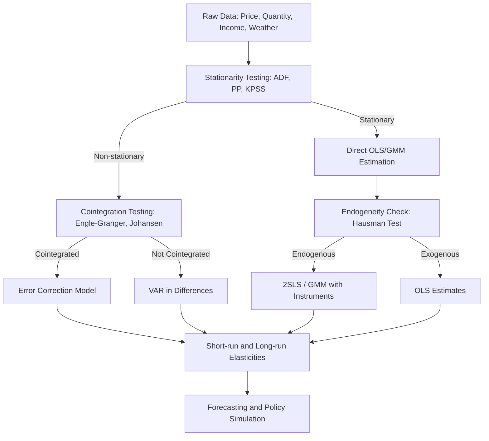

## Econometric Modeling of Energy Demand and Supply

### Overview

Econometric modeling of energy demand and supply applies statistical methods to quantify relationships between energy consumption, production, prices, income, and other economic and technical variables. These models support forecasting, policy analysis, price elasticity estimation, and long-run planning for utilities, regulators, and governments.

### Theoretical Foundations

#### Demand Theory

Energy demand is typically derived demand — households and firms do not want energy itself but the services it provides (heat, mobility, lighting, mechanical work). This underpins the standard specification:

$$Q_d = f(P, P_s, Y, T, \varepsilon)$$

Where $Q_d$ is quantity demanded, $P$ is own price, $P_s$ is the price of substitutes/complements, $Y$ is income or output, $T$ represents technology/weather/efficiency shifters, and $\varepsilon$ is a stochastic error term.

#### Supply Theory

Energy supply models incorporate resource extraction costs, capital investment lags, and capacity constraints:

$$Q_s = g(P, C, K, R, \mu)$$

Where $C$ is input/production cost, $K$ is capital stock or installed capacity, $R$ represents resource availability/reserves, and $\mu$ is the error term.

### Core Model Specifications

#### Static Log-Linear Demand Model

The most common workhorse specification, since coefficients map directly to elasticities:

$$\ln Q_t = \beta_0 + \beta_1 \ln P_t + \beta_2 \ln Y_t + \beta_3 \ln P_{s,t} + \varepsilon_t$$

Here $\beta_1$ is the own-price elasticity of demand and $\beta_2$ is the income elasticity, both interpreted directly as percentage responses.

#### Dynamic Partial Adjustment Model

Energy demand exhibits inertia due to capital stock (appliances, vehicles, industrial equipment) that adjusts slowly to price signals. The partial adjustment framework separates short-run from long-run responses:

$$\ln Q_t = \alpha + \beta_1 \ln P_t + \beta_2 \ln Y_t + \lambda \ln Q_{t-1} + \varepsilon_t$$

**Key Points**

- $\beta_1$ is the short-run price elasticity
- The long-run elasticity is $\beta_1 / (1-\lambda)$
- $\lambda$ (0 to 1) reflects the speed of adjustment; higher $\lambda$ implies slower capital turnover
- This structure is standard in energy demand literature and is well documented in applied econometrics texts

#### Error Correction Model (ECM)

When price and quantity series are non-stationary but cointegrated, an ECM separates short-run dynamics from long-run equilibrium:

$$\Delta \ln Q_t = \alpha + \sum_i \gamma_i \Delta \ln P_{t-i} + \sum_j \delta_j \Delta \ln Y_{t-j} + \theta (\ln Q_{t-1} - \phi_1 \ln P_{t-1} - \phi_2 \ln Y_{t-1}) + \varepsilon_t$$

The term in parentheses is the error correction term; $\theta$ (negative, and significantly so) measures the speed of reversion to long-run equilibrium after a shock.

#### Simultaneous Equations (Supply-Demand System)

Because price and quantity are jointly determined in energy markets, single-equation OLS estimation of either curve is subject to simultaneity bias. A structural system is specified as:

$$Q_t^d = \alpha_0 + \alpha_1 P_t + \alpha_2 Y_t + \varepsilon_t^d$$

$$Q_t^s = \beta_0 + \beta_1 P_t + \beta_2 C_t + \varepsilon_t^s$$

$$Q_t^d = Q_t^s = Q_t$$

Identification requires at least one exogenous variable that shifts demand but not supply (e.g., income $Y_t$) and one that shifts supply but not demand (e.g., input cost $C_t$) — the standard rank and order conditions for identification.

### Estimation Methods

| Method | Use Case | Notes |
| --- | --- | --- |
| OLS | Single-equation, exogenous regressors | Biased/inconsistent under simultaneity |
| 2SLS / IV | Simultaneous supply-demand systems | Requires valid instruments |
| GMM | Heteroskedasticity, weak-instrument robustness | Common in panel energy datasets |
| Panel Fixed/Random Effects | Cross-country or cross-utility panels | Controls unobserved heterogeneity |
| ARDL / Cointegration (Johansen, Engle-Granger) | Long-run price/income relationships in time series | Tests for stationarity required first |
| VAR / VECM | Multivariate dynamic interactions (price, output, demand) | Used for impulse response and forecasting |
| Panel Cointegration (Pedroni, Westerlund) | Large-N, large-T energy panels | Addresses cross-sectional dependence |

### Elasticity Concepts

**Key Points**

- **Own-price elasticity**: percentage change in quantity demanded per 1% change in own price; typically inelastic in the short run ($-0.1$ to $-0.3$ for many fuels) and more elastic in the long run ($-0.3$ to $-0.9$)
- **Income elasticity**: energy demand generally rises with income; elasticity often falls between 0.5 and 1.2 depending on the sector
- **Cross-price elasticity**: measures substitution, e.g., between natural gas and electricity for heating
- **Asymmetric price response**: [Inference] some empirical studies find demand responds differently to price increases than decreases, though this finding is sensitive to model specification and sample period

### Model Diagnostics and Pitfalls

#### Stationarity Testing

Time series in energy economics (prices, consumption) are frequently non-stationary. Standard practice includes:

- Augmented Dickey-Fuller (ADF) test
- Phillips-Perron (PP) test
- KPSS test (stationarity as the null, complementing ADF)

Running OLS on non-stationary, non-cointegrated series risks spurious regression — high $R^2$ and significant t-statistics that reflect no genuine relationship.

#### Endogeneity

Price and quantity are jointly determined; using OLS directly on a demand equation without addressing this produces biased and inconsistent estimates. Instrumental variables, simultaneous equations, or panel fixed-effects with appropriate instruments are standard remedies.

#### Multicollinearity

Energy variables (GDP, industrial output, population) are often highly correlated, inflating standard errors. Variance Inflation Factor (VIF) diagnostics and ridge regression are common mitigations.

#### Structural Breaks

Oil price shocks, policy changes (e.g., carbon pricing introduction), and technology shifts (e.g., shale gas expansion) can shift model parameters. Chow tests or Bai-Perron multiple breakpoint tests are used to detect these.

### Model Architecture Diagram

### Worked Example: Estimating Electricity Demand Elasticity

**Example**

Suppose monthly panel data across 20 utilities includes electricity consumption ($Q$), average retail price ($P$), regional income ($Y$), and heating/cooling degree days ($HDD$, $CDD$). A fixed-effects log-linear specification:

$$\ln Q_{it} = \alpha_i + \beta_1 \ln P_{it} + \beta_2 \ln Y_{it} + \beta_3 HDD_{it} + \beta_4 CDD_{it} + \varepsilon_{it}$$

**Output**

Hypothetical estimated coefficients:

- $\beta_1 = -0.28$ (short-run price elasticity: a 10% price increase reduces consumption by about 2.8%)
- $\beta_2 = 0.65$ (income elasticity: energy is a normal good with sub-unitary responsiveness)
- $\beta_3, \beta_4$ positive and significant, confirming weather-driven demand

[Unverified] — these are illustrative coefficients for demonstration, not empirical estimates from a specific published study; real elasticities vary substantially by country, sector, and period.

### Supply-Side Modeling Considerations

#### Exhaustible Resource Supply (Hotelling Framework)

For non-renewable energy resources, the Hotelling rule implies the shadow price of the resource (scarcity rent) grows at the rate of interest under efficient extraction:

$$\frac{\dot{p}_t}{p_t} = r$$

Empirical supply models augment this with extraction cost functions, exploration data, and reserve-to-production ratios.

#### Renewable Energy Supply

Renewable supply models differ structurally because marginal cost is near zero but output is weather-dependent and non-dispatchable. Common approaches:

- Merit-order stack models
- Stochastic frontier analysis for capacity factor estimation
- Panel models linking installed capacity growth to feed-in tariffs, auction prices, or policy incentives

### Software and Implementation Notes

**Key Points**

- **R**: `dynlm`, `urca` (unit root/cointegration), `vars` (VAR/VECM), `plm` (panel data), `systemfit` (simultaneous equations)
- **Python**: `statsmodels` (OLS, GLS, time series), `linearmodels` (panel/IV/GMM), `arch` (volatility, useful for energy price series)
- **Stata**: widely used in applied energy economics for `xtreg`, `ivregress`, `vec`
- Behavior of specific estimator defaults (e.g., standard error corrections, lag selection criteria) may vary by software version and package release; consult current package documentation before final implementation

### Common Data Sources

- EIA (U.S. Energy Information Administration) — consumption, price, and production series
- IEA (International Energy Agency) — cross-country energy balances
- World Bank — GDP, population, macroeconomic controls
- Eurostat — EU-level energy statistics
- National statistical/regulatory agencies for utility-level panel data

### Applications

**Key Points**

- Forecasting electricity/fuel demand for capacity planning
- Estimating price elasticities to evaluate carbon tax or subsidy removal impacts
- Simulating market responses to supply shocks (e.g., pipeline disruptions)
- Evaluating energy efficiency program effectiveness via difference-in-differences or synthetic control extensions
- Input to Computable General Equilibrium (CGE) models for broader macroeconomic-energy interaction analysis

### Related Topics

- Energy price forecasting and volatility modeling (GARCH/ARCH family)
- Cointegration and vector error correction models in energy markets
- Panel data econometrics for cross-country energy analysis
- Computable General Equilibrium (CGE) modeling of energy-economy interactions
- Elasticity of substitution between energy carriers
- Structural break detection in energy time series
- Instrumental variable selection for energy price endogeneity
- Renewable energy capacity investment models
- Energy demand under behavioral and bounded-rationality frameworks