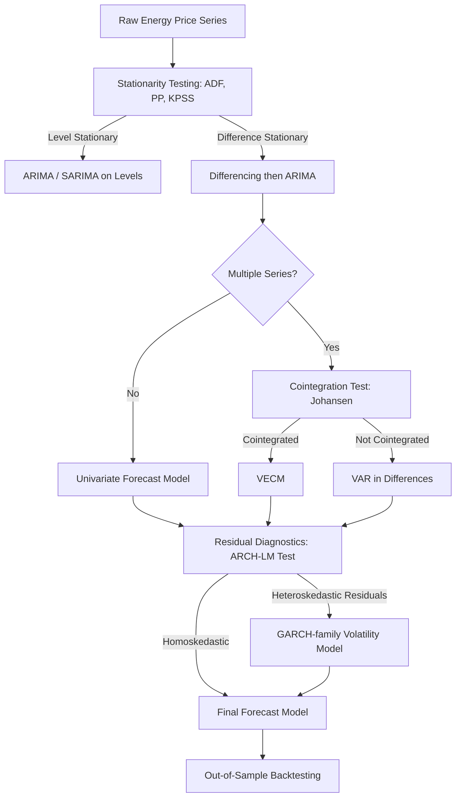

## Time Series Methods for Energy Price Analysis

### Overview

Energy prices — crude oil, natural gas, electricity, coal — exhibit properties that distinguish them from typical economic time series: high volatility, mean reversion, seasonality, price spikes, and regime shifts driven by supply disruptions, weather, and geopolitical events. Time series econometrics provides the toolkit to model, forecast, and analyze the risk characteristics of these series.

### Stylized Facts of Energy Price Series

**Key Points**

- **Volatility clustering**: large price changes tend to be followed by large changes (of either sign)
- **Mean reversion**: prices tend to revert toward long-run marginal cost or equilibrium levels, particularly pronounced in electricity and natural gas
- **Seasonality**: strong periodic patterns tied to weather-driven demand (heating/cooling seasons) and, for electricity, intraday/intraweek cycles
- **Price spikes**: electricity prices in particular show sudden, short-lived extreme spikes due to inelastic short-run supply and demand
- **Fat tails**: return distributions typically exhibit excess kurtosis relative to the normal distribution
- **Non-stationarity in levels**: raw price series often contain unit roots, while returns/differences are typically stationary

### Stationarity and Unit Root Testing

Before any time series model is estimated, series must be tested for stationarity.

#### Augmented Dickey-Fuller (ADF) Test

Tests the null hypothesis of a unit root:

$$\Delta y_t = \alpha + \beta t + \gamma y_{t-1} + \sum_{i=1}^{p} \delta_i \Delta y_{t-i} + \varepsilon_t$$

Rejecting $H_0: \gamma = 0$ implies stationarity.

#### Phillips-Perron (PP) Test

Non-parametric correction for serial correlation and heteroskedasticity in the error term, robust to certain forms of misspecification the ADF test does not directly address.

#### KPSS Test

Reverses the null hypothesis (stationarity), commonly used jointly with ADF/PP as a confirmatory check — agreement between the two increases confidence in the conclusion.

### Univariate Models

#### ARIMA(p,d,q)

The standard Box-Jenkins framework for a single price series:

$$\phi(L)(1-L)^d y_t = \theta(L)\varepsilon_t$$

Where $\phi(L)$ and $\theta(L)$ are autoregressive and moving-average lag polynomials, $L$ is the lag operator, and $d$ is the order of differencing needed for stationarity. Model order is selected using ACF/PACF inspection and information criteria (AIC, BIC).

#### Seasonal ARIMA (SARIMA)

Extends ARIMA with seasonal differencing and seasonal AR/MA terms, denoted $\text{SARIMA}(p,d,q)(P,D,Q)_s$, appropriate for natural gas or electricity prices with strong periodicity at seasonal frequency $s$.

### Volatility Models

Energy price volatility is itself economically meaningful (risk premia, options pricing, hedging), motivating conditional heteroskedasticity models.

#### ARCH(q)

$$\sigma_t^2 = \omega + \sum_{i=1}^{q} \alpha_i \varepsilon_{t-i}^2$$

#### GARCH(p,q)

Generalizes ARCH by allowing lagged conditional variance to enter:

$$\sigma_t^2 = \omega + \sum_{i=1}^{q} \alpha_i \varepsilon_{t-i}^2 + \sum_{j=1}^{p} \beta_j \sigma_{t-j}^2$$

GARCH(1,1) is the standard baseline specification for crude oil and gas price volatility.

#### Asymmetric Extensions

**Key Points**

- **EGARCH**: models asymmetric volatility response (leverage effect) in log-variance form, allowing negative and positive shocks to have different volatility impacts
- **GJR-GARCH (TARCH)**: adds an indicator term for negative shocks, commonly used since energy prices sometimes show *inverse* leverage (positive shocks — e.g., supply disruptions — raise volatility more than negative ones), the reverse of the equity market pattern
- [Inference] whether energy prices exhibit standard or inverse leverage effects is commodity- and period-specific and should be tested empirically rather than assumed

### Mean-Reverting and Jump-Diffusion Models

Electricity and, to a lesser extent, natural gas prices require continuous-time models capturing mean reversion and spikes, often used in derivatives pricing.

#### Ornstein-Uhlenbeck Mean-Reverting Process

$$dP_t = \kappa(\mu - P_t)dt + \sigma dW_t$$

Where $\kappa$ is the speed of mean reversion, $\mu$ is the long-run mean, and $dW_t$ is a Wiener process increment.

#### Mean-Reverting Jump-Diffusion (MRJD)

Adds a jump component to capture electricity price spikes:

$$dP_t = \kappa(\mu - P_t)dt + \sigma dW_t + J_t dq_t$$

Where $dq_t$ is a Poisson jump process and $J_t$ is the jump size, often modeled as log-normal.

### Multivariate Time Series Methods

#### Vector Autoregression (VAR)

Models dynamic interdependencies among multiple energy price series (e.g., oil, gas, coal) or between energy prices and macro variables:

$$Y_t = c + A_1 Y_{t-1} + \dots + A_p Y_{t-p} + \varepsilon_t$$

Used for impulse response analysis (tracing the effect of a shock in one price series on others) and forecast error variance decomposition.

#### Cointegration and Vector Error Correction Models (VECM)

When price series share a long-run equilibrium relationship (e.g., regional natural gas hubs linked by pipeline capacity, or crude oil grades), the VECM framework separates short-run dynamics from long-run adjustment:

$$\Delta Y_t = \Pi Y_{t-1} + \sum_{i=1}^{p-1} \Gamma_i \Delta Y_{t-i} + \varepsilon_t$$

Where $\Pi = \alpha \beta'$; $\beta$ contains the cointegrating vectors (long-run relationships) and $\alpha$ contains adjustment speeds. The Johansen procedure is the standard method for testing cointegration rank and estimating $\Pi$.

**Example**

Testing whether Henry Hub and a European gas hub price are cointegrated: if the Johansen trace test rejects the null of zero cointegrating vectors, a VECM can quantify how quickly deviations from the long-run price relationship (adjusted for shipping/LNG costs) are corrected — informing arbitrage and market integration analysis.

#### Structural VAR (SVAR)

Imposes economic identification restrictions (e.g., supply shocks affect price contemporaneously while demand shocks affect it with a lag) to disentangle underlying structural shocks — widely used in oil market shock decomposition (supply shock, aggregate demand shock, oil-specific demand shock).

### Regime-Switching and Structural Break Models

#### Markov-Switching Models

Allow model parameters (mean, variance) to switch between discrete unobserved regimes (e.g., "normal" vs. "crisis" states) governed by a hidden Markov chain, useful for capturing structural shifts in oil price behavior around major shocks.

#### Structural Break Tests

- **Chow test**: tests for a break at a known date
- **Bai-Perron test**: detects multiple unknown breakpoints, useful for identifying regime changes such as the shale revolution or major policy shifts

### Forecast Evaluation

**Key Points**

- **RMSE / MAE**: standard point-forecast accuracy measures
- **Diebold-Mariano test**: statistically compares forecast accuracy between two competing models
- **Backtesting**: out-of-sample rolling or expanding window evaluation is standard practice to avoid look-ahead bias
- **Density forecast evaluation**: for volatility/risk applications, calibration of the full predictive distribution (not just the point forecast) matters, often assessed via probability integral transform (PIT) tests

### Model Selection Workflow

### Software Implementation

**Key Points**

- **R**: `forecast` (ARIMA/SARIMA), `rugarch`/`rmgarch` (GARCH family), `urca` (unit root, Johansen cointegration), `vars` (VAR/SVAR), `MSwM` (Markov-switching)
- **Python**: `statsmodels` (ARIMA, VAR, VECM), `arch` (ARCH/GARCH family), `pmdarima` (automated ARIMA order selection)
- Package defaults for lag selection, error distributions (normal vs. Student-t vs. skewed-t), and optimization routines vary by version; results should be cross-checked against current documentation, particularly for GARCH variance-targeting options

### Applications in Energy Economics

- Value-at-Risk (VaR) and Expected Shortfall estimation for energy trading desks
- Options and derivatives pricing for electricity and gas contracts using mean-reverting/jump models
- Testing market integration and the Law of One Price across regional energy hubs
- Oil price shock decomposition for macroeconomic policy analysis
- Short-term load and price forecasting for grid operators and utilities
- Hedging strategy design based on volatility persistence estimates

### Related Topics

- GARCH-family volatility modeling in energy markets
- Cointegration testing and error correction models
- Structural VAR identification of oil supply and demand shocks
- Jump-diffusion models for electricity spot price spikes
- Markov-switching models for energy market regimes
- Value-at-Risk and risk management in energy trading
- High-frequency electricity price forecasting
- Machine learning approaches to energy price forecasting (LSTM, gradient boosting) as complements to classical time series methods