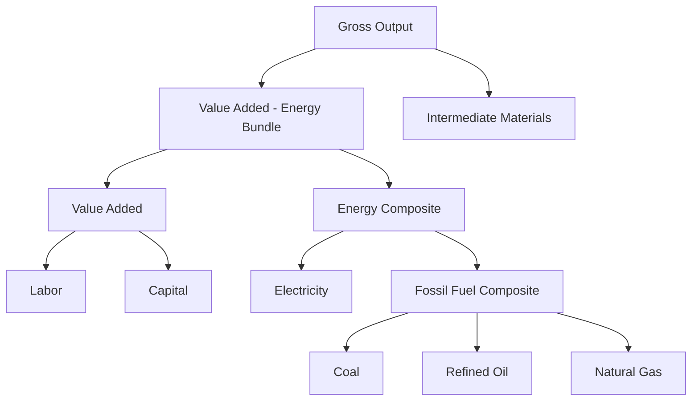

## Computable General Equilibrium Models of Energy Systems

### Overview

Computable General Equilibrium (CGE) models simulate the economy as a system of interlinked markets in simultaneous equilibrium, capturing how energy-sector shocks (carbon taxes, subsidy reform, technology shifts) propagate across production, consumption, trade, and factor markets. Unlike partial equilibrium or single-equation econometric models, CGE models explicitly account for economy-wide feedback effects, making them the standard tool for energy-climate policy analysis.

### Theoretical Foundations

#### Walrasian General Equilibrium

CGE models are numerical implementations of the Arrow-Debreu general equilibrium framework, in which all markets (goods, factors, energy) clear simultaneously at a vector of prices such that supply equals demand everywhere:

$$\sum_i x_i(p) = \sum_i \omega_i$$

Where $x_i(p)$ is demand by agent $i$ at price vector $p$, and $\omega_i$ is the corresponding endowment/supply.

#### Core Behavioral Assumptions

**Key Points**

- **Producers**: minimize cost subject to a nested production technology (typically constant elasticity of substitution, CES) combining capital, labor, energy, and materials
- **Households**: maximize utility subject to a budget constraint, often via a CES or Linear Expenditure System (LES) utility function
- **Government**: collects taxes (including energy/carbon taxes) and provides transfers or public goods
- **Rest of world**: modeled via trade closure rules (Armington assumption for import-domestic substitution, CET for export transformation)
- **Market clearing**: prices adjust until all markets clear; the model is solved as a simultaneous nonlinear system, not sequentially

### Model Architecture

#### Social Accounting Matrix (SAM)

The SAM is the core data structure underlying any CGE model — a square matrix recording all transactions between production sectors, factors, households, government, and the rest of the world in a base year, with each row sum equal to its corresponding column sum (accounting balance).

**Key Points**

- Rows/columns typically include: activities (production sectors), commodities, factors (labor, capital, energy resources), households, government, capital account, rest of world
- Energy-focused CGE models disaggregate the SAM to isolate energy sectors (coal, oil, gas, electricity, refined products) rather than treating "energy" as a single aggregate
- SAM construction/balancing commonly uses RAS or cross-entropy methods to reconcile inconsistent source data

#### Nested Production Structure

Energy-economy CGE models typically nest energy within a capital-energy or capital-energy-labor (KEL) bundle to reflect empirically observed substitution patterns, since energy and capital exhibit different substitution elasticities with labor than with each other.

#### CES Production/Substitution Function

At each nest level, a CES function governs substitution between inputs:

$$Y = A\left[\sum_i \delta_i X_i^{-\rho}\right]^{-1/\rho}$$

Where $\rho = \frac{1-\sigma}{\sigma}$ and $\sigma$ is the elasticity of substitution between inputs $X_i$. Energy-capital and energy-labor substitution elasticities are typically calibrated from econometric estimates or literature meta-analyses, since they are central to how the model responds to energy price shocks.

### Calibration and Closure

#### Calibration

Most CGE models are calibrated (not econometrically estimated) — free parameters (CES share and scale parameters) are set so the model exactly reproduces the base-year SAM as an equilibrium, given externally sourced elasticities. This contrasts with statistically estimated demand/supply models and is a defining methodological feature of CGE analysis.

#### Closure Rules

The model requires closure assumptions to be fully determined, since the number of endogenous variables must equal the number of independent equations:

**Key Points**

- **Macroeconomic closure**: determines how savings-investment balance is achieved (neoclassical: investment adjusts to savings; Keynesian: savings adjusts to investment)
- **Government closure**: fixed tax rates with endogenous deficit, or fixed deficit with endogenous tax rates
- **Trade closure**: fixed exchange rate vs. fixed current account balance
- **Factor market closure**: full employment (classical) vs. unemployment/wage rigidity (structuralist)
- [Inference] closure choice can materially affect simulated welfare and output results for the same shock, so sensitivity analysis across closures is considered good practice rather than optional

### Energy-Specific Extensions

#### Bottom-Up/Top-Down Hybrid Models

Pure top-down CGE models represent technology implicitly through smooth substitution elasticities, which can understate discrete technology-switching effects (e.g., coal-to-gas or fossil-to-renewable switching). Hybrid models address this by linking or embedding bottom-up engineering detail (discrete technology options, vintage capital, explicit cost curves) within the top-down general equilibrium structure.

**Key Points**

- **Soft-linking**: separate top-down and bottom-up models exchange results iteratively until convergence (e.g., MARKAL/TIMES linked to a CGE model)
- **Hard-linking**: technology detail is embedded directly within the CGE production functions, often via a "technology bundle" nest with discrete activities
- Hybrid approaches are standard in models such as GTAP-E, MIT EPPA, and various national integrated assessment frameworks

#### Carbon Pricing and Emissions Modules

Energy-CGE models typically append an emissions accounting module, with $CO_2$ (and sometimes other GHGs) linked to fossil fuel combustion via fixed emission factors:

$$E_t = \sum_f \phi_f \cdot Q_{f,t}$$

Where $\phi_f$ is the emission factor for fuel $f$ and $Q_{f,t}$ is quantity consumed. A carbon tax or cap-and-trade constraint then enters as an additional cost wedge in the fuel price, propagating through the CES production nests.

### Dynamic vs. Static Models

**Key Points**

- **Static (comparative-static) CGE**: solves a single equilibrium before and after a shock; useful for short/medium-run welfare and price impact analysis
- **Recursive-dynamic CGE**: solves a sequence of static equilibria linked by capital accumulation and other state variables updated period-to-period (no forward-looking expectations)
- **Intertemporal (forward-looking) CGE**: agents optimize over an infinite or finite horizon with perfect foresight or rational expectations, solved as a single large nonlinear system across all periods simultaneously (e.g., Ramsey-type growth CGE models)
- Energy-climate policy models most commonly use recursive-dynamic structures because the computational burden of full intertemporal solving scales poorly with sectoral/regional disaggregation

### Solution Methods

CGE models are solved as large systems of nonlinear equations (often thousands of equations for detailed models), typically formulated as:

- **Mixed Complementarity Problems (MCP)**: handles inequality constraints (e.g., zero-profit conditions, non-negativity) naturally; solved via PATH solver, standard in GAMS/MPSGE implementations
- **Sequential/Newton-based solvers**: used in some general-purpose CGE platforms

### Common Modeling Platforms

| Platform/Framework | Type | Notes |
| --- | --- | --- |
| GTAP-E | Static/comparative, global multi-region | Energy-extended version of the GTAP database and model |
| MIT EPPA | Recursive-dynamic, global | Widely used in climate policy analysis |
| GEM-E3 | Recursive-dynamic, EU-focused | Links energy, economy, and environment |
| ENVISAGE (World Bank) | Recursive-dynamic, global | Used for development and climate policy scenarios |
| PACE / DART | Static/dynamic, various | German research institution models for climate policy |
| GAMS/MPSGE | Modeling language/framework | Common implementation platform, not a standalone model |

[Unverified] — specific model names, versions, and institutional maintainers change over time; consult current documentation for the platform in question before implementation.

### Worked Example: Carbon Tax Impact Simulation

**Example**

A stylized single-country CGE model introduces a carbon tax of $\$50/tCO_2$ on fossil fuel combustion.

**Output** (illustrative, not from a specific published study)

Simulated general equilibrium effects might show:

- Coal output falls substantially (high emissions factor, low substitutability)
- Natural gas output falls moderately (lower emissions factor per unit energy)
- Renewable electricity generation share increases as relative fossil input costs rise
- Real GDP declines modestly in the near term as energy costs rise across all sectors
- Real household income effects depend on tax revenue recycling assumption (lump-sum rebate vs. labor tax cut vs. deficit reduction) — revenue recycling design is often the single largest determinant of net welfare outcomes

[Inference] the direction of these effects (fossil fuel contraction, renewable expansion) is a standard qualitative result across most published carbon-tax CGE studies, though magnitudes are highly model- and calibration-dependent.

### Validation and Sensitivity Analysis

**Key Points**

- **Systematic Sensitivity Analysis (SSA)**: varies key elasticities (especially energy substitution elasticities) across plausible ranges to assess result robustness
- **Model comparison exercises**: cross-model comparison projects (e.g., Energy Modeling Forum, EMF) benchmark results across multiple CGE and integrated assessment models for the same policy scenario
- **Historical validation**: recursive-dynamic models can be partially validated by comparing simulated historical trajectories against observed data, though full out-of-sample validation is inherently limited by the calibration-based (not estimation-based) nature of CGE parameters

### Limitations

**Key Points**

- Heavy reliance on externally sourced elasticity parameters rather than model-internal estimation
- Calibration to a single base-year SAM can embed idiosyncratic features of that year into all simulated results
- Smooth CES substitution may understate abrupt technology-switching or lock-in effects unless hybridized with bottom-up detail
- Results are sensitive to closure rule choice, which is a modeling assumption rather than an empirically testable feature
- Computational and data burden increases sharply with regional/sectoral disaggregation

### Related Topics

- Social Accounting Matrix construction and balancing methods
- CES/nested production function calibration
- Bottom-up energy system models (TIMES, MARKAL) and soft-linking approaches
- Carbon pricing and emissions trading scheme modeling
- Integrated Assessment Models (IAMs) linking CGE with climate systems
- Macroeconomic closure rules in applied general equilibrium analysis
- Energy Modeling Forum (EMF) cross-model comparison studies
- Welfare measurement (equivalent/compensating variation) in CGE policy analysis