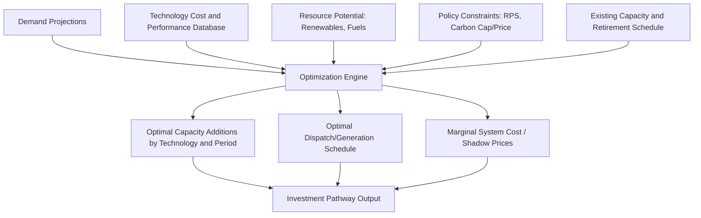

## Energy System Optimization and Capacity Expansion Modeling

### Overview

Energy system optimization models determine least-cost (or otherwise optimal) configurations of technologies, capacities, and operations needed to meet energy service demands subject to technical, economic, and policy constraints. Capacity expansion modeling — a core subclass — specifically answers *what new generation, transmission, or storage capacity should be built, when, and where* to meet future demand and policy targets at minimum system cost.

### Theoretical Foundations

#### Bottom-Up Engineering-Economic Optimization

Unlike CGE models, which represent technology implicitly through smooth substitution elasticities, bottom-up energy system models represent discrete technologies explicitly (specific power plant types, efficiencies, capital costs) and solve for the cost-minimizing technology mix directly:

$$\min \sum_{t} \sum_{i} \left( C_i^{inv} x_{i,t} + C_i^{op} y_{i,t} \right)$$

Subject to demand-balance, capacity, and policy constraints, where $x_{i,t}$ is new capacity built of technology $i$ in period $t$, $y_{i,t}$ is generation/operation level, $C_i^{inv}$ is annualized investment cost, and $C_i^{op}$ is operating cost.

#### Linear vs. Mixed-Integer Programming

**Key Points**

- **Linear Programming (LP)**: continuous decision variables; computationally tractable at large scale; standard for long-horizon, multi-region capacity expansion
- **Mixed-Integer Programming (MIP/MILP)**: adds binary/integer variables for unit commitment (on/off decisions), discrete plant sizing, or investment lumpiness; more realistic but computationally heavier
- Most large-scale, long-horizon capacity expansion models use LP with unit-commitment detail simplified or handled in a separate, higher-resolution dispatch sub-model

### Core Model Components

#### Objective Function

Standard formulation minimizes total discounted system cost over the planning horizon:

$$\min \sum_{t=1}^{T} \frac{1}{(1+r)^t} \left[ \sum_i \left( CAPEX_i \cdot x_{i,t} + FOM_i \cdot X_{i,t} + \sum_s VOM_i \cdot y_{i,t,s} \right) \right]$$

Where $r$ is the discount rate, $X_{i,t}$ is cumulative installed capacity, $FOM$/$VOM$ are fixed/variable operating and maintenance costs, and $s$ indexes representative time slices (hours, seasons) within each period $t$.

#### Key Constraints

**Key Points**

- **Demand balance**: generation plus imports must meet demand plus exports plus losses in every time slice and region
- **Capacity adequacy**: available capacity (installed capacity adjusted for availability/capacity factor) must meet peak demand plus a reserve margin
- **Resource/technical limits**: renewable resource potential caps, fuel availability, ramping constraints, minimum stable generation levels
- **Policy constraints**: renewable portfolio standards, emissions caps, carbon prices, capacity retirement schedules
- **Transmission constraints**: power flow limits between regions/nodes, often via simplified transport model or full DC power flow representation
- **Storage state-of-charge**: inventory balance equations linking charge/discharge decisions across time slices

#### Temporal Resolution

Capturing variable renewable output and demand fluctuations requires careful temporal representation, since full 8760-hour chronological modeling is often computationally prohibitive at multi-decade, multi-region scale:

**Key Points**

- **Representative days/weeks**: cluster analysis selects a subset of days that statistically represent the full year's demand/renewable variability
- **Time slices**: aggregate hours into blocks (e.g., peak/shoulder/off-peak by season), losing intra-block variability
- **Chronological full-resolution**: retains hour-by-hour sequencing, essential for accurately capturing storage dispatch and ramping, at higher computational cost
- [Inference] the choice of temporal resolution can materially affect optimal storage and flexible-capacity sizing results, since inadequate resolution tends to understate the value of flexibility

### Model Architecture Diagram

### Model Types and Frameworks

| Framework Type | Description | Examples |
| --- | --- | --- |
| Least-cost capacity expansion (LP/MILP) | Long-horizon, multi-region investment planning | GenX, ReEDS, PLEXOS (planning mode) |
| Technology-rich bottom-up (partial equilibrium) | Detailed energy system with technology chains across sectors | TIMES, MARKAL, MESSAGE |
| Production cost/dispatch models | High-resolution operational dispatch, fixed capacity | PLEXOS, PROMOD |
| Integrated Assessment Models (IAMs) | Global, links energy system to climate and macroeconomy | GCAM, IMAGE, REMIND |
| Agent-based/simulation models | Bottom-up behavioral simulation rather than optimization | Various regional tools |

[Unverified] — specific software names, licensing status (open-source vs. commercial), and current maintainers change over time; verify against current documentation before selecting a platform.

### Open-Source Framework Example: GenX

GenX is a widely used open-source capacity expansion and dispatch modeling framework developed in Julia using JuMP, notable for detailed representation of storage, flexible demand, and policy constraints.

**Key Points**

- Formulated as a linear (or mixed-integer) program solved via commercial or open-source solvers (Gurobi, CPLEX, HiGHS, Cbc)
- Supports multi-stage (multi-period) expansion planning with endogenous retirement decisions
- Includes detailed operational constraints: unit commitment, reserves, storage duration/efficiency, transmission network representation
- [Unverified] — exact feature set, input data format, and version-specific capabilities should be confirmed against current GenX documentation, as open-source energy modeling tools are updated frequently

### Setup Workflow (Generic Bottom-Up Capacity Expansion Model)

**Key Points**

1. **Define system boundary**: regions/nodes, sectors covered, planning horizon and period granularity
2. **Compile technology database**: capital costs, fixed/variable O&M, efficiency, lifetime, capacity factors (especially for variable renewables), ramp rates
3. **Build demand projections**: load profiles by region/time slice, often derived from historical data adjusted for growth and electrification scenarios
4. **Specify resource potentials**: renewable resource supply curves (wind/solar by grid cell or zone), fuel price/availability assumptions
5. **Encode policy constraints**: emissions caps or carbon prices, renewable portfolio standards, capacity market rules
6. **Select temporal resolution**: representative periods or full chronological hours depending on computational budget and storage/flexibility focus
7. **Solve and validate**: check solution for constraint violations, compare against historical benchmarks where applicable, run sensitivity analysis on key cost/policy parameters

### Worked Example: Simplified Two-Technology Expansion Problem

**Example**

Consider a single-region, single-period problem choosing between natural gas capacity (low CAPEX, higher variable cost) and solar capacity (higher CAPEX, near-zero variable cost, capacity factor 25%) to meet a peak demand of 1,000 MW with a 15% reserve margin, ignoring storage and transmission for simplicity.

$$\min \; CAPEX_{gas} \cdot X_{gas} + CAPEX_{solar} \cdot X_{solar} + VOM_{gas} \cdot \sum_s y_{gas,s}$$

Subject to:

$$X_{gas} + 0.25 \cdot X_{solar} \geq 1{,}150 \text{ MW (adequacy constraint)}$$

$$y_{gas,s} + 0.25 \cdot X_{solar} \cdot CF_s \geq D_s \; \forall s \text{ (demand balance by time slice)}$$

**Output** (illustrative)

The optimal mix depends critically on the relative CAPEX/VOM tradeoff and the shape of the demand-availability correlation across time slices $s$; solar's low capacity credit (25%) means it contributes less toward the adequacy constraint per MW installed than dispatchable gas capacity, a standard result in capacity expansion problems with variable renewables. [Inference] — this is a stylized illustration, not a calibrated numerical result.

### Uncertainty and Scenario Analysis

**Key Points**

- **Deterministic scenario analysis**: runs the model repeatedly under different fixed assumption sets (high/low demand growth, high/low technology cost)
- **Stochastic programming**: explicitly represents uncertain parameters (fuel prices, demand, renewable output) as probability-weighted scenarios within a single optimization, often via two-stage or multi-stage stochastic formulations
- **Robust optimization**: seeks solutions that perform acceptably across a defined uncertainty set without requiring probability distributions
- **Monte Carlo sensitivity analysis**: samples parameter distributions and re-solves the model many times to characterize output uncertainty

### Coupling with Other Model Types

**Key Points**

- **Soft-linking to CGE models**: capacity expansion output (technology costs, emissions) informs top-down macroeconomic models, and macro-level price/demand signals feed back into technology-choice constraints
- **Coupling with production cost/dispatch models**: capacity expansion models often use simplified operational representation; results are validated or refined using higher-resolution dispatch models post-optimization
- **Integration with power flow models**: detailed AC power flow analysis validates that optimized capacity/transmission decisions are technically feasible at the network level

### Solvers and Computational Considerations

**Key Points**

- Common solvers: Gurobi, CPLEX (commercial); HiGHS, CBC, GLPK (open-source)
- Large-scale, high-temporal-resolution, multi-region MILP formulations can require substantial computation time; decomposition methods (Benders decomposition, temporal/spatial aggregation) are commonly used to improve tractability
- Solver choice and default tolerance settings can affect solution precision and runtime; behavior may vary by solver version and problem formulation

### Applications

- Long-term generation and transmission investment planning for utilities and system operators
- Decarbonization pathway analysis (net-zero target feasibility studies)
- Renewable integration studies assessing storage and flexibility needs
- Policy impact assessment (carbon pricing, renewable mandates, capacity markets)
- Resource adequacy and reliability planning

### Related Topics

- Production cost modeling and unit commitment/dispatch optimization
- Renewable resource assessment and supply curve construction
- Energy storage sizing and dispatch optimization
- Stochastic and robust optimization under uncertainty
- Soft-linking bottom-up energy models with CGE frameworks
- Transmission expansion planning and power flow modeling
- Levelized cost of energy (LCOE) and technology cost trajectories
- Integrated Assessment Models and long-term decarbonization scenarios