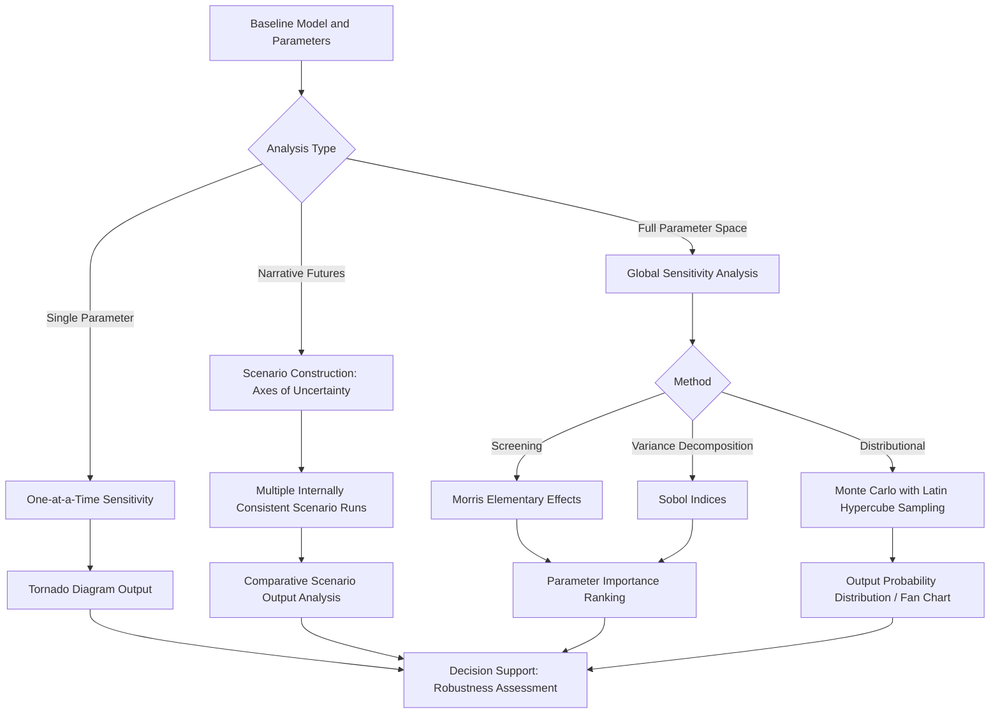

## Scenario Analysis and Sensitivity Testing Techniques

### Overview

Scenario analysis and sensitivity testing address model and parameter uncertainty in energy economics, where long time horizons, technological change, and policy discontinuities make single-point forecasts unreliable. These techniques characterize how outputs (costs, emissions, prices, investment pathways) respond to variation in assumptions, supporting robust decision-making under deep uncertainty rather than false precision.

### Distinguishing Core Concepts

**Key Points**

- **Scenario analysis**: constructs a small number of internally consistent, narratively distinct futures (e.g., "high renewable growth" vs. "delayed policy action") and examines model outcomes under each
- **Sensitivity analysis**: systematically varies individual input parameters (one at a time or jointly) around a baseline to measure output responsiveness, without necessarily constructing a full alternative narrative
- **Uncertainty analysis**: characterizes the full probability distribution of outcomes given uncertain inputs, often via Monte Carlo methods
- **Robustness analysis**: evaluates how well a given decision or strategy performs across a wide range of plausible futures, central to decision-making under deep uncertainty (DMDU) frameworks
- These categories overlap substantially in practice and are frequently combined within a single study

### Scenario Construction Methods

#### Narrative-Driven (Qualitative-to-Quantitative) Scenarios

Scenarios are often built by first defining qualitative storylines around key uncertainty axes, then translating them into quantitative model inputs.

**Key Points**

- **Axes-of-uncertainty method**: identifies two or more critical, independent uncertainty dimensions (e.g., policy stringency and technology cost trajectory) and defines scenarios at the extremes/combinations of a matrix
- **Intuitive logics approach**: builds scenarios through structured stakeholder deliberation identifying driving forces, critical uncertainties, and internally consistent narrative logic
- Common energy-sector scenario families include reference/business-as-usual, policy-constrained (e.g., net-zero-aligned), and technology-disruption scenarios

#### Exploratory vs. Normative Scenarios

- **Exploratory scenarios**: start from current conditions and explore plausible future trajectories ("what could happen")
- **Normative (target-seeking) scenarios**: start from a defined future goal (e.g., net-zero by a target year) and work backward to identify required pathways ("what must happen"), often called **backcasting**

### Sensitivity Analysis Methods

#### One-at-a-Time (OAT) Sensitivity Analysis

The simplest approach: vary a single parameter while holding all others at baseline values, and record the output change.

$$S_i = \frac{\partial Y}{\partial X_i}\bigg|_{X_{-i} = \bar{X}_{-i}}$$

**Key Points**

- Computationally cheap and easy to interpret
- Cannot capture interaction effects between parameters
- Commonly presented as **tornado diagrams**, ranking parameters by the magnitude of output swing they produce

#### Local Sensitivity Analysis

Computes partial derivatives (or finite-difference approximations) of model output with respect to each input around a single baseline point — appropriate for smooth, well-behaved models but uninformative about behavior far from the baseline or in models with strong nonlinearities/thresholds.

#### Global Sensitivity Analysis

Explores the full plausible range of all uncertain parameters simultaneously, capturing interaction effects that OAT methods miss.

**Key Points**

- **Sobol indices**: variance-based decomposition attributing output variance to individual parameters and their interactions; first-order index $S_i$ measures the individual contribution, total-order index $S_{Ti}$ includes interaction effects
- **Morris method (Elementary Effects)**: a computationally efficient screening method that ranks parameter importance without requiring the full computational cost of variance-based methods, well suited for models with many parameters where full Sobol analysis is infeasible
- **Regression-based methods**: standardized regression coefficients or partial correlation coefficients from a designed sample of model runs, appropriate for approximately linear/monotonic model responses

$$Var(Y) = \sum_i V_i + \sum_i \sum_{j>i} V_{ij} + \dots$$

Where $V_i$ is the variance contribution of parameter $i$ alone and $V_{ij}$ captures pairwise interaction effects.

#### Monte Carlo Simulation

Samples input parameters from specified probability distributions (uniform, normal, triangular, or empirically derived) and runs the model repeatedly to build a distribution of outputs.

**Key Points**

- Requires defining a joint probability distribution (or independence assumption) over uncertain inputs — a key methodological choice that itself carries assumptions
- **Latin Hypercube Sampling (LHS)**: a stratified sampling technique that achieves better coverage of the parameter space than simple random sampling for a given number of runs, standard practice in energy model uncertainty analysis
- Output typically summarized via percentile bands (e.g., 10th–90th percentile "fan charts"), particularly common in energy price and emissions forecasting

### Model Architecture / Workflow Diagram

### Decision-Making Under Deep Uncertainty (DMDU)

Standard scenario/sensitivity approaches assume the analyst can enumerate the relevant uncertainty space reasonably well. DMDU frameworks are designed for situations where even the *structure* of uncertainty is contested or poorly known — common in long-horizon energy transition planning.

**Key Points**

- **Robust Decision Making (RDM)**: stress-tests candidate strategies against a very large ensemble of plausible futures, then identifies vulnerabilities and strategies that perform "well enough" across most futures rather than optimally in one
- **Exploratory Modeling and Analysis (EMA)**: runs models across a wide range of scenarios to map the full space of plausible outcomes rather than seeking a single best estimate
- **Dynamic Adaptive Policy Pathways (DAPP)**: designs decision pathways with built-in adaptation triggers, allowing strategy adjustment as uncertainty resolves over time
- [Inference] DMDU approaches are increasingly applied in energy transition and infrastructure planning specifically because irreversible, long-lived capital investments are especially exposed to deep structural uncertainty (e.g., pace of technology cost decline, policy durability)

### Break-Even and Threshold Analysis

**Key Points**

- **Break-even analysis**: identifies the parameter value at which two alternatives (e.g., two technology choices) yield equal outcomes (e.g., equal levelized cost), directly informing decision thresholds
- **Threshold/tipping-point analysis**: identifies critical parameter values beyond which model behavior changes qualitatively (e.g., a carbon price level at which a technology switch becomes cost-optimal)

### Worked Example: Sensitivity of Levelized Cost to Discount Rate

**Example**

For a renewable energy project with fixed capital cost $CAPEX$, annual output $Q$, and lifetime $n$, the Levelized Cost of Energy (LCOE) is:

$$LCOE = \frac{CAPEX \cdot CRF(r,n) + FOM}{Q}$$

Where $CRF(r,n) = \frac{r(1+r)^n}{(1+r)^n - 1}$ is the capital recovery factor.

**Output** (illustrative)

Running LCOE across a discount rate range of 3% to 10% (holding $CAPEX$, $Q$, $FOM$ fixed) produces a tornado-style sensitivity showing LCOE rising substantially with discount rate, since capital-intensive, low-operating-cost technologies (typical of renewables) are disproportionately sensitive to the cost of capital relative to fuel-cost-dominated technologies. [Inference] this qualitative sensitivity ranking (capital-intensive technologies being more discount-rate-sensitive) is a standard, well-established result in energy project finance, though specific magnitudes depend on the numerical assumptions used.

### Presentation and Communication of Results

**Key Points**

- **Tornado diagrams**: rank parameters by sensitivity magnitude for a single output metric, widely used for OAT results
- **Spider/radar plots**: show percentage change in output against percentage change in multiple parameters simultaneously
- **Fan charts**: display probability bands around a central forecast trajectory over time, standard in energy price and emissions projections
- **Scenario matrices**: 2x2 or 3x3 grids positioning named scenarios along two key uncertainty axes
- Clear labeling of baseline assumptions and the plausible range tested is considered essential practice, since sensitivity results are only meaningful relative to the specified range

### Common Pitfalls

**Key Points**

- **Parameter range too narrow**: understates true uncertainty, giving false confidence in robustness
- **Ignoring parameter correlations**: independently varying parameters that are actually correlated (e.g., fuel prices across different fossil fuels) can produce implausible scenario combinations
- **Overreliance on OAT methods for nonlinear models**: misses interaction effects that can dominate total output variance in models with threshold effects or strong nonlinearities
- **Scenario proliferation without decision relevance**: generating many scenarios without a clear link to the decisions they are meant to inform reduces practical value
- [Inference] these are widely cited methodological cautions in the uncertainty analysis literature rather than claims specific to any single study

### Software and Implementation Tools

**Key Points**

- **Python**: `SALib` (Sobol, Morris, and other global sensitivity methods), `scipy.stats` for distribution sampling, `pyDOE2`/`SMT` for Latin Hypercube and other design-of-experiments sampling
- **R**: `sensitivity` package (Sobol, Morris, FAST methods), `lhs` package for Latin Hypercube sampling
- Specialized DMDU platforms include EMA Workbench (Python) for exploratory modeling and RDM-style analysis
- Behavior of specific sampling algorithms, convergence diagnostics, and default settings may vary by package version; consult current documentation before implementation

### Applications in Energy Economics

- Long-term energy demand and price forecasting under structural uncertainty
- Climate policy scenario analysis (e.g., IPCC-aligned emissions pathways)
- Capacity expansion and investment planning robustness testing
- Levelized cost and project finance risk assessment
- Stress-testing energy security and supply disruption scenarios
- Communicating uncertainty ranges to policymakers and investors

### Related Topics

- Stochastic programming and robust optimization in capacity expansion models
- Monte Carlo methods and Latin Hypercube sampling design
- Decision-making under deep uncertainty (RDM, EMA, DAPP frameworks)
- Integrated Assessment Model scenario families (SSPs, RCPs)
- Levelized Cost of Energy calculation and discount rate sensitivity
- Structural Decomposition Analysis as a complementary diagnostic technique
- Real options analysis for energy investment under uncertainty
- Backcasting methodology for target-seeking policy scenarios