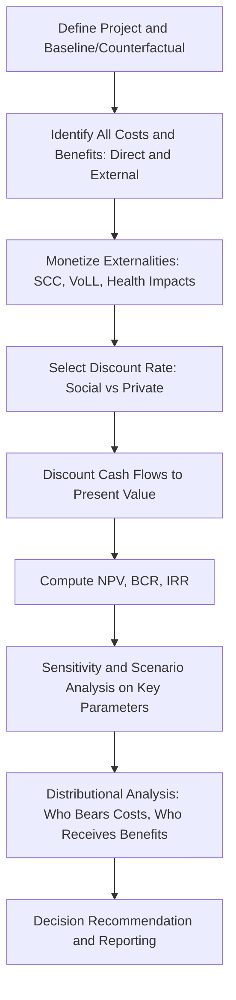

## Cost-Benefit Analysis Applied to Energy Projects

### Overview

Cost-benefit analysis (CBA) systematically compares the discounted economic value of a project's benefits against its costs to assess whether it represents an efficient use of resources. Applied to energy projects — generation capacity, transmission infrastructure, efficiency programs, or policy interventions — CBA underpins investment appraisal, regulatory approval, and public policy justification, extending beyond simple financial return to incorporate externalities such as emissions, reliability, and energy security.

### Theoretical Foundations

#### Welfare Economics Basis

CBA is grounded in the Kaldor-Hicks efficiency criterion: a project is worthwhile if the gainers could in principle compensate the losers and still be better off, even if compensation does not actually occur. This distinguishes CBA from pure financial appraisal (which considers only the investor's cash flows) by including all social costs and benefits regardless of who bears or receives them.

#### Net Present Value (NPV)

The core decision metric discounts all future costs and benefits to present value terms:

$$NPV = \sum_{t=0}^{T} \frac{B_t - C_t}{(1+r)^t}$$

Where $B_t$ and $C_t$ are benefits and costs in period $t$, $r$ is the discount rate, and $T$ is the project horizon. A project is deemed economically justified when $NPV > 0$.

#### Benefit-Cost Ratio (BCR)

$$BCR = \frac{\sum_{t=0}^{T} \frac{B_t}{(1+r)^t}}{\sum_{t=0}^{T} \frac{C_t}{(1+r)^t}}$$

A project is favorable when $BCR > 1$. BCR is useful for ranking mutually exclusive projects under capital constraints, though NPV is generally preferred as the primary decision criterion since BCR can give misleading rankings when project scales differ substantially.

#### Internal Rate of Return (IRR)

The discount rate at which $NPV = 0$:

$$0 = \sum_{t=0}^{T} \frac{B_t - C_t}{(1+IRR)^t}$$

**Key Points**

- IRR is intuitive for communicating project attractiveness but can produce multiple or undefined solutions when cash flow signs change more than once over the project horizon
- NPV is generally considered the more robust primary criterion in energy project appraisal, with IRR reported as a supplementary metric

### Categories of Costs and Benefits in Energy Projects

#### Direct/Private Costs and Benefits

**Key Points**

- Capital expenditure (CAPEX), fixed and variable operating and maintenance costs (FOM/VOM), fuel costs
- Revenue from energy sales, capacity payments, ancillary services
- Financing costs and residual/salvage value at project end

#### Externalities and Social Costs

Energy projects characteristically involve costs and benefits not captured in market prices, requiring explicit monetization for a complete social CBA:

**Key Points**

- **Environmental externalities**: greenhouse gas emissions (valued via social cost of carbon), local air pollutants (health impacts), land use and biodiversity effects
- **Energy security benefits**: reduced import dependence, supply diversification value
- **Reliability benefits**: value of lost load (VoLL) avoided through improved capacity/resilience
- **Employment and local economic effects**: often treated cautiously in formal CBA, since displaced employment elsewhere in the economy may offset gross job creation figures — [Inference] this is a standard caution in applied CBA guidance to avoid double-counting or overstating net employment benefits

#### Social Cost of Carbon (SCC)

A central input for valuing emissions externalities, representing the discounted present value of damages caused by one additional tonne of $CO_2$ emitted:

$$SCC = \sum_{t=0}^{\infty} \frac{D_t}{(1+\rho)^t}$$

Where $D_t$ is the marginal damage in period $t$ and $\rho$ is the social discount rate applied to damages. SCC estimates vary substantially across studies and institutions depending on damage function assumptions, discount rate choice, and treatment of catastrophic/tail risk. [Unverified] — specific official SCC values change periodically as agencies update methodology; consult current regulatory guidance for the applicable figure in a given jurisdiction and year.

### Discount Rate Selection

**Key Points**

- **Social discount rate**: reflects society's time preference and the opportunity cost of capital at the economy-wide level, typically lower than private/commercial discount rates
- **Private/commercial discount rate**: reflects the investor's cost of capital (WACC), incorporating project-specific risk premia
- **Declining discount rate schedules**: some regulatory guidance applies a lower discount rate to very long-horizon impacts (e.g., climate damages decades out), reflecting uncertainty about future growth rates
- Discount rate choice is one of the most consequential and contested methodological decisions in energy CBA, since long-lived infrastructure and multi-decade emissions impacts are highly sensitive to the rate applied — [Inference] this sensitivity is well documented in the CBA literature broadly, not specific to any single study

### CBA Workflow

### Treatment of Risk and Uncertainty

**Key Points**

- **Risk-adjusted discount rates**: incorporate a risk premium directly into the discount rate, though this approach can conflate time preference with risk in ways that complicate interpretation
- **Certainty-equivalent approach**: adjusts the cash flows themselves for risk, discounting at the risk-free rate, often preferred in formal welfare-economic treatments
- **Expected value with sensitivity analysis**: computes NPV under expected-value assumptions, then stress-tests key uncertain parameters (fuel prices, discount rate, SCC) via sensitivity/scenario analysis
- **Real options analysis**: values the flexibility to delay, expand, or abandon a project as new information arrives, particularly relevant for energy investments facing high technology-cost or policy uncertainty

### Distributional and Equity Analysis

Beyond aggregate efficiency (NPV), applied energy CBA increasingly incorporates distributional analysis — examining who bears costs and who receives benefits across income groups, regions, or generations.

**Key Points**

- **Intergenerational equity**: long-lived energy infrastructure and climate impacts raise explicit questions about how much weight to give future generations relative to the discount rate chosen
- **Distributional weighting**: some CBA frameworks apply higher weights to costs/benefits accruing to lower-income households, reflecting diminishing marginal utility of income
- **Just transition considerations**: CBA of fossil fuel phase-out or decarbonization policy increasingly incorporates transitional costs to affected workers/communities as an explicit line item rather than an externality

### Worked Example: Comparing Two Generation Investments

**Example**

Compare a natural gas plant (lower CAPEX, ongoing fuel cost and emissions) against a solar-plus-storage system (higher CAPEX, near-zero marginal cost and emissions) for meeting a defined capacity need, over a 20-year horizon at a 5% social discount rate.

| Component | Gas Plant | Solar + Storage |
| --- | --- | --- |
| CAPEX (illustrative) | Lower | Higher |
| Fuel/VOM costs | Ongoing | Near-zero |
| Emissions costs (at assumed SCC) | Significant, recurring | Near-zero |
| Reliability contribution | High (dispatchable) | Depends on storage duration/sizing |

**Output** (illustrative, not from a specific published study)

Including the social cost of carbon in the gas plant's cost stream narrows or reverses the NPV comparison relative to a private financial appraisal that excludes externalities — a standard qualitative finding in energy CBA literature when comparing fossil and low-carbon alternatives, though the specific NPV crossover point depends heavily on the SCC value, discount rate, and relative capital costs assumed. [Inference] the direction of this effect (externality-inclusive analysis favoring lower-emission alternatives relative to private analysis) follows directly from the definition of social vs. private cost accounting rather than requiring separate empirical verification.

### Regulatory and Institutional Guidance

**Key Points**

- Government CBA guidance documents (e.g., HM Treasury Green Book in the UK, OMB Circular A-4 in the US) specify standard discount rates, SCC values, and methodological requirements for public-sector energy project appraisal
- Multilateral development banks (World Bank, regional development banks) maintain their own CBA methodological guidance for energy sector lending
- [Unverified] — specific rates, values, and procedural requirements in these guidance documents are updated periodically; consult the current version of the applicable jurisdiction's guidance before formal appraisal

### Common Pitfalls

**Key Points**

- **Omitting externalities**: understates true social cost/benefit by relying only on private financial metrics
- **Double-counting**: counting the same benefit through multiple channels (e.g., both energy cost savings and separately valued emissions reductions that are already reflected in avoided fuel costs)
- **Inconsistent discount rate application**: mixing social and private discount rates inappropriately within the same analysis
- **Ignoring the counterfactual**: failing to rigorously define what would happen in the absence of the project, which can overstate attributable benefits
- **Optimism bias in cost estimation**: systematic underestimation of CAPEX and timeline, well documented in infrastructure project appraisal generally

### Software and Implementation Tools

**Key Points**

- Standard implementation is often spreadsheet-based (Excel) for straightforward project-level NPV/BCR/IRR calculations
- **Python**: `numpy-financial` (NPV, IRR functions), custom scripting for Monte Carlo sensitivity analysis
- **R**: base financial functions and packages such as `FinCal` for standard appraisal metrics
- For complex multi-scenario or stochastic CBA, integration with the sensitivity/uncertainty analysis techniques (Monte Carlo, Latin Hypercube sampling) described in dedicated uncertainty-analysis methodology is standard practice

### Applications in Energy Economics

- Public investment appraisal for generation, transmission, and grid infrastructure
- Regulatory cost-benefit test for utility resource planning and rate cases
- Climate and energy policy evaluation (carbon pricing, subsidy programs, efficiency standards)
- Comparative appraisal of competing technology options under a common decision framework
- Development finance project appraisal for energy access programs

### Related Topics

- Social cost of carbon estimation methodology
- Levelized Cost of Energy (LCOE) as a complementary private-cost metric
- Real options analysis for energy investment under uncertainty
- Value of Lost Load (VoLL) and reliability economics
- Discount rate selection in long-horizon public policy appraisal
- Distributional and just-transition analysis in energy policy
- Environmental externality valuation and non-market valuation methods
- Energy system optimization and capacity expansion modeling