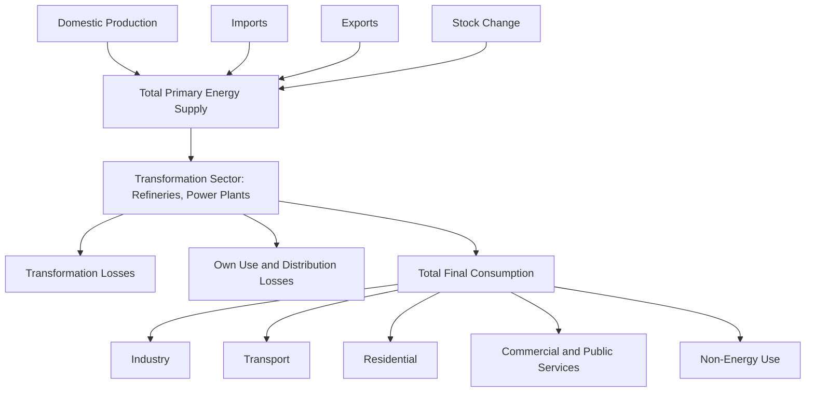

## Major Energy Data Sources and Statistical Conventions

### Overview

Empirical energy economics depends on a small set of internationally recognized data sources and a shared set of statistical conventions governing units, balances, and classifications. Understanding these sources and conventions is a prerequisite for any applied econometric, optimization, or CGE work, since inconsistent unit handling or misunderstood balance structures are a common source of analytical error.

### Major International Data Sources

#### International Energy Agency (IEA)

**Key Points**

- **World Energy Balances**: the core IEA product, providing energy balances covering roughly 156 countries and around 34–35 regional aggregates, expressed in both thousand tonnes of oil equivalent (ktoe) and terajoules (TJ), with historical coverage generally from 1971 (1960 for OECD members) to the most recently finalized year, with conversion factors and methodological notes on country-level sources provided alongside the data.
- The service is updated on a regular schedule, with a preliminary release early in the year followed by a final, globally complete edition later in the year — [Unverified] exact release months and edition naming shift slightly year to year; consult the IEA data product page for the current schedule before citing a specific vintage
- Other key IEA products: World Energy Outlook (scenario-based projections), Energy Prices and Taxes, Electricity Information, Oil/Gas/Coal Market Reports
- Access is a mix of free summary data and licensed detailed data; licensing terms and coverage should be checked directly on the IEA data platform

#### U.S. Energy Information Administration (EIA)

**Key Points**

- Publishes the **Annual Energy Outlook (AEO)** and **International Energy Outlook (IEO)**, both containing detailed projections and historical series
- **Short-Term Energy Outlook (STEO)**: monthly near-term forecasts for prices, production, and consumption
- Free, open API access to most series, widely used for U.S.-focused econometric and time series work
- Covers detailed U.S. state-level and sector-level data (residential, commercial, industrial, transportation, electric power)

#### Other Major Sources

| Source | Coverage | Notes |
| --- | --- | --- |
| BP (now Energy Institute) Statistical Review of World Energy | Global, long historical series | Widely used for long-run price/production time series; publisher/branding has changed over time |
| Eurostat | EU member states | Harmonized with EU statistical regulations |
| World Bank | Global, macro-energy indicators | Energy indicators often paired with GDP/development data |
| OECD | Member countries | Complements IEA data with broader economic context |
| National statistical/regulatory agencies | Country-specific | E.g., Ember, national energy ministries, grid operators |
| Ember | Global electricity-focused | Increasingly used for renewable/electricity transition tracking |

[Unverified] — organizational names, ownership, and publication branding (e.g., BP Statistical Review's transition to the Energy Institute) change periodically; verify current publisher and access terms before citing.

### Core Statistical Conventions

#### Energy Balance Structure

An energy balance is a standardized accounting framework tracking energy flows from primary production through transformation to final consumption, structured as a matrix of energy products (rows) by flow categories (columns).

**Key Points**

- **Primary energy supply**: production plus imports minus exports minus stock changes minus international bunkers, yielding Total Energy Supply (TES) or Total Primary Energy Supply (TPES)
- **Transformation sector**: inputs and outputs of conversion processes (e.g., crude oil into refined products, fuel into electricity), tracked as negative input and positive output entries
- **Final consumption**: energy delivered to end-use sectors (industry, transport, residential, commercial, agriculture, non-energy use)
- **Statistical differences**: a residual balancing item reflecting data collection imperfections, generally expected to be small relative to total supply

#### Units and Conversion

**Key Points**

- **Tonnes of oil equivalent (toe)**: a common energy unit allowing comparison across fuel types; 1 toe is conventionally defined as approximately $41.868$ gigajoules (GJ), though exact conversion factors can vary slightly by source and fuel-specific net calorific value assumptions
- **Joule-based units**: terajoules (TJ), petajoules (PJ), exajoules (EJ) are the SI-consistent alternative, increasingly preferred in international statistical publications
- **British thermal units (Btu)**: standard in U.S. data sources (EIA), with quadrillion Btu ("quads") common at the national aggregate level
- **Net vs. gross calorific value**: energy content can be measured on a net (lower heating value, excluding latent heat of water vapor) or gross (higher heating value) basis; mixing conventions across sources is a common source of comparability error
- **Electricity conversion**: converting electricity (measured in physical units, kWh/MWh) into a primary-energy-equivalent basis requires an assumption about the efficiency of the notional generation process being displaced — a methodological choice that differs between major statistical agencies (e.g., "physical energy content" vs. "partial substitution" methods) and can materially affect reported shares of nuclear/renewables in primary energy supply

#### Fuel and Sector Classification

**Key Points**

- Standard fuel categories: coal and coal products, peat, oil (crude, NGLs, petroleum products), natural gas, nuclear, hydro, geothermal, solar/wind/other renewables, combustible renewables and waste, electricity, heat
- Sector classifications generally follow, or are mapped to, International Standard Industrial Classification (ISIC) categories for cross-country comparability
- Renewable energy statistics require particular care distinguishing installed capacity (MW/GW) from generation (MWh/GWh/TWh), since capacity factor differences mean capacity shares and generation shares diverge substantially, especially for variable renewables

### Price and Market Data Conventions

**Key Points**

- **Spot vs. futures prices**: spot reflects current physical delivery, futures reflect forward contracts; energy economics research must clearly specify which is used, as they can diverge substantially during periods of market stress
- **Benchmark crude references**: Brent, WTI (West Texas Intermediate), Dubai/Oman are standard global oil price benchmarks, each reflecting different quality/location characteristics
- **Real vs. nominal prices**: converting to real terms requires an explicit deflator choice (CPI, GDP deflator, PPI), and results can be sensitive to that choice over long historical periods
- **Currency and purchasing power**: cross-country price comparisons require care in choosing between market exchange rates and purchasing power parity (PPP) conversion, particularly relevant for cross-country demand elasticity studies

### Data Quality and Comparability Issues

**Key Points**

- **Revisions**: energy statistics are frequently revised as agencies receive updated reporting; econometric work using real-time vs. revised (final) data can produce different results — a consideration parallel to "data vintage" issues in macroeconomics
- **Non-OECD data limitations**: non-OECD/developing country data collection methods, frequency, and granularity are often less standardized than OECD data, requiring caution in cross-country panel studies
- **Informal and traditional biomass consumption**: significant in many developing economies but poorly captured in formal statistical systems, creating a systematic undercount risk in total energy consumption figures for those countries
- **Confidentiality suppression**: some country/sector/fuel combinations are suppressed in published data for confidentiality reasons, creating structural missingness that differs from random missing data

### Data Access and Formats

**Key Points**

- Modern statistical agencies increasingly provide **API access** (EIA API, World Bank API) alongside traditional bulk downloads (CSV, Excel)
- IEA data is available through its .Stat Data Explorer interface as well as downloadable CSV and fixed-format text files
- Standardized data exchange formats such as **SDMX (Statistical Data and Metadata eXchange)** are increasingly used by international statistical agencies to facilitate machine-readable, harmonized data retrieval
- [Unverified] — specific access tiers, free vs. paid content boundaries, and API rate limits change over time across agencies; consult current documentation for the specific source before building a data pipeline

### Practical Workflow for Assembling an Energy Dataset

**Key Points**

1. **Define scope**: countries/regions, fuels, sectors, and time horizon required
2. **Select primary source(s)**: match source characteristics (coverage, granularity, update frequency) to research question
3. **Standardize units**: convert all series to a single consistent energy unit and calorific value basis before merging
4. **Reconcile classifications**: map source-specific sector/fuel codes to a common classification scheme if combining multiple sources
5. **Document vintage**: record the exact release/edition date of each source used, given the frequency of revisions
6. **Check balance identities**: for balance-structured data, verify that supply, transformation, and consumption entries are internally consistent as an initial data quality check

### Applications

- Empirical calibration of econometric demand/supply models
- Base-year Social Accounting Matrix and Input-Output table construction for CGE models
- Historical validation data for capacity expansion and system optimization models
- Cross-country panel studies of energy intensity and elasticities
- Policy monitoring and progress tracking against energy/climate targets

### Related Topics

- Energy balance construction and Sankey diagram visualization
- Unit conversion and calorific value conventions in energy statistics
- Input-output analysis for energy and emissions accounting
- Panel data construction for cross-country econometric studies
- SDMX and statistical data exchange standards
- Social Accounting Matrix data requirements for CGE modeling
- Real vs. nominal price series construction in energy economics
- Data vintage and revision effects in applied econometric analysis