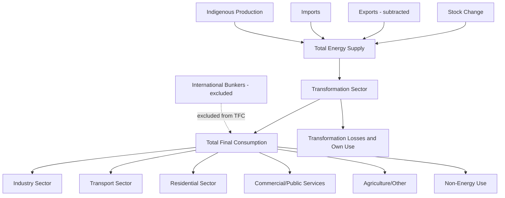

## National Energy Balances and Accounting Frameworks

### Overview

A national energy balance is the standardized accounting framework a country uses to track energy flows from primary supply through transformation to final use, in physically and conceptually consistent units. National accounting frameworks build on this balance structure to integrate energy statistics with broader economic accounts (national accounts, environmental-economic accounts), enabling policy analysis, international reporting, and integration with econometric and CGE models.

### Purpose and Institutional Context

**Key Points**

- National energy balances serve as the primary evidentiary basis for energy policy design, security-of-supply monitoring, and international reporting obligations (e.g., to the IEA, UNSD, UNFCCC)
- Most countries compile balances following international statistical standards to ensure comparability, principally the **International Recommendations for Energy Statistics (IRES)**, developed under the UN Statistical Commission, and IEA/Eurostat joint methodological guidance for member and partner countries
- Balances are typically compiled by a national statistical office, energy ministry, or dedicated energy agency, often in direct coordination with the IEA and Eurostat reporting cycles for countries within those frameworks

### Structure of a National Energy Balance

#### Supply Side

**Key Points**

- **Indigenous production**: extraction/generation of primary energy within national boundaries (coal mining, oil/gas extraction, renewable generation, nuclear generation)
- **Imports and exports**: cross-border physical trade in energy products
- **International marine and aviation bunkers**: fuel supplied to vessels/aircraft engaged in international transport, excluded from national final consumption by convention since it is not attributable to domestic economic activity
- **Stock changes**: drawdown (positive supply contribution) or build-up (negative) of held inventories
- These combine to yield **Total Energy Supply (TES)**, sometimes still referred to as Total Primary Energy Supply (TPES) in older terminology

$$TES = Production + Imports - Exports - Bunkers \pm \Delta Stocks$$

#### Transformation Sector

The transformation sector converts primary energy carriers into secondary/final forms, with each transformation process shown as a negative input and a positive output in the balance:

**Key Points**

- **Electricity and heat generation**: primary fuel input to power plants converted to electricity/heat output, with transformation losses reflecting thermal efficiency
- **Oil refineries**: crude oil and NGLs converted into refined petroleum products
- **Coke ovens, gas works, blast furnaces**: industrial transformation processes specific to certain fuel chains
- **Own use and distribution losses**: energy consumed by the energy sector itself (e.g., pipeline pumping, refinery own-use) and losses in transmission/distribution networks, tracked separately from transformation losses proper

#### Final Consumption

**Key Points**

- **Total Final Consumption (TFC)**: energy delivered to end-use sectors after netting out transformation, own use, and losses
- Standard end-use sector breakdown: industry (often by sub-sector: iron and steel, chemicals, non-metallic minerals, etc.), transport (by mode), residential, commercial and public services, agriculture/forestry/fishing, non-specified
- **Non-energy use**: energy products consumed as feedstock (e.g., petrochemical inputs) rather than combusted for energy, tracked separately since it does not generate the emissions or energy service typically associated with fuel consumption

#### Statistical Differences

**Key Points**

- The balance includes a **statistical difference** line item reconciling supply-side totals with the sum of transformation and final consumption entries, arising from imperfect synchronization of data sources (production surveys, trade data, sales data collected independently)
- A statistical difference that is large relative to total supply is generally treated as a data-quality flag warranting investigation, though [Inference] there is no universal fixed threshold across all statistical agencies for what counts as "large" — practice varies by country and agency

### Accounting Identities and Consistency Checks

The balance must satisfy identity-based consistency at each fuel/product level:

$$Production + Imports - Exports \pm \Delta Stocks - Bunkers = Transformation\ Inputs + TFC \pm Statistical\ Difference$$

**Key Points**

- Verifying this identity holds (within an acceptable statistical difference) is a standard first-pass data quality check before using national balance data in downstream models
- Balances are typically compiled separately for each fuel/product (coal, oil, gas, electricity, renewables, etc.) before being aggregated to a common energy unit for headline indicators like TES and TFC

### National Accounting Frameworks Linking Energy to the Economy

#### System of Environmental-Economic Accounting — Energy (SEEA-Energy)

A UN statistical standard extending the physical energy balance into a formal accounting framework structurally consistent with the System of National Accounts (SNA), enabling direct linkage between energy flows and monetary economic accounts.

**Key Points**

- Organizes data into physical supply-and-use tables (PSUTs) for energy, structurally mirroring the monetary supply-use tables used in national accounts
- Physical Supply and Use Tables record energy flows in physical units (e.g., TJ, tonnes) by industry and product, in a matrix structure directly analogous to standard monetary supply-use tables
- Enables construction of hybrid physical-monetary datasets that underpin environmentally extended input-output analysis and some CGE model calibration

#### Physical Supply and Use Tables (PSUTs)

**Key Points**

- **Supply table**: records energy product output by industry (domestic production plus imports)
- **Use table**: records energy product consumption by industry and final demand category (intermediate use, household consumption, exports)
- Structurally parallel to monetary supply-use tables, facilitating the construction of hybrid energy-economic datasets used in environmentally extended input-output (EEIO) analysis

#### Energy Efficiency Indicators Framework

National balances underpin standard energy efficiency and intensity indicators used in policy monitoring:

$$\text{Energy Intensity} = \frac{TES \text{ or } TFC}{GDP}$$

**Key Points**

- Sector-specific intensity indicators (e.g., energy per unit industrial value added, energy per passenger-km in transport) require more granular data than aggregate TES/GDP ratios and are typically compiled through complementary end-use surveys
- International comparability of intensity indicators depends on consistent treatment of the underlying energy unit, GDP measure (nominal vs. PPP-adjusted), and balance boundary definitions described above

### International Reporting Obligations

**Key Points**

- **IEA/Eurostat/UNSD Joint Questionnaires**: many countries submit annual energy data through a harmonized joint questionnaire process feeding both IEA and Eurostat databases (for applicable countries) and UN Statistics Division energy statistics
- **UNFCCC National Inventory Reports**: greenhouse gas inventories submitted under the UNFCCC draw directly on national energy balance data (activity data) combined with emission factors, following IPCC Guidelines methodology
- **International Recommendations for Energy Statistics (IRES)**: the overarching UN methodological standard specifying balance structure, product/sector classifications, and compilation guidance, intended to harmonize national practice globally
- [Unverified] — specific reporting deadlines, questionnaire structures, and reporting country lists are subject to periodic revision; consult current IEA/UNSD guidance for the applicable reporting cycle

### Reconciling National and International Balances

**Key Points**

- National balances published domestically sometimes differ from the version appearing in IEA/international databases due to differing vintage (national data may be revised after international submission), differing conversion factor assumptions, or differing treatment of specific categories (e.g., electricity primary-equivalent conversion method)
- Researchers combining national-source and international-source data for the same country should verify which conversion and classification conventions were applied, since combining series across the two without adjustment

  can introduce inconsistencies

### Worked Example: Constructing a Simplified National Balance Check

**Example**

For a hypothetical country's natural gas balance (in a common energy unit):

| Item | Value |
| --- | --- |
| Indigenous production | 500 |
| Imports | 200 |
| Exports | (50) |
| Stock change | (10) |
| International bunkers | 0 |
| **Total Energy Supply** | **640** |
| Transformation input (power generation) | (300) |
| Own use/losses | (20) |
| **Total Final Consumption** | **320** |
| Statistical difference | 0 |

**Output**

$$640 = 300 + 20 + 320 + 0$$

The identity holds exactly in this illustrative case (statistical difference of zero); in real compiled balances, a small non-zero statistical difference is normal and expected, while a large one signals a data reconciliation issue requiring investigation. [Inference] this illustrative example uses constructed figures purely to demonstrate the accounting identity, not real national data.

### Data Compilation Challenges

**Key Points**

- **Survey coverage gaps**: informal sector energy use, small-scale/off-grid generation, and traditional biomass consumption are commonly underrepresented in formal survey-based data collection
- **Timing misalignment**: production, trade, and consumption data are often collected through different survey instruments with different reporting lags, contributing to statistical differences
- **Fuel reclassification**: as new energy carriers emerge (e.g., hydrogen, specific biofuel categories), balance classification schemes require periodic updating, creating breaks in historical series comparability
- **Sub-national disaggregation**: national balances are compiled at the country level by convention; sub-national (state/provincial) energy balances, where compiled, often use different, less standardized methodologies

### Applications

- Input data for Input-Output and CGE model base-year calibration (via SAM/PSUT linkage)
- Baseline data for econometric demand/supply model estimation
- National greenhouse gas inventory compilation (activity data for emissions accounting)
- Energy security and self-sufficiency monitoring (import dependence ratios)
- International benchmarking of energy intensity and efficiency performance
- Historical validation dataset for capacity expansion and energy system models

### Related Topics

- Major energy data sources and statistical conventions
- Input-output analysis for energy and emissions accounting
- SEEA-Energy and Physical Supply and Use Table construction
- UNFCCC national GHG inventory methodology (IPCC Guidelines)
- Energy intensity and efficiency indicator construction
- Social Accounting Matrix development for CGE model calibration
- Cross-country panel data construction for econometric analysis
- Energy security indicators and import dependence metrics