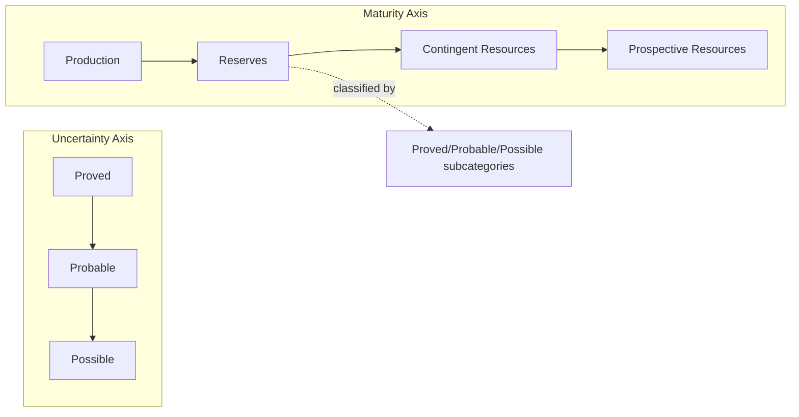
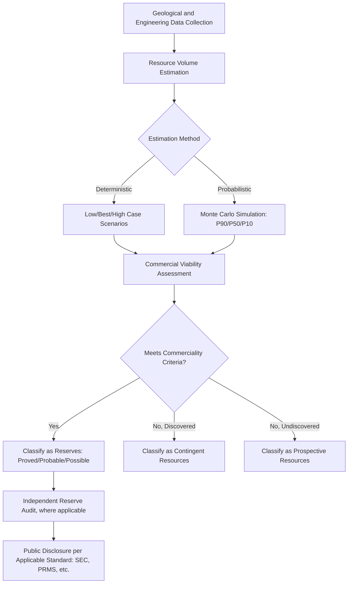

## Reserve Reporting Standards and Classification Systems

### Overview

Reserve reporting standards establish rules for estimating, classifying, and publicly disclosing quantities of oil, gas, coal, and mineral resources. These frameworks matter economically because reported reserves directly affect company valuation, capital allocation, regulatory compliance, and national resource accounting, while differing definitions across jurisdictions and standards bodies can produce materially different reported figures for the same physical resource base.

### Core Conceptual Distinction: Resources vs. Reserves

**Key Points**

- **Resources**: the total estimated quantity of a hydrocarbon or mineral in place or potentially recoverable, spanning a wide range of certainty and commercial viability
- **Reserves**: the subset of resources that are both technically recoverable and commercially viable under defined economic and regulatory conditions at the time of estimation
- All major classification systems organize quantities along two conceptual axes: **uncertainty** (how confident the estimate is) and **project maturity/commerciality** (how close the resource is to actual production)

### SPE Petroleum Resources Management System (PRMS)

The SPE Petroleum Resources Management System (PRMS) has been broadly adopted by the petroleum industry as the international standard reference for reserves and resources classification and reporting since its original 2007 publication, with a 2018 update approved by SPE and its co-sponsoring organizations following a multi-year review process. [Petroleum reserves +2](https://jpt.spe.org/update-global-standard-reservesresources-classification-and-definitions)

#### Governing Organizations

The SPE Oil and Gas Reserves Committee (OGRC) is responsible for reserves and resources matters including definitions, recommended practices, and standards, with PRMS co-sponsor organizations including the Society of Petroleum Evaluation Engineers (SPEE), the American Association of Petroleum Geologists (AAPG), the Society for Exploration Geophysicists (SEG), the Society of Petrophysicists and Well Log Analysts (SPWLA), the World Petroleum Council (WPC), and the European Association of Geoscientists and Engineers (EAGE). [spe](https://jpt.spe.org/spe-petroleum-resources-management-system-faqs-are-now-available)

#### Classification Framework

**Key Points**

- PRMS incorporates a central framework categorizing reserves and resources according to level of uncertainty on one axis and potential for reaching commercial producing status on the other [hartenergy](https://hartenergy.com/opinions/fresh-breeze-sec-accepts-new-reserve-reporting-rules-122064)
- The uncertainty axis divides reserves into proved, probable, and possible classifications [hartenergy](https://hartenergy.com/opinions/fresh-breeze-sec-accepts-new-reserve-reporting-rules-122064)
- The maturity axis categorizes quantities as production, reserves, contingent resources, and prospective resources, with reserves being a subset of the broader resources category [hartenergy](https://hartenergy.com/opinions/fresh-breeze-sec-accepts-new-reserve-reporting-rules-122064)
- Movement of volumes from a less certain to a more certain category requires resolution of the technical issues that originally caused the less-certain placement [hartenergy](https://hartenergy.com/opinions/fresh-breeze-sec-accepts-new-reserve-reporting-rules-122064)
- The system is fundamentally project-based, with classification tied to a specific project's chance of commerciality rather than to the reservoir in the abstract [spe](https://jpt.spe.org/update-global-standard-reservesresources-classification-and-definitions)

#### PRMS Sub-Classifications

**Key Points**

- **Proved reserves (1P)**: quantities with reasonable certainty (generally interpreted as a high confidence level) of commercial recovery under existing economic and operating conditions
- **Proved plus Probable (2P)**: adds probable reserves, those less certain than proved but considered more likely than not to be recovered
- **Proved plus Probable plus Possible (3P)**: adds possible reserves, less likely to be recovered than probable
- **Contingent resources**: discovered quantities not yet considered commercially recoverable due to one or more contingencies (e.g., pending regulatory approval, lack of a viable market, technology not yet proven)
- **Prospective resources**: undiscovered quantities estimated to be potentially recoverable from as-yet-undrilled prospects

#### Relationship to UNFC

PRMS also provides the commodity-specific specifications for petroleum under the United Nations Framework Classification for Resources (UNFC), a broader UN-maintained system intended to harmonize classification across energy and mineral resource types (not limited to petroleum). [hartenergy](https://hartenergy.com/opinions/fresh-breeze-sec-accepts-new-reserve-reporting-rules-122064)

### SEC Reserve Reporting Rules (United States)

**Key Points**

- Publicly traded companies listed on U.S. stock exchanges are obligated to report a defined portion of assets according to US Securities and Exchange Commission (SEC) disclosure rules, which have become more closely aligned with PRMS guidelines over time while retaining important differences [spe](https://www.spe.org/en/training/courses/managing-your-business-using-prms-and-sec-standards-2018-update/)
- The SEC's modernized reserve reporting rules were formally accepted, explicitly recognizing the importance of new technologies in producing accurate and reliable reserve estimates as the industry moved into harsher operating environments and more unconventional resource types [hartenergy](https://hartenergy.com/opinions/fresh-breeze-sec-accepts-new-reserve-reporting-rules-122064)
- SEC rules generally require use of a defined pricing convention (historically a trailing average of first-day-of-month prices over a preceding 12-month period) for proved reserves determination, differing in mechanics from the PRMS approach to economic assumptions — [Unverified] exact current SEC pricing and disclosure mechanics should be confirmed against the current Regulation S-K reserve disclosure rules, as detailed provisions are periodically revised
- Some reserve categories, such as sub-classification of developed reserves as Producing or Non-Producing, are optional PRMS guidance rather than SEC disclosure requirements [lawinsider](https://www.lawinsider.com/dictionary/spe-prms)

### Comparison of Major Classification Systems

| System | Governing Body | Primary Use | Key Characteristic |
| --- | --- | --- | --- |
| SPE-PRMS | SPE and co-sponsors (AAPG, SPEE, SEG, WPC, EAGE, SPWLA) | Global industry standard, technical/investment decisions | Project-based, probabilistic and deterministic methods both accepted |
| SEC Rules | U.S. Securities and Exchange Commission | Mandatory disclosure for U.S.-listed companies | Prescribed pricing convention, legally binding disclosure |
| UNFC | UN Economic Commission for Europe | Cross-commodity harmonization (energy and minerals) | Three-dimensional axis system (E, F, G: economic, feasibility, geological knowledge) |
| CRIRSCO family (JORC, NI 43-101, SAMREC, etc.) | National/regional mining bodies | Solid minerals (not petroleum) | Structurally analogous to PRMS but for mineral resources |
| Russian/CIS classification | National regulatory bodies | Historically distinct terminology and category structure | [Unverified] — degree of current convergence with international standards varies |

### Estimation Methodologies

**Key Points**

- **Deterministic methods**: apply a single set of assumptions to derive a single reserve estimate per category (low/best/high case), historically the more common approach in SEC-governed reporting
- **Probabilistic methods**: use statistical distributions over key input parameters (porosity, saturation, recovery factor) and Monte Carlo simulation to generate a full probability distribution of reserve outcomes, from which specific percentile estimates (P90, P50, P10) are drawn
- **P90/P50/P10 convention**: P90 denotes a 90% probability that actual recoverable quantities will equal or exceed the stated estimate (roughly corresponding to "proved" in deterministic terms), P50 to a 50% probability (roughly "proved plus probable"), and P10 to a 10% probability (roughly "proved plus probable plus possible") — though the deterministic and probabilistic terminology are not perfectly interchangeable and PRMS provides specific guidance on reconciling the two approaches

### Reserve Reporting Workflow

### Reserve Audits and Third-Party Certification

**Key Points**

- Independent reserve auditors (qualified reservoir engineering firms) are commonly engaged to review or certify company-reported reserve estimates, particularly for financing, transactions, or where governance/investor expectations require independent verification
- Auditor reports typically state best estimates for specific resource categories (e.g., a stated cumulative resource figure as of a defined date), consistent with the applicable classification standard's terminology [lawinsider](https://www.lawinsider.com/dictionary/spe-prms)
- Audit scope and rigor vary by jurisdiction, listing requirements, and whether the engagement is a full audit, review, or opinion-only engagement — [Unverified] specific audit standard requirements differ across stock exchange listing rules and should be confirmed against the applicable regulator's current requirements

### Economic Assumptions and Reserve Sensitivity

**Key Points**

- Reserve estimates are inherently price- and cost-dependent, since "commercially recoverable" is defined relative to a specific economic assumption set
- A change in the assumed price deck (or the prescribed SEC trailing-price convention) can move volumes across category boundaries (e.g., from possible into probable, or from reserves into contingent resources) without any change in the underlying physical resource
- [Inference] this price-sensitivity of reported reserves is a well-recognized feature of reserve accounting broadly, and is one reason analysts often examine reserve revisions alongside price movements when interpreting company disclosures
- Technology-driven reclassification (e.g., unconventional resources becoming commercially producible with new extraction techniques) can similarly shift large volumes between resource and reserve categories over time

### Applications in Energy Economics

- Company valuation and equity analysis (reserve-based net asset value models)
- National resource wealth accounting and sovereign fiscal planning for resource-dependent economies
- Input to long-run supply curve construction for econometric and CGE energy supply modeling
- Basis for reserve-to-production (R/P) ratio calculations used in energy security analysis
- Collateral valuation in reserve-based lending for upstream oil and gas financing

### Related Topics

- Reserve-to-production ratio and depletion analysis
- Hotelling framework and exhaustible resource economics
- National energy balances and accounting frameworks
- UNFC cross-commodity classification and mineral resource standards (CRIRSCO family)
- Reserve-based lending and upstream project finance
- Monte Carlo simulation methods in resource estimation
- Sovereign resource wealth and fiscal policy for resource-dependent economies
- Regulatory disclosure requirements for extractive industries (e.g., EITI transparency standards)