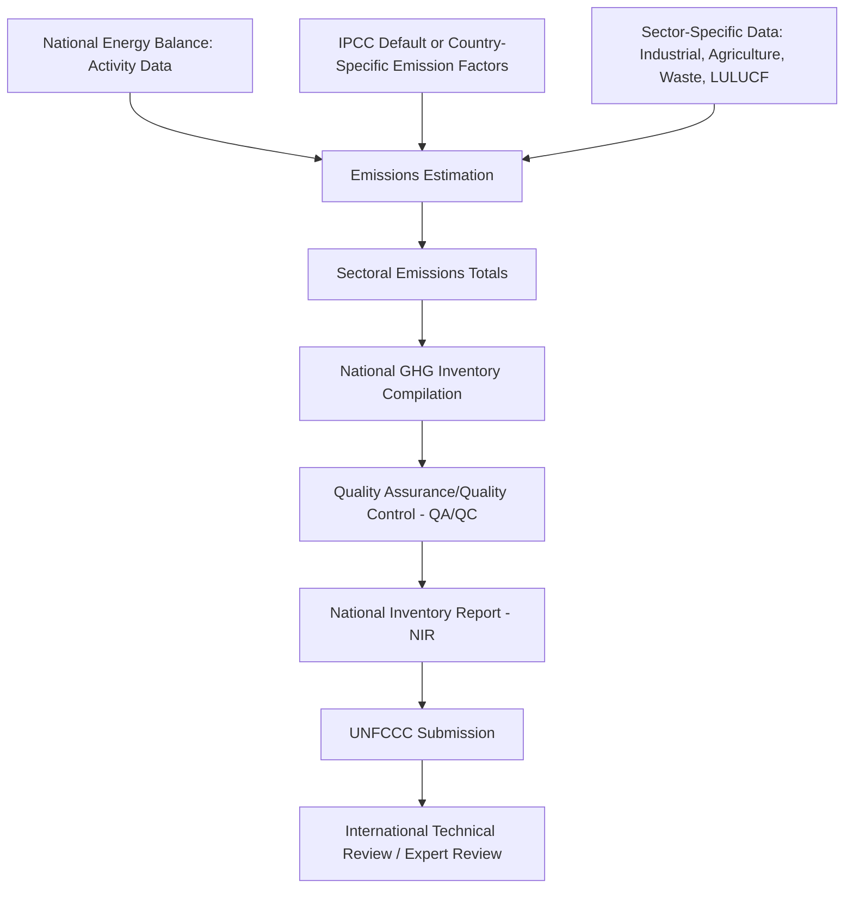

## Emissions Inventories and Measurement, Reporting, Verification

### Overview

Emissions inventories are systematic accounts of greenhouse gas (GHG) emissions and removals compiled at national, corporate, facility, or project level. Measurement, Reporting, and Verification (MRV) refers to the institutional and technical processes that ensure inventory data is accurate, transparent, consistent, comparable, and complete — a foundation for climate policy compliance, carbon markets, corporate disclosure, and international negotiation.

### Core Framework Principles

**Key Points**

- **Transparency**: methods, data sources, and assumptions are documented such that a third party could reproduce the estimate
- **Accuracy**: emissions are neither systematically over- nor under-estimated as far as can be judged
- **Completeness**: all relevant sources, sinks, gases, and geographic areas within the defined boundary are covered
- **Consistency**: methods are applied consistently over time to allow valid trend analysis
- **Comparability**: estimates use standardized categories and methods enabling comparison across reporting entities
- These five principles (often abbreviated TACCC) originate from IPCC national inventory guidance and are widely adopted as the general quality benchmark across national, corporate, and project-level inventory systems

### National GHG Inventories

#### IPCC Guidelines Methodology

National inventories submitted under the UNFCCC follow IPCC Guidelines methodology, structuring emissions estimation as:

$$Emissions = Activity\ Data \times Emission\ Factor$$

**Key Points**

- **Activity data**: physical quantity of an activity causing emissions (e.g., tonnes of fuel combusted, hectares of land converted), typically sourced from national energy balances, agricultural statistics, and industrial production data
- **Emission factor**: emissions per unit of activity, which may be an IPCC default value (Tier 1), a country-specific factor (Tier 2), or derived from direct measurement/detailed modeling (Tier 3)
- Higher tiers generally require more detailed data and yield lower uncertainty but at higher compilation cost

#### Sectoral Structure

National inventories are organized into standard IPCC sectors:

**Key Points**

- **Energy**: fuel combustion (by sub-sector: energy industries, manufacturing/construction, transport, other) and fugitive emissions from fuel production
- **Industrial Processes and Product Use (IPPU)**: emissions from chemical/physical processes independent of fuel combustion (e.g., cement production, refrigerant use)
- **Agriculture, Forestry and Other Land Use (AFOLU)**: livestock, soil management, land-use change, forestry sinks/sources
- **Waste**: solid waste disposal, wastewater treatment
- The Energy sector is typically the largest source category in most national inventories and draws directly on the national energy balance activity data described in energy statistics reporting

#### Reporting Under the UNFCCC and Paris Agreement

**Key Points**

- Countries submit National Inventory Reports (NIRs) and, since the Paris Agreement's Enhanced Transparency Framework (ETF) took effect, Biennial Transparency Reports (BTRs) with harmonized reporting tables and common timeframes for most countries
- The Enhanced Transparency Framework replaced the previous differentiated system (Annex I vs. non-Annex I reporting schedules) with a more unified structure, while retaining flexibility provisions for developing countries with capacity constraints
- Submitted inventories undergo technical expert review to assess adherence to methodology and identify areas for improvement, rather than a pass/fail audit in the strict sense
- [Unverified] — specific submission deadlines, review cycle timing, and flexibility provisions are subject to ongoing negotiation and procedural refinement under the UNFCCC process; consult current UNFCCC guidance for the applicable reporting cycle

### Corporate GHG Accounting: The GHG Protocol

#### Scope Classification

The GHG Protocol Corporate Standard is the most widely used framework for corporate-level emissions accounting, organizing emissions into three scopes:

**Key Points**

- **Scope 1**: direct emissions from sources owned or controlled by the reporting company (on-site combustion, company vehicles, process emissions)
- **Scope 2**: indirect emissions from purchased electricity, heat, or steam, reportable using either a location-based method (grid-average emission factors) or a market-based method (contractual instruments such as renewable energy certificates)
- **Scope 3**: all other indirect emissions occurring in the company's value chain, both upstream (purchased goods, capital goods, transportation) and downstream (product use, end-of-life treatment), further divided into 15 defined categories
- Scope 3 emissions are typically the largest and most methodologically challenging category for most companies, often requiring input-output-based or hybrid life-cycle assessment approaches described in emissions accounting methodology

#### Organizational and Operational Boundaries

**Key Points**

- **Equity share approach**: emissions accounted for in proportion to ownership share of an operation
- **Financial control approach**: emissions accounted for fully if the company has financial control, regardless of ownership percentage
- **Operational control approach**: emissions accounted for fully if the company has operational authority to implement policies, regardless of ownership share
- Companies must select and consistently apply one consolidation approach, disclosed as part of the inventory methodology

### Facility-Level and Regulatory MRV Systems

**Key Points**

- Many jurisdictions operate mandatory facility-level MRV systems tied to emissions trading schemes or carbon taxes (e.g., EU Emissions Trading System MRV Regulation, various national/sub-national mandatory reporting programs)
- These systems typically require higher-tier (more precise) monitoring methodologies than default national inventory factors, since facility-level data directly determines compliance obligations and financial liability
- Continuous Emissions Monitoring Systems (CEMS) provide direct, real-time measurement of stack emissions for large point sources, generally considered the highest-accuracy monitoring approach where installed, though calculation-based methods (activity data times emission factor) remain more common for smaller or more diffuse sources due to cost

### Verification Processes

**Key Points**

- **Third-party verification**: independent auditors assess whether reported emissions data conforms to the applicable standard and is free of material misstatement, commonly required for regulatory compliance schemes and increasingly for voluntary corporate disclosure
- **Assurance levels**: "limited assurance" (a lower-intensity review providing negative assurance — nothing came to the verifier's attention suggesting material misstatement) versus "reasonable assurance" (a more intensive audit-level process providing positive assurance), with reasonable assurance being more rigorous and costly
- **Materiality thresholds**: verification standards typically define a threshold below which discrepancies are not considered to affect the overall reliability of the reported figure
- Common verification standards include ISO 14064-3 (specifically for GHG assertions) and general assurance standards adapted from financial auditing practice (e.g., ISAE 3000 framework)

### Uncertainty Quantification

**Key Points**

- National and corporate inventories generally report a quantified uncertainty range alongside point estimates, reflecting both activity data uncertainty and emission factor uncertainty
- **Error propagation methods**: combine uncertainty in activity data and emission factors, typically via simplified variance propagation (Tier 1 approach in IPCC guidance) or Monte Carlo simulation (Tier 2 approach) for more complex, correlated uncertainty structures
- Uncertainty is generally higher for AFOLU/land-use categories than for energy combustion categories, since land-use change and soil carbon estimation involve substantially more measurement and modeling uncertainty than fuel combustion accounting

### Satellite and Remote Sensing MRV

**Key Points**

- Satellite-based atmospheric monitoring (e.g., missions measuring column-averaged $CO_2$ and $CH_4$ concentrations) increasingly complements traditional bottom-up (activity-data-based) inventories with top-down atmospheric measurement
- Top-down satellite estimates and bottom-up inventory estimates do not always agree precisely, and reconciling the two remains an active area of methodological development — [Inference] discrepancies between top-down and bottom-up estimates are widely discussed in the atmospheric science and inventory literature as a signal of remaining measurement and methodological uncertainty on both sides, not necessarily an indication that one method is simply wrong
- Satellite monitoring is particularly valuable for detecting large point-source methane emissions (e.g., oil and gas sector leaks), where bottom-up emission factor approaches have historically shown significant uncertainty

### Carbon Market MRV Requirements

**Key Points**

- Compliance carbon markets (cap-and-trade systems) and voluntary carbon markets both require robust MRV to ensure traded credits/allowances correspond to real, verified emissions or reductions
- Project-level voluntary carbon credits require additional concepts beyond standard inventory MRV: **additionality** (would the reduction have occurred without the project/credit revenue), **baseline setting** (what would emissions have been absent the project), and **permanence** (particularly relevant for removal-based credits, e.g., forestry, where reversal risk must be managed)
- Double-counting prevention (ensuring the same emission reduction is not claimed by multiple parties) is a central design requirement across both compliance and voluntary carbon market MRV systems

### Reporting Standards Landscape

| Framework | Level | Primary Use |
| --- | --- | --- |
| IPCC Guidelines | National | UNFCCC national inventory reporting |
| GHG Protocol Corporate Standard | Corporate | Corporate Scope 1/2/3 disclosure |
| ISO 14064 (Parts 1-3) | Organizational/Project | International standard for GHG quantification, reporting, and verification |
| EU ETS MRV Regulation | Facility | EU Emissions Trading System compliance |
| CDP (formerly Carbon Disclosure Project) | Corporate | Voluntary investor-facing disclosure platform |
| Various carbon crediting standards (e.g., Verra, Gold Standard) | Project | Voluntary carbon market credit issuance |

[Unverified] — specific standard versions, regulatory requirements, and platform names are subject to periodic revision; consult current documentation for the applicable framework and jurisdiction.

### Common Data Quality Challenges

**Key Points**

- **Emission factor uncertainty**: default factors may not accurately reflect specific technology, fuel quality, or operating conditions at a given facility or country
- **Activity data gaps**: informal sector activity, small-scale/distributed sources, and certain land-use categories are commonly underrepresented in available statistics
- **Boundary-setting inconsistency**: differing organizational/operational boundary choices across companies or jurisdictions complicate direct comparability
- **Double counting risk**: particularly relevant where multiple entities in a supply chain, or multiple governance levels (national vs. sub-national), might independently claim the same emissions reduction

### Applications in Energy Economics

- Input data (activity data) for national energy balance cross-validation
- Basis for carbon pricing policy design and compliance monitoring
- Corporate climate risk disclosure and investor decision-making
- Input to Structural Decomposition Analysis and Input-Output emissions accounting
- Calibration data for CGE and energy system model emissions modules
- Underpinning data for carbon border adjustment mechanisms and trade-related climate policy

### Related Topics

- Input-output analysis for energy and emissions accounting
- National energy balances and accounting frameworks
- Carbon pricing and emissions trading scheme design
- Corporate climate disclosure frameworks (TCFD-aligned reporting)
- Satellite-based atmospheric monitoring for methane detection
- Carbon market design: compliance vs. voluntary markets
- Structural Decomposition Analysis of emissions trends
- Social cost of carbon and externality valuation methodology