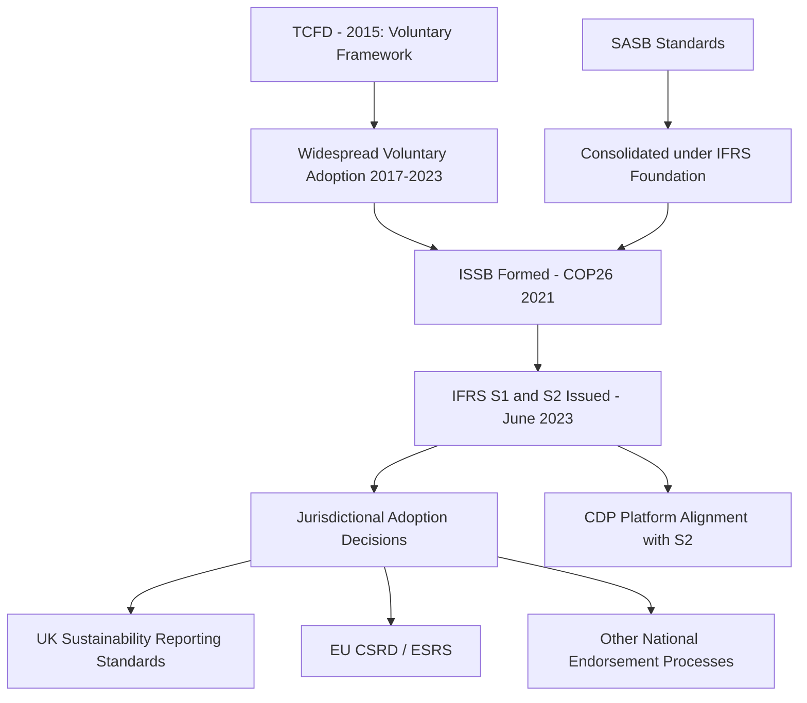
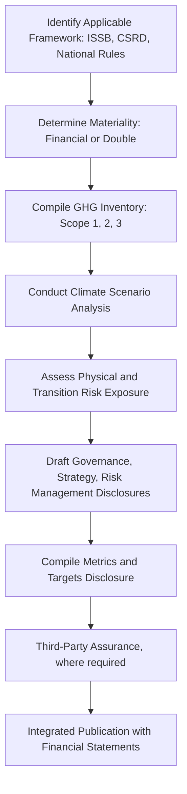

## Corporate Energy and Climate Disclosure Frameworks

### Overview

Corporate energy and climate disclosure frameworks establish standardized requirements for companies to report their energy use, greenhouse gas emissions, climate-related risks, and transition strategies to investors, regulators, and the public. This landscape has evolved rapidly from voluntary, investor-driven initiatives toward a more consolidated and increasingly mandatory global baseline, with implications for capital allocation, energy transition financing, and comparability of corporate climate performance.

### Historical Evolution

**Key Points**

- Early voluntary frameworks (CDP, GRI) established reporting norms in the 2000s–2010s, driven primarily by investor and NGO demand rather than regulation
- The Task Force on Climate-related Financial Disclosures (TCFD) was established by the Financial Stability Board in 2015 to develop consistent, voluntary disclosure recommendations for climate-related financial risk, and became the dominant reference framework globally over the following decade
- The International Sustainability Standards Board (ISSB) was created under the IFRS Foundation, with its establishment announced at COP26 in November 2021, given a mandate to develop global sustainability reporting standards building on TCFD, SASB, and other prior frameworks
- The ISSB issued its inaugural standards, IFRS S1 and IFRS S2, on 26 June 2023, fully incorporating TCFD's recommendations, with the IFRS Foundation formally taking over TCFD's climate-disclosure monitoring role from 2024

### TCFD Framework Structure

The TCFD framework organizes climate-related financial disclosure around four core pillars, which remain structurally embedded in its successor, IFRS S2.

**Key Points**

- **Governance**: the organization's governance around climate-related risks and opportunities (board oversight, management's role)
- **Strategy**: actual and potential impacts of climate-related risks and opportunities on the business, strategy, and financial planning, including scenario analysis
- **Risk Management**: processes used to identify, assess, and manage climate-related risks
- **Metrics and Targets**: metrics and targets used to assess and manage relevant climate-related risks and opportunities, including GHG emissions

#### Physical vs. Transition Risk

**Key Points**

- **Physical risks**: direct impacts from climate change, further divided into acute (event-driven, e.g., extreme weather) and chronic (longer-term shifts, e.g., changing precipitation patterns, rising mean temperatures)
- **Transition risks**: risks arising from the shift to a lower-carbon economy, including policy and legal risk (e.g., carbon pricing), technology risk (e.g., stranded assets from displaced technologies), market risk (shifting demand patterns), and reputational risk

### IFRS S1 and IFRS S2 (ISSB Standards)

#### IFRS S1: General Requirements

IFRS S1 sets out general requirements for sustainability-related financial disclosures, requiring an entity to disclose material information about sustainability-related risks and opportunities across governance, strategy, risk management, and metrics and targets, emphasizing financial materiality — whether information could reasonably be expected to influence investor decisions.

#### IFRS S2: Climate-Related Disclosures

**Key Points**

- Designed to be used together with IFRS S1, IFRS S2 requires disclosure of information across the same four TCFD-aligned pillars specifically for climate
- Required metrics include Scope 1, 2, and 3 greenhouse gas emissions, climate-related physical and transition risks, capital expenditure directed toward climate-related risks and opportunities, and internal carbon pricing where used
- Both standards became effective for annual reporting periods beginning on or after 1 January 2024, with early application permitted provided both standards are applied together
- The standards permit reference to other frameworks (e.g., SASB industry-specific standards) in the absence of topic-specific IFRS Sustainability Disclosure Standards, and both S1 and S2 require considering industry-specific SASB standards in determining materiality

### Jurisdictional Adoption Landscape

Adoption of ISSB standards proceeds jurisdiction by jurisdiction, as regulators decide whether and how to build or align local disclosure rules with IFRS S1 and S2, rather than through automatic global applicability.

**Key Points**

- **United Kingdom**: has been an early leader in mandating climate disclosures, requiring large UK incorporated companies and LLPs to make TCFD-consistent disclosures under prior rules; in February 2026 the UK Government published UK Sustainability Reporting Standards (UK SRS), UK-endorsed versions of the ISSB standards closely aligned with them, initially available for voluntary adoption with the possibility of becoming mandatory for certain entities in due course
- **European Union**: operates its own regime under the Corporate Sustainability Reporting Directive (CSRD) and European Sustainability Reporting Standards (ESRS), which share substantial conceptual overlap with ISSB standards (including alignment efforts on interoperability) but are a distinct regulatory instrument with broader "double materiality" scope (financial materiality plus impact materiality)
- Other jurisdictions are at varying stages of endorsement, ranging from full mandatory adoption to voluntary reference use
- [Unverified] — specific jurisdictional adoption timelines, mandatory thresholds, and interoperability arrangements between ISSB and regional frameworks (e.g., EU CSRD) continue to evolve; consult current regulatory guidance for the applicable jurisdiction

### Relationship to Other Reporting Frameworks

**Key Points**

- **GRI (Global Reporting Initiative)**: has some overlap with S1/S2 but generally covers a broader range of stakeholder-oriented sustainability topics beyond financial materiality, serving as an influence on but not consolidated into the ISSB standards
- **SASB Standards**: industry-specific sustainability accounting standards that were brought under ISSB oversight and are referenced within the ISSB's materiality guidance
- **CDP (formerly Carbon Disclosure Project)**: a voluntary investor-facing corporate disclosure platform; CDP has aligned its reporting platform with IFRS S2 recommendations, illustrating the broader consolidation trend around the ISSB baseline
- **GHG Protocol**: provides the underlying emissions accounting methodology (Scope 1/2/3 definitions) that all of the above disclosure frameworks reference rather than duplicate

### Materiality Concepts

**Key Points**

- **Financial (single) materiality**: the ISSB/IFRS approach, focused on information that could reasonably influence investor decisions about providing resources to the entity
- **Double materiality**: the EU CSRD/ESRS approach, requiring disclosure of both financial materiality (climate's impact on the company) and impact materiality (the company's impact on climate/environment), a broader scope than the ISSB baseline
- This distinction is one of the most consequential differences between the two dominant global frameworks and affects the practical disclosure burden for companies reporting under each

### Scenario Analysis Requirements

**Key Points**

- Both TCFD and IFRS S2 require companies to use climate scenario analysis to assess resilience of strategy under different climate futures (e.g., a below-2°C pathway alongside a higher-warming pathway)
- Scenario analysis under these frameworks draws methodologically on the broader scenario analysis and sensitivity testing techniques used in energy-economic modeling more generally, applied specifically to assess transition and physical risk exposure
- Disclosure typically includes the scenarios used, the time horizons considered, and the qualitative or quantitative resilience assessment resulting from the analysis

### Assurance and Verification

**Key Points**

- Disclosed emissions data under these frameworks is increasingly subject to third-party assurance requirements, following the same limited vs. reasonable assurance distinction used in general emissions MRV practice
- Assurance requirements and expected assurance levels vary by jurisdiction and by whether disclosure is mandatory (regulatory) or voluntary
- [Inference] the trend toward mandatory assurance is broadly consistent across major disclosure regimes as they mature from voluntary to mandatory status, though the pace and specific requirements differ by jurisdiction

### Reporting Workflow

### Key Reporting Metrics Commonly Required

**Key Points**

- Scope 1, 2, and 3 GHG emissions (per GHG Protocol methodology)
- Climate-related targets (e.g., net-zero commitments) and progress against them
- Internal carbon price used in investment decision-making, where applicable
- Capital expenditure and financing directed toward climate mitigation/adaptation
- Physical and transition risk exposure, often quantified where feasible (e.g., percentage of assets in climate-vulnerable locations)
- Remuneration linkage to climate-related performance, where applicable

### Common Implementation Challenges

**Key Points**

- **Scope 3 data quality**: value-chain emissions estimation is often the most resource-intensive and uncertain component of compliant disclosure, frequently relying on input-output-based or industry-average estimation methods rather than primary supplier data
- **Multi-framework compliance burden**: companies operating across jurisdictions may need to satisfy multiple overlapping but non-identical frameworks (e.g., ISSB-aligned home-country rules plus EU CSRD for EU operations)
- **Comparability limitations**: even under a common standard, methodological choices (boundary-setting, emission factors, scenario assumptions) can limit true comparability across companies
- **Evolving mandatory thresholds**: company size/listing thresholds triggering mandatory disclosure vary by jurisdiction and are subject to revision as regulatory frameworks mature

### Applications in Energy Economics

- Investor risk assessment and capital allocation toward energy transition-aligned companies
- Corporate transition planning and internal carbon pricing calibration
- Input data for portfolio-level climate risk and stranded asset analysis
- Comparative benchmarking of energy sector companies' emissions performance and reduction trajectories
- Regulatory monitoring of corporate progress toward national/sectoral decarbonization targets

### Related Topics

- Emissions inventories and measurement, reporting, verification
- GHG Protocol Scope 1/2/3 accounting methodology
- Climate scenario analysis and stress testing for financial institutions
- Stranded asset risk and transition risk analysis
- EU Corporate Sustainability Reporting Directive and European Sustainability Reporting Standards
- Internal carbon pricing methodologies
- Carbon market MRV and voluntary carbon credit standards
- Social cost of carbon and externality valuation in corporate decision-making