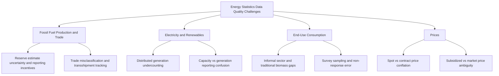

## Data Quality Challenges in Energy Statistics

### Overview

Energy statistics underpin nearly every quantitative method covered elsewhere in this chapter — econometric estimation, CGE calibration, capacity expansion modeling, and emissions accounting all depend on the reliability of underlying data. Yet energy data collection faces persistent quality challenges: measurement error, coverage gaps, definitional inconsistency, revision instability, and structural underrepresentation of certain activities. Understanding these challenges is essential for correctly interpreting model results and avoiding false precision in applied energy economics work.

### Sources of Data Quality Problems

#### Measurement and Collection Error

**Key Points**

- **Survey-based collection**: much energy data (especially consumption by end-use sector) is derived from sample surveys of firms or households, introducing sampling error and potential non-response bias
- **Metering and instrumentation limitations**: physical measurement (fuel volumes, electricity flows) is subject to instrument calibration error, and metering coverage is often incomplete for smaller or informal energy users
- **Self-reported data**: much energy production and trade data relies on self-reporting by companies or countries, creating potential for both unintentional error and, in some contexts, incentive-driven misreporting (e.g., underreporting production for tax purposes, overreporting reserves for financing purposes)
- **Unit and conversion inconsistency**: differing calorific value assumptions (net vs. gross), differing toe/Btu/joule conversion factors, and inconsistent treatment of electricity primary-equivalent conversion across sources can introduce apparent discrepancies that are purely definitional rather than substantive

#### Coverage and Completeness Gaps

**Key Points**

- **Informal sector and traditional biomass**: fuelwood, charcoal, and other traditional biomass consumption — significant in many developing economies — is frequently poorly captured by formal statistical systems built around commercial energy flows
- **Distributed and off-grid generation**: small-scale rooftop solar, off-grid diesel generators, and behind-the-meter storage are often incompletely captured in centralized statistical systems designed around grid-connected utility-scale generation
- **Small and micro-enterprise energy use**: statistical surveys often have coverage thresholds that exclude very small firms, understating industrial/commercial energy use in economies with a large informal or micro-enterprise sector
- **Non-reporting or partially reporting countries**: geographic coverage in international databases varies, with some countries providing less frequent, less granular, or methodologically inconsistent submissions

#### Structural and Definitional Inconsistency

**Key Points**

- **Sector classification misalignment**: energy data classified under one industrial classification scheme (e.g., national scheme) may not map cleanly onto international standards (ISIC), complicating cross-country comparison and integration with economic data
- **Boundary definition differences**: what counts as "final consumption" vs. "non-energy use" vs. "transformation input" can differ subtly across statistical agencies, particularly for petrochemical feedstocks and combined heat-and-power outputs
- **Fuel category evolution**: emerging energy carriers (green hydrogen, specific biofuel blends, battery storage flows) require new classification categories that are not always immediately or consistently adopted across all data sources, creating temporary comparability gaps during the transition period

### Revision and Data Vintage Issues

**Key Points**

- Energy statistics are commonly revised as agencies receive updated, more complete reporting after initial (preliminary) publication
- **Data vintage effects**: econometric or forecasting work using "real-time" (as originally published) data can produce materially different results than the same analysis using final, revised data — an issue directly analogous to well-documented vintage effects in macroeconomic forecasting evaluation
- Researchers replicating or building on prior published energy-economic analysis should note which data vintage was used, since a later revision to historical figures can complicate exact replication
- [Inference] the magnitude of revision-driven discrepancy is generally larger for more granular/disaggregated series and smaller for well-established aggregate indicators (e.g., total primary energy supply), though this pattern is not universal across all countries and data types

### Statistical Differences as a Diagnostic

The balance-structure "statistical difference" line item (the residual reconciling supply-side and use-side totals in a national energy balance) serves as a practical, built-in data quality signal.

**Key Points**

- A statistical difference that is small and stable over time relative to total supply is generally taken as a sign of reasonably consistent data collection
- A statistical difference that is large, volatile, or trending is generally treated as a flag warranting investigation into underlying source data quality, though [Inference] there is no single universally applied numerical threshold defining "large" across all statistical agencies — practice and tolerance vary by country and data compiler
- Statistical differences can also mask offsetting errors (an overestimate in one category cancelling an underestimate in another), so a small residual does not guarantee the absence of category-level error

### Data Quality Challenges by Energy Sub-Sector

#### Fossil Fuel Production and Reserves

**Key Points**

- Reserve estimates are inherently subject to the classification and reporting standard applied, and the same physical resource can be reported differently depending on the applicable standard's economic assumptions and category definitions
- National production statistics for some countries and fuels may be affected by incentives to over- or under-report (fiscal, quota compliance, or geopolitical reasons), a longstanding and widely acknowledged limitation in energy statistics broadly — [Inference] the specific magnitude of any such bias is generally not independently verifiable using the same reported data, which is a structural limitation of self-reported statistics rather than a claim about any particular country's practice

#### Electricity and Renewables Data

**Key Points**

- **Capacity vs. generation confusion**: installed capacity (MW) figures are sometimes conflated with actual generation (MWh) in secondary reporting, especially for variable renewables where capacity factor differences are large and consequential
- **Distributed generation undercounting**: centralized statistical collection systems built around utility-scale, grid-connected generation can systematically undercount rapidly growing distributed/behind-the-meter solar capacity
- **Curtailment reporting**: energy curtailed (renewable generation reduced due to grid constraints) is not always consistently reported, complicating assessment of true resource potential utilization

#### Price Data

**Key Points**

- **Spot vs. contract price conflation**: publicly reported "prices" sometimes mix spot market transactions with longer-term contract prices without clear labeling, producing apparent volatility or trends that reflect a changing mix of price types rather than genuine market movement
- **Subsidized price ambiguity**: in markets with energy subsidies or price controls, published "prices" may not reflect marginal economic cost, complicating cross-country price comparison and elasticity estimation unless subsidy-adjusted or shadow price series are separately available
- **Currency and PPP conversion sensitivity**: cross-country price comparability depends heavily on the exchange rate/PPP conversion methodology chosen, which is a modeling choice rather than an inherent property of the price data itself

### Implications for Applied Modeling

**Key Points**

- **Econometric estimation**: measurement error in regressors (e.g., price, income) biases coefficient estimates toward zero (attenuation bias) under classical measurement error assumptions, a standard econometric result relevant when energy price/quantity data quality is suspect
- **CGE calibration**: Social Accounting Matrix construction inherits any inconsistencies in the underlying monetary and physical energy data used to build it, and RAS/cross-entropy balancing methods used to reconcile data can mask rather than resolve underlying quality issues
- **Capacity expansion and system optimization**: technology cost and resource potential data quality directly affects the realism of "optimal" investment pathways, and stale or non-representative cost assumptions are a commonly cited limitation given how quickly some technology costs (e.g., battery storage, solar PV) have moved historically
- **Emissions inventories**: activity data quality directly propagates into emissions estimates via the activity-data-times-emission-factor methodology, meaning energy statistics quality is inseparable from emissions inventory quality

### Data Quality Assessment Practices

**Key Points**

- **Cross-source triangulation**: comparing the same indicator across multiple independent sources (e.g., IEA vs. national statistics vs. company-reported data) to identify discrepancies warranting investigation
- **Consistency checks against accounting identities**: verifying that balance identities (supply = transformation input + final consumption + statistical difference) hold within reasonable tolerance
- **Trend plausibility review**: examining whether reported year-over-year changes are consistent with known events (capacity additions, demand shocks, policy changes), flagging implausible discontinuities for investigation
- **Documentation review**: checking metadata/methodological notes provided by the source agency for known limitations, definitional choices, and coverage caveats before using a series in formal analysis

### Emerging Data Quality Improvements

**Key Points**

- Satellite-based remote sensing and atmospheric monitoring increasingly provide independent, top-down cross-checks on bottom-up self-reported activity and emissions data, particularly valuable for methane leak detection and large point-source verification
- Smart metering and digital grid infrastructure are improving real-time measurement granularity in some jurisdictions, potentially reducing reliance on survey-based estimation over time
- Machine learning-based anomaly detection is increasingly applied by some statistical agencies and researchers to flag implausible data points for review before publication, though [Unverified] the extent of formal adoption across major energy statistical agencies varies and is evolving

### Practical Recommendations for Applied Researchers

**Key Points**

- Document the specific data source, vintage/release date, and unit conventions used, to support replication and transparent interpretation of results
- Cross-check headline figures against at least one independent source where feasible, particularly for high-stakes or policy-relevant analysis
- Treat reported precision with appropriate skepticism — a figure reported to several significant digits does not imply that level of underlying measurement accuracy
- Where data quality concerns are material to the research question, incorporate uncertainty explicitly (e.g., via sensitivity analysis on key data inputs) rather than treating point estimates as exact

### Applications

- Informing appropriate uncertainty bounds in econometric and forecasting work
- Guiding data source selection and triangulation strategy for applied energy-economic research
- Supporting critical evaluation of policy analysis and model results that depend on underlying energy statistics
- Informing statistical agency methodology improvement priorities

### Related Topics

- Major energy data sources and statistical conventions
- National energy balances and accounting frameworks
- Emissions inventories and measurement, reporting, verification
- Reserve reporting standards and classification systems
- Measurement error and attenuation bias in econometric estimation
- Satellite and remote sensing applications in energy/emissions monitoring
- Social Accounting Matrix construction and balancing methods
- Scenario analysis and sensitivity testing techniques