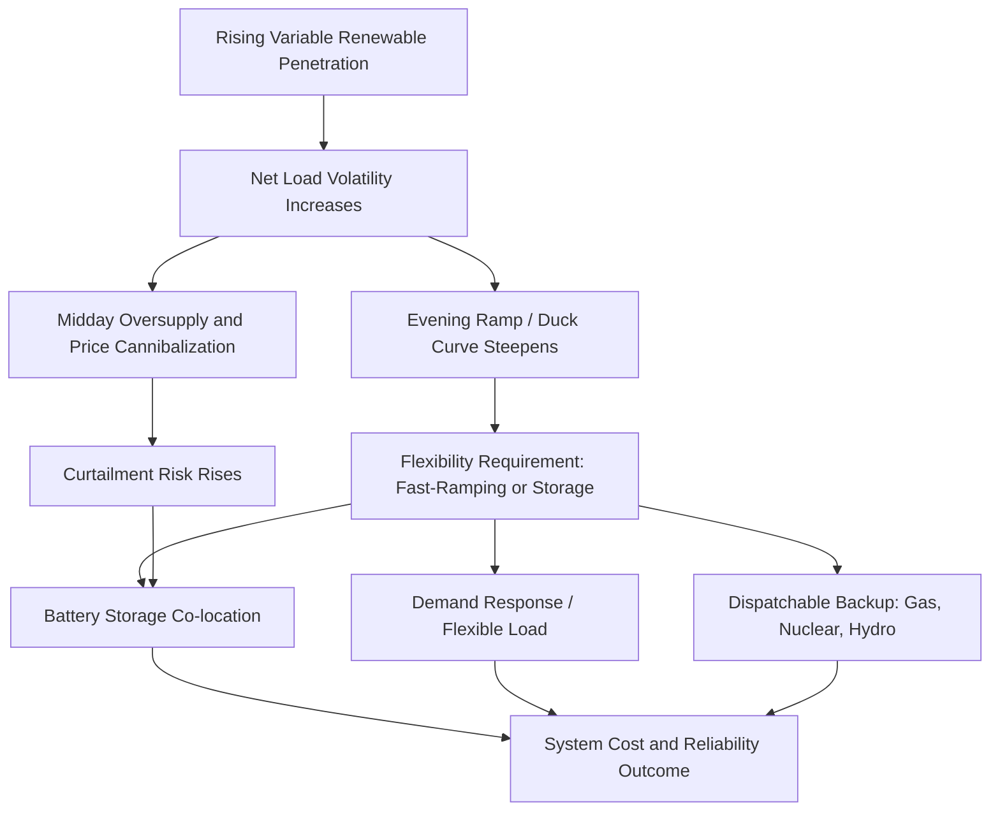

## Power Sector Decarbonization Pathways and Costs

### Overview

Power sector decarbonization involves shifting electricity generation from fossil fuel combustion toward low- and zero-carbon sources while maintaining reliability, affordability, and adequacy. It is generally considered the leading edge of broader economy-wide decarbonization, both because cost-competitive low-carbon generation options exist today and because electrification of other sectors (transport, heating, industry) depends on a substantially decarbonized power supply to deliver net emissions benefits.

### Current Cost Landscape

#### Levelized Cost Trends

Recent cost data shows renewable generation technologies have become cost-competitive with, and in many markets cheaper than, new fossil fuel generation.

**Key Points**

- More than 90% of utility-scale renewable capacity added globally in 2025 delivered power at a lower cost than the cheapest new fossil fuel alternative in its market, according to IRENA's Renewable Power Generation Costs analysis
- In 2025, utility-scale solar PV LCOE held around $44/MWh, onshore wind fell to roughly $33/MWh, and offshore wind fell to around $78/MWh, according to IRENA figures, while dispatchable renewable technologies such as hydropower, geothermal, and concentrated solar power recorded relatively higher costs
- Since 2010, total installed costs have declined by roughly 87–89% for solar PV and by over half for onshore wind, reflecting sustained technology learning curves
- [Unverified] — these are point-in-time figures from recent industry reporting (IRENA, BloombergNEF) as of mid-2026; given how quickly this cost landscape moves, consult current IRENA/IEA/BNEF releases for up-to-date figures before using specific numbers in analysis

#### Battery Storage Cost Declines

**Key Points**

- Battery storage costs fell faster than any other energy technology tracked in 2025, with IRENA estimating installed cost of a four-hour utility-scale battery system at around $140/kWh — a decline of close to 30% in a single year and roughly 95% since 2010
- BloombergNEF's separately tracked benchmark for a four-hour battery project showed a comparable sharp year-on-year decline to a reported record low, reflecting the same broad technology trend from an independent data source
- Falling battery costs are driving rapid growth in co-located solar-plus-storage systems, with roughly one-quarter of utility-scale solar commissioned globally in 2025 paired with battery storage — a marked rise in co-location share since 2020
- [Unverified] — specific dollar figures cited above vary somewhat by source and methodology (IRENA vs. BNEF), reflecting differing sample sets and benchmark definitions; treat as broadly directionally consistent rather than as a single precise figure

#### Firm (Round-the-Clock) Renewable Costs

**Key Points**

- Firm levelized costs of electricity for solar-plus-storage systems providing high-reliability, round-the-clock supply have fallen substantially, from above $100/MWh in 2020 to roughly $54–$85/MWh by 2025 at high-quality resource sites, per IRENA analysis, compared to $70–$85/MWh for new coal in China and over $100/MWh for new gas generation globally in the same period
- Further reductions of roughly 30% by 2030 and around 40% by 2035 are projected by IRENA, though [Inference] published multi-year cost projections carry inherent uncertainty and should be treated as directional expectations rather than guaranteed outcomes
- Firm wind-plus-storage costs showed a wide range across regions in 2025, reflecting differing wind resource quality and storage requirements by location
- Combining wind and solar PV in the same system tends to reduce required storage duration and overall system cost relative to either technology paired with storage alone, since the two resources' variability patterns are partially complementary

### Decarbonization Pathway Archetypes

**Key Points**

- **Renewables-plus-storage dominant pathway**: relies primarily on wind, solar, and increasingly long-duration storage to meet both energy and reliability needs, supplemented by limited dispatchable backup
- **Nuclear-inclusive pathway**: retains or expands nuclear capacity as a firm, low-carbon baseload source alongside variable renewables, reducing storage/flexibility requirements but facing distinct cost, siting, and construction-timeline considerations
- **Gas-with-CCS transitional pathway**: retains natural gas generation equipped with carbon capture and storage as a bridging or backstop technology, particularly where reliability requirements or resource constraints limit renewable-plus-storage feasibility
- **Hydrogen and long-duration storage pathway**: envisions green hydrogen (produced via electrolysis from renewable electricity) or other long-duration storage technologies filling the seasonal/multi-day reliability gap that batteries alone cannot economically address
- Most published decarbonization scenarios for individual power systems combine elements of multiple archetypes rather than relying on a single technology exclusively, reflecting the resource-specific and reliability-specific realities of each system

### Technical Challenges of High Variable Renewable Penetration

#### The Duck Curve and Net Load Management

**Key Points**

- As solar penetration rises, net load (demand minus variable renewable generation) develops a characteristic profile with a steep evening ramp as solar output falls while demand remains high, requiring fast-ramping or storage resources to fill the gap
- Daytime oversupply from solar can depress or even turn negative wholesale prices during high-output hours, reducing the revenue captured by additional solar capacity — a phenomenon often termed value deflation or cannibalization, which is one driver of the growing preference for co-located storage described above
- Curtailment (deliberately reducing renewable output below available potential due to grid or market constraints) tends to rise with variable renewable penetration in the absence of sufficient flexibility, storage, or transmission capacity

#### Grid Flexibility and Reliability Requirements

**Key Points**

- **Ancillary services**: frequency regulation, voltage support, and operating reserves become more complex to provide as the generation mix shifts away from traditional synchronous thermal generators toward inverter-based renewable resources
- **Capacity adequacy**: variable renewables generally receive a lower "capacity credit" than dispatchable thermal generation per installed MW, since their contribution to meeting peak demand is probabilistic rather than guaranteed
- **Transmission expansion**: renewable resources are often located far from demand centers (e.g., high-wind or high-solar regions), requiring new transmission infrastructure whose siting, permitting, and cost allocation can be a major pathway bottleneck independent of generation technology cost trends

### Modeling Power Sector Decarbonization

**Key Points**

- Capacity expansion and system optimization models (least-cost investment planning frameworks) are the standard analytical tool for determining optimal technology mixes and buildout schedules under decarbonization constraints, incorporating detailed temporal and technical representation of variable renewable output and storage dispatch
- Scenario analysis and sensitivity testing techniques are routinely applied given deep uncertainty in future technology costs, demand growth (including load growth from electrification and, increasingly, data center demand), and policy trajectories
- Cost-benefit analysis incorporating externalities (social cost of carbon, air quality co-benefits) is used to compare decarbonization pathways on a full social-cost basis rather than private cost alone

### Retirement and Stranded Asset Considerations

**Key Points**

- Existing fossil fuel generation assets, particularly coal, face increasing risk of early retirement or reduced utilization as decarbonization policy and cost trends advance, raising stranded asset considerations for asset owners and, in some jurisdictions, for workers and communities dependent on those facilities
- Just transition considerations — support for affected workers and communities — are increasingly incorporated explicitly into power sector decarbonization policy design and cost-benefit analysis rather than treated purely as an externality
- Capacity retirement scheduling is a standard constraint category within capacity expansion models, though the economically optimal retirement schedule can differ from politically or socially feasible retirement schedules

### Nuclear Power Considerations

**Key Points**

- Nuclear power provides firm, low-carbon generation with high capacity factors, reducing the storage and flexibility burden otherwise placed on the system by variable renewables
- New nuclear construction has historically faced substantial cost overrun and schedule delay risk in many (though not all) markets, a well-documented pattern in infrastructure project appraisal broadly and specifically relevant to nuclear project cost-benefit analysis
- Small Modular Reactor (SMR) designs are frequently discussed as a potential pathway to more predictable, lower-capital-intensity nuclear deployment, though [Unverified] — commercial deployment track record, realized costs, and timelines for SMR technology are still developing and should be checked against current project data rather than developer projections alone

### Carbon Capture and Storage (CCS) in Power Generation

**Key Points**

- CCS-equipped fossil generation can provide firm, dispatchable low-carbon power, potentially valuable where renewable resource quality or storage economics are less favorable
- Capture rates achieved in practice, added capital and operating costs, and the availability of suitable geological storage or utilization pathways are central determinants of CCS's competitiveness relative to renewables-plus-storage or nuclear alternatives in a given system
- [Inference] the relative cost competitiveness of CCS-equipped fossil generation compared to renewables-plus-storage has narrowed in many contexts given the renewable and storage cost declines described above, though system-specific results depend heavily on local resource quality and CCS project-specific costs

### Policy Instruments Supporting Decarbonization

**Key Points**

- **Carbon pricing**: carbon taxes or cap-and-trade systems raise the relative cost of emissions-intensive generation, informed by cost-benefit analysis using the social cost of carbon
- **Renewable Portfolio Standards / Clean Electricity Standards**: mandate minimum shares of qualifying low-carbon generation, functioning as a quantity-based policy constraint within capacity expansion modeling
- **Capacity markets and reliability mechanisms**: separately compensate firm/dispatchable capacity to address the adequacy challenges associated with high variable renewable penetration
- **Direct subsidies and tax incentives**: investment or production tax credits for renewable and storage technologies, which have historically been a major driver of technology cost decline through deployment-driven learning effects

### Applications in Energy Economics

- Capacity expansion modeling for utility integrated resource planning
- National and sub-national decarbonization target feasibility analysis
- Investment appraisal for individual generation and storage projects
- Policy design and evaluation for carbon pricing, clean energy standards, and capacity markets
- Stranded asset and just-transition economic analysis

### Related Topics

- Energy system optimization and capacity expansion modeling
- Cost-benefit analysis applied to energy projects
- Scenario analysis and sensitivity testing techniques
- Levelized Cost of Energy calculation and discount rate sensitivity
- Transmission expansion planning and power flow modeling
- Carbon pricing and emissions trading scheme design
- Corporate energy and climate disclosure frameworks (investor-facing transition risk)
- Just transition and distributional analysis in energy policy