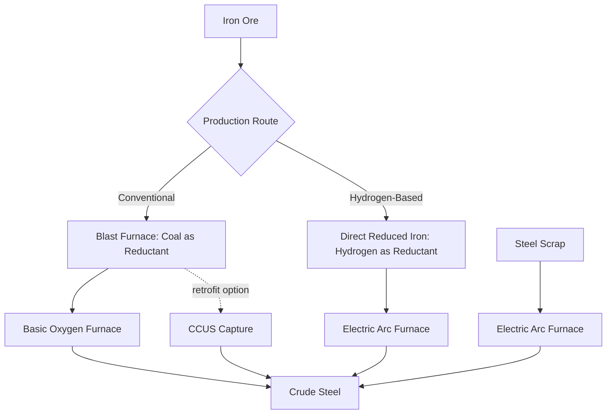
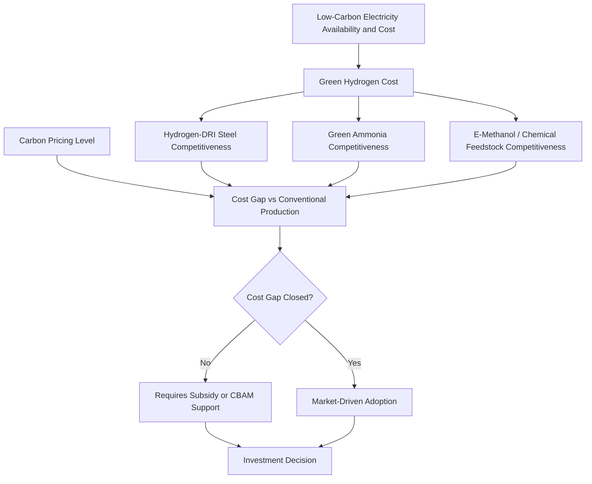

## Industrial Decarbonization: Steel, Cement, and Chemicals

### Overview

Steel, cement, and chemicals are collectively termed "hard-to-abate" industrial sectors because their emissions arise substantially from process chemistry and high-temperature heat requirements, not solely from combustion-based energy use that can be addressed by simple electrification. Together these three sectors represent a large share of global industrial emissions and present distinct technical and economic decarbonization pathways, each facing high capital intensity, long asset lifetimes, trade exposure, and technology readiness constraints that differentiate industrial decarbonization economics from power sector decarbonization.

### Why Industrial Decarbonization Differs from Power Sector Decarbonization

**Key Points**

- **Process emissions**: a substantial share of emissions in steel and especially cement arise from the chemical reactions of production itself (e.g., limestone calcination), not from fuel combustion, meaning switching to clean electricity alone cannot eliminate these emissions
- **High-temperature heat requirements**: many industrial processes require heat at temperatures difficult or costly to achieve through direct electrification with current technology, motivating continued reliance on combustion-based or hydrogen-based heat sources in some applications
- **Long asset lifetimes and capital intensity**: industrial facilities (blast furnaces, cement kilns, chemical crackers) typically operate for several decades, creating lock-in risk and a narrower window of low-cost retrofit/replacement opportunities compared to shorter-lived power generation assets
- **International trade exposure**: these are globally traded, relatively homogeneous commodities, raising competitiveness and carbon leakage concerns that are less pronounced in power generation (which is typically not internationally traded at comparable scale)

### Steel Sector Decarbonization

#### Conventional Production Route

**Key Points**

- The dominant conventional route is the Blast Furnace-Basic Oxygen Furnace (BF-BOF) pathway, which uses coking coal both as a reducing agent (removing oxygen from iron ore) and as a heat source, making coal chemically integral to the process rather than merely an energy input
- This chemical role of coal as a reducing agent is the central technical reason steel decarbonization cannot rely solely on switching to low-carbon electricity or fuel substitution in the conventional route

#### Decarbonization Pathways

**Key Points**

- **Direct Reduced Iron with hydrogen (H-DRI/EAF)**: replaces coal-based reduction with hydrogen as the reducing agent, producing water instead of $CO_2$ as the reaction byproduct, followed by an Electric Arc Furnace (EAF) for steelmaking; considered among the most promising near-commercial routes to substantially lower-emission primary steel production
- **Scrap-based Electric Arc Furnace (EAF) route**: recycles steel scrap using electricity rather than virgin ore reduction, already commercially mature and low-emission when powered by low-carbon electricity, but constrained by available scrap supply relative to growing global steel demand
- **Carbon Capture, Utilization and Storage (CCUS) retrofit**: captures $CO_2$ from conventional BF-BOF or other process routes rather than replacing the underlying chemistry, potentially useful as a transitional option for existing assets not yet due for replacement
- **Molten oxide electrolysis and other emerging routes**: direct electrochemical reduction of iron ore, at an earlier stage of technological maturity than hydrogen-DRI

#### Economic Considerations for Steel

**Key Points**

- Green hydrogen cost and availability is generally considered the single largest economic determinant of hydrogen-DRI competitiveness relative to conventional BF-BOF production, since hydrogen production (via electrolysis) requires substantial low-cost, low-carbon electricity input
- The "green premium" — the cost difference between low-emission and conventional steel — has historically been positive but is [Inference] narrowing over time as green hydrogen and renewable electricity costs decline, following the same technology cost trend logic seen in power sector decarbonization, though the pace and eventual crossover point remain an area of active analysis and disagreement across studies
- Trade exposure creates a "first-mover disadvantage" dynamic: producers adopting higher-cost low-emission processes unilaterally may face a cost disadvantage against competitors continuing conventional production, absent carbon border adjustment mechanisms or coordinated policy

### Cement Sector Decarbonization

#### Emissions Sources

Cement production is distinctive among the three sectors for the large share of its emissions arising from chemical process reactions rather than combustion.

**Key Points**

- **Calcination process emissions**: limestone (calcium carbonate) is heated to produce clinker, releasing $CO_2$ as an inherent chemical byproduct of the reaction, independent of the fuel used to provide the heat — this process emissions component is often estimated to represent roughly half or more of total cement production emissions, though the exact split varies by cement chemistry and kiln technology
- **Thermal energy emissions**: high-temperature heat (historically often provided by coal or petroleum coke) required to drive the calcination reaction and clinker formation
- **Electricity-related emissions**: grinding and other electrified process steps, a comparatively smaller emissions share addressable through grid decarbonization

#### Decarbonization Pathways

**Key Points**

- **Clinker substitution**: reducing the clinker share of cement by blending in supplementary cementitious materials (fly ash, slag, calcined clay, limestone) that require no or less calcination, directly reducing process emissions per unit of cement produced
- **Alternative/novel cement chemistries**: reformulated binder chemistries designed to reduce or eliminate the calcination-driven $CO_2$ release inherent to traditional Portland cement clinker
- **Carbon capture (post-combustion or oxy-fuel)**: given the large process-emissions share that cannot be eliminated through fuel switching alone, CCUS is considered a particularly important pathway for cement relative to other sectors, since process emissions persist even with zero-carbon heat and electricity
- **Alternative fuels for kiln heat**: substituting coal/petcoke with biomass, waste-derived fuels, or hydrogen for the thermal energy component, addressing the combustion share but not the calcination share of emissions
- **Demand-side measures**: reducing cement/concrete intensity in construction through design optimization and material efficiency, complementing supply-side production changes

### Chemicals Sector Decarbonization

#### Sector Heterogeneity

**Key Points**

- The chemicals sector is considerably more heterogeneous than steel or cement, encompassing a wide range of products (ammonia, ethylene, methanol, and many others) with distinct process routes and decarbonization pathways rather than a single dominant technology
- Feedstock use (chemicals used as raw material inputs rather than combusted) is a defining characteristic distinguishing chemicals sector emissions accounting from purely combustion-based sectors, since the carbon embodied in some chemical products is not immediately released as $CO_2$

#### Key Decarbonization Pathways by Sub-Sector

**Key Points**

- **Ammonia production**: conventionally produced via the Haber-Bosch process using hydrogen derived from natural gas (steam methane reforming); "green ammonia" substitutes electrolytic (green) hydrogen for the natural-gas-derived hydrogen input, directly analogous in economic logic to hydrogen-DRI steel
- **Olefins/ethylene production (steam cracking)**: high-temperature process traditionally fueled by fossil fuels; electrification of cracker furnaces using low-carbon electricity is an emerging pathway, alongside feedstock changes (e.g., bio-based or recycled feedstocks)
- **Methanol production**: can be produced via conventional fossil-based routes or via green hydrogen combined with captured $CO_2$ (e-methanol), providing both a decarbonization pathway and a potential carbon utilization outlet
- **Electrification of process heat**: where technically feasible, direct electrification of lower-temperature chemical process heat requirements offers a more straightforward decarbonization route than for higher-temperature applications

### Cross-Cutting Economic and Policy Considerations

#### Green Hydrogen as a Common Enabling Input

**Key Points**

- Green hydrogen (produced via electrolysis powered by low-carbon electricity) is a common enabling input across steel (DRI), ammonia, and several other chemical pathways, meaning its cost trajectory has outsized influence across multiple hard-to-abate sectors simultaneously
- Hydrogen production cost is highly sensitive to the cost and availability of low-carbon electricity and electrolyzer capital costs, both of which have historically declined but remain a significant driver of overall green hydrogen cost competitiveness
- [Unverified] — current green hydrogen cost figures and near-term cost trajectories are evolving rapidly and vary substantially by region (driven by local renewable resource quality) and electrolyzer technology; consult current IEA/IRENA hydrogen cost tracking for up-to-date figures rather than relying on a single static estimate

#### Carbon Leakage and Trade Policy

**Key Points**

- Because steel, cement, and many chemical products are internationally traded commodities, unilateral carbon pricing or regulation in one jurisdiction risks carbon leakage — production and associated emissions shifting to jurisdictions with less stringent climate policy, potentially without net global emissions benefit
- **Carbon Border Adjustment Mechanisms (CBAMs)**: apply a carbon cost to imports based on their embodied emissions, intended to level the competitive playing field between domestic low-carbon producers and imports from less-regulated jurisdictions, drawing on the embodied-emissions accounting methodology used in input-output and trade-emissions analysis
- **Green public procurement and product standards**: government procurement preferences or mandatory emissions-intensity labeling for these materials are increasingly discussed as complementary demand-side policy tools to support nascent low-carbon industrial production

#### Investment and Cost-Benefit Considerations

**Key Points**

- Industrial decarbonization projects typically involve very high capital expenditure relative to annual output value, making financing availability and cost-benefit analysis (incorporating carbon pricing and any available subsidies) particularly consequential for investment decisions
- Long asset lifetimes mean investment timing decisions carry substantial lock-in risk: a conventional facility built today may operate for several decades, either requiring costly retrofit or continuing to emit at higher rates than a low-carbon alternative built at the same time
- Government support mechanisms (contracts for difference, capital grants, tax credits, green public procurement) are widely used given persistent cost gaps between conventional and low-emission production in most current market conditions

### Assessment Frameworks

**Key Points**

- **Marginal abatement cost curves (MACCs)**: rank available decarbonization options by cost per tonne of $CO_2$ avoided, a standard analytical tool for comparing pathways within and across these sectors, though MACCs are commonly criticized for understating interaction effects and dynamic cost changes from technology learning
- **Techno-economic analysis**: detailed bottom-up costing of specific process routes (e.g., H-DRI vs. BF-BOF-CCUS) under varying input cost and carbon price assumptions, feeding into the broader energy system optimization and capacity expansion modeling frameworks used for whole-economy or whole-sector planning
- **Life-cycle assessment**: full supply-chain emissions accounting for industrial products, particularly relevant given feedstock and embodied-carbon considerations in chemicals and the trade-exposed nature of comparing domestic vs. imported material carbon intensity

### Applications in Energy Economics

- Marginal abatement cost curve construction for industrial sector decarbonization planning
- Carbon Border Adjustment Mechanism design and impact assessment
- Green hydrogen demand forecasting across multiple hard-to-abate sectors
- Investment appraisal for first-of-a-kind low-carbon industrial facilities
- Trade and competitiveness impact analysis of unilateral industrial climate policy

### Related Topics

- Power sector decarbonization pathways and costs
- Green hydrogen production economics and electrolyzer cost trends
- Carbon Border Adjustment Mechanisms and trade-embodied emissions
- Input-output analysis for energy and emissions accounting
- Cost-benefit analysis applied to energy projects
- Marginal abatement cost curve methodology and critiques
- Energy system optimization and capacity expansion modeling
- Just transition and distributional analysis in industrial policy