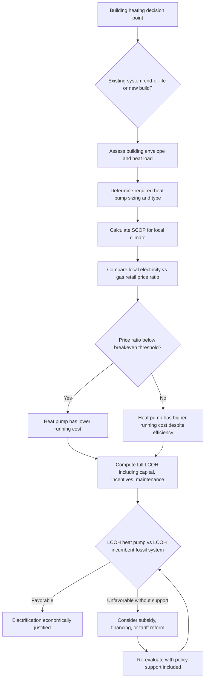

## Building Sector Electrification and Heat Pump Economics

### Definition and Scope

Building sector electrification and heat pump economics examines the technical and economic drivers behind replacing fossil-fuel-based building energy services (primarily space heating, water heating, and cooking) with electric alternatives — chiefly heat pumps — as a decarbonization strategy. It draws on engineering economics (equipment lifecycle cost analysis), energy economics (relative fuel pricing and price volatility), and public economics (externality pricing, subsidy design, and market failure correction).

This topic covers:

- The thermodynamic basis for heat pump efficiency and why it drives the economic case
- Total cost of ownership (TCO) comparisons against fossil-fuel alternatives
- Key economic variables determining electrification competitiveness (fuel price ratios, climate, building envelope)
- Market failures and barriers to adoption (split incentives, capital cost bias, information gaps)
- Policy instruments used to accelerate electrification
- Grid-level economic implications of building electrification at scale

---

### Technical Foundation: Why Heat Pump Efficiency Drives the Economics

Unlike resistance heating or combustion, a heat pump does not generate heat directly — it moves heat from a colder space (outdoor air, ground, or water) to a warmer space (indoors) using a vapor-compression refrigeration cycle run in reverse. This allows a heat pump to deliver more thermal energy output than the electrical energy input, expressed via the **Coefficient of Performance (COP)**:

$$COP = \frac{Q_{\text{heat delivered}}}{W_{\text{electrical input}}}$$

A COP of 3.0 means 1 kWh of electricity delivers 3 kWh of heat — an efficiency exceeding 100% because the heat pump is moving ambient thermal energy, not creating it from the input energy alone. This is the central variable in electrification economics, since it determines the effective "delivered energy cost" of electric heating relative to its input electricity price.

For seasonal performance across a heating season, the relevant metric is the **Seasonal Coefficient of Performance (SCOP)** or, in North American terminology, the **Heating Seasonal Performance Factor (HSPF)**, which accounts for COP degradation as outdoor temperature falls (for air-source heat pumps) and defrost-cycle losses.

$$SCOP = \frac{\text{Total seasonal heat output (kWh}_{th}\text{)}}{\text{Total seasonal electricity input (kWh}_e\text{)}}$$

Ground-source (geothermal) heat pumps maintain more stable COPs (typically SCOP 3.5–5+, **[Unverified]** — varies significantly by ground loop design, climate, and system sizing) because ground temperature is far more stable year-round than air temperature, at the cost of higher upfront capital expenditure for the ground loop installation.

---

### The Core Economic Comparison: Cost per Unit of Delivered Heat

The fundamental economic comparison between electrification and fossil-fuel heating is the **cost per unit of delivered heat**, not the raw fuel price:

$$\text{Cost per kWh}_{th} \text{ (electric heat pump)} = \frac{P_{\text{elec}}}{SCOP}$$

$$\text{Cost per kWh}_{th} \text{ (gas furnace/boiler)} = \frac{P_{\text{gas}}}{\eta_{\text{combustion}}}$$

where $P_{\text{elec}}$ and $P_{\text{gas}}$ are the retail prices per kWh (or equivalent unit) of electricity and gas respectively, and $\eta_{\text{combustion}}$ is the combustion efficiency of the gas system (typically 0.80–0.98 for modern condensing boilers/furnaces).

The **breakeven price ratio** — the electricity-to-gas price ratio at which a heat pump has equal running cost to a gas system — is:

$$\left(\frac{P_{\text{elec}}}{P_{\text{gas}}}\right)_{\text{breakeven}} = \frac{SCOP}{\eta_{\text{combustion}}}$$

**Example**

A gas furnace has $\eta_{\text{combustion}} = 0.92$. A heat pump has $SCOP = 3.0$ (moderate climate). The breakeven electricity-to-gas price ratio is:

$$\frac{SCOP}{\eta_{\text{combustion}}} = \frac{3.0}{0.92} \approx 3.26$$

This means the heat pump has lower running cost as long as electricity is priced at less than about 3.26 times the per-kWh price of gas. In jurisdictions where the retail electricity-to-gas price ratio exceeds this threshold (common in some markets with high electricity taxes/network charges relative to gas), heat pumps can have *higher* running costs than gas despite superior thermodynamic efficiency — a critical, often counterintuitive result that shapes electrification economics and policy debate.

**[Inference]** Actual price ratios vary substantially by country and even by utility service territory due to differing taxation, network cost allocation, and fuel subsidy structures; the breakeven ratio should be recalculated using local retail tariffs rather than assumed generically.

---

### Total Cost of Ownership (TCO) Framework

A complete economic comparison requires levelizing both capital and operating costs over the equipment's useful life:

$$LCOH = \frac{C_0 + \sum_{t=1}^{T} \dfrac{OM_t + F_t}{(1+r)^t}}{\sum_{t=1}^{T} \dfrac{Q_t}{(1+r)^t}}$$

where $LCOH$ is the levelized cost of heat ($/kWh$_{th}$), $C_0$ is upfront capital cost (equipment plus installation), $OM_t$ is annual operations and maintenance cost, $F_t$ is annual fuel/electricity cost, $Q_t$ is annual heat delivered (kWh$_{th}$), $r$ is the discount rate, and $T$ is the equipment lifetime.

**Key Points — typical cost structure differences**

- **Capital cost:** Heat pumps (particularly air-source) typically have higher upfront installed cost than a like-for-like gas furnace/boiler replacement, though the differential varies significantly by market, region, and whether ducting/distribution modifications are needed. Ground-source systems have substantially higher capital cost due to ground loop installation.
- **Installation complexity:** Retrofits in buildings without existing ductwork (common in Europe with hydronic radiator systems) may require higher-cost high-temperature heat pumps or radiator/emitter upsizing to maintain comfortable output temperatures, adding to installed cost.
- **Operating cost:** Determined by the price-ratio and COP relationship above; can be lower or higher than fossil alternatives depending on local tariffs.
- **Maintenance cost:** Heat pumps generally have fewer combustion-related maintenance requirements (no flue, no combustion safety checks) but require refrigerant system servicing.
- **Lifetime:** Heat pump compressors typically have a somewhat shorter or comparable expected service life to modern condensing gas boilers, though this varies by manufacturer, climate severity (more cycling in cold climates), and maintenance quality. **[Unverified]** Specific lifetime figures are manufacturer- and product-specific and should be verified against manufacturer warranty data and independent field studies rather than assumed as a fixed industry-wide number.

---

### Diagram: Heat Pump Economic Decision Framework

---

### Key Economic Variables Determining Competitiveness

**Key Points**

- **Climate severity:** Colder climates reduce air-source heat pump COP at design conditions (though modern cold-climate heat pumps have substantially narrowed this gap) and increase total heating load, both affecting the economics; ground-source systems are less climate-sensitive but carry higher fixed capital cost that is harder to justify in milder climates.
- **Electricity-to-gas price ratio:** The single most influential exogenous economic variable; heavily shaped by taxation, network charge allocation, carbon pricing incidence, and fuel subsidy policy, all of which vary by jurisdiction and change over time.
- **Building envelope quality:** Poor insulation/airtightness increases total heat load, which increases both capital sizing requirements (larger heat pump) and running costs proportionally for any heating technology — envelope improvements are frequently economically complementary to (and sometimes a precondition for) cost-effective electrification, especially for buildings with hydronic distribution requiring specific flow temperatures.
- **Existing distribution system:** Buildings with forced-air ductwork (common in North American new construction) typically have lower-cost heat pump retrofit pathways than buildings with high-temperature hydronic radiators (common in older European building stock), where either radiator upsizing or a high-temperature-output heat pump is needed.
- **Carbon pricing:** A carbon price applied to fossil fuel combustion raises $P_{\text{gas}}$ relative to (typically less carbon-intensive, though grid-mix-dependent) electricity, shifting the breakeven ratio in favor of electrification over time as carbon prices rise or as the electricity grid decarbonizes further.
- **Grid carbon intensity:** For emissions-based (rather than purely cost-based) evaluation, the marginal or average carbon intensity of the local electricity grid determines whether electrification reduces or increases operational emissions; in grids with high fossil generation share, electrification's emissions benefit is smaller or, in edge cases, potentially negative until further grid decarbonization occurs.

---

### Market Failures and Adoption Barriers

Even where LCOH analysis favors heat pumps, several structural market failures slow adoption — a central concern in building electrification policy design:

| Barrier | Mechanism | Economic Character |
| --- | --- | --- |
| Capital cost / upfront cost bias | Consumers systematically underweight future operating savings relative to upfront cost, especially under capital constraints or high discount rates faced by lower-income households | Behavioral/liquidity market failure |
| Split incentives (principal-agent problem) | Landlords bear capital cost of equipment upgrades but tenants receive the operating-cost benefit, reducing landlord incentive to invest | Classic principal-agent misalignment |
| Information asymmetry | Consumers and even some contractors lack accurate information on heat pump performance, correct sizing, and expected running costs, leading to under- or over-estimation of value | Information market failure |
| Contractor/installer capacity constraints | Limited trained workforce for heat pump sizing, installation, and servicing raises effective cost and risk (poor installations reduce real-world COP below rated values) | Supply-side capacity/skills gap |
| Emergency replacement decisions | Fossil system failures often require immediate replacement (especially in cold climates), leaving no time for the higher-consideration purchase decision a heat pump often requires (financing, retrofit planning) | Time-constrained decision-making distorting optimal choice |
| Externality mispricing | If carbon and other pollution externalities are not fully priced into fossil fuel costs, the private LCOH comparison is systematically biased against the socially optimal (lower-emission) choice | Environmental externality |

**[Inference]** The relative importance of each barrier is context- and market-specific; academic and policy literature generally treats upfront capital cost bias and split incentives as among the most significant based on survey and program-evaluation evidence, but this ranking is not universally quantified across all markets.

---

### Policy Instruments for Building Electrification

**Key Points**

- **Upfront capital subsidies/rebates:** Direct grants or rebates reducing the installed cost gap between heat pumps and fossil alternatives, directly targeting the capital-cost bias barrier.
- **Tax credits:** Income tax credits for qualifying heat pump installations, functioning similarly to rebates but realized at a later point (tax filing) which can reduce their effectiveness for liquidity-constrained households relative to point-of-sale rebates.
- **Low-interest or on-bill financing:** Addresses the capital constraint barrier directly by spreading the cost differential over time, sometimes structured so loan repayments are offset by (and do not exceed) operating cost savings.
- **Electricity/gas tariff reform (rebalancing):** Adjusting the allocation of fixed network costs and taxes between electricity and gas tariffs to reduce the electricity-to-gas price ratio, directly targeting the breakeven-ratio driver of the economics; a contested policy area because gas network costs need to be recovered from a shrinking customer base as electrification proceeds (the "gas utility death spiral" concern).
- **Carbon pricing:** Raises the relative cost of fossil fuel combustion over time, shifting the breakeven ratio in favor of electrification without requiring direct subsidy expenditure, though politically sensitive due to direct consumer cost visibility.
- **Building codes and mandates:** Requirements for heat-pump-ready or heat-pump-only installation in new construction, or phase-out dates for fossil fuel heating system installation/replacement in existing buildings, shifting the decision from a voluntary economic comparison to a compliance requirement.
- **Contractor training and certification programs:** Addressing the installer capacity barrier to improve real-world installed performance and reduce effective project risk/cost.
- **Time-of-use or dynamic electricity tariffs:** Can improve heat pump economics where the equipment (particularly with thermal storage or smart controls) can shift load toward lower-price periods, though this adds control complexity.

**[Unverified]** Specific program names, subsidy amounts, and eligibility criteria are highly jurisdiction- and time-specific, change frequently with budget cycles and political priorities, and should be verified against current government program documentation for the relevant jurisdiction rather than assumed from general knowledge.

---

### Worked Example: LCOH Comparison

**Example**

A homeowner compares replacing an aging gas furnace with either (a) a new high-efficiency gas furnace or (b) an air-source heat pump.

**Assumptions:**

- Annual heat demand: 15,000 kWh$_{th}$
- Gas furnace: $C_0 = \$5{,}000$; $\eta = 0.95$; $P_{\text{gas}} = \$0.045$/kWh; annual O&M = $150; lifetime = 15 years
- Heat pump: $C_0 = \$12{,}000$ (before incentives); $SCOP = 2.8$ (moderate-cold climate); $P_{\text{elec}} = \$0.15$/kWh; annual O&M = $200; lifetime = 15 years
- Discount rate: $r = 5\%$
- A $4,000 upfront rebate is available for the heat pump

**Annual fuel/electricity cost:**

- Gas: $\dfrac{15{,}000}{0.95} \times 0.045 = \$710.53$/year
- Heat pump: $\dfrac{15{,}000}{2.8} \times 0.15 = \$803.57$/year

At these input prices, the heat pump has a *higher* annual running cost than gas ($\$803.57$ vs $\$710.53$) because the electricity-to-gas price ratio (0.15/0.045 ≈ 3.33) slightly exceeds the breakeven ratio ($SCOP/\eta = 2.8/0.95 ≈ 2.95$) in this example.

**Levelized cost of heat (simplified annuity approach), post-rebate:**

Annuity factor for capital recovery at $r=5\%$, $T=15$: $\dfrac{r}{1-(1+r)^{-T}} = \dfrac{0.05}{1-(1.05)^{-15}} \approx 0.0963$

- Gas: Annualized capital = $5{,}000 \times 0.0963 = \$481.50$; Total annual cost = $481.50 + 150 + 710.53 = \$1{,}342.03$; $LCOH = 1{,}342.03/15{,}000 = \$0.0895$/kWh$_{th}$
- Heat pump (post-rebate capital = $8,000): Annualized capital = $8{,}000 \times 0.0963 = \$770.40$; Total annual cost = $770.40 + 200 + 803.57 = \$1{,}773.97$; $LCOH = 1{,}773.97/15{,}000 = \$0.1183$/kWh$_{th}$

In this illustrative scenario, even with a $4,000 rebate, the heat pump's LCOH remains higher than the gas furnace, driven primarily by the unfavorable local electricity-to-gas price ratio rather than capital cost alone — demonstrating why tariff structure and carbon pricing, not just capital subsidies, are often necessary complementary policy levers. **[Inference]** This is a stylized illustrative calculation with assumed input prices; actual outcomes are highly sensitive to local tariff structures, climate, and available incentive stacking, and can differ substantially, including reversing the conclusion, in jurisdictions with more favorable electricity-to-gas price ratios (e.g., markets with hydro or nuclear baseload power and higher gas prices).

---

### Grid-Level Economic Implications of Mass Electrification

Building electrification at scale interacts with broader power system economics:

- **Peak demand impact:** Space heating is highly weather-correlated and can create sharp winter demand peaks in electricity systems historically optimized around summer cooling peaks, potentially requiring new generation and network capacity investment — a system cost not always internalized in individual household LCOH calculations.
- **Load factor effects:** Heat pump load added to an existing system with unused off-peak capacity can improve overall system load factor and reduce average system cost per unit of electricity if it fills existing troughs, whereas load added coincident with existing peaks increases system-wide capacity costs.
- **Diversity and coincidence factors:** The economic cost of serving additional heat pump load depends on the coincidence factor — the degree to which many buildings' heating loads peak simultaneously during cold snaps — which is generally high for weather-driven loads, raising the marginal system cost per additional heat pump connected during system-wide cold events relative to more diversified loads.
- **Demand flexibility value:** Smart/connected heat pumps with thermal mass or storage buffering can shift some load away from system peaks, reducing the net system cost impact — creating an economic case for flexibility-enabling controls as a complement to the heat pump investment itself (connecting to smart grid/DER economics).
- **Gas network cost allocation as electrification proceeds:** As electrification reduces the customer base connected to gas networks, the fixed costs of maintaining that network must be recovered from a shrinking customer base, raising per-customer gas tariffs over time (a potential "death spiral" dynamic) — a system transition cost with significant distributional and stranded-asset implications requiring active regulatory and policy management.

**[Inference]** The scale and timing of these grid-level effects depend heavily on electrification adoption rates, the pace of complementary grid investment, and regional generation mix, and are the subject of ongoing modeling and policy debate rather than settled empirical consensus.

---

### Related Topics

- Heat pump technology types compared (air-source, ground-source, air-to-water, hybrid systems)
- District heating and cooling economics as an electrification alternative
- Building envelope retrofit economics and its interaction with heating system sizing
- Carbon pricing design and incidence across residential fuel choices
- Gas network stranded asset risk and cost recovery under electrification
- Demand response and thermal storage economics for electrified heating loads
- Split-incentive market failures in rental housing energy efficiency
- Cold-climate heat pump performance and cost-effectiveness by climate zone
- Time-of-use tariff design for electrified heating loads
- Embodied carbon and lifecycle emissions comparison of heating technologies
- Low-income household energy burden and electrification equity considerations
- Smart grid investment and digitalization economics (interaction with flexible electrified heating loads)