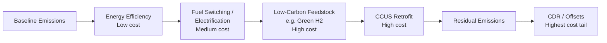

## Hard-to-Abate Sectors and Residual Emissions Strategies

### Definition and Scope

Hard-to-abate sectors are industries where deep decarbonization faces persistent technical, economic, or physical barriers that prevent straightforward electrification or efficiency-based emissions elimination. These sectors typically share several structural characteristics: high-temperature process heat requirements, emissions arising from chemical reactions rather than combustion alone (process emissions), high capital intensity with long asset lifetimes, exposure to international trade competition, and limited substitutability of carbon-intensive inputs.

**Key Points**

- Core hard-to-abate sectors: steel, cement, chemicals (especially ammonia and high-value chemicals), aviation, shipping, and heavy-duty road freight
- These sectors collectively account for a substantial share of global $CO_2$ emissions — commonly cited estimates place heavy industry plus heavy transport at roughly 30% of global energy and process $CO_2$ emissions [Unverified — exact share varies by source methodology and year]
- Residual emissions refer to the portion of a sector's emissions that remain after all economically and technically feasible abatement measures have been applied, which must then be addressed via removal, offsetting, or continued use with compensating mechanisms

### Why These Sectors Resist Decarbonization

**Thermodynamic and Process Constraints**

Several hard-to-abate sectors emit $CO_2$ as an unavoidable output of the core chemical reaction, independent of the energy source used to drive the process:

- **Cement**: Calcination of limestone ($CaCO_3 \rightarrow CaO + CO_2$) releases $CO_2$ directly from the raw material, accounting for roughly 60% of cement sector emissions, with the remainder from fuel combustion for kiln heat (typically 1,400–1,450°C)
- **Steel (primary/blast furnace route)**: The blast furnace–basic oxygen furnace (BF-BOF) pathway uses coke as both a fuel and a chemical reducing agent, converting iron oxide to iron and releasing $CO_2$ as a stoichiometric byproduct of the reduction reaction
- **Ammonia**: Steam methane reforming (SMR) uses natural gas as both feedstock (hydrogen source) and fuel, releasing $CO_2$ from both the reforming reaction and combustion

**Economic Barriers**

- **Capital stock inertia**: Blast furnaces, cement kilns, and chemical plants have asset lifetimes of 30–50 years; early retirement imposes stranded-asset costs
- **Cost premiums**: Low-carbon production pathways (e.g., hydrogen-based direct reduced iron, green ammonia) currently carry a "green premium" — the cost differential over conventional production — often estimated in the range of 20–50% depending on technology maturity and regional energy prices [Inference — premiums are highly sensitive to natural gas, electricity, and carbon prices and change materially year to year]
- **Trade exposure and carbon leakage risk**: Unilateral carbon pricing on tradable, commodity-like goods (steel, cement, chemicals) risks shifting production — and emissions — to jurisdictions with weaker climate policy, undermining both competitiveness and global abatement

**Energy Density Constraints (Transport)**

- Aviation and long-haul shipping require energy carriers with high gravimetric and volumetric energy density; batteries remain substantially below the energy density of jet fuel or marine fuel oil, making battery-electric propulsion infeasible for long-range flight and ocean shipping with current technology [Inference — based on current battery energy density trajectories relative to liquid hydrocarbon fuels]

### Sector-by-Sector Abatement Pathways

#### Steel

- **Scrap-based EAF (Electric Arc Furnace)**: Recycles steel scrap using electricity; emissions intensity depends entirely on grid carbon intensity, but scrap availability limits total volume achievable via this route alone
- **Hydrogen-based Direct Reduced Iron (H2-DRI)**: Replaces coke with hydrogen as the reducing agent ($Fe_2O_3 + 3H_2 \rightarrow 2Fe + 3H_2O$), eliminating process $CO_2$ when hydrogen is produced via electrolysis with low-carbon electricity
- **Carbon capture on BF-BOF**: Retrofits existing blast furnaces with post-combustion or oxy-fuel capture, addressing capital stock inertia but not eliminating fuel-related emissions entirely

#### Cement

- **Clinker substitution**: Replacing clinker with supplementary cementitious materials (fly ash, slag, calcined clay) reduces the calcination-emission share
- **Carbon capture (post-combustion, oxy-fuel, or calcium looping)**: Necessary for the process-emission component that cannot be eliminated through fuel switching alone
- **Novel binder chemistries**: Alternative cements with lower or no limestone calcination requirement remain at pilot/demonstration scale [Unverified — commercial-scale cost and performance data limited]

#### Chemicals (Ammonia and Olefins)

- **Green ammonia**: Electrolytic hydrogen combined with air-separated nitrogen via Haber-Bosch, powered by renewable electricity
- **Blue ammonia**: Conventional SMR-based production paired with carbon capture and storage (CCS)
- **Electrification of steam crackers**: Emerging technology for olefin production replacing furnace combustion with electric heating [Recent/emerging — commercial deployment limited to pilot projects as of the last search]

#### Aviation

- **Sustainable Aviation Fuel (SAF)**: Drop-in biofuels or synthetic e-fuels (power-to-liquid) compatible with existing aircraft and infrastructure
- **Efficiency improvements**: Airframe and engine design, operational optimization (routing, load factors)
- **Residual reliance on offsets/removals**: Given limited near-term SAF supply and no viable long-haul battery-electric or hydrogen-combustion alternative at scale, aviation is expected to retain substantial residual emissions through at least mid-century [Inference — dependent on SAF scale-up rates and policy support]

#### Shipping

- **Alternative fuels**: Green methanol, ammonia, and biofuels are the leading long-haul candidates; battery-electric is viable only for short-sea/ferry routes
- **Wind-assist and efficiency technologies**: Rotor sails, hull optimization, slow steaming
- **Regulatory drivers**: International Maritime Organization (IMO) fuel intensity and greenhouse gas targets shape investment timing

### Residual Emissions Strategies

Once abatement measures reach their economic or technical limit, three broad strategies address what remains:

**1. Carbon Capture, Utilization, and Storage (CCUS)**

- Point-source capture at industrial facilities (cement kilns, steel plants, chemical plants) followed by geological storage or utilization (e.g., in concrete curing or synthetic fuel production)
- Distinguished from removal: CCUS on a fossil-fuel process reduces net emissions from that process but does not remove legacy atmospheric $CO_2$

**2. Carbon Dioxide Removal (CDR)**

- **Nature-based removal**: Afforestation, reforestation, soil carbon sequestration
- **Engineered removal**: Direct Air Capture (DAC) with storage, Bioenergy with Carbon Capture and Storage (BECCS), enhanced weathering
- Used to counterbalance genuinely unabatable residual emissions (e.g., a fraction of aviation and agricultural emissions) rather than as a substitute for available abatement

**3. Carbon Markets and Offset Mechanisms**

- Compliance markets (e.g., EU ETS, and sector-specific mechanisms like CORSIA for aviation) create a price signal and flexibility mechanism for residual emissions
- Voluntary carbon markets allow firms to purchase verified removal or avoidance credits, though credit quality and additionality remain active areas of scrutiny [Unverified — market integrity varies significantly by registry and project type]

### Economic Framing: Marginal Abatement Cost Curves

The standard economic tool for sequencing decarbonization investment across a sector is the Marginal Abatement Cost Curve (MACC), which ranks abatement options by cost per tonne of $CO_2$ avoided ($/tCO_2$) against total abatement potential (tCO2$e).

$$MAC_i = \frac{\Delta Cost_i}{\Delta Emissions_i}$$

Where $MAC_i$ is the marginal abatement cost of measure $i$. Measures are implemented in ascending order of cost until the marginal cost equals the prevailing carbon price or policy-implied shadow price. In hard-to-abate sectors, the MACC characteristically shows a long "tail" of high-cost measures (e.g., DAC, novel process routes) that only become economic at carbon prices well above current compliance market levels [Inference — specific price thresholds are technology- and region-dependent and shift with input cost changes].

### Diagram: Residual Emissions Framework

<svg xmlns="http://www.w3.org/2000/svg" viewBox="0 0 720 380" font-family="Arial, sans-serif">
<text x="360" y="24" text-anchor="middle" font-size="16" font-weight="bold">Residual Emissions Framework (svg_diagram)</text>
<rect x="30" y="60" width="180" height="80" rx="8" fill="#dbeafe" stroke="#1e40af" />
<text x="120" y="90" text-anchor="middle" font-size="12" font-weight="bold">Gross Sector</text>
<text x="120" y="108" text-anchor="middle" font-size="12">Emissions</text>
<rect x="270" y="60" width="180" height="80" rx="8" fill="#dcfce7" stroke="#166534" />
<text x="360" y="90" text-anchor="middle" font-size="12" font-weight="bold">Abatement</text>
<text x="360" y="108" text-anchor="middle" font-size="12">Measures Applied</text>
<rect x="510" y="60" width="180" height="80" rx="8" fill="#fef9c3" stroke="#92400e" />
<text x="600" y="90" text-anchor="middle" font-size="12" font-weight="bold">Residual</text>
<text x="600" y="108" text-anchor="middle" font-size="12">Emissions</text>
<line x1="210" y1="100" x2="270" y2="100" stroke="#374151" stroke-width="2" marker-end="url(#arrow)" />
<line x1="450" y1="100" x2="510" y2="100" stroke="#374151" stroke-width="2" marker-end="url(#arrow)" />
<rect x="510" y="200" width="180" height="70" rx="8" fill="#fee2e2" stroke="#991b1b" />
<text x="600" y="230" text-anchor="middle" font-size="12" font-weight="bold">CCUS</text>
<text x="600" y="248" text-anchor="middle" font-size="11">(reduces flow)</text>
<rect x="510" y="290" width="180" height="70" rx="8" fill="#ede9fe" stroke="#5b21b6" />
<text x="600" y="320" text-anchor="middle" font-size="12" font-weight="bold">CDR / Offsets</text>
<text x="600" y="338" text-anchor="middle" font-size="11">(counterbalances)</text>
<line x1="600" y1="140" x2="600" y2="200" stroke="#374151" stroke-width="2" marker-end="url(#arrow)" />
<line x1="600" y1="270" x2="600" y2="290" stroke="#374151" stroke-width="2" marker-end="url(#arrow)" />
</svg>

### Policy Instruments Supporting Residual Strategies

- **Carbon Border Adjustment Mechanisms (CBAM)**: Address carbon leakage risk by imposing a carbon price on imports equivalent to domestic carbon costs, most notably the EU CBAM covering cement, steel, aluminum, fertilizers, hydrogen, and electricity
- **Contracts for Difference (CfDs)**: Guarantee a strike price for low-carbon industrial output, de-risking first-mover investment in green steel, cement, or chemicals
- **Green public procurement**: Government commitments to purchase low-carbon materials (e.g., "green steel" for infrastructure) to create early demand
- **Sectoral agreements and clubs**: International coordination mechanisms (e.g., a hypothetical "climate club" for steel or cement) intended to harmonize carbon pricing across trade-exposed sectors and reduce leakage risk

### Worked Example: Comparing Abatement Costs

Consider a simplified comparison for one tonne of steel produced via three routes:

| Route | Approx. Emissions (tCO2/t steel) | Approx. Cost Premium vs. Conventional |
| --- | --- | --- |
| Conventional BF-BOF | ~2.0–2.3 | Baseline |
| BF-BOF + CCUS | ~0.3–0.5 | +20–40% [Inference — cost premiums vary by capture rate and CO2 transport/storage distance] |
| H2-DRI-EAF (green H2) | ~0.05–0.1 | +30–50% [Inference — highly sensitive to green hydrogen and electricity cost] |

**Example**

A steelmaker facing a carbon price of $100/tCO2 would find CCUS economically preferable to unabated production once avoided carbon costs exceed the levelized cost of capture and storage — but H2-DRI only becomes competitive at either substantially higher carbon prices or with additional subsidy support, illustrating why residual emissions in steel persist even under moderate carbon pricing.

### Conclusion

Hard-to-abate sectors require differentiated policy and technology strategies rather than a uniform carbon price approach, because their emissions arise from a combination of process chemistry, capital lifetimes, trade exposure, and energy density constraints that resist simple electrification. Residual emissions — the portion remaining after feasible abatement — are managed through a layered approach combining CCUS on point sources, engineered and nature-based carbon dioxide removal, and market mechanisms that price the remaining tonnes. The economic sequencing of these options follows the marginal abatement cost curve, with early low-cost efficiency measures giving way to a high-cost tail dominated by novel process routes and removal technologies.

**Related Topics**

- Marginal abatement cost curves and shadow carbon pricing
- Carbon Border Adjustment Mechanisms (CBAM) and carbon leakage
- Green hydrogen economics and electrolyzer cost trajectories
- Direct Air Capture (DAC) cost curves and scale-up economics
- Sustainable Aviation Fuel (SAF) supply chains and mandates
- Carbon capture, utilization, and storage (CCUS) infrastructure economics
- Net-zero industry clubs and sectoral trade agreements
- Voluntary carbon market integrity and additionality standards