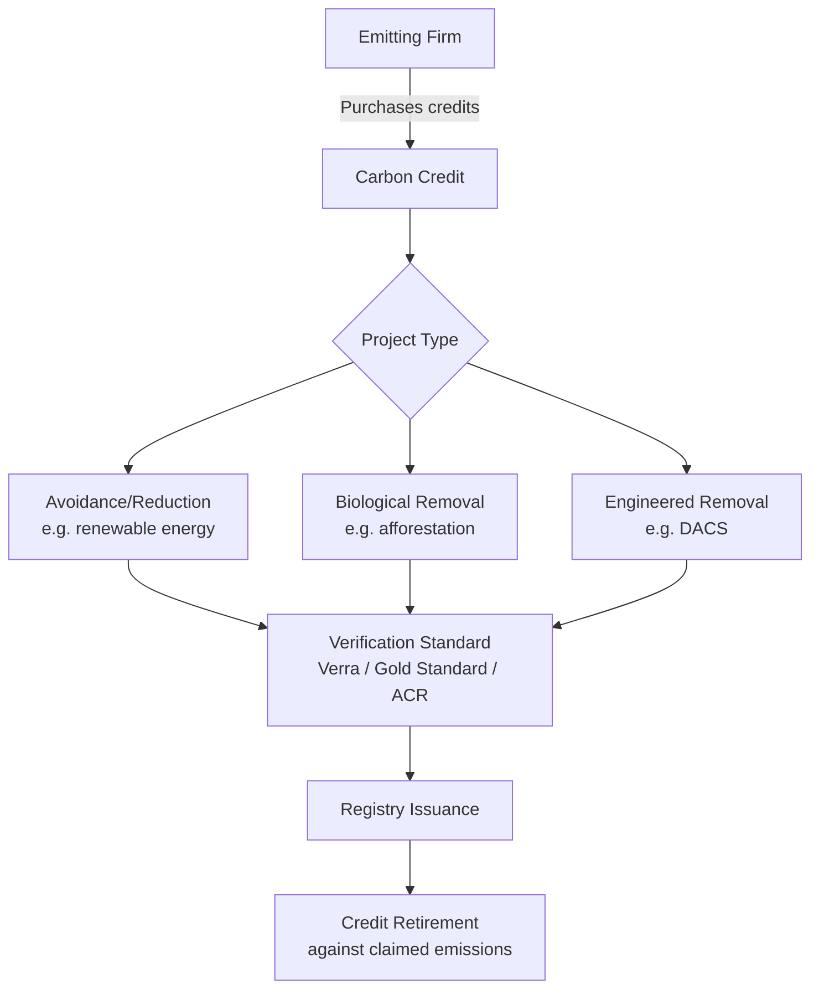

## Carbon Offset Markets and Their Economic Role

### Definition and Conceptual Basis

A carbon offset represents a verified reduction, avoidance, or removal of one tonne of $CO_2e$ (carbon dioxide equivalent) achieved by a project outside a buyer's own operational boundary, which the buyer purchases to compensate for emissions it has not itself eliminated. Offsets are the tradable instrument underlying voluntary carbon markets (VCMs) and are also used as a flexibility mechanism within some compliance schemes.

**Key Points**

- Offsets are fungible only in the narrow sense that each credit nominally represents 1 tCO2e, but they are highly heterogeneous in underlying project type, permanence, and verification rigor
- The economic rationale rests on the premise that $CO_2$ has the same marginal climate impact regardless of where the reduction occurs, allowing abatement to happen where it is cheapest (least-cost abatement)
- Offsets differ fundamentally from **allowances** in cap-and-trade systems: allowances represent a right to emit under a fixed, shrinking cap, while offsets represent a claimed reduction against a counterfactual baseline that is not directly capped

### Economic Theory: Why Offset Markets Exist

**The Least-Cost Abatement Argument**

Under textbook environmental economics, if marginal abatement costs (MAC) differ across firms or sectors, then allowing trade in emissions reductions equalizes the marginal cost of abatement across all participants, minimizing the aggregate cost of achieving a given emissions target.

$$MAC_A = MAC_B \quad \text{at market equilibrium}$$

If firm A can abate at $15/tCO2e and firm B faces a marginal cost of $80/tCO2e, it is economically efficient for B to pay A (or a project generating equivalent reductions) to abate on its behalf rather than abating internally at higher cost. This is the same logic underlying tradable permit systems generally (Coase, 1960; Montgomery, 1972), applied to a project-based, uncapped context.

**Key Points**

- This efficiency argument depends critically on the offset representing a genuine, **additional** reduction — i.e., one that would not have occurred without the offset revenue
- If the underlying project would have happened anyway (non-additional), the offset purchase does not represent real abatement and the buyer's claimed compensation is illusory in net emissions terms

### Market Structure

#### Compliance vs. Voluntary Markets

| Feature | Compliance Markets | Voluntary Markets |
| --- | --- | --- |
| Legal basis | Government-mandated (e.g., EU ETS, California Cap-and-Trade, CORSIA) | No legal requirement; corporate/individual choice |
| Typical use | Limited offset use as a flexibility mechanism within a capped system | Primary use is corporate net-zero/carbon-neutral claims |
| Price formation | Linked to allowance price and quota rules | Fragmented, project-type and quality dependent |
| Oversight | Government regulator | Independent standards bodies (Verra, Gold Standard, ACR, CAR) |

**Key Points**

- CORSIA (Carbon Offsetting and Reduction Scheme for International Aviation) is the leading example of a compliance-adjacent scheme built around offsets rather than a hard cap-and-trade structure
- Voluntary market prices have historically ranged widely, from under $1/tCO2e for some older forestry credits to over $100/tCO2e for high-permanence removal credits like direct air capture [Inference — prices are volatile and vary substantially by vintage, methodology, and buyer segment; figures should be checked against current market data for decision-making purposes]

#### Project Categories

- **Avoidance/reduction credits**: Renewable energy, fuel switching, avoided deforestation (REDD+), landfill gas capture
- **Removal credits (biological)**: Afforestation/reforestation, soil carbon sequestration
- **Removal credits (engineered)**: Direct Air Capture with storage (DACS), Bioenergy with Carbon Capture and Storage (BECCS), enhanced weathering, biochar

### Core Economic and Integrity Concepts

**Additionality**

A project is additional if its emissions reduction would not have occurred in the absence of carbon credit revenue. Additionality is typically assessed against a counterfactual baseline scenario, and is one of the most contested elements of offset market integrity because baselines are inherently unobservable and require modeling assumptions.

**Permanence**

Biological carbon storage (forests, soils) carries **reversal risk** — stored carbon can be released through fire, disease, land-use change, or poor long-term management, whereas geological storage (used in DACS, BECCS) is considered to have permanence on the order of thousands of years or more [Inference — permanence claims for geological storage rest on geological modeling and monitoring rather than direct long-duration observation, given the technology's relatively recent deployment at scale].

**Leakage**

Leakage occurs when emissions-reducing activity in one location displaces the emitting activity to another location rather than eliminating it — for example, protecting one forest parcel from logging while logging simply shifts to an adjacent unprotected parcel.

**Double Counting**

Double counting arises when the same tonne of avoided or removed $CO_2$ is claimed by more than one party — for instance, both the host country toward its Nationally Determined Contribution (NDC) under the Paris Agreement and the corporate buyer toward its own net-zero target. Article 6 of the Paris Agreement introduces **corresponding adjustments** as a mechanism to prevent this double claiming in internationally transferred mitigation outcomes (ITMOs).

**Key Points**

- Corresponding adjustments require the host country to adjust its own emissions inventory when a credit generated within its borders is transferred internationally, ensuring only one entity counts the reduction toward a formal target
- Voluntary market credits without corresponding adjustments risk being double-counted against both a national NDC and a corporate claim

### Pricing Dynamics and Market Failures

**Quality Discounting**

Because verification rigor and additionality confidence vary widely across registries and project types, the market exhibits significant price dispersion for a nominally identical unit (1 tCO2e). This reflects a form of **information asymmetry** analogous to Akerlof's "market for lemons": buyers cannot easily verify true quality, which can depress prices for genuinely high-quality credits and allow lower-quality credits to persist in the market.

**Reputational and Litigation Risk**

Corporate purchasers face growing scrutiny over offset quality, driven by investigative journalism, NGO analysis, and regulatory attention (e.g., EU Green Claims Directive discussions, FTC Green Guides in the US). This has shifted demand toward higher-integrity removal credits and away from cheaper avoidance credits, particularly following widely reported concerns about over-crediting in some REDD+ and improved forest management methodologies [Unverified — the magnitude and permanence of this demand shift is still an active area of market analysis].

**Supply-Side Response**

Independent standards bodies have responded with methodology revisions, third-party assurance frameworks (e.g., the Integrity Council for the Voluntary Carbon Market's Core Carbon Principles), and buyer-side codes of good practice (e.g., the Voluntary Carbon Markets Integrity Initiative, VCMI) aimed at restoring confidence and reducing the quality-discount problem.

### Economic Role in Corporate Decarbonization Strategy

**Key Points**

- Under frameworks such as the Science Based Targets initiative (SBTi), offsets are increasingly restricted to addressing **residual emissions** after a firm has pursued deep operational decarbonization, rather than serving as a substitute for internal abatement
- This reflects a shift in economic framing: offsets as a **residual compensation mechanism** rather than a general-purpose least-cost compliance tool, particularly for corporate voluntary claims
- The mitigation hierarchy — avoid, reduce, then offset/neutralize residual emissions — is now the dominant normative framework guiding how offsets should be economically deployed

$$\text{Net Emissions} = \text{Gross Emissions} - \text{Internal Abatement} - \text{Verified Offsets (residual only)}$$

### Worked Example: Cost-Effectiveness Comparison

A manufacturing firm has residual emissions of 10,000 tCO2e/year after internal abatement measures. It compares:

| Option | Cost ($/tCO2e) | Total Annual Cost | Quality/Risk Profile |
| --- | --- | --- | --- |
| Avoided deforestation credit | $8 | $80,000 | Higher additionality and permanence uncertainty |
| Renewable energy credit | $5 | $50,000 | Often flagged as non-additional in mature grids [Inference — additionality concerns are most acute in markets with strong existing renewable policy support] |
| Direct Air Capture credit | $400 | $4,000,000 | High permanence, high verification confidence, low volume risk |

**Example**

A firm targeting a credible net-zero claim under SBTi-aligned guidance would likely need to weight its portfolio toward the DAC or high-integrity removal category for genuinely residual emissions, even at a substantial cost premium, because reputational and regulatory risk from low-quality avoidance credits increasingly outweighs the short-term cost savings.

### Diagram: Offset Market Integrity Chain

<svg xmlns="http://www.w3.org/2000/svg" viewBox="0 0 720 300" font-family="Arial, sans-serif">
<text x="360" y="24" text-anchor="middle" font-size="16" font-weight="bold">Offset Market Integrity Chain (svg_diagram)</text>
<rect x="20" y="60" width="150" height="70" rx="8" fill="#dbeafe" stroke="#1e40af" />
<text x="95" y="90" text-anchor="middle" font-size="11" font-weight="bold">Project</text>
<text x="95" y="106" text-anchor="middle" font-size="11">Design</text>
<rect x="200" y="60" width="150" height="70" rx="8" fill="#dcfce7" stroke="#166534" />
<text x="275" y="90" text-anchor="middle" font-size="11" font-weight="bold">Baseline &amp;</text>
<text x="275" y="106" text-anchor="middle" font-size="11">Additionality Test</text>
<rect x="380" y="60" width="150" height="70" rx="8" fill="#fef9c3" stroke="#92400e" />
<text x="455" y="90" text-anchor="middle" font-size="11" font-weight="bold">Third-Party</text>
<text x="455" y="106" text-anchor="middle" font-size="11">Verification</text>
<rect x="560" y="60" width="140" height="70" rx="8" fill="#fee2e2" stroke="#991b1b" />
<text x="630" y="90" text-anchor="middle" font-size="11" font-weight="bold">Registry</text>
<text x="630" y="106" text-anchor="middle" font-size="11">Issuance</text>
<line x1="170" y1="95" x2="200" y2="95" stroke="#374151" stroke-width="2" marker-end="url(#arrow2)" />
<line x1="350" y1="95" x2="380" y2="95" stroke="#374151" stroke-width="2" marker-end="url(#arrow2)" />
<line x1="530" y1="95" x2="560" y2="95" stroke="#374151" stroke-width="2" marker-end="url(#arrow2)" />
<rect x="290" y="190" width="150" height="70" rx="8" fill="#ede9fe" stroke="#5b21b6" />
<text x="365" y="220" text-anchor="middle" font-size="11" font-weight="bold">Retirement &amp;</text>
<text x="365" y="236" text-anchor="middle" font-size="11">Corporate Claim</text>
<line x1="630" y1="130" x2="365" y2="190" stroke="#374151" stroke-width="2" marker-end="url(#arrow2)" />
</svg>

### Critiques and Limitations

- **Moral hazard**: Cheap offsets may reduce firms' incentive to pursue harder, more expensive internal abatement, potentially slowing the structural transition needed in hard-to-abate sectors
- **Equity concerns**: Many offset projects are sited in lower-income countries, raising questions about whether carbon revenue adequately compensates local communities and whether host-country development priorities are subordinated to buyer-country climate claims
- **Fragmented governance**: The absence of a single global regulator for voluntary markets means quality standards, methodologies, and enforcement vary considerably across registries, complicating cross-market price comparison and policy design [Unverified — regulatory harmonization efforts are ongoing and their eventual scope is not yet settled]

### Conclusion

Carbon offset markets are grounded in a sound economic principle — equalizing marginal abatement costs to minimize the total cost of emissions reduction — but their real-world function is complicated by information asymmetries around additionality, permanence, and double counting that are difficult to fully resolve through voluntary, fragmented governance. The market's economic role is consequently shifting from a general least-cost compliance tool toward a more constrained instrument for addressing genuinely residual emissions after internal abatement, with growing emphasis on high-integrity removal credits and corresponding-adjustment mechanisms to preserve the environmental and economic credibility of offset claims.

**Related Topics**

- Marginal abatement cost curves and least-cost abatement theory
- Paris Agreement Article 6 and corresponding adjustments
- Science Based Targets initiative (SBTi) net-zero standards
- Direct Air Capture (DAC) cost curves and removal credit pricing
- REDD+ and forest carbon methodology design
- Carbon Border Adjustment Mechanisms and interaction with offset use
- Information asymmetry and "market for lemons" dynamics in environmental markets
- Corporate net-zero claim regulation (EU Green Claims Directive, FTC Green Guides)